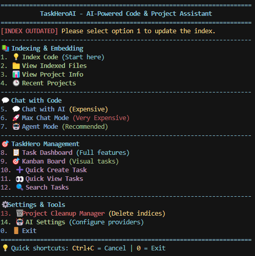

# TaskHero AI 🤖

[](https://github.com/Interstellar-code/taskheroai/stargazers)
[](https://github.com/Interstellar-code/taskheroai/network/members)
[](https://github.com/Interstellar-code/taskheroai/issues)
[](https://github.com/Interstellar-code/taskheroai/blob/main/LICENSE)
[](https://www.python.org/downloads/release/python-3116/)

Ever felt lost in a complex codebase? Wish you had a smart assistant to help you navigate, understand code, and manage your projects right in your terminal? TaskHero AI is here to help! This powerful AI-powered tool acts as your personal code companion and project management assistant, leveraging advanced embedding techniques and Large Language Model (LLM) integration. It offers intelligent code analysis, comprehensive task management, helps you search and understand your project, and provides assistance directly within your command-line interface, making your development workflow smoother and more efficient.

```yaml
 _______         _    _    _                  ___    _____
|__   __|       | |  | |  | |                / _ \  |_   _|
   | | __ _ ___| | _| |__| | ___ _ __ ___   | |_| |   | |
   | |/ _` / __| |/ /  __  |/ _ \ '__/ _ \  |  _  |   | |
   | | (_| \__ \   <| |  | |  __/ | | (_) | | | | |  _| |_
   |_|\__,_|___/_|\_\_|  |_|\___|_|  \___/  |_| |_| |_____|
                       [AI Assistant for Code & Projects]
    > AI Assistant for Project Management & Code
    > Analyzing your codebase... [DONE]
    > Initializing AI engine... [DONE]
    > Ready to help with your questions!
```

<div align="center">
  
</div>

<details>
<summary><strong>Table of Contents</strong></summary>

- [TaskHero AI 🤖](#taskhero-ai-)
  - [Getting Started](#getting-started)
    - [Prerequisites](#prerequisites)
    - [Installation](#installation)
      - [Windows](#windows)
      - [Linux/macOS](#linuxmacos)
    - [Manual Installation](#manual-installation)
  - [Usage](#usage)
    - [Starting the Application](#starting-the-application)
    - [Main Menu Options](#main-menu-options)
      - [📚 Indexing & Embedding (Options 1-4)](#-indexing--embedding-options-1-4)
      - [💬 Chat with Code (Options 5-7)](#-chat-with-code-options-5-7)
      - [🎯 TaskHero Management (Options 8-12)](#-taskhero-management-options-8-12)
      - [⚙️ Settings & Tools (Options 13-14)](#️-settings--tools-options-13-14)
    - [HTTP API Server](#http-api-server)
    - [MCP Integration](#mcp-integration)
      - [Setting Up the MCP Server](#setting-up-the-mcp-server)
      - [Using with Claude Desktop](#using-with-claude-desktop)
  - [Configuration](#configuration)
    - [Supported LLM Providers](#supported-llm-providers)
      - [Recommended Ollama Setup](#recommended-ollama-setup)
      - [Anthropic Claude Models](#anthropic-claude-models)
      - [OpenAI Models](#openai-models)
      - [DeepSeek Models](#deepseek-models)
    - [Performance Settings](#performance-settings)
    - [UI Settings](#ui-settings)
  - [Project Structure](#project-structure)
  - [Contributing](#contributing)
  - [License](#license)
  - [Links](#links)

</details>

## ✨ Key Features

- 🔍 **Intelligent Code Search**: Find relevant code snippets using natural language queries
- 📊 **Code Analysis**: Get insights about your codebase structure and dependencies
- 🤖 **Agent Mode**: Let the AI explore and understand your codebase using various tools
- 💬 **Chat with AI**: Ask questions about your code and get detailed explanations
- 🎯 **Task Management**: Comprehensive project task management with Kanban boards
- 📋 **Task Dashboard**: Full-featured task creation, tracking, and organization
- 🔄 **Version Control Integration**: Analyze git history and changes
- 📝 **File Description**: Generate concise descriptions of code files
- 🛠️ **Command Runner**: Execute system commands with AI assistance
- 🌐 **HTTP API**: RESTful API for external integrations
- 🔗 **MCP Integration**: Connect with Claude Desktop and other AI assistants
- 🧠 **Memory System**: The AI remembers important information about your project
- ⚡ **Multiple AI Providers**: Support for OpenAI, Anthropic, DeepSeek, Ollama, and more

## Getting Started

### Prerequisites

- Python 3.11.6 (tested and recommended version)
- [Ollama](https://ollama.com/download) (for local model execution - optional)
- Git (for version control features)

> **Note:** The application has been specifically tested with Python 3.11.6 on Windows and Linux. While it may work with other versions, for the best experience, we recommend using the tested version.

### Installation

#### Windows

1. Clone the repository:
   ```powershell
   git clone https://github.com/Interstellar-code/taskheroai.git
   cd taskheroai
   ```

2. Run the setup script:
   ```powershell
   .\setup_windows.bat
   ```

   Or use the PowerShell version for enhanced features:
   ```powershell
   .\setup_windows.ps1
   ```

#### Linux/macOS

1. Clone the repository:
   ```bash
   git clone https://github.com/Interstellar-code/taskheroai.git
   cd taskheroai
   ```

2. Make the setup script executable and run it:
   ```bash
   chmod +x setup_linux.sh
   ./setup_linux.sh
   ```

### Manual Installation

If you prefer to set up manually:

1. Create a virtual environment:
   ```bash
   python -m venv venv
   ```

2. Activate the virtual environment:
   - Windows: `venv\Scripts\activate`
   - Linux/macOS: `source venv/bin/activate`

3. Install dependencies:
   ```bash
   pip install -r requirements.txt
   ```

4. Create a `.env` file with your configuration (see Configuration section for details)

## Usage

### Starting the Application

After installation, activate your virtual environment and run:

```bash
python app.py
```

On first startup, you'll be prompted to select a directory to index. This process analyzes your codebase and creates embeddings for efficient searching.

### Main Menu Options

TaskHero AI provides a comprehensive menu system organized into logical sections:

#### 📚 Indexing & Embedding (Options 1-4)

**1. 💡 Index Code** - Start here to analyze your codebase
- Scans your project directory
- Creates embeddings for intelligent search
- Analyzes file structure and dependencies
- Updates automatically when files change

**2. 📁 View Indexed Files** - Browse your indexed codebase
- See all files that have been processed
- Check indexing status and statistics
- View file metadata and descriptions

**3. 📊 View Project Info** - Get comprehensive project insights
- Project structure overview
- File type distribution
- Code statistics and metrics
- Dependency analysis

**4. 🕒 Recent Projects** - Quick access to previously indexed projects
- Switch between different codebases
- Resume work on recent projects
- Manage project history

#### 💬 Chat with Code (Options 5-7)

**5. 💬 Chat with AI** *(Expensive)* - Interactive AI conversations
- Ask questions about your codebase
- Get explanations of complex code
- Request code suggestions and improvements
- Natural language code queries

**6. 🚀 Max Chat Mode** *(Very Expensive)* - Enhanced AI capabilities
- Advanced reasoning and analysis
- Complex multi-step problem solving
- Detailed architectural discussions
- Comprehensive code reviews

**7. 🤖 Agent Mode** *(Recommended)* - AI with tools access
- Most cost-effective option for cloud providers
- AI can use various tools to explore your codebase
- Automated code analysis and insights
- Tool-assisted problem solving

#### 🎯 TaskHero Management (Options 8-12)

**8. 📋 Task Dashboard** - Full-featured task management
- Create, edit, and manage tasks
- Set priorities, due dates, and assignees
- Track progress and completion status
- Organize tasks by categories and tags

**9. 🎯 Kanban Board** - Visual task organization
- Drag-and-drop task management
- Visual workflow representation
- Status columns: Todo, In Progress, Testing, Done
- Real-time project overview

**10. ➕ Quick Create Task** - Rapid task creation
- Streamlined task creation process
- Pre-filled templates for common task types
- AI-assisted task description generation
- Automatic task categorization

**11. 👀 Quick View Tasks** - Fast task browsing
- Overview of all tasks by status
- Quick filtering and searching
- Task summary and details
- Status updates and progress tracking

**12. 🔍 Search Tasks** - Advanced task search
- Search by title, description, or tags
- Filter by status, priority, or assignee
- Date range filtering
- Semantic search capabilities

#### ⚙️ Settings & Tools (Options 13-14)

**13. 🗑️ Project Cleanup Manager** - Manage project data
- Delete old indices and cached data
- Clean up temporary files
- Reset project configurations
- Free up disk space

**14. 🤖 AI Settings** - Configure AI providers
- Set up API keys for different providers
- Configure model preferences
- Adjust performance settings
- Test AI connections

### HTTP API Server

TaskHero AI includes a built-in HTTP API server that allows you to access its functionality programmatically. This is useful for integrating TaskHero AI with other tools or creating custom interfaces.

To start the HTTP API server:

```bash
python start_http_server.py --port 8000
```

The server provides the following endpoints:

- `GET /api/health` - Health check
- `POST /api/initialize` - Initialize a directory
- `POST /api/ask` - Ask the agent a question
- `POST /api/index/start` - Start indexing a directory
- `GET /api/index/status` - Get indexing status
- `GET /api/tasks` - Get all tasks
- `POST /api/tasks` - Create a new task
- `GET /api/kanban` - Get kanban board data

Example usage with curl:

```bash
# Health check
curl http://localhost:8000/api/health

# Initialize a directory
curl -X POST http://localhost:8000/api/initialize -H "Content-Type: application/json" -d '{"directory_path": "C:/path/to/your/project"}'

# Ask a question
curl -X POST http://localhost:8000/api/ask -H "Content-Type: application/json" -d '{"question": "What does this codebase do?"}'
```

### MCP Integration

TaskHero AI supports the Model Context Protocol (MCP), allowing you to connect it to Claude Desktop and other MCP-compatible AI assistants. This integration enables Claude to directly interact with your codebase and task management system.

<div align="center">
  
  
</div>

#### Setting Up the MCP Server

1. **Start the HTTP API Server**:
   ```bash
   python start_http_server.py --port 8000
   ```

2. **Start the MCP Server**:
   ```bash
   python mcp_server.py
   ```

#### Using with Claude Desktop

To use TaskHero AI with Claude Desktop:

1. **Configure Claude Desktop** by adding an entry to the MCP servers configuration file:

   **Windows**: `%APPDATA%\Claude Desktop\User Data\Default\mcp_servers.json`
   **macOS**: `~/Library/Application Support/Claude Desktop/User Data/Default/mcp_servers.json`
   **Linux**: `~/.config/Claude Desktop/User Data/Default/mcp_servers.json`

   ```json
   {
     "mcpServers": {
       "TaskHeroAI": {
         "command": "YOUR_VENV_PATH\\Scripts\\python.exe",
         "args": ["PATH_TO_TASKHEROAI\\mcp_server.py"]
       }
     }
   }
   ```

2. **Restart Claude Desktop** for the changes to take effect.

3. **Available MCP Tools**:
   - `initialize_directory(directory_path)` - Initialize a directory for use with TaskHero AI
   - `ask_agent(question)` - Ask the agent a question about the codebase
   - `start_indexing(directory_path)` - Start indexing a directory
   - `get_indexing_status()` - Get the status of the indexing process
   - `get_all_tasks()` - Get all tasks
   - `create_task(title, content, priority, status)` - Create a new task
   - `get_kanban_board()` - Get kanban board data

## Configuration

TaskHero AI can be configured through the `.env` file. The setup scripts will create a default configuration, but you can customize it for your needs:

```env
# Provider can be: ollama, google, openai, anthropic, groq, deepseek, or openrouter
AI_CHAT_PROVIDER=ollama
AI_EMBEDDING_PROVIDER=ollama
AI_DESCRIPTION_PROVIDER=ollama
AI_AGENT_BUDDY_PROVIDER=ollama

# API Keys for each functionality (only needed if using that provider)
AI_CHAT_API_KEY=None
AI_EMBEDDING_API_KEY=None
AI_DESCRIPTION_API_KEY=None
AI_AGENT_BUDDY_API_KEY=None

# Model names for each provider
CHAT_MODEL=llama2
EMBEDDING_MODEL=all-minilm:33m
DESCRIPTION_MODEL=llama2
AI_AGENT_BUDDY_MODEL=llama3.2

# Model Temperatures
CHAT_MODEL_TEMPERATURE=0.7
DESCRIPTION_MODEL_TEMPERATURE=0.3
AI_AGENT_BUDDY_MODEL_TEMPERATURE=0.7

# Performance settings (LOW, MEDIUM, MAX)
PERFORMANCE_MODE=MEDIUM
MAX_THREADS=16
EMBEDDING_CACHE_SIZE=1000

# UI Settings
ENABLE_MARKDOWN_RENDERING=TRUE
SHOW_THINKING_BLOCKS=FALSE
ENABLE_STREAMING_MODE=FALSE
CHAT_LOGS=FALSE
MEMORY_ENABLED=TRUE
MAX_MEMORY_ITEMS=10
COMMANDS_YOLO=FALSE

# HTTP API Server Settings
HTTP_ALLOW_ALL_ORIGINS=FALSE

# MCP Server Settings
MCP_API_URL=http://localhost:8000
MCP_HTTP_PORT=8000
```

### Supported LLM Providers

- **Ollama**: Local models (default, free)
- **OpenAI**: GPT models for both chat and embeddings (requires API key)
- **Anthropic**: Claude models for chat with streaming support (requires API key)
- **DeepSeek**: DeepSeek models for chat and coding (requires API key)
- **Groq**: High-performance LLMs with extremely low latency (requires API key)
- **OpenRouter**: Various cloud models (requires API key)
- **Google AI**: Gemini models (requires API key)

#### Recommended Ollama Setup

For the best local experience without any API costs:
- **Chat/Description**: `llama3.2` - Meta's Llama 3.2 model provides excellent code understanding
- **Embeddings**: `all-minilm:33m` - Efficient and accurate embeddings for code search

To use these models, install them in Ollama:
```bash
ollama pull llama3.2
ollama pull all-minilm:33m
```

#### Anthropic Claude Models

Claude models are particularly strong at understanding and generating code:
- **claude-3-5-sonnet-latest**: Latest version, excellent balance of performance and speed
- **claude-3-opus-20240229**: Most powerful Claude model with advanced reasoning
- **claude-3-haiku-20240307**: Fastest and most cost-effective Claude model

#### OpenAI Models

OpenAI provides both chat and embedding capabilities:
- **gpt-4**: Most capable model for complex reasoning
- **gpt-3.5-turbo**: Fast and cost-effective for most tasks
- **text-embedding-ada-002**: High-quality embeddings for search

#### DeepSeek Models

DeepSeek specializes in coding and technical tasks:
- **deepseek-chat**: General purpose chat model
- **deepseek-coder**: Specialized for coding tasks

### Performance Settings

- **LOW**: Minimal resource usage, suitable for low-end systems
- **MEDIUM**: Balanced resource usage, suitable for most systems
- **MAX**: Maximum resource usage, suitable for high-end systems

### UI Settings

- **ENABLE_MARKDOWN_RENDERING**: Enable/disable markdown rendering in responses
- **SHOW_THINKING_BLOCKS**: Show AI's thinking process in responses
- **ENABLE_STREAMING_MODE**: Enable streaming responses
- **CHAT_LOGS**: Save conversation logs to disk
- **MEMORY_ENABLED**: Enable AI memory for conversations
- **COMMANDS_YOLO**: When FALSE, prompts for confirmation before executing commands

## 📊 Image Showcase

Below are some screenshots of TaskHero AI in action:

*to be updated *

## Project Structure

```
TaskHeroAI/
├── app.py                    # Main application entry point
├── mcp_server.py             # MCP server wrapper
├── mcp_server_http.py        # HTTP-based MCP server implementation
├── start_http_server.py      # HTTP API server launcher
├── setup_windows.bat         # Windows setup script
├── setup_windows.ps1         # Enhanced Windows PowerShell setup
├── setup_linux.sh            # Linux/macOS setup script
├── requirements.txt          # Python dependencies
├── .env                      # Environment configuration
├── mods/                     # Core modules
│   ├── __init__.py
│   ├── banners.py              # ASCII art banners
│   ├── http_api.py             # HTTP API server implementation
│   ├── llms.py                 # LLM integration
│   ├── terminal_ui.py          # Terminal UI components
│   ├── terminal_utils.py       # Terminal utilities
│   ├── ai/                     # AI-related modules
│   │   ├── ai_manager.py         # AI provider management
│   │   ├── agent_mode.py         # Agent mode implementation
│   │   ├── chat_handler.py       # Chat functionality
│   │   └── providers/            # AI provider implementations
│   ├── cli/                    # Command-line interface
│   │   ├── cli_manager.py        # CLI management
│   │   ├── project_cli.py        # Project CLI commands
│   │   └── task_cli.py           # Task CLI commands
│   ├── code/                   # Code processing modules
│   │   ├── agent_mode.py         # Agent mode implementation
│   │   ├── directory.py          # Directory structure handling
│   │   ├── embed.py              # Embedding generation and search
│   │   ├── indexer.py            # File indexing
│   │   ├── memory.py             # Memory management
│   │   ├── terminal.py           # Terminal command execution
│   │   └── tools.py              # Agent tools
│   ├── core/                   # Core system modules
│   │   ├── app_controller.py     # Main application controller
│   │   ├── base_classes.py       # Base classes and interfaces
│   │   └── cleanup_manager.py    # Project cleanup functionality
│   ├── project_management/    # Task and project management
│   │   ├── task_manager.py       # Task management core
│   │   ├── kanban_board.py       # Kanban board implementation
│   │   ├── project_planner.py    # Project planning tools
│   │   └── templates/            # Task and project templates
│   ├── settings/               # Configuration management
│   │   ├── config_manager.py     # Configuration handling
│   │   ├── settings_manager.py   # Settings management
│   │   └── ai_settings_manager.py # AI-specific settings
│   └── ui/                     # User interface modules
│       ├── display_manager.py    # Display management
│       ├── menu_manager.py       # Menu system
│       ├── terminal_interface.py # Terminal interface
│       └── ai_settings_ui.py     # AI settings UI
├── theherotasks/             # Default task storage
│   ├── todo/                 # Tasks to be done
│   ├── inprogress/           # Tasks in progress
│   ├── testing/              # Tasks being tested
│   ├── devdone/              # Development completed tasks
│   ├── done/                 # Completed tasks
│   └── archive/              # Archived tasks
├── taskheromd/               # Legacy task management (markdown-based)
│   ├── README.md
│   └── project docs/         # Project documentation templates
├── Showcase/                 # Screenshots and demo materials
└── tests/                    # Test files and demos
```

## Contributing

Contributions are welcome! Please feel free to submit a Pull Request.

1. Fork the repository
2. Create your feature branch (`git checkout -b feature/amazing-feature`)
3. Commit your changes (`git commit -m 'Add some amazing feature'`)
4. Push to the branch (`git push origin feature/amazing-feature`)
5. Open a Pull Request

### Development Guidelines

- Follow the existing code structure and patterns
- Add tests for new features
- Update documentation as needed
- Ensure all tests pass before submitting
- Use meaningful commit messages

### Reporting Issues

If you encounter any issues or have suggestions for improvements:

1. Check existing issues to avoid duplicates
2. Provide detailed information about the problem
3. Include steps to reproduce the issue
4. Mention your operating system and Python version

## License

This project is licensed under the MIT License - see the [LICENSE](LICENSE) file for details.

## Links

- [GitHub Repository](https://github.com/Interstellar-code/taskheroai)
- [Report Issues](https://github.com/Interstellar-code/taskheroai/issues)
- [API Documentation](API_DOCUMENTATION.md)

## Acknowledgements

- [Ollama](https://ollama.com/) for local model execution
- [OpenAI](https://openai.com/) for GPT models and embeddings
- [Anthropic](https://anthropic.com/) for Claude models
- [DeepSeek](https://deepseek.com/) for specialized coding models
- All the open-source libraries that make this project possible
- Forked from Verbalcode AI (https://github.com/vibheksoni/VerbalCodeAi/tree/master)

---

<p align="center">
  Made with ❤️ for developers who want to understand their code and manage their projects efficiently !
</p>
