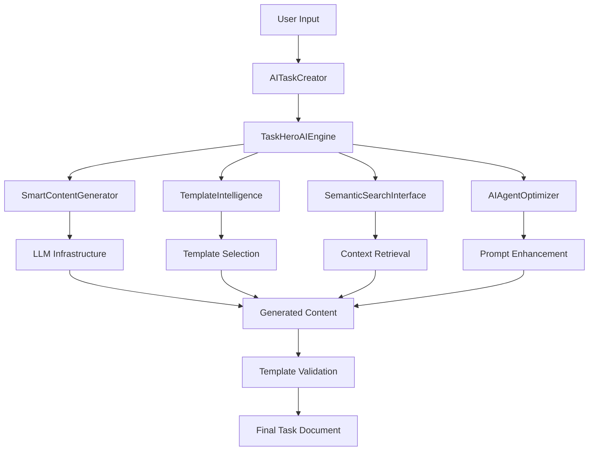

# Current TaskHero AI Task Generation Pipeline Analysis

**Document Version:** 1.0  
**Created:** 2025-05-25  
**Purpose:** Document current task generation pipeline and identify improvement points for quality enhancement

## Executive Summary

The current TaskHero AI task generation system consists of multiple components working together to create tasks. However, analysis reveals significant quality gaps and improvement opportunities that need to be addressed to achieve professional-grade task generation comparable to external AI systems.

## Current Pipeline Architecture

### 1. Main Components Overview



### 2. Component Analysis

#### 2.1. AITaskCreator (Primary Interface)
**Location:** `mods/project_management/ai_task_creator.py`

**Current Capabilities:**
- Interactive task creation wizard
- Progressive task creation (Phase 4C)
- AI enhancement integration
- Template rendering with Jinja2
- Context analysis and selection

**Quality Issues Identified:**
- ❌ No quality validation or scoring
- ❌ Limited template structure enforcement
- ❌ Poor functional requirements formatting (Python lists)
- ❌ Missing Mermaid diagram generation
- ❌ Inconsistent content quality

**Improvement Points:**
1. Add quality scoring and validation
2. Implement strict template structure enforcement
3. Fix functional requirements formatting
4. Add Mermaid diagram generation capability
5. Enhance content specificity and actionability

#### 2.2. TaskHeroAIEngine (Core Engine)
**Location:** `taskhero_ai_engine.py`

**Current Pipeline Steps:**
1. **User Input Enhancement** - `agent_optimizer.enhance_user_input()`
2. **Template Selection** - `template_manager.select_optimal_template()`
3. **Context Search** - `semantic_search.search_relevant_context()`
4. **Content Generation** - `content_generator.generate_content()`
5. **Template Validation** - `template_manager.validate_template_adherence()`

**Quality Issues Identified:**
- ❌ No quality gates or improvement loops
- ❌ Basic template validation without content quality checks
- ❌ Missing visual element generation
- ❌ No section completeness validation
- ❌ Limited error handling and fallback mechanisms

**Improvement Points:**
1. Add quality gates between pipeline steps
2. Implement content quality scoring
3. Add visual element generation (Mermaid diagrams)
4. Enhance template validation with content checks
5. Add iterative improvement loops

#### 2.3. SmartContentGenerator (Content Creation)
**Location:** `taskhero_ai_engine.py` (lines 230-374)

**Current Process:**
1. Build system prompt from template
2. Build user prompt with context
3. Generate content using LLM infrastructure
4. Parse response to structured format

**Quality Issues Identified:**
- ❌ Generic system prompts without quality requirements
- ❌ No content quality validation
- ❌ Poor response parsing leading to format issues
- ❌ Missing specificity enforcement
- ❌ No visual element generation

**Improvement Points:**
1. Enhance system prompts with quality requirements
2. Add content quality validation and scoring
3. Improve response parsing for better formatting
4. Add specificity and actionability enforcement
5. Integrate Mermaid diagram generation

#### 2.4. TemplateIntelligence (Template Management)
**Location:** `taskhero_ai_engine.py` (lines 440-586)

**Current Capabilities:**
- Template loading and selection
- Basic template validation
- New template generation
- Template adherence checking

**Quality Issues Identified:**
- ❌ Basic template selection without quality considerations
- ❌ Limited template validation (structure only)
- ❌ No content quality enforcement
- ❌ Missing section completeness checking

**Improvement Points:**
1. Enhance template selection with quality criteria
2. Add comprehensive content validation
3. Implement section completeness checking
4. Add quality-based template optimization

## Current Quality Issues Analysis

### 1. Functional Requirements Generation

**Current Implementation:**
```python
# From ai_task_creator.py line ~1130
async def _ai_generate_requirements(self, description: str, context: Dict[str, Any], relevant_context: List[Dict[str, Any]] = None) -> List[str]:
    # Generates requirements as Python list
    # Results in poor formatting like TASK-057
```

**Issues:**
- Generates Python list format instead of markdown bullets
- Verbose, repetitive descriptions
- Generic, template-like language
- Poor readability and professional presentation

**Required Fix:**
- Change output format to markdown bullets
- Enhance specificity and conciseness
- Add context-aware content generation
- Implement professional formatting standards

### 2. Template Structure Enforcement

**Current Implementation:**
```python
# From taskhero_ai_engine.py line ~545
def validate_template_adherence(self, content: Dict[str, Any], template: str) -> Dict[str, Any]:
    # Basic validation without quality checks
    return content  # Minimal validation
```

**Issues:**
- No section completeness validation
- Missing quality thresholds enforcement
- No content quality scoring
- Inconsistent section numbering

**Required Fix:**
- Add comprehensive section validation
- Implement quality threshold checking
- Add content quality scoring
- Enforce consistent structure and numbering

### 3. Visual Elements Generation

**Current State:**
- ❌ No Mermaid diagram generation
- ❌ No ASCII art creation
- ❌ No user journey visualization
- ❌ Missing process flow diagrams

**Required Implementation:**
- Add Mermaid diagram generation for all appropriate tasks
- Implement ASCII art creation for UI tasks
- Add user journey flow creation
- Include process visualization capabilities

### 4. Content Quality Validation

**Current State:**
- ❌ No quality scoring system
- ❌ No content specificity validation
- ❌ No actionability assessment
- ❌ Missing professional presentation standards

**Required Implementation:**
- Implement comprehensive quality scoring
- Add content specificity validation
- Include actionability assessment
- Enforce professional presentation standards

## Improvement Implementation Plan

### Phase 1: Quality Framework Integration (Priority 1)

**Target Components:**
- SmartContentGenerator
- TemplateIntelligence
- AITaskCreator

**Improvements:**
1. **Add Quality Scoring Engine**
   ```python
   class QualityScorer:
       def score_task_content(self, content: Dict[str, Any]) -> Dict[str, float]:
           # Implement quality scoring based on defined metrics
   ```

2. **Enhance Template Validation**
   ```python
   def validate_template_adherence(self, content: Dict[str, Any], template: str) -> Dict[str, Any]:
       # Add comprehensive validation with quality checks
       # Implement section completeness validation
       # Add content quality thresholds
   ```

3. **Fix Functional Requirements Generation**
   ```python
   async def _ai_generate_requirements(self, description: str, context: Dict[str, Any]) -> str:
       # Change return type to formatted markdown string
       # Enhance prompt for better specificity
       # Add quality validation
   ```

### Phase 2: Visual Elements Integration (Priority 2)

**Target Components:**
- SmartContentGenerator
- AITaskCreator

**Improvements:**
1. **Add Mermaid Diagram Generator**
   ```python
   class MermaidDiagramGenerator:
       def generate_flow_diagram(self, task_type: str, description: str) -> str:
           # Generate task-specific Mermaid diagrams
   ```

2. **Integrate Visual Elements in Content Generation**
   ```python
   async def generate_content(self, user_input: str, template: str, relevant_context: List[Dict[str, Any]]) -> Dict[str, Any]:
       # Add visual element generation
       # Include Mermaid diagrams
       # Add ASCII art for UI tasks
   ```

### Phase 3: Quality Improvement Loops (Priority 3)

**Target Components:**
- TaskHeroAIEngine
- SmartContentGenerator

**Improvements:**
1. **Add Quality Gates**
   ```python
   async def generate_task_content(self, user_input: str, template_type: str, context: Optional[Dict[str, Any]] = None) -> Dict[str, Any]:
       # Add quality gates between steps
       # Implement improvement loops
       # Add validation checkpoints
   ```

2. **Implement Iterative Enhancement**
   ```python
   async def enhance_content_quality(self, content: Dict[str, Any], target_score: float) -> Dict[str, Any]:
       # Iterative content improvement
       # Quality-based enhancement loops
   ```

## Technical Implementation Requirements

### 1. New Classes Needed

```python
class QualityScorer:
    """Comprehensive quality scoring for task content."""
    
class MermaidDiagramGenerator:
    """Generate Mermaid diagrams for tasks."""
    
class ContentQualityEnhancer:
    """Enhance content quality through iterative improvement."""
    
class TemplateStructureValidator:
    """Validate and enforce template structure compliance."""
```

### 2. Enhanced Existing Classes

```python
class SmartContentGenerator:
    # Add quality validation
    # Integrate visual element generation
    # Enhance prompt engineering
    
class TemplateIntelligence:
    # Add quality-based template selection
    # Implement comprehensive validation
    # Add section completeness checking
    
class AITaskCreator:
    # Integrate quality scoring
    # Add visual element support
    # Enhance content validation
```

### 3. Configuration Requirements

```python
QUALITY_CONFIG = {
    'minimum_overall_score': 8.5,
    'section_thresholds': {
        'metadata': 9.0,
        'overview': 8.5,
        'implementation': 8.5,
        'flow_diagram': 8.0,
        'risk_assessment': 8.0
    },
    'improvement_loops': {
        'max_iterations': 3,
        'improvement_threshold': 0.5
    },
    'visual_elements': {
        'enable_mermaid': True,
        'enable_ascii_art': True,
        'diagram_types': ['flowchart', 'user_journey', 'process_flow']
    }
}
```

## Success Metrics

### 1. Quality Score Improvements
- **Current Average:** 3.0/10 (based on TASK-057 analysis)
- **Target Average:** 8.5/10 (based on TASK-008 benchmark)
- **Improvement Required:** 183% increase

### 2. Section Quality Targets
- **Structure Compliance:** 9.0/10 (vs current 3.0/10)
- **Content Quality:** 8.5/10 (vs current 2.0/10)
- **Visual Elements:** 8.0/10 (vs current 1.0/10)
- **Professional Presentation:** 9.0/10 (vs current 3.0/10)

### 3. User Experience Metrics
- **Task Generation Time:** < 30 seconds
- **Quality Consistency:** 95% of tasks meet minimum thresholds
- **User Satisfaction:** 90%+ positive feedback
- **Manual Editing Required:** < 10% of generated tasks

## Next Steps

### Immediate Actions (Week 1)
1. Implement QualityScorer class
2. Fix functional requirements formatting
3. Add basic template structure validation
4. Integrate quality gates in pipeline

### Short-term Goals (Week 2-3)
1. Add Mermaid diagram generation
2. Implement content quality enhancement loops
3. Enhance template validation
4. Add visual element integration

### Long-term Objectives (Week 4+)
1. Achieve 8.5/10 average quality score
2. Implement comprehensive quality monitoring
3. Add advanced AI enhancement features
4. Establish continuous improvement processes

---
*Pipeline Analysis v1.0 - Created 2025-05-25* 