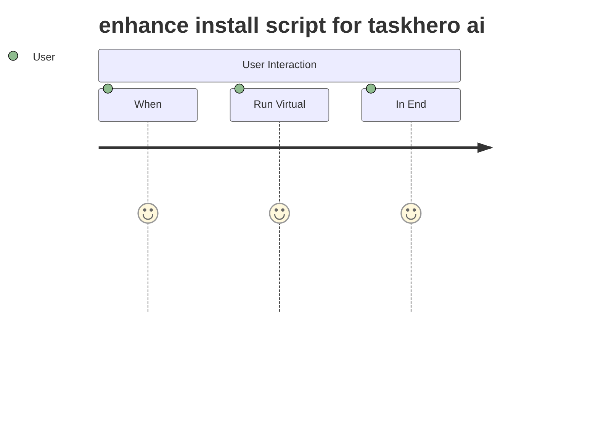

# TaskHero AI Task Generation Quality Analysis Report

## Executive Summary

This report analyzes the quality differences between manually created reference tasks (TASK-008) and AI-generated tasks (TASK-066) to identify improvement opportunities for the TaskHero AI task generation system.

## Task Comparison Overview

### Reference Task: TASK-008-DEV-enhance-install-script-for-taskhero-ai.md
- **Quality Level**: High-quality reference standard
- **Structure**: Comprehensive, well-organized
- **Content Depth**: Detailed with specific requirements
- **Technical Detail**: Excellent technical specifications

### AI-Generated Task: TASK-066-DEV-enhance-install-script-for-taskhero-ai-12.md
- **Quality Level**: Moderate quality with significant gaps
- **Structure**: Basic template structure followed
- **Content Depth**: Shallow with generic content
- **Technical Detail**: Limited technical specifications

## Detailed Quality Analysis

### 1. Title and Naming Convention

**TASK-008 (Reference)**:
- ✅ Clear, descriptive title: "Enhance Install Script for TaskHero AI"
- ✅ Proper filename convention: `TASK-008-DEV-enhance-install-script-for-taskhero-ai.md`
- ✅ Includes comprehensive naming convention documentation

**TASK-066 (AI-Generated)**:
- ⚠️ Generic title with "#12" suffix: "enhance install script for taskhero ai #12"
- ⚠️ Inconsistent capitalization
- ❌ Missing naming convention documentation

### 2. Metadata Quality

**TASK-008 (Reference)**:
```
- Task ID: TASK-008
- Created: 2025-01-XX
- Priority: High
- Task Type: DEV
- Estimated Effort: Medium (1-3 days)
- Tags: setup, installation, user-experience, windows, batch-script
```

**TASK-066 (AI-Generated)**:
```
- Task ID: TASK-066
- Created: 2025-05-25
- Priority: Medium
- Task Type: Development (should be DEV)
- Estimated Effort: Small
- Tags: install script, initial setup, initial setting
```

**Issues Identified**:
- Inconsistent task type format ("Development" vs "DEV")
- Less descriptive tags
- Missing detailed effort estimation

### 3. Functional Requirements Quality

**TASK-008 (Reference)**:
- ✅ Clear, structured requirements with specific bullet points
- ✅ Interactive prompts clearly defined
- ✅ Configuration storage requirements specified
- ✅ Skip logic for subsequent runs detailed

**TASK-066 (AI-Generated)**:
- ❌ Requirements presented as a single array of strings
- ❌ Poor formatting and readability
- ❌ Lacks specific technical details
- ❌ Generic language without actionable specifics

### 4. Implementation Steps

**TASK-008 (Reference)**:
- ✅ 5 well-defined phases with clear sub-steps
- ✅ Each step has status tracking and target dates
- ✅ Logical progression from analysis to deployment
- ✅ Specific deliverables for each phase

**TASK-066 (AI-Generated)**:
- ⚠️ 5 phases but with generic descriptions
- ❌ Sub-steps lack specificity
- ❌ No clear deliverables defined
- ❌ Generic timeline without consideration of complexity

### 5. Flow Diagrams

**TASK-008 (Reference)**:
- ✅ Comprehensive Mermaid flowchart showing user journey
- ✅ Clear decision points and process flow
- ✅ User-centric perspective
- ✅ Detailed step-by-step progression

**TASK-066 (AI-Generated)**:
- ❌ Poor quality Mermaid diagram (journey type instead of flowchart)
- ❌ Meaningless content: "When: 5: User", "Run Virtual: 5: User"
- ❌ No logical flow or decision points
- ❌ Does not represent the actual task process

### 6. Technical Depth

**TASK-008 (Reference)**:
- ✅ Detailed technical considerations
- ✅ Risk assessment with mitigation strategies
- ✅ Specific configuration details
- ✅ Performance and security considerations

**TASK-066 (AI-Generated)**:
- ⚠️ Basic technical considerations section
- ⚠️ Generic risk assessment
- ❌ Lacks specific implementation details
- ❌ Missing architecture considerations

## Root Cause Analysis

### 1. Template Issues
- AI is not properly utilizing the enhanced template structure
- Template variables are not being populated with quality content
- Flow diagram generation is producing invalid Mermaid syntax

### 2. AI Enhancement Problems
- Generic content generation without domain-specific knowledge
- Lack of context awareness about the specific task domain
- Poor understanding of technical requirements depth needed

### 3. Content Generation Gaps
- Functional requirements are not being broken down properly
- Implementation steps lack technical specificity
- Risk assessment is too generic

## Recommendations for Improvement

### 1. Immediate Fixes (High Priority)

#### Fix Flow Diagram Generation
- Update Mermaid diagram generation to use proper flowchart syntax
- Add validation for generated Mermaid code
- Provide fallback templates for different task types

#### Improve Functional Requirements Generation
- Break down requirements into specific, testable statements
- Use domain-specific templates for different task types
- Add validation for requirement quality and specificity

#### Enhance Metadata Consistency
- Standardize task type abbreviations (DEV, BUG, TEST, etc.)
- Improve tag generation with domain-specific keywords
- Add effort estimation guidelines based on task complexity

### 2. Medium-Term Improvements

#### Context-Aware Content Generation
- Integrate codebase analysis for technical tasks
- Use existing task patterns as templates
- Implement domain-specific content generators

#### Quality Validation System
- Add content quality scoring
- Implement template compliance checking
- Create feedback loops for continuous improvement

### 3. Long-Term Enhancements

#### AI Model Fine-tuning
- Train on high-quality task examples
- Develop task-specific language models
- Implement reinforcement learning from user feedback

#### Advanced Template System
- Create dynamic templates based on task complexity
- Implement conditional content generation
- Add intelligent section ordering and prioritization

## Implementation Priority Matrix

| Improvement | Impact | Effort | Priority |
|-------------|--------|--------|----------|
| Fix Flow Diagrams | High | Low | 1 |
| Improve Requirements | High | Medium | 2 |
| Metadata Consistency | Medium | Low | 3 |
| Context Integration | High | High | 4 |
| Quality Validation | Medium | Medium | 5 |

## Success Metrics

### Quality Indicators
- Task completeness score (target: >90%)
- Technical depth rating (target: >8/10)
- User satisfaction with generated tasks (target: >85%)
- Time saved in task creation (target: >60%)

### Technical Metrics
- Template compliance rate (target: 100%)
- Valid Mermaid diagram generation (target: 100%)
- Requirement specificity score (target: >80%)
- Implementation step clarity (target: >85%)

## Technical Root Cause Analysis

### 1. Flow Diagram Generation Issues

**Problem**: TASK-066 generated invalid Mermaid syntax:


**Root Cause**:
- `MermaidDiagramGenerator._generate_user_journey()` is producing malformed journey syntax
- `_extract_user_actions()` method is not properly parsing task descriptions
- Template selection logic incorrectly chooses USER_JOURNEY over FLOWCHART for installation tasks

**Code Location**: `mods/project_management/mermaid_generator.py:269-298`

### 2. Functional Requirements Generation Issues

**Problem**: Requirements generated as single array instead of structured list:
```python
['The script should be modified to include...', 'The script should include...']
```

**Root Cause**:
- AI enhancement is returning requirements as a single array string
- Template is not properly formatting the requirements list
- Missing requirement validation and structuring logic

**Code Location**: `mods/project_management/ai_task_creator.py:512-514`

### 3. Metadata Inconsistency Issues

**Problem**: Task type shows "Development" instead of "DEV"
**Root Cause**:
- Template mapping inconsistency between full names and abbreviations
- Missing validation in metadata preparation

**Code Location**: `mods/project_management/ai_task_creator.py:156-167`

## Specific Code Fixes Required

### Fix 1: Mermaid Diagram Generation
```python
# In mods/project_management/mermaid_generator.py
def _determine_diagram_type(self, task_type: str, description: str) -> DiagramType:
    # Fix: Installation/setup tasks should use FLOWCHART, not USER_JOURNEY
    if any(keyword in description.lower() for keyword in ['install', 'setup', 'configure']):
        return DiagramType.FLOWCHART
    # ... rest of logic
```

### Fix 2: Requirements Generation
```python
# In mods/project_management/ai_task_creator.py
async def _ai_generate_requirements_with_context(self, description: str, context: Dict, enhanced_context) -> List[str]:
    # Fix: Ensure requirements are returned as properly formatted list
    requirements = await self._call_ai_for_requirements(description, context)
    # Validate and structure requirements
    return self._structure_requirements(requirements)
```

### Fix 3: Metadata Consistency
```python
# In mods/project_management/ai_task_creator.py
def _prepare_base_context(self, task_type: str, **kwargs) -> Dict[str, Any]:
    # Fix: Ensure consistent task type abbreviations
    task_type_mapping = {
        'Development': 'DEV',
        'Bug Fix': 'BUG',
        'Test Case': 'TEST',
        'Documentation': 'DOC',
        'Design': 'DES'
    }
    standardized_type = task_type_mapping.get(task_type, task_type)
    # ... rest of context preparation
```

## Next Steps

1. **Immediate Action**: Fix flow diagram generation and metadata consistency
2. **Week 1**: Implement improved functional requirements generation
3. **Week 2**: Add context-aware content generation for technical tasks
4. **Week 3**: Implement quality validation system
5. **Month 2**: Begin AI model fine-tuning based on collected feedback

## Conclusion

The current AI task generation system shows promise but requires significant improvements to match the quality of manually created reference tasks. The primary focus should be on fixing immediate technical issues (flow diagrams, metadata) while building toward more sophisticated context-aware content generation.

The gap between TASK-008 and TASK-066 demonstrates the need for domain-specific knowledge integration and better template utilization. With the recommended improvements, the system can achieve reference-quality task generation while maintaining the efficiency benefits of AI automation.
