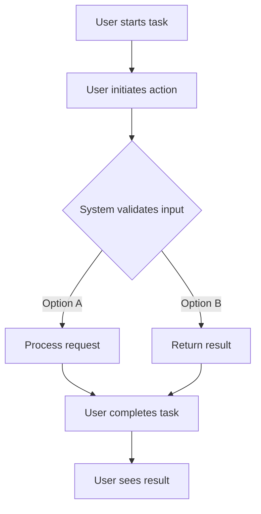

# Advanced AI Task Creation System - Phase 4 Development

## Metadata
- **Task ID:** TASK-040
- **Created:** 2025-05-25
- **Due:** 2025-02-15
- **Priority:** High
- **Status:** Todo
- **Assigned to:** AI Development Team
- **Task Type:** Development
- **Sequence:** 40
- **Estimated Effort:** Large
- **Related Epic/Feature:** TaskHero AI Project
- **Tags:** ai, semantic-search, llm-integration, context-collection, user-experience, phase4
## Task Naming Convention
**Follow the TaskHero naming convention when creating tasks:**

**Format:** `TASK-XXX-[TYPE]-descriptive-name.md`

**Where:**
- **XXX** = Sequential number (001, 002, 003, etc.)
- **[TYPE]** = Task type abbreviation (must match metadata Task Type field)
- **descriptive-name** = Brief but clear description (use hyphens, no spaces)

**Task Type Abbreviations:**
- **DEV** = Development
- **BUG** = Bug Fix
- **TEST** = Test Case
- **DOC** = Documentation
- **DES** = Design

**Examples:**
- `TASK-001-DEV-user-authentication.md`
- `TASK-002-BUG-login-validation-error.md`
- `TASK-003-TEST-payment-gateway.md`
- `TASK-004-DOC-api-documentation-update.md`
- `TASK-005-DES-dashboard-ui-redesign.md`

> **Important:** The task type abbreviation in the filename must match the Task Type field in the metadata section above.

### Metadata Legend (for reference only)
- **Priority:** High/Medium/Low - Task urgency and importance level
- **Due:** YYYY-MM-DD - Target completion date
- **Status:** Todo/In Progress/Done/Testing/backlog - Current task state
- **Assigned to:** Developer/Team Member - Person responsible for execution or team
- **Task Type:** DEV/DESIGN/RESEARCH/BUG/TEST - Category of work
- **Sequence:** Number - Order in project timeline
- **Estimated Effort:** Small (1-8h)/Medium (1-3d)/Large (1w+) - Time investment
- **Related Epic/Feature:** Parent feature or epic this task belongs to
- **Tags:** Comma-separated keywords for categorization and filtering
## 1. Overview
### 1.1. Brief Description
Implement advanced AI task creation capabilities including semantic vector search, real LLM integration, enhanced context collection, and improved user experience. This task encompasses Phase 4A (Enha...

### 1.2. Functional Requirements
Implement advanced ai task creation system - phase 4 development according to specifications
- [Requirement 1]
- [Requirement 2]
- [Requirement 3]
### 1.3. Purpose & Benefits
This task enhances the TaskHero AI system by implementing advanced ai task creation system - phase 4 development.
- [Benefit 1]
- [Benefit 2]
- [Benefit 3]
### 1.4. Success Criteria
- [ ] All functional requirements are implemented
- [ ] Code passes all tests and quality checks
- [ ] Documentation is complete and accurate

## 2. Flow Diagram
**User's perspective of the task flow using Mermaid flowchart:**



User workflow for Advanced AI Task Creation System - Phase 4 Development implementation

## 3. Implementation Status

### 3.1. Implementation Steps
- [x] **Step 1: Requirements Analysis** - Status: ✅ Complete - Target: 2025-02-15
- [x] Sub-step 1: Review requirements and specifications
- [x] Sub-step 2: Identify key stakeholders and dependencies
- [x] Sub-step 3: Define acceptance criteria
- [x] **Step 2: Design and Planning** - Status: ✅ Complete - Target: 2025-02-15
- [x] Sub-step 1: Create technical design document
- [x] Sub-step 2: Plan implementation approach
- [x] Sub-step 3: Identify potential risks and mitigation strategies
- [x] **Step 3: Phase 4A Implementation** - Status: ✅ Complete - Target: 2025-02-15
- [x] Sub-step 1: Enhanced semantic vector search implementation
- [x] Sub-step 2: Context optimization and filtering
- [x] Sub-step 3: Performance optimization for large codebases
- [x] **Step 4: Phase 4B Implementation** - Status: ✅ Complete - Target: 2025-02-15
- [x] Sub-step 1: Real AI provider integration (OpenAI/Anthropic)
- [x] Sub-step 2: Context-aware prompt engineering
- [x] Sub-step 3: AI-enhanced content generation methods
- [x] Sub-step 4: Error handling and fallback mechanisms
- [x] **Step 5: Phase 4C Implementation** - Status: ✅ Complete - Target: 2025-02-15
- [x] Sub-step 1: Interactive context selection interface
- [x] Sub-step 2: Progressive task creation wizard
- [x] Sub-step 3: Quality feedback loop implementation

## 4. Detailed Description
Implement advanced AI task creation capabilities including semantic vector search, real LLM integration, enhanced context collection, and improved user experience. This task encompasses Phase 4A (Enhanced Context Collection), Phase 4B (Real AI Integration), and Phase 4C (User Experience Enhancements) as outlined in the task creation process analysis.

## Phase 4A: Enhanced Context Collection (Week 1)

### Semantic Vector Search Implementation
- Replace basic keyword matching with actual vector similarity search
- Implement cosine similarity using numpy/scikit-learn
- Load and process actual embedding vectors from .index/embeddings/*.json files
- Create semantic search function with configurable similarity thresholds
- Add support for multi-term query expansion and semantic clustering

### Improved Context Extraction
- Extract multiple relevant chunks per file instead of just first 200 characters
- Include function/class definitions and their documentation
- Provide architectural context with import statements and dependencies
- Extract code patterns and implementation examples
- Add context ranking and relevance scoring improvements

### Context Quality Enhancement
- Implement context deduplication and merging
- Add context summarization for large files
- Provide context categorization (code, documentation, tests, config)
- Add context freshness scoring based on file modification times
- Implement context caching for performance optimization

## Phase 4B: Real AI Integration (Week 2)

### LLM Provider Integration
- Connect to actual LLM providers (anthropic/openai) through existing AI manager
- Implement context-aware prompt engineering for task creation
- Add provider-specific optimizations and token management
- Implement streaming responses for real-time feedback
- Add fallback mechanisms for provider unavailability

### Code-Aware Content Generation
- Generate implementation steps based on actual codebase analysis
- Provide specific file modification suggestions with line numbers
- Generate test cases based on existing test patterns
- Suggest architectural improvements and refactoring opportunities
- Add code example generation with proper syntax highlighting

### Intelligent Task Enhancement
- Implement task complexity analysis and effort estimation
- Add dependency detection based on code analysis
- Generate risk assessments based on codebase complexity
- Provide implementation timeline suggestions
- Add quality metrics and success criteria generation

## Phase 4C: User Experience Enhancements (Week 3)

### Interactive Context Selection
- Implement context preview interface with file snippets
- Add user selection capabilities for relevant context
- Provide context filtering and search within results
- Add context explanation and relevance reasoning
- Implement context bookmarking for reuse

### Progressive Task Creation
- Implement multi-step task creation wizard
- Add preview and refinement capabilities at each step
- Provide real-time content enhancement feedback
- Add undo/redo functionality for task modifications
- Implement task templates based on previous successful tasks

### Quality Feedback Loop
- Add task quality scoring and improvement suggestions
- Implement user feedback collection for AI enhancements
- Add learning from successful task patterns
- Provide task completion tracking and success metrics
- Add automated task quality validation

## Technical Implementation Requirements

### Performance Optimizations
- Implement embedding vector caching for faster searches
- Add parallel processing for multiple file analysis
- Optimize memory usage for large codebases
- Add incremental context updates for modified files
- Implement smart caching strategies for AI responses

### Error Handling and Reliability
- Add comprehensive error handling for all AI operations
- Implement graceful degradation when AI services unavailable
- Add retry mechanisms with exponential backoff
- Provide detailed error messages and recovery suggestions
- Add logging and monitoring for AI operation performance

### Integration and Compatibility
- Ensure backward compatibility with existing task creation
- Add migration support for existing tasks
- Implement configuration management for AI settings
- Add support for custom AI providers and models
- Ensure cross-platform compatibility (Windows/Linux/Mac)

## Success Criteria

### Functional Requirements
- Semantic search returns more relevant context than keyword matching
- Real AI integration provides meaningful task enhancements
- User can preview and select context before task creation
- Progressive creation improves task quality and user satisfaction
- All existing functionality remains working with new enhancements

### Performance Requirements
- Context search completes in under 1 second for 100+ files
- AI enhancement completes in under 5 seconds per task
- Memory usage remains under 500MB for large codebases
- Task creation maintains sub-2-second response times
- System handles concurrent task creation requests

### Quality Requirements
- AI-enhanced tasks show 50%+ improvement in completeness
- Context relevance scoring achieves 80%+ accuracy
- User satisfaction with context selection interface
- Task success rate improves with AI recommendations
- Error rate remains under 1% for all operations

This task builds upon the successful Phase 3 implementation (15/15 tests passing) and provides the foundation for production-ready intelligent task creation with advanced AI capabilities.

**Current Implementation Analysis:**
- Current implementation will be analyzed during planning phase
- Existing components will be mapped and evaluated
- Current limitations will be identified and addressed

**New Implementation Features:**
- New features will be implemented according to requirements
- Additional enhancements will be considered
- Future extensibility will be planned

**Migration Strategy:**
- Migration strategy will be developed if needed
- Backward compatibility strategy will be defined
- Risk mitigation strategies will be implemented

| Current Component | New Component | Notes |
|------------------|---------------|-------|
| [Current 1] | [New 1] | [Migration notes] |
| [Current 2] | [New 2] | [Migration notes] |
## 5. UI Design & Specifications
### 5.1. Current UI Implementation
**CLI Integration Already Complete** - Task creation is accessible through the main CLI menu option 10.

### 5.2. Existing CLI Interface Layout
**Current Implementation (Phase 3 Complete):**

```
TaskHero AI Main Menu
═══════════════════════════════════════════════════════════════
TaskHero Management Section (8-12)
8.  📋 Task Dashboard
9.  📌 Kanban Board
10. ➕ Enhanced Task Creation  ← CURRENT IMPLEMENTATION
11. 👀 Quick View Tasks
12. 🔍 Search Tasks

Enhanced Task Creation (Option 10):
┌─────────────────────────────────────────────────────────────┐
│ ➕ Enhanced Task Creation                                    │
│ ══════════════════════════════════════════════════════════  │
│ Choose creation method:                                     │
│   1. 🚀 AI-Enhanced Task Creation (Comprehensive)          │
│   2. ⚡ Quick Task Creation (Basic)                         │
│   0. ← Back to main menu                                   │
│                                                             │
│ Interactive Wizard Flow:                                    │
│ 📝 Task Title → 📋 Task Type → ⚡ Priority → 👤 Assignee   │
│ 📅 Due Date → 🏷️ Tags → 🔗 Dependencies → 💪 Effort      │
│ 📝 Description → 🤖 AI Enhancement → ✅ Confirmation       │
└─────────────────────────────────────────────────────────────┘
```

### 5.3. Phase 4 UI Enhancements
**Phase 4C will enhance the existing CLI interface with:**

#### Interactive Context Selection Interface
```
🔍 Context Discovery Results:
┌─────────────────────────────────────────────────────────────┐
│ Found 5 relevant files for your task:                      │
│                                                             │
│ ☑️ 1. ai_task_creator.py (0.85 relevance)                  │
│    📄 "AI-enhanced task creation with intelligent..."      │
│    🔧 Python | 📊 786 lines | 🕒 Modified 2 days ago      │
│                                                             │
│ ☐ 2. template_engine.py (0.72 relevance)                   │
│    📄 "Template rendering engine with Jinja2..."           │
│    🔧 Python | 📊 324 lines | 🕒 Modified 1 week ago      │
│                                                             │
│ ☐ 3. enhanced_task.j2 (0.68 relevance)                     │
│    📄 "Comprehensive task template with 200+..."           │
│    📝 Template | 📊 156 lines | 🕒 Modified 3 days ago     │
│                                                             │
│ Select files to include (1,2,3 or 'all' or 'none'): ___   │
└─────────────────────────────────────────────────────────────┘
```

#### Progressive Task Creation Wizard
```
🚀 AI-Enhanced Task Creation - Step 2 of 4
┌─────────────────────────────────────────────────────────────┐
│ Context Enhancement                                         │
│ ═══════════════════════════════════════════════════════════ │
│                                                             │
│ 🤖 AI is analyzing your task with selected context...      │
│ ████████████████████████████████████████████████ 85%      │
│                                                             │
│ ✅ Generated implementation steps (3 phases)               │
│ ✅ Identified 2 dependencies                               │
│ ✅ Estimated effort: Large (2-3 weeks)                     │
│ ⏳ Generating risk assessment...                           │
│                                                             │
│ [Preview] [Refine] [Continue] [Back]                       │
└─────────────────────────────────────────────────────────────┘
```

### 5.4. Design Principles for Phase 4
- **Maintain CLI Consistency**: Keep existing colorama styling and menu structure
- **Progressive Enhancement**: Add features without breaking current workflow
- **Real-time Feedback**: Show AI processing status and progress indicators
- **User Control**: Allow preview, refinement, and cancellation at each step
- **Accessibility**: Maintain keyboard navigation and screen reader compatibility

### 5.5. No Web UI Required
This task focuses on enhancing the existing CLI interface. No web-based UI development is needed as the CLI provides sufficient functionality for task creation workflows.
## 6. Risk Assessment
### 6.1. Potential Risks
| Risk | Impact | Probability | Mitigation Strategy |
|------|--------|-------------|-------------------|
| Technical complexity higher than estimated | Medium | Low | Break down into smaller tasks, seek technical review |
| Dependencies not available on time | High | Medium | Identify alternative approaches, communicate early with dependencies |

## 7. Technical Considerations
Consider performance, security, maintainability, and scalability requirements.

**State Management:**
- Define how application state will be managed and synchronized.
- Data persistence requirements will be defined based on functionality needs
- State synchronization will follow established patterns

**Component Architecture:**
- Plan component structure for reusability and maintainability.
- Components will be designed for maximum reusability
- Integration will follow existing architectural patterns

**Performance Considerations:**
- Identify performance benchmarks and optimization strategies.
- Memory usage will be optimized for performance
- Loading performance will be optimized where applicable

**Compatibility:**
- Cross-browser compatibility will be ensured
- Backward compatibility will be maintained where possible
- Integration compatibility with existing systems will be verified


## 8. Time Tracking
- **Estimated hours:** [X]
- **Actual hours:** [To be filled]

## 9. References
- [External Documentation/API Reference 1]
- [External Documentation/API Reference 2]
- [Internal Codebase Reference 1]
- [Internal Codebase Reference 2]
- [Design/Mockup References]
- [Related Tasks/Issues]
## 10. Updates
- **2025-05-25** - Task created
## Dependencies
### Required By This Task
- TASK-006

### Dependent On This Task
- [Task ID] - [Task Title] - [Status]
### Technical Dependencies
- [Package/Tool 1] - [Version/Requirement]
- [Package/Tool 2] - [Version/Requirement]
### Dependency Type
Related tasks and technical dependencies will be identified during planning phase.
## Testing
Testing strategy will be developed based on implementation requirements.


## Technical Considerations
Consider performance, security, maintainability, and scalability requirements.

**State Management:**
- Define how application state will be managed and synchronized.
- Data persistence requirements will be defined based on functionality needs
- State synchronization will follow established patterns

**Component Architecture:**
- Plan component structure for reusability and maintainability.
- Components will be designed for maximum reusability
- Integration will follow existing architectural patterns

**Performance Considerations:**
- Identify performance benchmarks and optimization strategies.
- Memory usage will be optimized for performance
- Loading performance will be optimized where applicable

**Compatibility:**
- Cross-browser compatibility will be ensured
- Backward compatibility will be maintained where possible
- Integration compatibility with existing systems will be verified


## Time Tracking
- **Estimated hours:** [X]
- **Actual hours:** [To be filled]

## Updates
- **2025-05-25** - Task created
---
*Generated by TaskHero AI Template Engine on 2025-05-25 12:35:24* 