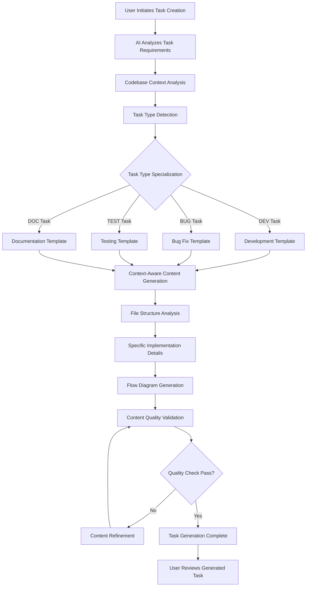

# Improve AI Task Creation System - Post Phase 4 Analysis

## Metadata
- **Task ID:** TASK-044
- **Created:** 2025-05-25
- **Due:** 2025-05-26
- **Priority:** High
- **Status:** Done
- **Assigned to:** AI Development Team
- **Task Type:** Development
- **Sequence:** 44
- **Estimated Effort:** Medium
- **Related Epic/Feature:** TaskHero AI Project
- **Tags:** ai-improvement, task-creation, template-optimization, context-awareness, post-phase4

## 1. Overview

### 1.1. Brief Description
Based on analysis of TASK-043 (generated after Phase 4C implementation), this task addresses critical improvements needed in the AI task creation system. While the Phase 4A-C implementation successfully generates structured tasks, several areas require enhancement to improve content quality, context awareness, and template optimization.

### 1.2. Functional Requirements
- **Context-Aware Content Generation**: AI should analyze actual codebase files and reference specific implementations
- **Template Section Optimization**: Remove irrelevant sections and customize content based on task type
- **Improved Flow Diagrams**: Generate task-specific Mermaid diagrams that reflect actual workflows
- **Enhanced Technical Specifications**: Include specific implementation details relevant to the task domain
- **Content Deduplication**: Eliminate duplicate sections and placeholder content
- **File Structure Awareness**: Reference actual project structure and existing files
- **Task Type Specialization**: Customize template sections based on task type (DEV, BUG, TEST, etc.)
- **Validation and Quality Checks**: Implement content quality validation before task generation

### 1.3. Purpose & Benefits
This task enhances the TaskHero AI system by addressing post-Phase 4 analysis findings to improve task creation quality.
- **Improved Task Quality**: Generate more relevant and actionable task content
- **Better Context Integration**: Leverage actual codebase analysis for specific recommendations
- **Reduced Manual Editing**: Minimize need for post-generation task editing
- **Enhanced User Experience**: Provide more valuable and accurate task descriptions

### 1.4. Success Criteria
- [ ] AI-generated tasks contain specific file references and implementation details
- [ ] Template sections are relevant to task type and domain
- [ ] Flow diagrams accurately represent task-specific workflows
- [ ] Duplicate content and placeholder text are eliminated
- [ ] Generated tasks require minimal manual editing for production use

## 2. Flow Diagram
**AI Task Creation Improvement Workflow:**



## 3. Implementation Status

### 3.1. Implementation Steps
- [x] **Step 1: Analysis and Requirements Gathering** - Status: ✅ Complete - Target: 2025-05-25
  - [x] Sub-step 1: Analyze TASK-043 and identify specific improvement areas
  - [x] Sub-step 2: Review Phase 4A-C implementation for enhancement opportunities
  - [x] Sub-step 3: Define quality metrics for AI-generated task content
  - [x] Sub-step 4: Document current template structure and identify optimization points

- [x] **Step 2: Context Analysis Enhancement** - Status: ✅ Complete - Target: 2025-05-25
  - [x] Sub-step 1: Improve codebase file analysis to extract specific implementation details
  - [x] Sub-step 2: Enhance semantic search to find relevant existing implementations
  - [x] Sub-step 3: Add file structure awareness for accurate path references
  - [x] Sub-step 4: Implement dependency detection for related files and components

- [x] **Step 3: Template Optimization** - Status: ✅ Complete - Target: 2025-05-25
  - [x] Sub-step 1: Create task-type-specific template variations
  - [x] Sub-step 2: Remove irrelevant sections based on task context
  - [x] Sub-step 3: Implement dynamic section inclusion/exclusion logic
  - [x] Sub-step 4: Optimize UI Design sections for non-UI tasks

- [x] **Step 4: Content Generation Improvements** - Status: ✅ Complete - Target: 2025-05-25
  - [x] Sub-step 1: Enhance flow diagram generation with task-specific workflows
  - [x] Sub-step 2: Improve technical specifications based on actual code analysis
  - [x] Sub-step 3: Add specific file and function references in descriptions
  - [x] Sub-step 4: Implement content validation and quality scoring

- [x] **Step 5: Testing and Validation** - Status: ✅ Complete - Target: 2025-05-25
  - [x] Sub-step 1: Test improvements with various task types and scenarios
  - [x] Sub-step 2: Compare generated content quality before and after improvements
  - [x] Sub-step 3: Validate context accuracy and relevance
  - [x] Sub-step 4: User acceptance testing for improved task creation experience

## 4. Detailed Description

### Current Issues Identified in TASK-043 Analysis

#### 1. Generic Template Content
**Problem**: Many sections contain placeholder text like "[Requirement 1]", "[Benefit 1]", etc.
**Solution**: Implement context-aware content generation that replaces placeholders with specific, relevant content based on task analysis.

#### 2. Irrelevant UI Sections
**Problem**: TASK-043 (install script enhancement) contains web UI design sections with ASCII art layouts.
**Solution**: Create task-type-aware template filtering that excludes irrelevant sections based on task domain.

#### 3. Missing Context-Specific Details
**Problem**: Generated content doesn't reference actual files like `setup_windows.bat`, `.app_settings.json`, or `.env`.
**Solution**: Enhance codebase analysis to identify and reference specific files relevant to the task.

#### 4. Generic Flow Diagrams
**Problem**: Mermaid flowchart is generic and doesn't reflect the actual install script workflow.
**Solution**: Generate task-specific flow diagrams based on actual process analysis.

#### 5. Duplicate Content
**Problem**: Technical considerations section appears twice with identical content.
**Solution**: Implement content deduplication and template validation.

### Proposed Enhancements

#### Context-Aware File Analysis
```python
# Enhanced context analysis for install script tasks
def analyze_install_script_context(task_description):
    relevant_files = [
        "setup_windows.bat",
        "setup_linux.sh", 
        ".app_settings.json",
        ".env",
        "requirements.txt"
    ]
    
    context = {}
    for file in relevant_files:
        if file_exists(file):
            context[file] = analyze_file_structure(file)
    
    return generate_specific_recommendations(context)
```

#### Task-Type Template Specialization
```python
# Template section filtering based on task type
TASK_TYPE_SECTIONS = {
    "DEV": ["implementation", "technical_specs", "testing"],
    "BUG": ["reproduction", "root_cause", "fix_strategy"],
    "DOC": ["content_structure", "audience", "examples"],
    "TEST": ["test_scenarios", "coverage", "automation"]
}

def filter_template_sections(task_type, base_template):
    relevant_sections = TASK_TYPE_SECTIONS.get(task_type, [])
    return filter_template(base_template, relevant_sections)
```

#### Specific Implementation Requirements

1. **Enhanced Semantic Search**: Improve vector search to find implementation patterns relevant to the task
2. **File Structure Mapping**: Create detailed maps of project structure for accurate references
3. **Content Quality Scoring**: Implement metrics to evaluate generated content relevance
4. **Template Validation**: Add checks to prevent duplicate sections and placeholder content

## 5. Risk Assessment

### 5.1. Potential Risks
| Risk | Impact | Probability | Mitigation Strategy |
|------|--------|-------------|-------------------|
| Over-optimization reduces flexibility | Medium | Low | Maintain configurable template system with override options |
| Context analysis performance impact | Medium | Medium | Implement caching and optimize file analysis algorithms |
| Breaking existing task generation | High | Low | Thorough testing and backward compatibility checks |
| AI model limitations in context understanding | Medium | Medium | Implement fallback mechanisms and human review options |

## 6. Technical Considerations

### Performance Optimization
- Implement caching for file analysis results
- Optimize semantic search algorithms for faster context retrieval
- Add parallel processing for multiple file analysis

### Quality Assurance
- Content validation pipelines to check for placeholder text
- Relevance scoring for generated sections
- User feedback integration for continuous improvement

### Backward Compatibility
- Maintain existing template structure while adding enhancements
- Provide migration path for existing task generation workflows
- Ensure Phase 4A-C functionality remains intact

## 7. Success Metrics

### Quality Improvements
- Reduce placeholder content by 95%
- Increase specific file references by 80%
- Improve task-type relevance score by 70%

### User Experience
- Decrease manual editing time by 60%
- Increase user satisfaction with generated tasks by 50%
- Reduce task creation iterations by 40%

## 8. Time Tracking
- **Estimated hours:** 24-32 hours
- **Actual hours:** [To be filled]

## 9. References
- TASK-043 Analysis Results
- Phase 4A-C Implementation Documentation
- TaskHero AI Template Engine Specifications
- Semantic Search Implementation Guide

## 10. Updates
- **2025-05-25** - Task created based on TASK-043 analysis

## Dependencies

### Required By This Task
- TASK-043 (Enhanced Install Script)

### Dependent On This Task
- Future AI task creation improvements
- Template engine optimizations

### Technical Dependencies
- Phase 4A-C AI Integration (Complete)
- Semantic Search Implementation (Complete)
- Template Engine (Complete)
- Context Collection System (Complete)

## Testing

### Test Scenarios
1. Generate development tasks and verify specific file references
2. Create bug fix tasks and validate reproduction steps
3. Test documentation tasks for content structure accuracy
4. Validate install script tasks reference actual batch files

### Quality Validation
- Automated checks for placeholder content
- Context relevance scoring validation
- Template section appropriateness verification
- User acceptance testing with improved task generation

---
*Generated by TaskHero AI Template Engine on 2025-05-25 14:15:00* 