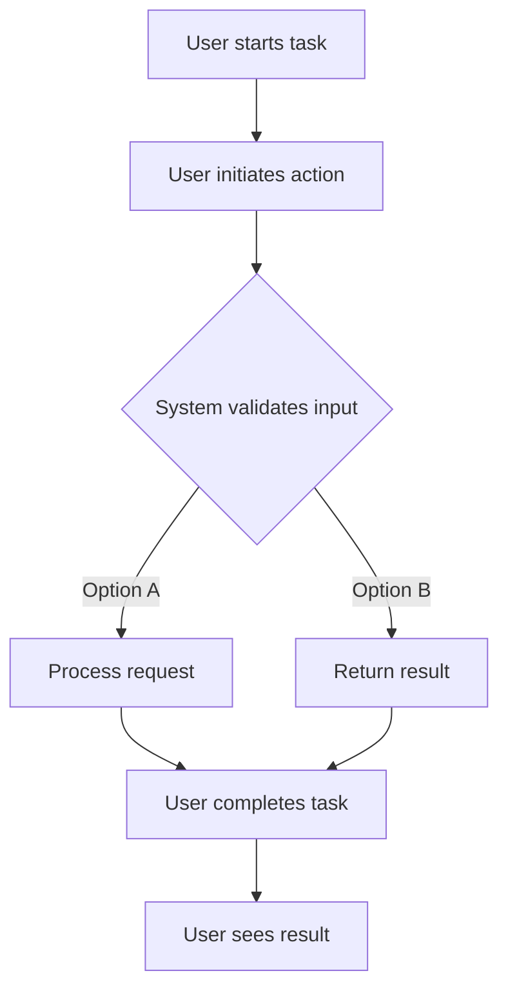

# enhance existing MCP to include new tools

## Metadata
- **Task ID:** TASK-039
- **Created:** 2025-05-25
- **Due:** 2025-06-01
- **Priority:** Medium
- **Status:** Todo
- **Assigned to:** Developer
- **Task Type:** Development
- **Sequence:** 39
- **Estimated Effort:** Medium
- **Related Epic/Feature:** TaskHero AI Project
- **Tags:** mcp server, enhancement, taskhero, task, project
## Task Naming Convention
**Follow the TaskHero naming convention when creating tasks:**

**Format:** `TASK-XXX-[TYPE]-descriptive-name.md`

**Where:**
- **XXX** = Sequential number (001, 002, 003, etc.)
- **[TYPE]** = Task type abbreviation (must match metadata Task Type field)
- **descriptive-name** = Brief but clear description (use hyphens, no spaces)

**Task Type Abbreviations:**
- **DEV** = Development
- **BUG** = Bug Fix
- **TEST** = Test Case
- **DOC** = Documentation
- **DES** = Design

**Examples:**
- `TASK-001-DEV-user-authentication.md`
- `TASK-002-BUG-login-validation-error.md`
- `TASK-003-TEST-payment-gateway.md`
- `TASK-004-DOC-api-documentation-update.md`
- `TASK-005-DES-dashboard-ui-redesign.md`

> **Important:** The task type abbreviation in the filename must match the Task Type field in the metadata section above.

### Metadata Legend (for reference only)
- **Priority:** High/Medium/Low - Task urgency and importance level
- **Due:** YYYY-MM-DD - Target completion date
- **Status:** Todo/In Progress/Done/Testing/backlog - Current task state
- **Assigned to:** Developer/Team Member - Person responsible for execution or team
- **Task Type:** DEV/DESIGN/RESEARCH/BUG/TEST - Category of work
- **Sequence:** Number - Order in project timeline
- **Estimated Effort:** Small (1-8h)/Medium (1-3d)/Large (1w+) - Time investment
- **Related Epic/Feature:** Parent feature or epic this task belongs to
- **Tags:** Comma-separated keywords for categorization and filtering
## 1. Overview
### 1.1. Brief Description
the existing code base has already MCP server capabilities to offer the embeddings via the tool call, since we have added new task management features into the app. we have to update the mcp server to...

### 1.2. Functional Requirements
Implement enhance existing mcp to include new tools according to specifications
- [Requirement 1]
- [Requirement 2]
- [Requirement 3]
### 1.3. Purpose & Benefits
This task enhances the TaskHero AI system by implementing enhance existing mcp to include new tools.
- [Benefit 1]
- [Benefit 2]
- [Benefit 3]
### 1.4. Success Criteria
- [ ] All functional requirements are implemented
- [ ] Code passes all tests and quality checks
- [ ] Documentation is complete and accurate

## 2. Flow Diagram
**User's perspective of the task flow using Mermaid flowchart:**



User workflow for enhance existing MCP to include new tools implementation

## 3. Implementation Status

### 3.1. Implementation Steps
- [ ] **Step 1: Requirements Analysis** - Status: ⏳ Pending - Target: 2025-06-01
- [ ] Sub-step 1: Review requirements and specifications
- [ ] Sub-step 2: Identify key stakeholders and dependencies
- [ ] Sub-step 3: Define acceptance criteria
- [ ] **Step 2: Design and Planning** - Status: ⏳ Pending - Target: 2025-06-01
- [ ] Sub-step 1: Create technical design document
- [ ] Sub-step 2: Plan implementation approach
- [ ] Sub-step 3: Identify potential risks and mitigation strategies
- [ ] **Step 3: Implementation** - Status: ⏳ Pending - Target: 2025-06-01
- [ ] Sub-step 1: Implement core functionality
- [ ] Sub-step 2: Add error handling and validation
- [ ] Sub-step 3: Write unit tests

## 4. Detailed Description
the existing code base has already MCP server capabilities to offer the embeddings via the tool call, since we have added new task management features into the app. we have to update the mcp server tools to also add these functions. the end result will allow mcp clients to get new tool calls from the mcp server of our app to get new capabiltiies.

**Current Implementation Analysis:**
- Current implementation will be analyzed during planning phase
- Existing components will be mapped and evaluated
- Current limitations will be identified and addressed

**New Implementation Features:**
- New features will be implemented according to requirements
- Additional enhancements will be considered
- Future extensibility will be planned

**Migration Strategy:**
- Migration strategy will be developed if needed
- Backward compatibility strategy will be defined
- Risk mitigation strategies will be implemented

| Current Component | New Component | Notes |
|------------------|---------------|-------|
| [Current 1] | [New 1] | [Migration notes] |
| [Current 2] | [New 2] | [Migration notes] |
## 5. UI Design & Specifications
### 5.1. Design Overview
UI design considerations will be defined during implementation phase.

### 5.2. Wireframes & Layout
**Use ASCII art for layouts, wireframes, and component positioning:**

```
┌─────────────────────────────────────────────────────────────┐
│ [Page/Component Layout - Use ASCII art for visual layouts]   │
│ ┌─────────────┐ ┌─────────────────────────────────────────┐ │
│ │ Sidebar     │ │ Main Content Area                       │ │
│ │ - Item 1    │ │ ┌─────────────────────────────────────┐ │ │
│ │ - Item 2    │ │ │ Header/Title Section                │ │ │
│ │ - Item 3    │ │ ├─────────────────────────────────────┤ │ │
│ │             │ │ │ Content Block 1                     │ │ │
│ │             │ │ │ Content Block 2                     │ │ │
│ │             │ │ └─────────────────────────────────────┘ │ │
│ └─────────────┘ └─────────────────────────────────────────┘ │
└─────────────────────────────────────────────────────────────┘
```
**ASCII Art Tips:**
- Use `┌─┐└─┘│├─┤` for clean borders and boxes
- Use `═══` for emphasis/headers
- Use `...` for content areas
- Use `[Button]` for interactive elements
- Use `📊📅💳⚙️` emojis for icons and visual elements
- Use `↕↗▼` arrows for sorting and navigation indicators
- Use `🔴🟢` colored circles for status indicators
- Use `^annotations` below diagrams for explanations

### 5.3. Design System References
- **Colors:** Follow TaskHero AI design system color palette
- **Typography:** Use system default typography standards
- **Spacing:** Follow 8px grid system for consistent spacing
- **Components:** Utilize existing component library where applicable
- **Icons:** Use consistent icon set from design system

### 5.4. Visual Design References
- [Link to Figma/Design file]
- [Link to existing similar components]
- [Screenshots or mockups if available]
## 6. Risk Assessment
### 6.1. Potential Risks
| Risk | Impact | Probability | Mitigation Strategy |
|------|--------|-------------|-------------------|
| Technical complexity higher than estimated | Medium | Low | Break down into smaller tasks, seek technical review |
| Dependencies not available on time | High | Medium | Identify alternative approaches, communicate early with dependencies |

## 7. Technical Considerations
Consider performance, security, maintainability, and scalability requirements.

**State Management:**
- Define how application state will be managed and synchronized.
- Data persistence requirements will be defined based on functionality needs
- State synchronization will follow established patterns

**Component Architecture:**
- Plan component structure for reusability and maintainability.
- Components will be designed for maximum reusability
- Integration will follow existing architectural patterns

**Performance Considerations:**
- Identify performance benchmarks and optimization strategies.
- Memory usage will be optimized for performance
- Loading performance will be optimized where applicable

**Compatibility:**
- Cross-browser compatibility will be ensured
- Backward compatibility will be maintained where possible
- Integration compatibility with existing systems will be verified


## 8. Time Tracking
- **Estimated hours:** [X]
- **Actual hours:** [To be filled]

## 9. References
- [External Documentation/API Reference 1]
- [External Documentation/API Reference 2]
- [Internal Codebase Reference 1]
- [Internal Codebase Reference 2]
- [Design/Mockup References]
- [Related Tasks/Issues]
## 10. Updates
- **2025-05-25** - Task created
## Dependencies
### Required By This Task
- task-007

### Dependent On This Task
- [Task ID] - [Task Title] - [Status]
### Technical Dependencies
- [Package/Tool 1] - [Version/Requirement]
- [Package/Tool 2] - [Version/Requirement]
### Dependency Type
Related tasks and technical dependencies will be identified during planning phase.
## Testing
Testing strategy will be developed based on implementation requirements.


## Technical Considerations
Consider performance, security, maintainability, and scalability requirements.

**State Management:**
- Define how application state will be managed and synchronized.
- Data persistence requirements will be defined based on functionality needs
- State synchronization will follow established patterns

**Component Architecture:**
- Plan component structure for reusability and maintainability.
- Components will be designed for maximum reusability
- Integration will follow existing architectural patterns

**Performance Considerations:**
- Identify performance benchmarks and optimization strategies.
- Memory usage will be optimized for performance
- Loading performance will be optimized where applicable

**Compatibility:**
- Cross-browser compatibility will be ensured
- Backward compatibility will be maintained where possible
- Integration compatibility with existing systems will be verified


## Time Tracking
- **Estimated hours:** [X]
- **Actual hours:** [To be filled]

## Updates
- **2025-05-25** - Task created
---
*Generated by TaskHero AI Template Engine on 2025-05-25 12:29:41* 