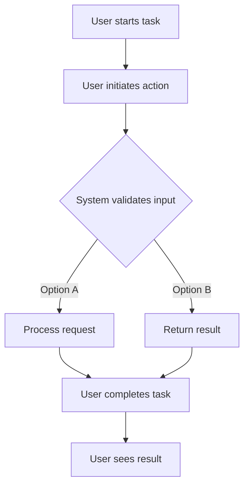

# enhance install script for taskhero ai

## Metadata
- **Task ID:** TASK-050
- **Created:** 2025-05-25
- **Due:** 2025-05-25
- **Priority:** High
- **Status:** Todo
- **Assigned to:** Developer
- **Task Type:** Development
- **Sequence:** 50
- **Estimated Effort:** Medium
- **Related Epic/Feature:** TaskHero AI Project
- **Tags:** install script, initial setup, initial settings
## Task Naming Convention
**Follow the TaskHero naming convention when creating tasks:**

**Format:** `TASK-XXX-[TYPE]-descriptive-name.md`

**Where:**
- **XXX** = Sequential number (001, 002, 003, etc.)
- **[TYPE]** = Task type abbreviation (must match metadata Task Type field)
- **descriptive-name** = Brief but clear description (use hyphens, no spaces)

**Task Type Abbreviations:**
- **DEV** = Development
- **BUG** = Bug Fix
- **TEST** = Test Case
- **DOC** = Documentation
- **DES** = Design

**Examples:**
- `TASK-001-DEV-user-authentication.md`
- `TASK-002-BUG-login-validation-error.md`
- `TASK-003-TEST-payment-gateway.md`
- `TASK-004-DOC-api-documentation-update.md`
- `TASK-005-DES-dashboard-ui-redesign.md`

> **Important:** The task type abbreviation in the filename must match the Task Type field in the metadata section above.

### Metadata Legend (for reference only)
- **Priority:** High/Medium/Low - Task urgency and importance level
- **Due:** YYYY-MM-DD - Target completion date
- **Status:** Todo/In Progress/Done/Testing/backlog - Current task state
- **Assigned to:** Developer/Team Member - Person responsible for execution or team
- **Task Type:** DEV/DESIGN/RESEARCH/BUG/TEST - Category of work
- **Sequence:** Number - Order in project timeline
- **Estimated Effort:** Small (1-8h)/Medium (1-3d)/Large (1w+) - Time investment
- **Related Epic/Feature:** Parent feature or epic this task belongs to
- **Tags:** Comma-separated keywords for categorization and filtering
## 1. Overview
### 1.1. Brief Description
Task Title: Enhance Install Script for TaskHero AI

Task Description:

This task involves enhancing the existing setup_windows.bat installation script for TaskHero AI. The goal is to improve the user ...

### 1.2. Functional Requirements
["The script must be capable of installing all the necessary packages for setting up the app requirements. This functionality should be tested by verifying the successful installation of the packages and the app's proper functioning after the setup.", "The script should have an interactive interface that prompts the user to answer specific questions about the setup process. This can be verified by checking the user's input against expected responses.", 'The script should be able to ask the user if the installation will serve as a central repository for all codebases or will be singular. This can be tested by checking the configuration settings after the setup is complete.', 'The script should prompt the user to provide the path of the codebase which taskhero is going to index. This can be tested by verifying if the provided path is correctly set in the configuration.', 'The script should ask the user for the path of the project tasks files storage. It should provide options for a default present folder or a root folder /taskherofiles. This can be tested by verifying if the selected path is correctly set in the configuration.', "The script should query the user if taskhero API and MCP functions will be used. This can be verified by checking if the corresponding settings are enabled or disabled based on the user's response.", 'The script should ask the user for API details required by taskhero to function. This can be tested by verifying if the provided API details are correctly set in the ENV file.', 'The script should store all the user-provided details in the app settings json file and API settings in the ENV file. This can be tested by verifying if the details are correctly stored in the respective files.']
- [Requirement 1]
- [Requirement 2]
- [Requirement 3]
### 1.3. Purpose & Benefits
This task enhances the TaskHero AI system by implementing enhance install script for taskhero ai.
- [Benefit 1]
- [Benefit 2]
- [Benefit 3]
### 1.4. Success Criteria
- [ ] All functional requirements are implemented
- [ ] Code passes all tests and quality checks
- [ ] Documentation is complete and accurate

## 2. Flow Diagram
**User's perspective of the task flow using Mermaid flowchart:**



User workflow for enhance install script for taskhero ai implementation

## 3. Implementation Status

### 3.1. Implementation Steps
- [ ] **Step 1: Requirements Analysis and Planning** - Status: ⏳ Pending - Target: 2025-05-25
- [ ] Sub-step 1: Analyze the existing setup_windows.bat file for taskhero ai and identify areas that need enhancement.
- [ ] Sub-step 2: Understand the application requirements to be installed and how they're currently being handled.
- [ ] Sub-step 3: Plan the user interaction flow for answering the questions mentioned in the task description.
- [ ] Sub-step 4: Deliverables: Documented requirements and planned user interaction flow.
- [ ] **Step 2: Design and Architecture** - Status: ⏳ Pending - Target: 2025-05-25
- [ ] Sub-step 1: Design the architecture of how the setup script will be divided into parts.
- [ ] Sub-step 2: Design the flow of how the script will handle user inputs and save them into the app settings json file and ENV file.
- [ ] Sub-step 3: Design the mechanism of how the script will skip the settings that are already completed in the subsequent runs.
- [ ] Sub-step 4: Deliverables: Detailed design document of the enhanced setup script.
- [ ] **Step 3: Implementation and Development** - Status: ⏳ Pending - Target: 2025-05-25
- [ ] Sub-step 1: Develop the first part of the script that installs the packages to setup the app requirements.
- [ ] Sub-step 2: Develop the second part that interacts with the user to get the answers to the questions and save them in the app settings json file and ENV file.
- [ ] Sub-step 3: Implement the mechanism to skip the settings that are already completed when the script is run the next time.
- [ ] Sub-step 4: Deliverables: Enhanced setup_windows.bat file.
- [ ] **Step 4: Testing and Validation** - Status: ⏳ Pending - Target: 2025-05-25
- [ ] Sub-step 1: Test the script on different windows machines to ensure it's working as expected.
- [ ] Sub-step 2: Validate that the user interaction flow is smooth and the script is indeed more informative and elegant.
- [ ] Sub-step 3: Validate that the script is able to correctly save the settings and skip them in the subsequent runs.
- [ ] Sub-step 4: Deliverables: Test reports and validated setup_windows.bat file.
- [ ] **Step 5: Deployment and Documentation** - Status: ⏳ Pending - Target: 2025-05-25
- [ ] Sub-step 1: Deploy the enhanced script in the production environment.
- [ ] Sub-step 2: Document the changes made in the script and how to use it.
- [ ] Sub-step 3: Deliverables: Deployed setup_windows.bat file and its documentation.

## 4. Detailed Description
Task Title: Enhance Install Script for TaskHero AI

Task Description:

This task involves enhancing the existing setup_windows.bat installation script for TaskHero AI. The goal is to improve the user experience by making the script more informative and elegant, and to gather necessary setup parameters from the user. The enhanced script will also need to handle the persistence of these parameters so that they are not requested every time the script is run.

Technical Context:

The existing setup_windows.bat script is used to install TaskHero AI and initiate its virtual environment on Windows systems. It currently executes app.py, which starts the TaskHero application. The enhancement should be made keeping in view the existing flow and functionality of the script, while integrating the new features described below.

Key Implementation Considerations:

1. Divide the script into two parts: The first part should install the necessary packages and setup the app requirements. The second part should handle the interactions with the user.

2. User Interaction: The script should ask the user questions regarding the setup, including: 

   - Whether TaskHero will serve as a central repository for all codebases or function within an existing codebase
   - The path of the codebase that TaskHero should index
   - The location of project tasks files storage (either the current folder or /taskherofiles)
   - Whether TaskHero API and MCP functions will be used
   - API details needed for TaskHero to function.

3. Persistence: All the collected details should be stored in the app's settings JSON file and the environment (ENV) file as relevant. If these settings are already present from a previous run, the script should skip the interaction part and proceed directly to run the app.

Expected Deliverables:

1. An enhanced setup_windows.bat script that implements the above considerations.
2. Documentation describing the changes made, how the new script works, and how to use it.

Integration Points:

This task interacts with the existing system at several points:

1. It installs and sets up TaskHero AI and its virtual environment.
2. It interacts with the user to gather necessary setup parameters.
3. It stores these parameters in the app's settings and ENV files as appropriate.
4. It initiates the running of app.py, which starts the TaskHero application.

The enhanced script should maintain compatibility with these existing system components and processes. All changes should be documented and tested to ensure seamless integration.

**Current Implementation Analysis:**
- Current implementation will be analyzed during planning phase
- Existing components will be mapped and evaluated
- Current limitations will be identified and addressed

**New Implementation Features:**
- New features will be implemented according to requirements
- Additional enhancements will be considered
- Future extensibility will be planned

**Migration Strategy:**
- Migration strategy will be developed if needed
- Backward compatibility strategy will be defined
- Risk mitigation strategies will be implemented

| Current Component | New Component | Notes |
|------------------|---------------|-------|
| [Current 1] | [New 1] | [Migration notes] |
| [Current 2] | [New 2] | [Migration notes] |
## 5. UI Design & Specifications
### 5.1. Design Overview
UI design considerations will be defined during implementation phase.

### 5.2. Wireframes & Layout
**Use ASCII art for layouts, wireframes, and component positioning:**

```
┌─────────────────────────────────────────────────────────────┐
│ [Page/Component Layout - Use ASCII art for visual layouts]   │
│ ┌─────────────┐ ┌─────────────────────────────────────────┐ │
│ │ Sidebar     │ │ Main Content Area                       │ │
│ │ - Item 1    │ │ ┌─────────────────────────────────────┐ │ │
│ │ - Item 2    │ │ │ Header/Title Section                │ │ │
│ │ - Item 3    │ │ ├─────────────────────────────────────┤ │ │
│ │             │ │ │ Content Block 1                     │ │ │
│ │             │ │ │ Content Block 2                     │ │ │
│ │             │ │ └─────────────────────────────────────┘ │ │
│ └─────────────┘ └─────────────────────────────────────────┘ │
└─────────────────────────────────────────────────────────────┘
```
**ASCII Art Tips:**
- Use `┌─┐└─┘│├─┤` for clean borders and boxes
- Use `═══` for emphasis/headers
- Use `...` for content areas
- Use `[Button]` for interactive elements
- Use `📊📅💳⚙️` emojis for icons and visual elements
- Use `↕↗▼` arrows for sorting and navigation indicators
- Use `🔴🟢` colored circles for status indicators
- Use `^annotations` below diagrams for explanations

### 5.3. Design System References
- **Colors:** Follow TaskHero AI design system color palette
- **Typography:** Use system default typography standards
- **Spacing:** Follow 8px grid system for consistent spacing
- **Components:** Utilize existing component library where applicable
- **Icons:** Use consistent icon set from design system

### 5.4. Visual Design References
- [Link to Figma/Design file]
- [Link to existing similar components]
- [Screenshots or mockups if available]
## 6. Risk Assessment
### 6.1. Potential Risks
| Risk | Impact | Probability | Mitigation Strategy |
|------|--------|-------------|-------------------|
| Inadequate error handling in the script | High | Medium | Implement comprehensive error handling and logging within the script to capture any exceptions or issues that arise during the installation process. This will allow developers to troubleshoot and resolve issues quickly. |
| User input errors | Medium | High | Validate user input thoroughly to prevent incorrect entries. Provide clear instructions and examples for each input prompt. Implement defaults where appropriate to minimize the amount of input required from the user. |
| Compatibility issues with different Windows versions | Medium | Medium | Test the script across different Windows versions to ensure compatibility. If needed, create different scripts or script versions for different Windows versions. |
| Inadequate documentation leading to incorrect use | Medium | Low | Provide clear, concise, and comprehensive documentation for the script. Include details about its purpose, how to use it, what each section does, and what inputs are expected. |
| Failure to save settings or loss of settings data | High | Low | Implement a robust mechanism for saving and retrieving settings data. This could include data validation, redundancy, and backup measures to prevent data loss. |

## 7. Technical Considerations
Consider performance, security, maintainability, and scalability requirements.

**State Management:**
- Define how application state will be managed and synchronized.
- Data persistence requirements will be defined based on functionality needs
- State synchronization will follow established patterns

**Component Architecture:**
- Plan component structure for reusability and maintainability.
- Components will be designed for maximum reusability
- Integration will follow existing architectural patterns

**Performance Considerations:**
- Identify performance benchmarks and optimization strategies.
- Memory usage will be optimized for performance
- Loading performance will be optimized where applicable

**Compatibility:**
- Cross-browser compatibility will be ensured
- Backward compatibility will be maintained where possible
- Integration compatibility with existing systems will be verified


## 8. Time Tracking
- **Estimated hours:** [X]
- **Actual hours:** [To be filled]

## 9. References
- [External Documentation/API Reference 1]
- [External Documentation/API Reference 2]
- [Internal Codebase Reference 1]
- [Internal Codebase Reference 2]
- [Design/Mockup References]
- [Related Tasks/Issues]
## 10. Updates
- **2025-05-25** - Task created
## Dependencies
### Required By This Task
- [Task ID] - [Task Title] - [Status]
### Dependent On This Task
- [Task ID] - [Task Title] - [Status]
### Technical Dependencies
- [Package/Tool 1] - [Version/Requirement]
- [Package/Tool 2] - [Version/Requirement]
### Dependency Type
Related tasks and technical dependencies will be identified during planning phase.
## Testing
Testing strategy will be developed based on implementation requirements.


## Technical Considerations
Consider performance, security, maintainability, and scalability requirements.

**State Management:**
- Define how application state will be managed and synchronized.
- Data persistence requirements will be defined based on functionality needs
- State synchronization will follow established patterns

**Component Architecture:**
- Plan component structure for reusability and maintainability.
- Components will be designed for maximum reusability
- Integration will follow existing architectural patterns

**Performance Considerations:**
- Identify performance benchmarks and optimization strategies.
- Memory usage will be optimized for performance
- Loading performance will be optimized where applicable

**Compatibility:**
- Cross-browser compatibility will be ensured
- Backward compatibility will be maintained where possible
- Integration compatibility with existing systems will be verified


## Time Tracking
- **Estimated hours:** [X]
- **Actual hours:** [To be filled]

## Updates
- **2025-05-25** - Task created
---
*Generated by TaskHero AI Template Engine on 2025-05-25 15:36:59* 