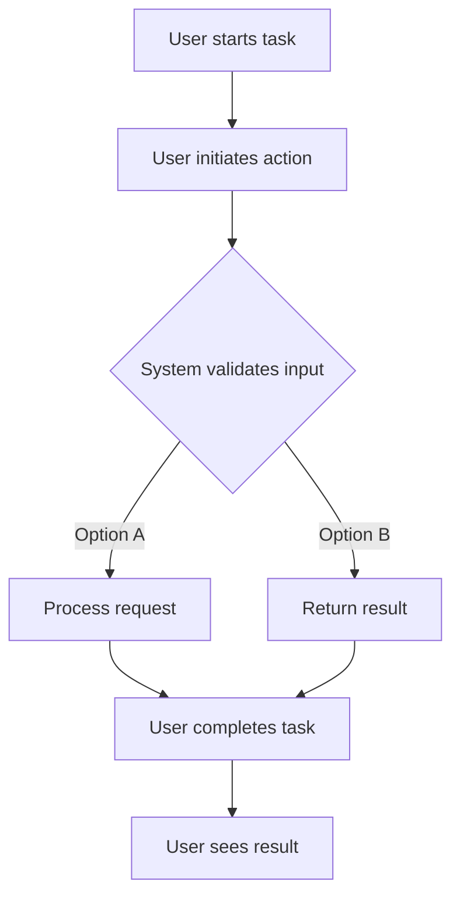

# enhance install script for taskhero ai #4

## Metadata
- **Task ID:** TASK-055
- **Created:** 2025-05-25
- **Due:** 2025-05-25
- **Priority:** Low
- **Status:** Todo
- **Assigned to:** Developer
- **Task Type:** Development
- **Sequence:** 55
- **Estimated Effort:** Small
- **Related Epic/Feature:** TaskHero AI Project
- **Tags:** install script, initial setup, initial settings
## 1. Overview
### 1.1. Brief Description
Task Title: Enhance Install Script for TaskHero AI #4

Task Overview and Objectives:
The primary objective of this task is to enhance and streamline the existing setup_windows.bat installation script ...

### 1.2. Functional Requirements
['The script should be capable of installing all the necessary packages required by taskhero ai.', 'The script should prompt the user with questions regarding the setup of taskhero ai such as whether it will be a central repository or a singular one, the path of the code base for indexing, the path for project tasks files storage, etc.', 'The script should be able to store all the user-provided details in the app settings json file and API settings into the ENV file accordingly.', 'The script should be able to initiate the execution of the app.py file to run taskhero ai.', 'The script should have the ability to skip already completed settings during subsequent runs and directly proceed to running the app.', 'The script should be compatible with the existing codebase patterns to ensure seamless integration.', 'The script should have error handling mechanisms in place to handle potential errors during the installation process or when prompting user questions.', 'The script should be able to handle edge cases such as invalid user inputs for the setup questions or missing packages during the installation process.']

### 1.3. Purpose & Benefits
This task enhances the TaskHero AI system by implementing enhance install script for taskhero ai #4.

### 1.4. Success Criteria
- [ ] All functional requirements are implemented
- [ ] Code passes all tests and quality checks
- [ ] Documentation is complete and accurate

## 2. Flow Diagram
**User's perspective of the task flow using Mermaid flowchart:**

User workflow for enhance install script for taskhero ai #4 implementation
## 3. Implementation Status

### 3.1. Implementation Steps
- [ ] **Step 1: Requirements Analysis and Planning** - Status: ⏳ Pending - Target: 2025-05-25
- [ ] Sub-step 1: Sub-step 1: Identify and document the detailed requirements for the enhancements to the setup_windows.bat file. This includes understanding the new functionalities to be added such as user prompts, application settings, and API configurations.
- [ ] Sub-step 2: Sub-step 2: Plan the project timeline and resources needed for each phase of the project.
- [ ] Sub-step 3: Deliverables: Detailed requirements document and project plan.
- [ ] **Step 2: Design and Architecture** - Status: ⏳ Pending - Target: 2025-05-25
- [ ] Sub-step 1: Sub-step 1: Design the new flow of the script based on the requirements. This includes the sequence of user prompts, decisions, and actions.
- [ ] Sub-step 2: Sub-step 2: Define the architecture of the script enhancement, including how it interacts with the existing codebase, the app settings JSON file, and the ENV file.
- [ ] Sub-step 3: Deliverables: Detailed design document including flowcharts and architecture diagrams.
- [ ] **Step 3: Implementation and Development** - Status: ⏳ Pending - Target: 2025-05-25
- [ ] Sub-step 1: Sub-step 1: Implement the enhancements in the setup_windows.bat file according to the design, including the addition of user prompts and changes in the script flow.
- [ ] Sub-step 2: Sub-step 2: Develop the functionality to save the user's answers into the app settings JSON file and the ENV file.
- [ ] Sub-step 3: Sub-step 3: Implement the check to skip settings that have been completed in previous runs.
- [ ] Sub-step 4: Deliverables: Enhanced setup_windows.bat file with new functionalities.
- [ ] **Step 4: Testing and Validation** - Status: ⏳ Pending - Target: 2025-05-25
- [ ] Sub-step 1: Sub-step 1: Write test cases for each new functionality added to the script.
- [ ] Sub-step 2: Sub-step 2: Run the test cases in different scenarios to validate the implementation.
- [ ] Sub-step 3: Sub-step 3: Fix any bugs or issues found during testing.
- [ ] Sub-step 4: Deliverables: Test cases, test results, and bug-free setup_windows.bat file.
- [ ] **Step 5: Deployment and Documentation** - Status: ⏳ Pending - Target: 2025-05-25
- [ ] Sub-step 1: Sub-step 1: Deploy the enhanced setup_windows.bat file in the production environment.
- [ ] Sub-step 2: Sub-step 2: Document the changes made to the script, how to use the new functionalities, and any considerations or known issues.
- [ ] Sub-step 3: Sub-step 3: Communicate the changes and provide training to the users if necessary.
- [ ] Sub-step 4: Deliverables: Deployed setup_windows.bat file, user manual, and technical documentation.

## 4. Detailed Description
Task Title: Enhance Install Script for TaskHero AI #4

Task Overview and Objectives:
The primary objective of this task is to enhance and streamline the existing setup_windows.bat installation script for TaskHero AI. The script is currently responsible for installing TaskHero AI and initializing the virtual environment, ending with running app.py. The aim is to make the script more informative, interactive, and user-friendly.

Technical Context:
The TaskHero AI installation script is written in a batch file (.bat) that is designed to automate the installation process on a Windows environment. The script is also responsible for setting up the virtual environment and running the final Python application (app.py). The enhancement of this script will involve reorganization and addition of new interactive features to improve the user experience.

Key Implementation Considerations:
1. The script should be divided into two main parts. The first part should handle the installation of necessary packages and setup of application requirements. The second part should interactively ask the user to answer several questions to help with the setup.
2. These questions should cover topics such as the role of this installation (central repository or singular codebase), path of the codebase to index, location for project task files storage, usage of TaskHero API and MCP functions, and API details required for TaskHero to function.
3. All these user inputs should be stored in the app settings .json file and API settings into the .env file for future reference and usage.
4. The script should also contain logic to skip settings that are already completed from the initial run, allowing the script to directly run the app the next time it is executed.

Expected Deliverables:
1. Enhanced setup_windows.bat file with the above-mentioned features and considerations.
2. Updated documentation explaining the changes made, how to use the new script, and how to answer the interactive queries.

Integration Points with Existing System:
The enhanced script will interact with the existing codebase and project setup. It will write to the existing app settings .json file and .env file. Once the setup is complete, the script will initiate the existing app.py file to run TaskHero. The script should be designed to be idempotent, i.e., it can be run multiple times without changing the result beyond the initial run.

**Current Implementation Analysis:**
- Current implementation will be analyzed during planning phase
- Existing components will be mapped and evaluated
- Current limitations will be identified and addressed

**New Implementation Features:**
- New features will be implemented according to requirements
- Additional enhancements will be considered
- Future extensibility will be planned

**Migration Strategy:**
- Migration strategy will be developed if needed
- Backward compatibility strategy will be defined
- Risk mitigation strategies will be implemented

| Current Component | New Component | Notes |
|------------------|---------------|-------|
| [Current 1] | [New 1] | [Migration notes] |
| [Current 2] | [New 2] | [Migration notes] |

## 6. Risk Assessment
### 6.1. Potential Risks
| Risk | Impact | Probability | Mitigation Strategy |
|------|--------|-------------|-------------------|
| Malfunction due to incorrect user input | High | Medium | Implement robust error checking and validation on user inputs. Provide clear instructions and examples to the user to help them provide the correct inputs. |
| Incompatibility with different Windows versions or system configurations | High | Medium | Test the enhanced installation script on different Windows versions and system configurations. Make necessary adjustments for compatibility or provide clear instructions for users with different system configurations. |
| Failure to save settings correctly to the app settings json file or ENV file | High | Low | Implement checks to ensure that settings are saved correctly. Provide clear error messages if saving fails, and possibly provide a manual method to save settings. |
| Failure to run the app.py file correctly | High | Low | Implement checks to ensure the app.py file runs correctly. Provide clear error messages if the run fails, and possibly provide a manual method to run the app. |
| New user confusion due to complex installation process | Medium | Medium | Create a detailed step-by-step guide or tutorial for the installation process. Provide support channels for users to ask questions or get help during installation. |

## 7. Technical Considerations
Consider performance, security, maintainability, and scalability requirements.

**State Management:**
- Define how application state will be managed and synchronized.
- Data persistence requirements will be defined based on functionality needs
- State synchronization will follow established patterns

**Component Architecture:**
- Plan component structure for reusability and maintainability.
- Components will be designed for maximum reusability
- Integration will follow existing architectural patterns

**Performance Considerations:**
- Identify performance benchmarks and optimization strategies.
- Memory usage will be optimized for performance
- Loading performance will be optimized where applicable

**Compatibility:**
- Cross-browser compatibility will be ensured
- Backward compatibility will be maintained where possible
- Integration compatibility with existing systems will be verified

## 8. Time Tracking
- **Estimated hours:** [X]
- **Actual hours:** [To be filled]

## 9. References
- [External Documentation/API Reference 1]
- [External Documentation/API Reference 2]
- [Internal Codebase Reference 1]
- [Internal Codebase Reference 2]
- [Design/Mockup References]
- [Related Tasks/Issues]
## 10. Updates
- **2025-05-25** - Task created
## Dependencies
### Required By This Task
- [Task ID] - [Task Title] - [Status]
### Dependent On This Task
- [Task ID] - [Task Title] - [Status]
### Technical Dependencies
- [Package/Tool 1] - [Version/Requirement]
- [Package/Tool 2] - [Version/Requirement]
### Dependency Type
Related tasks and technical dependencies will be identified during planning phase.
## Testing
Testing strategy will be developed based on implementation requirements.

## Technical Considerations
Consider performance, security, maintainability, and scalability requirements.

**State Management:**
- Define how application state will be managed and synchronized.
- Data persistence requirements will be defined based on functionality needs
- State synchronization will follow established patterns

**Component Architecture:**
- Plan component structure for reusability and maintainability.
- Components will be designed for maximum reusability
- Integration will follow existing architectural patterns

**Performance Considerations:**
- Identify performance benchmarks and optimization strategies.
- Memory usage will be optimized for performance
- Loading performance will be optimized where applicable

**Compatibility:**
- Cross-browser compatibility will be ensured
- Backward compatibility will be maintained where possible
- Integration compatibility with existing systems will be verified

## Time Tracking
- **Estimated hours:** [X]
- **Actual hours:** [To be filled]

## Updates
- **2025-05-25** - Task created
---
*Generated by TaskHero AI Template Engine on 2025-05-25 17:16:09* 