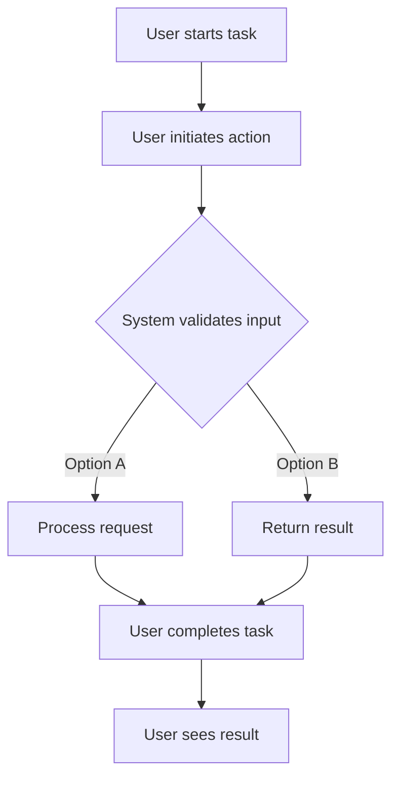

# enhance install script for taskhero ai #5

## Metadata
- **Task ID:** TASK-056
- **Created:** 2025-05-25
- **Due:** 2025-05-25
- **Priority:** Low
- **Status:** Todo
- **Assigned to:** Developer
- **Task Type:** Development
- **Sequence:** 56
- **Estimated Effort:** Small
- **Related Epic/Feature:** TaskHero AI Project
- **Tags:** install script, initial setup, initial settings

## 1. Overview
### 1.1. Brief Description
**Task Title:** Enhance Install Script for TaskHero AI #5

**Overview and Objectives:** 

The primary goal of this task is to improve the user experience and efficiency of the current setup_windows.ba...

### 1.2. Functional Requirements
['The enhanced script should be able to install all necessary packages to set up the app requirements, with a progress indicator and error handling for any failed installations.', 'The script should prompt the user with a series of questions to define the app configuration, including whether TaskHero AI will be a central repository or singular, the path of the code base to index, the path of the project tasks files storage, and whether TaskHero API and MCP functions will be used.', "The script should be able to save the user's responses to these configuration questions in the app settings JSON file and API settings in the ENV file for future use.", 'The script should initiate the run of the app.py file to run TaskHero AI after configuration is completed.', 'On subsequent runs, the script should check for existing settings and skip the configuration step if already completed, going directly to the app run.', 'The script should handle edge cases such as invalid user inputs during the configuration step, ensuring that the user is prompted again until valid input is provided.', 'The script should be compatible with the existing codebase patterns and not introduce any breaking changes.', 'The script should incorporate proper logging to record the installation and configuration process, aiding in debugging and future enhancements.']

### 1.3. Purpose & Benefits
This task enhances the TaskHero AI system by implementing enhance install script for taskhero ai #5.

### 1.4. Success Criteria
- [ ] All functional requirements are implemented
- [ ] Code passes all tests and quality checks
- [ ] Documentation is complete and accurate

## 2. Flow Diagram
**User's perspective of the task flow using Mermaid flowchart:**

User workflow for enhance install script for taskhero ai #5 implementation
## 3. Implementation Status

### 3.1. Implementation Steps
- [ ] **Step 1: Requirements Analysis and Planning** - Status: ⏳ Pending - Target: 2025-05-25
- [ ] Sub-step 1: Analyze the existing setup_windows.bat file and identify areas that need enhancement.
- [ ] Sub-step 2: Gather requirements for the new interactive features to be added to the script such as the questions to be asked to the user and the information to be stored.
- [ ] Sub-step 3: Plan the structure of the enhanced script, including the division into parts and the sequence of operations.
- [ ] **Step 2: Design and Architecture** - Status: ⏳ Pending - Target: 2025-05-25
- [ ] Sub-step 1: Design the flow and logic of the script, including the installation of packages, user interaction, and initiating the run of app.py file.
- [ ] Sub-step 2: Architect how the user's responses will be stored in the app settings json file and ENV file.
- [ ] Sub-step 3: Design the mechanism to skip already completed settings in subsequent runs.
- [ ] **Step 3: Implementation and Development** - Status: ⏳ Pending - Target: 2025-05-25
- [ ] Sub-step 1: Implement the first part of the script for installing the packages.
- [ ] Sub-step 2: Develop the second part of the script for user interaction and storing the responses.
- [ ] Sub-step 3: Implement the final part of the script to run the app.py file.
- [ ] Sub-step 4: Develop the mechanism to skip already completed settings in subsequent runs.
- [ ] **Step 4: Testing and Validation** - Status: ⏳ Pending - Target: 2025-05-25
- [ ] Sub-step 1: Test the script in a controlled environment to ensure it installs the packages correctly.
- [ ] Sub-step 2: Validate the user interaction part of the script by checking if it asks the correct questions and stores the responses properly.
- [ ] Sub-step 3: Validate the mechanism of skipping already completed settings in subsequent runs.
- [ ] **Step 5: Deployment and Documentation** - Status: ⏳ Pending - Target: 2025-05-25
- [ ] Sub-step 1: Deploy the enhanced setup_windows.bat file in the production environment.
- [ ] Sub-step 2: Document the changes made in the script, its usage, and any potential issues and their solutions.
- [ ] Sub-step 3: Update the user manual or help document to reflect the changes made in the script.

## 4. Detailed Description
**Task Title:** Enhance Install Script for TaskHero AI #5

**Overview and Objectives:** 

The primary goal of this task is to improve the user experience and efficiency of the current setup_windows.bat file that is used to install and run the TaskHero AI application. The aim is to make the script more informative and elegant when executed. The enhanced script is expected to handle installation of packages for app requirements, user interaction to answer configuration questions, storing app settings in a JSON file, and initiating the app.py file.

**Technical Context:**

The setup_windows.bat file is a crucial part of our application's installation process. Our codebase consists of a mix of Python, JSON and Batch Script files. The TaskHero AI app is primarily written in Python and it uses a JSON file for app settings and an ENV file for API settings. The Batch Script is used to setup the Python virtual environment and run the application.

**Key Implementation Considerations:**

1. **Script Division:** The script needs to be divided into two main parts - installation and configuration. The first part will handle the installation of the necessary packages while the second will interact with the user to set up the app requirements.

2. **User Interaction:** The script should prompt users with questions about configuration settings such as whether TaskHero AI would be a central repository for all codebases, the path of the codebase that TaskHero AI will index, the location of project task files, and the usage of TaskHero API and MCP functions. 

3. **Settings Storage:** The setting details provided by the user should be stored in the app settings JSON file and API settings in the ENV file accordingly. 

4. **App Execution:** Upon successful configuration, the script should initiate the app.py file to run the TaskHero AI application. 

5. **Settings Persistence:** If settings have been previously completed, they should be skipped in subsequent runs of the script to go directly to the app run. 

**Expected Deliverables:**

An enhanced windows setup script (setup_windows.bat) that is more user-friendly and efficient, covering all the points detailed above.

**Integration Points with Existing System:**

The enhanced script will interact with the existing taskhero codebase, app settings JSON file and API settings ENV file. It should seamlessly integrate with the existing system, ensuring that it does not disrupt the current functionality while providing an improved user experience. The script should also be able to handle future scaling and expansions of the TaskHero AI application.

**Current Implementation Analysis:**
- Current implementation will be analyzed during planning phase
- Existing components will be mapped and evaluated
- Current limitations will be identified and addressed

**New Implementation Features:**
- New features will be implemented according to requirements
- Additional enhancements will be considered
- Future extensibility will be planned

**Migration Strategy:**
- Migration strategy will be developed if needed
- Backward compatibility strategy will be defined
- Risk mitigation strategies will be implemented

| Current Component | New Component | Notes |
|------------------|---------------|-------|
| [Current 1] | [New 1] | [Migration notes] |
| [Current 2] | [New 2] | [Migration notes] |

## 6. Risk Assessment
### 6.1. Potential Risks
| Risk | Impact | Probability | Mitigation Strategy |
|------|--------|-------------|-------------------|
| Incorrect Script Modification | High | Medium | Ensure the modification of the script is done by a skilled developer. Conduct thorough testing in different environments before deployment. |
| User Input Errors | Medium | High | Implement input validation and error handling. Provide clear instructions and examples for the user to follow when providing inputs. |
| Compatibility Issues with Different Operating Systems | Medium | Medium | Test the script on different operating systems. If necessary, create different versions of the script for different operating systems. |
| Data Loss due to Incorrect Storage Path | High | Low | Implement a confirmation step before moving any files. Include a backup feature in the script. |
| Security Vulnerability from Exposure of API Details | High | Low | Implement secure methods for storing and handling sensitive data such as API details. This could involve encryption or using secure environment variables. |

## 7. Technical Considerations
Consider performance, security, maintainability, and scalability requirements.

**State Management:**
- Define how application state will be managed and synchronized.
- Data persistence requirements will be defined based on functionality needs
- State synchronization will follow established patterns

**Component Architecture:**
- Plan component structure for reusability and maintainability.
- Components will be designed for maximum reusability
- Integration will follow existing architectural patterns

**Performance Considerations:**
- Identify performance benchmarks and optimization strategies.
- Memory usage will be optimized for performance
- Loading performance will be optimized where applicable

**Compatibility:**
- Cross-browser compatibility will be ensured
- Backward compatibility will be maintained where possible
- Integration compatibility with existing systems will be verified

## 8. Time Tracking
- **Estimated hours:** [X]
- **Actual hours:** [To be filled]

## 9. References
- [External Documentation/API Reference 1]
- [External Documentation/API Reference 2]
- [Internal Codebase Reference 1]
- [Internal Codebase Reference 2]
- [Design/Mockup References]
- [Related Tasks/Issues]
## 10. Updates
- **2025-05-25** - Task created
## Dependencies
### Required By This Task
- [Task ID] - [Task Title] - [Status]
### Dependent On This Task
- [Task ID] - [Task Title] - [Status]
### Technical Dependencies
- [Package/Tool 1] - [Version/Requirement]
- [Package/Tool 2] - [Version/Requirement]
### Dependency Type
Related tasks and technical dependencies will be identified during planning phase.
## Testing
Testing strategy will be developed based on implementation requirements.

## Technical Considerations
Consider performance, security, maintainability, and scalability requirements.

**State Management:**
- Define how application state will be managed and synchronized.
- Data persistence requirements will be defined based on functionality needs
- State synchronization will follow established patterns

**Component Architecture:**
- Plan component structure for reusability and maintainability.
- Components will be designed for maximum reusability
- Integration will follow existing architectural patterns

**Performance Considerations:**
- Identify performance benchmarks and optimization strategies.
- Memory usage will be optimized for performance
- Loading performance will be optimized where applicable

**Compatibility:**
- Cross-browser compatibility will be ensured
- Backward compatibility will be maintained where possible
- Integration compatibility with existing systems will be verified

## Time Tracking
- **Estimated hours:** [X]
- **Actual hours:** [To be filled]

## Updates
- **2025-05-25** - Task created
---
*Generated by TaskHero AI Template Engine on 2025-05-25 17:37:29* 