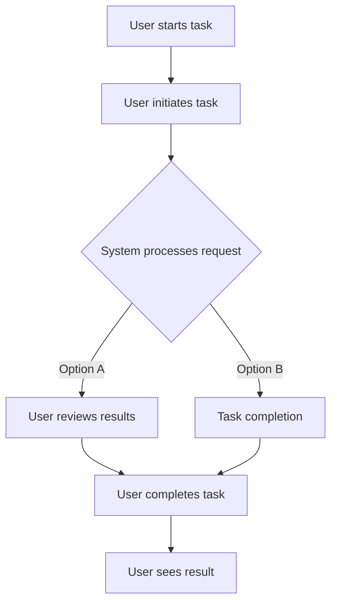

# Test Install Script Enhancement

## Metadata
- **Task ID:** TASK-063
- **Created:** 2025-05-25
- **Due:** 2025-06-01
- **Priority:** Medium
- **Status:** Todo
- **Assigned to:** Developer
- **Task Type:** Development
- **Sequence:** 63
- **Estimated Effort:** Medium
- **Related Epic/Feature:** TaskHero AI Project
- **Tags:** TAGS

## 1. Overview
### 1.1. Brief Description
Enhance the Windows installation script to include user configuration prompts and better error handling

### 1.2. Functional Requirements
Implement test install script enhancement according to specifications
- The installation script should prompt users for configuration settings during the installation process.
- The script should include a comprehensive error handling mechanism to manage any possible failures during the installation.
- The script should maintain a log file, recording all actions taken during installation and any errors encountered.
- The script should include a rollback mechanism in case of any critical errors during the installation, ensuring the system returns to its initial state.
- The script should allow the user to specify the installation directory.
- The installation script should be compatible with the latest versions of Windows OS.
- The script should display a progress bar or similar indicator to keep the user informed about the installation progress.
- The script must not alter any system settings outside of those necessary for the application's function.

### 1.3. Purpose & Benefits
This task enhances the TaskHero AI system by implementing test install script enhancement.
- Improved efficiency: Enhancing the installation script to include user configuration prompts will streamline the installation process, reducing manual intervention and saving time for users.
- Enhanced error handling: By improving error handling in the script, issues can be detected and addressed faster, improving overall system stability and reliability.
- Improved user experience: User configuration prompts will make the installation process more intuitive and user-friendly, enhancing the overall user experience.
- Future scalability: The enhancements will make the script more adaptable for future updates or changes in the system, providing long-term strategic value.
- Risk mitigation: Better error handling will reduce the risk of system crashes or data loss during installation, thereby reducing potential business risks.
- Better troubleshooting: With improved error handling, diagnosing and resolving issues becomes easier and faster, reducing downtime and improving productivity.

### 1.4. Success Criteria
- [ ] Installation script runs successfully on target platforms
- [ ] User configuration is properly collected and validated
- [ ] Settings are correctly stored in configuration files
- [ ] Application starts successfully after setup

## 2. Flow Diagram
**User's perspective of the task flow using Mermaid flowchart:**

User workflow for installation and setup process implementation
## 3. Implementation Status

### 3.1. Implementation Steps
- [ ] **Step 1: Analyzing Current Installation Script** - Status: ⏳ Pending - Target: 2025-06-01
- [ ] Sub-step 1: Review the existing Windows installation script in the file .index\descriptions\mods_project_management_planning_todo_TASK-050-DEV-enhance-install-script-for-taskhero-ai.md.txt to understand its current functionality.
- [ ] Sub-step 2: Identify areas where user configuration prompts can be included and where better error handling is needed.
- [ ] **Step 2: Designing User Configuration Prompts** - Status: ⏳ Pending - Target: 2025-06-01
- [ ] Sub-step 1: Define the necessary user configuration prompts. These could include prompts for installation directory, optional components to install, etc.
- [ ] Sub-step 2: Write pseudo-code for these prompts, detailing where in the installation process they should appear and what actions they should trigger.
- [ ] **Step 3: Enhancing Error Handling** - Status: ⏳ Pending - Target: 2025-06-01
- [ ] Sub-step 1: Identify potential points of failure in the existing script where better error handling could be beneficial.
- [ ] Sub-step 2: Design error handling mechanisms for these points. This should include clear error messages that would help users understand what went wrong.
- [ ] **Step 4: Implementing Enhancements** - Status: ⏳ Pending - Target: 2025-06-01
- [ ] Sub-step 1: Implement the user configuration prompts in the appropriate places in the script as per the pseudo-code.
- [ ] Sub-step 2: Implement the designed error handling mechanisms at the identified points of failure.
- [ ] **Step 5: Testing and Debugging** - Status: ⏳ Pending - Target: 2025-06-01
- [ ] Sub-step 1: Test the modified installation script in a controlled environment to ensure it works as expected.
- [ ] Sub-step 2: Debug any issues that arise during testing, making necessary changes to the script.
- [ ] Sub-step 3: Once all tests pass, commit and push the changes to the repository.

## 4. Detailed Description
Enhance the Windows installation script to include user configuration prompts and better error handling

**Current Implementation Analysis:**
- **Current Implementation Analysis:**
**Primary File**: `.index\descriptions\mods_project_management_planning_todo_TASK-050-DEV-enhance-install-script-for-taskhero-ai.md.txt` (text)
**Complexity**: Low to moderate (0.00)
**Documentation Quality**: Poor

## 6. Risk Assessment
### 6.1. Potential Risks
| Risk | Impact | Probability | Mitigation Strategy |
|------|--------|-------------|-------------------|
| Incomplete or Incorrect User Configuration Prompts | High | Medium | Develop a comprehensive list of all the configurations that need to be prompted. Perform rigorous testing to ensure all prompts are working as expected. |
| Insufficient Error Handling | High | Medium | Identify all possible error scenarios and ensure they are all covered in the script. Implement robust error logging to help diagnose issues. |
| Compatibility Issues with Different Windows Versions | Medium | High | Test the script on all supported versions of Windows to ensure compatibility. |
| User Interface (UI) isn't user-friendly | Medium | Medium | Design the user prompts to be as intuitive as possible. Conduct user testing to gather feedback and make necessary improvements. |
| Extended Downtime due to Script Errors | High | Low | Have a rollback plan in place to revert to the previous version of the script if the new one fails. |

## Testing
Testing will be handled in a separate task based on this task summary and requirements.

## Technical Considerations
- Cross-platform compatibility for installation scripts
- Error handling and recovery mechanisms
- User input validation and sanitization
- Configuration file management and validation

**State Management:**
- State management following identified patterns in the codebase
**Component Architecture:**
- Component architecture aligned with existing file structure and patterns
**Performance Considerations:**
- Performance requirements based on existing code patterns and complexity analysis

## Updates
- **2025-05-25** - Task created
---
*Generated by TaskHero AI Template Engine on 2025-05-25 20:03:16* 