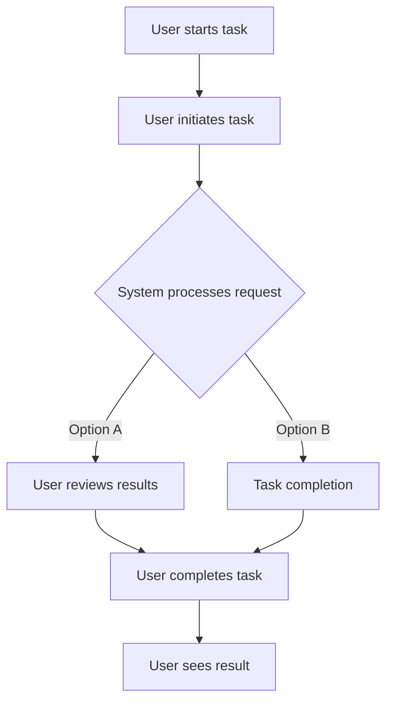

# Test Install Script Enhancement

## Metadata
- **Task ID:** TASK-064
- **Created:** 2025-05-25
- **Due:** 2025-06-01
- **Priority:** Medium
- **Status:** Todo
- **Assigned to:** Developer
- **Task Type:** Development
- **Sequence:** 64
- **Estimated Effort:** Medium
- **Related Epic/Feature:** TaskHero AI Project
- **Tags:** TAGS

## 1. Overview
### 1.1. Brief Description
Enhance the Windows installation script to include user configuration prompts and better error handling

### 1.2. Functional Requirements
Implement test install script enhancement according to specifications
- The script must be updated to prompt the user for configuration details during the installation process.
- The script must validate the user's inputs and deny any invalid entries, providing a clear error message to guide the user towards valid entries.
- The script must include a comprehensive error handling system that catches and logs errors during the installation process.
- The script must provide clear, user-friendly messages for any errors encountered. These messages should include guidance on how to resolve the error.
- The script must be able to run within the existing Windows environment, without requiring any additional software or dependencies.
- The script must be written in a language that is compatible with the existing code base, such as PowerShell or Batch.
- The script must include comments and documentation to enable other developers to understand and modify the code in the future.
- The script must be tested on different versions of Windows to ensure its compatibility and functionality across all supported platforms.

### 1.3. Purpose & Benefits
This task enhances the TaskHero AI system by implementing test install script enhancement.
- Improved Efficiency: Enhanced installation scripts speed up the installation process and reduce the time spent on troubleshooting, which directly increases business productivity.
- Enhanced Error Handling: Better error handling mechanisms in the installation script will help to prevent unexpected crashes, thus improving system stability and reliability.
- Improved User Experience: User configuration prompts will make the installation process more interactive and user-friendly, improving the user experience.
- Strategic Value: The enhancement of the installation script aligns with the long-term strategy of improving product quality and user satisfaction, which could lead to increased customer retention and loyalty.
- Risk Reduction: Enhanced error handling can prevent critical system failures and data loss, thereby reducing operational risks.
- Cost Savings: By reducing the time spent on troubleshooting and the potential for system crashes, the enhanced script could lead to significant cost savings in the long run.

### 1.4. Success Criteria
- [ ] Installation script runs successfully on target platforms
- [ ] User configuration is properly collected and validated
- [ ] Settings are correctly stored in configuration files
- [ ] Application starts successfully after setup

## 2. Flow Diagram
**User's perspective of the task flow using Mermaid flowchart:**

User workflow for installation and setup process implementation
## 3. Implementation Status

### 3.1. Implementation Steps
- [ ] **Step 1: Understanding the Current Script** - Status: ⏳ Pending - Target: 2025-06-01
- [ ] Sub-step 1: Analyze the current Windows installation script in the file .index\descriptions\mods_project_management_planning_todo_TASK-048-DEV-test-enhanced-install-script-task.md.txt. Understand what it does, its flow, and how it handles errors currently.
- [ ] Sub-step 2: Document the existing script's functionality to ensure that no features are lost in the enhancement process.
- [ ] **Step 2: Designing User Configuration Prompts** - Status: ⏳ Pending - Target: 2025-06-01
- [ ] Sub-step 1: Identify the areas in the installation process where user input could be beneficial. This may include paths for installation, optional features to install, or other user-specific configurations.
- [ ] Sub-step 2: Design a set of prompts to gather this information from the user during the installation process. Ensure these prompts are clear, concise, and user-friendly.
- [ ] **Step 3: Implementing User Configuration Prompts** - Status: ⏳ Pending - Target: 2025-06-01
- [ ] Sub-step 1: Implement the designed prompts into the installation script. This might involve using 'read' commands to capture user input, and 'echo' commands to provide the user with information and instructions.
- [ ] Sub-step 2: Test the new prompts to ensure they work as expected.
- [ ] **Step 4: Enhancing Error Handling** - Status: ⏳ Pending - Target: 2025-06-01
- [ ] Sub-step 1: Identify potential points of failure in the installation script where enhanced error handling would be beneficial.
- [ ] Sub-step 2: Implement additional 'try/catch' blocks or conditional statements to catch these errors and provide informative error messages to the user.
- [ ] **Step 5: Testing and Documentation** - Status: ⏳ Pending - Target: 2025-06-01
- [ ] Sub-step 1: Thoroughly test the enhanced script to ensure it works as expected, handles errors appropriately, and properly incorporates user input.
- [ ] Sub-step 2: Update the documentation in the .index\descriptions\mods_project_management_planning_todo_TASK-048-DEV-test-enhanced-install-script-task.md.txt file to reflect the changes and enhancements made to the script. This should include information on new user prompts and improved error handling.

## 4. Detailed Description
Enhance the Windows installation script to include user configuration prompts and better error handling

**Current Implementation Analysis:**
- **Current Implementation Analysis:**
**Primary File**: `.index\descriptions\mods_project_management_planning_todo_TASK-048-DEV-test-enhanced-install-script-task.md.txt` (text)
**Complexity**: Low to moderate (0.00)
**Documentation Quality**: Poor

## 6. Risk Assessment
### 6.1. Potential Risks
| Risk | Impact | Probability | Mitigation Strategy |
|------|--------|-------------|-------------------|
| Incompatibility with different Windows versions | High | Medium | Test the enhanced script on different Windows versions to ensure compatibility. |
| User configuration prompts might be confusing or unclear | Medium | Medium | Conduct usability testing and gather user feedback to improve the clarity and simplicity of configuration prompts. |
| Enhanced error handling may not cover all potential errors | Medium | Medium | Identify a comprehensive list of potential errors and ensure the script is equipped to handle each one. |
| The script might fail to install the program correctly due to new enhancements | High | Low | Perform thorough testing, including edge cases and failure scenarios, to ensure the script installs the program correctly under all circumstances. |
| Script enhancement may cause longer installation time | Low | Medium | Optimize the script to ensure it performs the installation process efficiently. |

## Testing
Testing will be handled in a separate task based on this task summary and requirements.

## Technical Considerations
- Cross-platform compatibility for installation scripts
- Error handling and recovery mechanisms
- User input validation and sanitization
- Configuration file management and validation

**State Management:**
- State management following identified patterns in the codebase
**Component Architecture:**
- Component architecture aligned with existing file structure and patterns
**Performance Considerations:**
- Performance requirements based on existing code patterns and complexity analysis

## Updates
- **2025-05-25** - Task created
---
*Generated by TaskHero AI Template Engine on 2025-05-25 20:08:33* 