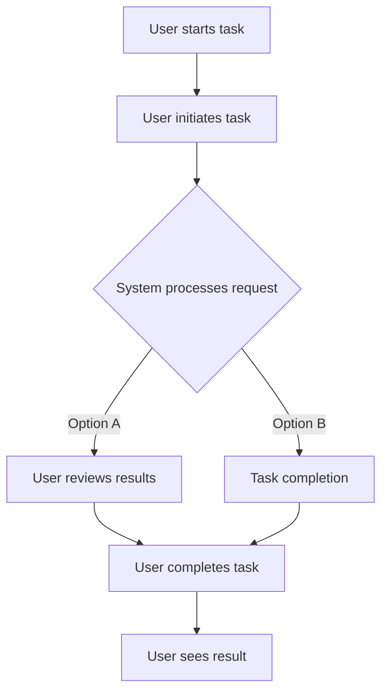

# Test Install Script Enhancement

## Metadata
- **Task ID:** TASK-065
- **Created:** 2025-05-25
- **Due:** 2025-06-01
- **Priority:** Medium
- **Status:** Todo
- **Assigned to:** Developer
- **Task Type:** Development
- **Sequence:** 65
- **Estimated Effort:** Medium
- **Related Epic/Feature:** TaskHero AI Project
- **Tags:** TAGS

## 1. Overview
### 1.1. Brief Description
Enhance the Windows installation script to include user configuration prompts and better error handling

### 1.2. Functional Requirements
Implement test install script enhancement according to specifications
- The script must include a user configuration prompt to gather necessary information during the installation process.
- The script must include a system compatibility check before initiating the installation process.
- The script must include enhanced error handling, with specific error messages for common issues such as missing dependencies or insufficient system resources.
- The script must include a log generation mechanism to record the installation process, and any errors encountered. This will help in troubleshooting in case of installation failure.
- The script must include a rollback mechanism to revert any changes made in case of installation failure.
- The script must include a verification step post-installation to confirm successful installation.
- The script must include a user-friendly interface for the configuration prompts.
- The script must be compatible with all current and future versions of Windows operating system.

### 1.3. Purpose & Benefits
This task enhances the TaskHero AI system by implementing test install script enhancement.
- Improved User Experience: By including user configuration prompts, the installation process will become more interactive and user-oriented, thus improving the overall user experience.
- Enhanced Error Handling: Better error handling in the script will allow the system to deal with issues more effectively, reducing the risk of installation failures and increasing system stability.
- Time Efficiency: With the script enhancement, the installation process will be more efficient and quicker, saving valuable time for users.
- Cost Effective: Improved error handling will reduce system downtime and support costs, providing long-term financial benefits for the business.
- Increased Flexibility: User configuration prompts will allow users to customize the installation to their needs, providing greater flexibility and adaptability.
- Risk Reduction: Better error handling will minimize the risk of system failures during installation, thus reducing potential risks and improving system reliability.

### 1.4. Success Criteria
- [ ] Installation script runs successfully on target platforms
- [ ] User configuration is properly collected and validated
- [ ] Settings are correctly stored in configuration files
- [ ] Application starts successfully after setup

## 2. Flow Diagram
**User's perspective of the task flow using Mermaid flowchart:**

User workflow for installation and setup process implementation
## 3. Implementation Status

### 3.1. Implementation Steps
- [ ] **Step 1: Analyze Current Script** - Status: ⏳ Pending - Target: 2025-06-01
- [ ] Sub-step 1: Start by reviewing the existing installation script located in .index\descriptions\mods_project_management_planning_todo_TASK-045-DEV-enhance-install-script-for-taskhero-ai---improved.md.txt file. Understand its current functionality and structure.
- [ ] Sub-step 2: Identify the parts of the script that need modifications to include user configuration prompts and better error handling.
- [ ] **Step 2: Implement User Configuration Prompts** - Status: ⏳ Pending - Target: 2025-06-01
- [ ] Sub-step 1: Start by defining the user configuration prompts. These could be prompts for the installation directory, feature selection, etc. Ensure the prompts are clear and understandable.
- [ ] Sub-step 2: Update the script to include these prompts at the appropriate stages of the installation process. You might use built-in shell scripting functions like `read` for this.
- [ ] **Step 3: Upgrade Error Handling** - Status: ⏳ Pending - Target: 2025-06-01
- [ ] Sub-step 1: Review the current error handling within the script. Identify areas where error handling is either non-existent or can be improved.
- [ ] Sub-step 2: Implement better error handling. This can be achieved by using try-catch blocks, if-else conditions, or exit statuses. Ensure that any errors encountered during the installation process are properly caught and meaningful error messages are displayed to the user.
- [ ] **Step 4: Testing and Validation** - Status: ⏳ Pending - Target: 2025-06-01
- [ ] Sub-step 1: Once the changes have been made, test the script thoroughly. This should include testing with a variety of user inputs at the configuration prompts, as well as intentionally causing errors to test the error handling.
- [ ] Sub-step 2: Validate that the script works as expected and that all user prompts and error messages are displayed correctly.
- [ ] **Step 5: Documentation** - Status: ⏳ Pending - Target: 2025-06-01
- [ ] Sub-step 1: Document the changes made to the script. This should include a description of the new user prompts and error handling features.
- [ ] Sub-step 2: Update the installation instructions as necessary to reflect the new user prompts.
- [ ] Sub-step 3: Commit the changes with clear and descriptive commit messages.

## 4. Detailed Description
Enhance the Windows installation script to include user configuration prompts and better error handling

**Current Implementation Analysis:**
- **Current Implementation Analysis:**
**Primary File**: `.index\descriptions\mods_project_management_planning_todo_TASK-045-DEV-enhance-install-script-for-taskhero-ai---improved.md.txt` (text)
**Complexity**: Low to moderate (0.00)
**Documentation Quality**: Poor

## 6. Risk Assessment
### 6.1. Potential Risks
| Risk | Impact | Probability | Mitigation Strategy |
|------|--------|-------------|-------------------|
| Incorrect User Configuration Input | High | Medium | Implement robust input validation and provide clear instructions to the user on how to correctly provide the configuration inputs. |
| Failure in Error Handling Enhancement | High | Medium | Extensive testing should be performed on the error handling capabilities of the script. This includes generating all possible errors to ensure that they are handled correctly. |
| Compatibility Issues with Different Windows Versions | Medium | High | Test the script on different versions of Windows to ensure compatibility. If not possible, specify the Windows versions that are supported in the user documentation. |
| Script Enhancement may increase Installation Time | Low | Medium | Optimize the script to ensure that the installation time is not significantly increased. If unavoidable, inform the user about the expected installation time. |
| Unhandled Exceptions in the Script | High | Low | Implement a comprehensive exception handling system in the script to catch and handle all possible exceptions. |

## Testing
Testing will be handled in a separate task based on this task summary and requirements.

## Technical Considerations
- Cross-platform compatibility for installation scripts
- Error handling and recovery mechanisms
- User input validation and sanitization
- Configuration file management and validation

**State Management:**
- State management following identified patterns in the codebase
**Component Architecture:**
- Component architecture aligned with existing file structure and patterns
**Performance Considerations:**
- Performance requirements based on existing code patterns and complexity analysis

## Updates
- **2025-05-25** - Task created
---
*Generated by TaskHero AI Template Engine on 2025-05-25 20:09:54* 