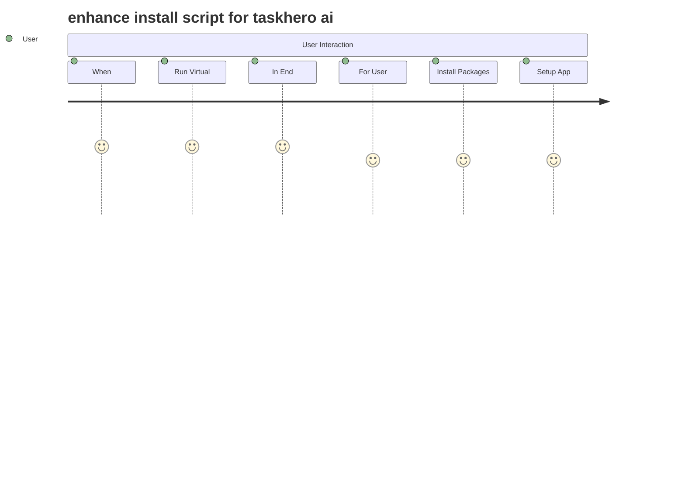

# enhance install script for taskhero ai #12

## Metadata
- **Task ID:** TASK-066
- **Created:** 2025-05-25
- **Due:** 2025-05-28
- **Priority:** Medium
- **Status:** Todo
- **Assigned to:** Developer
- **Task Type:** Development
- **Sequence:** 66
- **Estimated Effort:** Small
- **Related Epic/Feature:** TaskHero AI Project
- **Tags:** install script, initial setup, initial setting

## 1. Overview
### 1.1. Brief Description
**Task Title:** Enhance Install Script for TaskHero AI #12
**Overview and Objectives:**
The primary aim of this task is to enhance and improve the existing setup_windows.bat file used for installing...

### 1.2. Functional Requirements
['The script should be modified to include a clear and user-friendly interface, presenting on-screen instructions and feedback to the user during the installation process. This should be tested with a variety of users to ensure it is intuitive and informative.', 'The script should include a feature to divide the installation into two main parts: package installation and user configuration. The script should be able to verify successful package installation before proceeding to user configuration.', 'The script should prompt the user to answer questions regarding the setup of the application, such as whether it will be a central repository or a singular codebase, the path of the codebase, the location of project tasks files storage, and whether taskhero API and MCP functions will be used. These prompts should be tested for clarity and ease of user response.', 'The script should include error handling for invalid user input, such as incorrect file paths or non-existent directories. This should include informative error messages and prompts for the user to correct their input.', "The script should store the user's answers to the configuration questions in the app settings JSON file and API settings into the ENV file. The script should be able to verify that the information has been correctly stored.", 'The script should initiate the run of the app.py file to run TaskHero, only after the successful completion of the previous steps. This should be tested to ensure that app.py runs correctly and TaskHero functions as expected.', 'The script should include a feature to remember the settings from the initial run and skip those steps in subsequent runs. This feature should be tested to ensure that it correctly identifies and skips completed settings.', 'The script should include a feature for handling edge cases, such as failure of package installation, interruption during script execution, or unexpected user input. This should be tested to ensure that the script can recover and continue or provide useful feedback to the user.']

### 1.3. Purpose & Benefits
This task enhances the TaskHero AI system by implementing enhance install script for taskhero ai #12.

### 1.4. Success Criteria
- [ ] Installation script runs successfully on target platforms
- [ ] User configuration is properly collected and validated
- [ ] Settings are correctly stored in configuration files
- [ ] Application starts successfully after setup

## 2. Flow Diagram
**Task flow diagram:**



Task Flow Diagram

## 3. Implementation Status

### 3.1. Implementation Steps
- [ ] **Step 1: Requirements Analysis and Planning** - Status: ⏳ Pending - Target: 2025-05-28
- [ ] Sub-step 1: Analyze the existing setup_windows.bat script and identify areas requiring enhancement.
- [ ] Sub-step 2: Understand the user interaction requirements like the questions to be asked, and how the responses should be handled and stored.
- [ ] Sub-step 3: Plan the sequence of tasks and identify the dependencies.
- [ ] **Step 2: Design and Architecture** - Status: ⏳ Pending - Target: 2025-05-28
- [ ] Sub-step 1: Design the improved user interaction flow, including the sequence and format of questions to be asked.
- [ ] Sub-step 2: Architect the handling of user responses, including how they are stored in the app settings json file and ENV file.
- [ ] Sub-step 3: Design the conditional logic for skipping already completed settings in subsequent runs.
- [ ] **Step 3: Implementation and Development** - Status: ⏳ Pending - Target: 2025-05-28
- [ ] Sub-step 1: Enhance the script to implement the designed user interaction flow.
- [ ] Sub-step 2: Implement the handling of user responses, including storing them in the appropriate files.
- [ ] Sub-step 3: Implement the conditional logic for skipping already completed settings.
- [ ] Sub-step 4: Ensure the app.py file is correctly initiated to run TaskHero.
- [ ] **Step 4: Testing and Validation** - Status: ⏳ Pending - Target: 2025-05-28
- [ ] Sub-step 1: Write test cases to validate all possible user responses and edge cases.
- [ ] Sub-step 2: Run the enhanced script in a controlled environment and validate it against the test cases.
- [ ] Sub-step 3: Validate that the app.py file correctly runs TaskHero after the script completes.
- [ ] **Step 5: Deployment and Documentation** - Status: ⏳ Pending - Target: 2025-05-28
- [ ] Sub-step 1: Deploy the enhanced script in the production environment.
- [ ] Sub-step 2: Document the enhancements made, how to use the enhanced script, and any known issues or limitations.
- [ ] Sub-step 3: Update the user guide to reflect the new user interaction flow.

## 4. Detailed Description
**Task Title:** Enhance Install Script for TaskHero AI #12
**Overview and Objectives:**
The primary aim of this task is to enhance and improve the existing setup_windows.bat file used for installing and running TaskHero AI. The existing script needs to be more user-friendly, informative, and segmented for a better user experience. The enhanced script should prompt the user to answer a series of configuration questions that will be stored and used for subsequent runs of the script.
**Technical Context:**
The existing codebase consists of a setup script (setup_windows.bat) which is responsible for installing TaskHero AI and initiating a virtual environment to run the app.py file. This script also handles the setup of app requirements. This setup process needs to be improved and divided into two main parts: the installation of necessary packages and a configuration questionnaire.
**Key Implementation Considerations:**
1. **Script Segmentation:** The script should be divided into two main parts. The first part should handle the installation of all necessary packages for setting up the app requirements. The second part should handle the user configuration questionnaire.
2. **User Configuration:** The script should prompt the user to answer a series of questions related to the setup and configuration of TaskHero AI. These questions include:
    - Is this a central repository for all different codebases or will it be singular and reside into the existing codebase it is going to index?
    - What is the path of the codebase that TaskHero is going to attempt to index?
    - What is the path of the project tasks files storage (default present folder or root folder /taskherofiles)?
    - Will TaskHero API and MCP functions be used?
    - What are the API details for the models and functions required by TaskHero to function?
3. **Data Storage:** The answers provided by the user should be stored in the app settings JSON file and the API settings should be stored in the ENV file accordingly.
4. **Script Re-run:** If the script is run subsequent times, it should skip the completed settings and move directly to running the app.
**Expected Deliverables:**
The enhanced setup_windows.bat file that includes the aforementioned improvements and features. The script should be well-documented with clear, concise comments explaining each section and its functionality.
**Integration Points with Existing System:**
The enhanced script should seamlessly integrate with the existing system. It should be capable of installing TaskHero AI, setting up the app requirements, storing user configuration data, and running the app.py file. All the details stored from the initial run should be fetchable and reusable for subsequent runs of the script. The script should also be able to handle changes or updates to the previously given answers by the user.


## 5. UI Design & Specifications
### 5.1. Design Overview
[Brief description of the UI changes and design goals]

### 5.2. Wireframes & Layout
**Use ASCII art for layouts, wireframes, and component positioning:**

```
╔═══════════════════════════════════════════════════════════════╗
║                        Task Progress                          ║
╠═══════════════════════════════════════════════════════════════╣
║ Phase 1: Analysis     [████████░░] 80%       ║
║ Phase 2: Development  [██████░░░░] 60%       ║
║ Phase 3: Testing      [███░░░░░░░] 30%       ║
║ Phase 4: Deployment   [░░░░░░░░░░] 0%       ║
╚═══════════════════════════════════════════════════════════════╝
```

**ASCII Art Tips:**
- Use `┌─┐└─┘│├─┤` for clean borders and boxes
- Use `═══` for emphasis/headers
- Use `...` for content areas
- Use `[Button]` for interactive elements
- Use `📊📅💳⚙️` emojis for icons and visual elements
- Use `↕↗▼` arrows for sorting and navigation indicators
- Use `🔴🟢` colored circles for status indicators
- Use `^annotations` below diagrams for explanations

### 5.3. Design System References
- **Colors:** [Primary: #color, Secondary: #color, etc.]
- **Typography:** [Font family, sizes, weights]
- **Spacing:** [Padding/margin standards]
- **Components:** [shadcn/ui components used]
- **Icons:** [Icon library and specific icons]

### 5.4. Visual Design References
- [Link to Figma/Design file]
- [Link to existing similar components]
- [Screenshots or mockups if available]
## 6. Risk Assessment
### 6.1. Potential Risks
| Risk | Impact | Probability | Mitigation Strategy |
|------|--------|-------------|-------------------|
| User Inputs Incorrect Information | High | Medium | Implement data validation to check for valid inputs. Provide clear instructions and examples to guide the user. |
| Script Fails to Save Settings Correctly | High | Low | Implement error checking and handling mechanisms to ensure settings are saved properly. Test thoroughly to ensure reliability. |
| Script Fails to Skip Completed Settings on Subsequent Runs | Medium | Medium | Implement a mechanism to track and check the status of each setting. Test this feature thoroughly to ensure settings are correctly identified and skipped. |
| Dependency Installation Fails | High | Low | Ensure the script has robust error handling and recovery for dependency installation. Include checks for system requirements before installation begins. |
| Incompatibility with Different Windows Versions | Medium | Medium | Test the script on different versions of Windows to ensure compatibility. If incompatibilities are found, provide clear error messages and potential solutions to the user. |


## Testing
Testing will be handled in a separate task based on this task summary and requirements.


## Technical Considerations
- Cross-platform compatibility for installation scripts
- Error handling and recovery mechanisms
- User input validation and sanitization
- Configuration file management and validation


## Updates
- **2025-05-25** - Task created
---
*Generated by TaskHero AI Template Engine on 2025-05-25 20:15:32* 