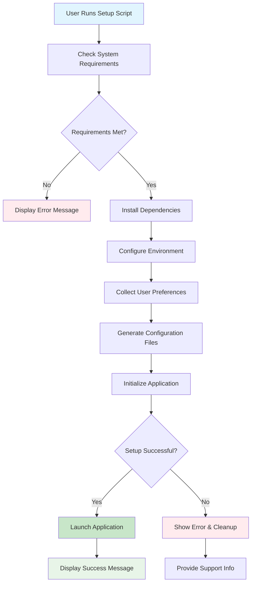

# enhance install script for taskhero ai #16

## Metadata
- **Task ID:** TASK-070
- **Created:** 2025-05-25
- **Due:** 2025-05-28
- **Priority:** Medium
- **Status:** Todo
- **Assigned to:** Developer
- **Task Type:** Development
- **Sequence:** 70
- **Estimated Effort:** Small
- **Related Epic/Feature:** TaskHero AI Project
- **Tags:** install script, initial setup, initial settings

## 1. Overview
### 1.1. Brief Description
## Development Task: Enhance TaskHero AI Windows Installation Script
**Task ID:** #16
**Task Title:** Enhance `setup_windows.bat` for TaskHero AI Installation
### 1. Overview and Objectives
T...

### 1.2. Functional Requirements
['Here are 8 specific functional requirements for enhancing the `setup_windows.bat` script:', 'The install script shall display clear, step-by-step progress messages to the user during package installation, including the name of the package being installed and a success/failure indicator.', 'The install script shall prompt the user with a "Yes/No" question regarding whether TaskHero AI will be a central repository for multiple codebases, storing the user\'s choice in the `app_settings.json` file as `is_central_repo` (Boolean).', 'The install script shall prompt the user for the absolute path of the codebase(s) to be indexed by TaskHero AI, validating that the provided path exists and storing it in `app_settings.json` as `indexed_codebase_path` (String).', "The install script shall offer the user a choice for TaskHero's project tasks file storage: either the current directory (default) or a new `/taskherofiles` directory in the root, storing the chosen path in `app_settings.json` as `project_tasks_storage_path` (String).", 'The install script shall prompt the user with a "Yes/No" question regarding the use of TaskHero API and MCP functions, and if "Yes", subsequently prompt for required API details (e.g., API keys, endpoints) and store them securely in the `.env` file.', 'The install script shall detect existing valid configurations in `app_settings.json` and `.env` files from previous runs, skipping corresponding user prompts and proceeding directly to the `app.py` execution if all necessary settings are present.', 'The install script shall implement error handling for failed package installations, displaying a user-friendly error message, logging the failure, and providing instructions for manual intervention or script re-execution.']

### 1.3. Purpose & Benefits
This task enhances the TaskHero AI system by implementing enhance install script for taskhero ai #16.

### 1.4. Success Criteria
- [ ] Installation script runs successfully on target platforms
- [ ] User configuration is properly collected and validated
- [ ] Settings are correctly stored in configuration files
- [ ] Application starts successfully after setup

## 2. Flow Diagram
**Task flow diagram:**



Task Flow Diagram

## 3. Implementation Status

### 3.1. Implementation Steps
- [ ] **Step 1: Requirements Analysis** - Status: ⏳ Pending - Target: 2025-05-28
- [ ] Sub-step 1: Review requirements and specifications
- [ ] Sub-step 2: Identify key stakeholders and dependencies
- [ ] Sub-step 3: Define acceptance criteria
- [ ] **Step 2: Implementation** - Status: ⏳ Pending - Target: 2025-05-28
- [ ] Sub-step 1: Implement core functionality
- [ ] Sub-step 2: Add error handling and validation
- [ ] Sub-step 3: Write unit tests

## 4. Detailed Description
## Development Task: Enhance TaskHero AI Windows Installation Script
**Task ID:** #16
**Task Title:** Enhance `setup_windows.bat` for TaskHero AI Installation
### 1. Overview and Objectives
This task aims to significantly improve the user experience and robustness of the TaskHero AI Windows installation process by enhancing the existing `setup_windows.bat` script. The primary objective is to transform a basic installation script into an interactive, informative, and intelligent setup wizard that guides users through essential configuration steps, stores their preferences, and streamlines subsequent executions.
The goal is to provide a user-friendly and efficient installation flow that:
*   Clearly separates installation phases (dependencies vs. configuration).
*   Gathers critical user inputs for TaskHero's operation.
*   Persists configuration settings for future runs.
*   Enables automated setup skipping on subsequent executions.
*   Ultimately, initiates the TaskHero AI application.
### 2. Technical Context
TaskHero AI currently relies on a `setup_windows.bat` script for initial setup and virtual environment management on Windows. This script is responsible for setting up the Python environment, installing dependencies, and launching `app.py`.
Key existing components and considerations:
*   **`setup_windows.bat`:** The current batch script. This task requires significant modification and enhancement of this file.
*   **`app.py`:** The main TaskHero AI application entry point. The enhanced script must eventually launch this.
*   **Virtual Environment:** The script should continue to properly set up and activate a Python virtual environment (e.g., using `venv` or `conda` if preferred/specified).
*   **`requirements.txt`:** This file dictates the Python packages to be installed. The script must reliably install these.
*   **`app_settings.json`:** This file is intended to store application-wide configuration settings. User inputs from the script should be persisted here.
*   **Environment Variables (e.g., `.env` file):** Sensitive API details and other environment-specific configurations are likely stored as environment variables or within a `.env` file. The script needs to manage these.
*   **`git`:** The script may need to interact with Git for repository cloning or path validation.
*   **Python:** The script will be executing Python commands (e.g., `pip install`, `python app.py`).
### 3. Key Implementation Considerations
The enhanced `setup_windows.bat` script should implement the following phases and functionalities:
#### Phase 1: Pre-requisites & Dependency Installation
*   **User Feedback:** Provide clear, user-friendly messages indicating the current step (e.g., "Checking prerequisites...", "Installing Python packages...").
*   **Python & `venv` Setup:** Ensure a Python virtual environment is created and activated. If Python is not found, guide the user or attempt to install it (optional, but good for robustness).
*   **Package Installation:** Install all dependencies listed in `requirements.txt` into the virtual environment. Handle potential errors gracefully (e.g., network issues, missing packages).
#### Phase 2: Interactive Configuration Wizard
This phase will prompt the user for critical TaskHero AI configuration details. All inputs should be validated where possible.
*   **Configuration Persistence Logic:** Introduce a mechanism (e.g., a flag in `app_settings.json` or a dedicated marker file) to indicate if the configuration has been completed.
*   **Conditional Execution:** If configuration is already complete (from a previous run), skip this phase and proceed directly to Phase 3.
*   **User Prompts (with clear explanations and default options):**
    1.  **Repository Strategy:**
        *   **Question:** "Will TaskHero AI operate as a central repository for multiple codebases, or will it be singular, indexing only its own immediate codebase?"
        *   **Options:** `[C]entral Repository` / `[S]ingular (index current codebase)`
        *   **Impact:** This choice influences how TaskHero indexes and manages projects. (Developer: Map this to a configuration key in `app_settings.json`, e.g., `repo_strategy`).
    2.  **Codebase Path:**
        *   **Question:** "Please provide the absolute path to the codebase TaskHero AI will attempt to index."
        *   **Input:** User provides a directory path.
        *   **Validation:** Check if the path exists and is a directory.
        *   **Impact:** Store this path in `app_settings.json` (e.g., `codebase_path`).
    3.  **Project Tasks Files Storage:**
        *   **Question:** "Where should TaskHero AI store its project tasks files?"
        *   **Options:** `[D]efault (current working directory)` / `[R]oot folder (e.g., C:\taskherofiles)`
        *   **If 'R' selected:** Prompt for the specific root folder path.
        *   **Validation:** Ensure the path is valid and writable.
        *   **Impact:** Store this path in `app_settings.json` (e.g., `task_files_storage_path`).
    4.  **API & MCP Functions Usage:**
        *   **Question:** "Will TaskHero AI's API and MCP (Master Control Program) functions be used?"
        *   **Options:** `[Y]es` / `[N]o`
        *   **Impact:** This flag might enable/disable certain features or prompt for further API details. Store in `app_settings.json` (e.g., `enable_api_mcp`).
    5.  **API Details (Conditional):**
        *   **If 'Y' selected for Q4:** Prompt for specific API details required by TaskHero (e.g., API keys, endpoint URLs for models/services).
        *   **Input:** Varies by API (e.g., OpenAI API Key, custom model endpoint).
        *   **Storage:** Store these *sensitive* details in environment variables or within a `.env` file, not directly in `app_settings.json`. The script should create/update the `.env` file.
        *   **Guidance:** Provide clear instructions on where to obtain these keys/endpoints.
#### Phase 3: Configuration Persistence
*   **`app_settings.json` Update:** Write all gathered configuration details (from Q1-Q4) into `app_settings.json`. Ensure proper JSON formatting.
*   **`.env` File Update:** Create or update the `.env` file with sensitive API details.
#### Phase 4: Application Launch
*   **Virtual Environment Activation:** Ensure the virtual environment is activated.
*   **Application Execution:** Launch `app.py` using the activated virtual environment's Python interpreter.
*   **Success Message:** Display a clear message indicating TaskHero AI is starting.
#### Error Handling & User Feedback
*   **Robustness:** Implement basic error handling for common issues (e.g., file not found, invalid input, network errors during `pip install`).
*   **Informative Messages:** Provide clear, actionable error messages to the user.
*   **Progress Indicators:** Use simple visual cues (e.g., dots, "Working...") during long operations.
### 4. Expected Deliverables
*   **Modified `setup_windows.bat`:** The primary deliverable, containing all the described logic, interactive prompts, configuration persistence, and application launch.
*   **Updated `app_settings.json` structure (if necessary):** Ensure the `app_settings.json` file is designed to accept and store the new configuration parameters gathered by the script.
*   **Documentation Snippets (within the script or separate README):** Brief internal comments explaining complex parts of the batch script. A small update to the main `README.md` to explain how to run the new installer.
*   **Test Plan (informal):** A brief outline of how to test the various scenarios (first run, subsequent run, invalid inputs, etc.).
### 5. Integration Points with Existing System
*   **`app.py`:** The final step of the script must successfully launch `app.py`. `app.py` should then read its configuration from the updated `app_settings.json` and `.env` files.
*   **`requirements.txt`:** The script must correctly interpret and install packages from this file.
*   **`app_settings.json`:** This is the central repository for non-sensitive application settings. The script writes to it.
*   **`.env` file (or equivalent environment variable management):** This is for sensitive API keys and environment-specific settings. The script writes to it.
*   **Virtual Environment:** The script manages the creation and activation of the Python virtual environment.
*   **User Interface:** The script itself *is* the user interface for the installation process. The prompts and messages it displays are critical.
**Definition of Done:**
*   `setup_windows.bat` executes without errors on a clean Windows machine.
*   The script correctly identifies if it's a first-time run or a subsequent run.
*   On first run, all configuration prompts are displayed


## 5. UI Design & Specifications
### 5.1. Design Overview
[Brief description of the UI changes and design goals]

### 5.2. Wireframes & Layout
**Use ASCII art for layouts, wireframes, and component positioning:**

```
╔═══════════════════════════════════════════════════════════════╗
║                        Task Progress                          ║
╠═══════════════════════════════════════════════════════════════╣
║ Phase 1: Analysis     [████████░░] 80%       ║
║ Phase 2: Development  [██████░░░░] 60%       ║
║ Phase 3: Testing      [███░░░░░░░] 30%       ║
║ Phase 4: Deployment   [░░░░░░░░░░] 0%       ║
╚═══════════════════════════════════════════════════════════════╝
```

### 5.3. Design System References
- **Colors:** [Primary: #color, Secondary: #color, etc.]
- **Typography:** [Font family, sizes, weights]
- **Spacing:** [Padding/margin standards]
- **Components:** [shadcn/ui components used]
- **Icons:** [Icon library and specific icons]

### 5.4. Visual Design References
- [Link to Figma/Design file]
- [Link to existing similar components]
- [Screenshots or mockups if available]
## 6. Risk Assessment
### 6.1. Potential Risks
| Risk | Impact | Probability | Mitigation Strategy |
|------|--------|-------------|-------------------|
| **Increased Complexity and Error Proneness in Script Logic** | High | Medium | Implement robust error handling for user inputs (e.g., input validation, default values if invalid). Thoroughly test all possible execution paths (first run, subsequent runs, different user choices). Utilize modular functions within the batch script to manage complexity and improve readability. Consider using a more robust scripting language (e.g., PowerShell, Python) if the batch script becomes unmanageable. |
| **Data Loss or Corruption due to Incorrect Configuration Storage** | High | Medium | Implement strict validation for all user inputs before writing to configuration files. Use libraries or built-in functions for safe JSON parsing and writing. Ensure proper file permissions are set for the configuration files. Implement version control for `app settings json` (if practical) or provide clear instructions for backing up existing configurations before running the script. For ENV files, ensure secure storage practices are followed (e.g., not committing sensitive keys to public repositories). |
| **Negative User Experience due to Unclear Prompts or Installation Failures** | Medium | Medium | Conduct user acceptance testing (UAT) with target users to gather feedback on the clarity and flow of the prompts. Provide clear examples for each question. Implement informative progress indicators and verbose error messages if installation steps fail. Offer options to retry failed steps or provide clear instructions for manual intervention. Ensure the script provides a clear summary of configured settings at the end. |
| **Security Vulnerabilities from Improper API Key Handling** | High | Medium | Educate users on the importance of securing their API keys. Ensure the ENV file is created with appropriate file permissions to restrict access. Avoid displaying API keys in plain text during script execution or in log files. Consider implementing environment variable masking or encrypted storage if the application architecture allows for it. Advise users against committing ENV files to version control. |
| **Compatibility Issues Across Different Windows Environments** | Medium | Low | Test the enhanced script on a variety of common Windows operating system versions and configurations (e.g., different user privileges, presence/absence of specific system tools). Use robust and widely compatible batch commands. Provide clear prerequisites for the execution environment (e.g., administrative privileges if required). Consider providing alternative installation methods or detailed troubleshooting guides for known compatibility issues. |


## Testing
Testing will be handled in a separate task based on this task summary and requirements.


## Technical Considerations
- Cross-platform compatibility for installation scripts
- Error handling and recovery mechanisms
- User input validation and sanitization
- Configuration file management and validation


## Updates
- **2025-05-25** - Task created
---
*Generated by TaskHero AI Template Engine on 2025-05-25 23:23:50* 