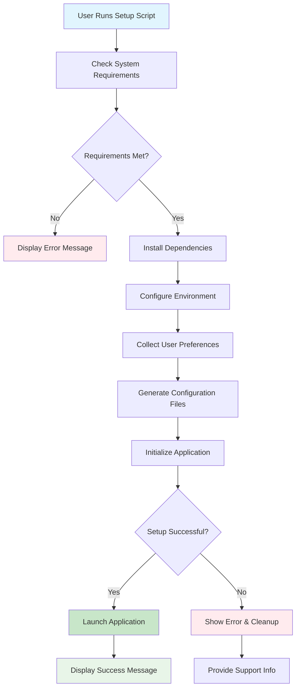

# enhance install script for taskhero ai #19

## Metadata
- **Task ID:** TASK-073
- **Created:** 2025-05-26
- **Due:** 2025-05-29
- **Priority:** Medium
- **Status:** Todo
- **Assigned to:** Developer
- **Task Type:** Development
- **Sequence:** 73
- **Estimated Effort:** Small
- **Related Epic/Feature:** TaskHero AI Project
- **Tags:** install script, initial setup, initial settings

## 1. Overview
### 1.1. Brief Description
## Development Task: Enhance TaskHero AI Installation Script (Windows)
**Task ID:** #19
**Task Title:** Enhance `setup_windows.bat` for TaskHero AI
### 1. Overview and Objectives
This task ai...

### 1.2. Functional Requirements
['Here are 8 specific functional requirements for enhancing the `setup_windows.bat` script:', 'The `setup_windows.bat` script shall first check for and install all required Python packages and dependencies for TaskHero AI, providing clear progress indicators to the user.', 'The `setup_windows.bat` script shall, after dependency installation, prompt the user for the following configuration details: Central vs. Singular repository, Codebase path for indexing, Project task file storage path (default or `/taskherofiles`), and TaskHero API/MCP usage.', 'The `setup_windows.bat` script shall validate user input for codebase and project task file paths, ensuring they are valid and accessible directories, and prompt for re-entry if invalid.', 'The `setup_windows.bat` script shall store user-provided configuration details (excluding API keys) into the `app_settings.json` file, overwriting existing values if present.', 'The `setup_windows.bat` script shall, if TaskHero API/MCP usage is selected, prompt for and store necessary API details into the `.env` file, ensuring sensitive information is handled securely.', "The `setup_windows.bat` script shall utilize a mechanism (e.g., a status file like `setup_status.py`'s `SETUP_FILE`) to detect if initial configuration has been completed, skipping all interactive prompts and directly proceeding to `app.py` execution if setup is detected.", 'The `setup_windows.bat` script shall gracefully handle errors during package installation or file operations (e.g., `pip` failures, file write errors), providing informative messages to the user and suggesting troubleshooting steps.']

### 1.3. Purpose & Benefits
This task enhances the TaskHero AI system by implementing enhance install script for taskhero ai #19.

### 1.4. Success Criteria
- [ ] Installation script runs successfully on target platforms
- [ ] User configuration is properly collected and validated
- [ ] Settings are correctly stored in configuration files
- [ ] Application starts successfully after setup

## 2. Flow Diagram
**Task flow diagram:**



Task Flow Diagram

## 3. Implementation Status

### 3.1. Implementation Steps
- [ ] **Step 1: Requirements Analysis** - Status: ⏳ Pending - Target: 2025-05-29
- [ ] Sub-step 1: Review requirements and specifications
- [ ] Sub-step 2: Identify key stakeholders and dependencies
- [ ] Sub-step 3: Define acceptance criteria
- [ ] **Step 2: Implementation** - Status: ⏳ Pending - Target: 2025-05-29
- [ ] Sub-step 1: Implement core functionality
- [ ] Sub-step 2: Add error handling and validation
- [ ] Sub-step 3: Write unit tests

## 4. Detailed Description
## Development Task: Enhance TaskHero AI Installation Script (Windows)
**Task ID:** #19
**Task Title:** Enhance `setup_windows.bat` for TaskHero AI
### 1. Overview and Objectives
This task aims to significantly enhance the existing `setup_windows.bat` installation script for TaskHero AI. The primary objective is to transform the current rudimentary script into a user-friendly, informative, and interactive installation experience. This involves structuring the installation process into distinct phases, gathering essential configuration details from the user through guided prompts, storing these settings appropriately, and ultimately launching the TaskHero AI application. The enhanced script should also intelligently handle subsequent runs, skipping already completed configuration steps.
**Objectives:**
*   **Improved User Experience:** Provide clear, concise, and elegant output during the installation process, making it intuitive for users.
*   **Modular Installation:** Divide the script into logical sections for dependency installation, configuration gathering, and application launch.
*   **Interactive Configuration:** Prompt the user for critical TaskHero AI settings (repository type, codebase path, task file storage, API/MCP usage, API details).
*   **Persistent Configuration:** Store user-provided settings in `app_settings.json` and sensitive API details in the `.env` file.
*   **Idempotency:** Ensure the script can be run multiple times without re-prompting for already configured settings, directly proceeding to application launch.
*   **Robustness:** Incorporate error handling and informative messages for failed steps.
### 2. Technical Context
The current `setup_windows.bat` script is a basic batch file responsible for setting up the TaskHero AI environment on Windows. It is expected to:
*   Install necessary Python packages.
*   Prepare the virtual environment.
*   Initiate `app.py`.
**Relevant Codebase References:**
*   **`setup_linux.sh` (script):** This script provides a precedent for structured installation steps, including dependency installation, virtual environment setup, and error handling (`if [ $? -ne 0 ]`). While a shell script, its modular approach and error reporting can inform the structure of the enhanced batch file. Specifically, observe how it handles `pip` upgrades and general dependency installation.
*   **`setup_status.py` (python):** This Python script demonstrates how setup status is managed and checked. It utilizes a `SETUP_FILE` (likely a marker file or a configuration file) to determine if a setup has been performed. This is crucial for implementing the idempotency requirement of skipping already completed configuration steps. The enhanced `setup_windows.bat` will need to interact with or mimic the logic of `setup_status.py` (or a new equivalent) to check for existing configuration.
*   **`app_settings.json`:** This JSON file is designated for storing general application settings. User-provided configuration details like repository type, codebase path, and task file storage paths will need to be written to this file.
*   **`.env` file:** This file is used for storing environment variables, typically for sensitive information like API keys and model details. The script will need to dynamically update or create this file with the API details provided by the user.
*   **`app.py`:** This is the main TaskHero AI application entry point. The enhanced script's final step will be to activate the virtual environment and execute this script.
### 3. Key Implementation Considerations
*   **Batch Scripting Best Practices:**
    *   Utilize `ECHO` for clear user output.
    *   Employ `SET /P` for interactive user input.
    *   Implement `IF` conditions for flow control and error checking.
    *   Consider using `GOTO` for modular sections (e.g., `:INSTALL_DEPS`, `:CONFIGURE_SETTINGS`, `:LAUNCH_APP`).
    *   Error handling for `pip` commands and file operations.
*   **Dependency Installation:**
    *   Ensure `pip` is updated (`python -m pip install --upgrade pip`).
    *   Install required packages (likely from a `requirements.txt` file if not already handled).
    *   Create and activate a Python virtual environment.
*   **Interactive Configuration Flow:**
    *   **Part 1: Initial Setup / Dependency Installation:**
        *   Inform user about the process.
        *   Install Python dependencies (e.g., `pip install -r requirements.txt`).
        *   Handle potential errors gracefully.
    *   **Part 2: User Configuration Prompts:**
        *   **Repository Type:** Prompt user: "Will this be a central repo for all different codebases? (Y/N) or singular (S)?"
            *   If 'Y', TaskHero will index multiple repos.
            *   If 'S', TaskHero will index a single repo.
        *   **Codebase Path:** Prompt for the path of the codebase TaskHero will index.
        *   **Project Tasks Files Storage:** Prompt for storage location.
            *   Option A: Default (present folder).
            *   Option B: Specific path (e.g., `/taskherofiles` relative to root, or absolute path).
        *   **API/MCP Usage:** Prompt: "Will TaskHero API and MCP functions be used? (Y/N)"
        *   **API Details (Conditional):** If API/MCP usage is 'Y', prompt for necessary API details (e.g., model endpoints, API keys).
    *   **Part 3: Configuration Storage:**
        *   **`app_settings.json`:** Dynamically update this file with repository type, codebase path, and task file storage. This may require calling a Python script from the batch file to handle JSON manipulation.
        *   **`.env`:** Dynamically update or create this file with sensitive API details. This can also be done via a Python script or direct echo commands if carefully managed.
*   **Idempotency and Status Checking:**
    *   Leverage a mechanism similar to `setup_status.py` to check if configuration steps have already been completed. This could involve:
        *   Checking for the existence of specific configuration files (`app_settings.json`, `.env`).
        *   Introducing a marker file (e.g., `.taskhero_setup_complete`) after successful configuration.
        *   A dedicated Python script called by the batch file that checks `setup_status.py` logic or its own configuration state.
    *   If configuration is detected, the script should skip directly to activating the virtual environment and launching `app.py`.
*   **Virtual Environment Management:** Ensure the virtual environment is correctly created, activated, and `app.py` is run within it.
*   **Error Handling:** Provide informative messages for common issues (e.g., Python not found, `pip` installation failures, invalid input).
### 4. Expected Deliverables
*   **Modified `setup_windows.bat`:** The primary output, containing the enhanced installation logic.
*   **New/Modified Python Helper Scripts (if necessary):**
    *   A Python script to handle interactive configuration prompts and writing to `app_settings.json` and `.env` (recommended for robust JSON/ENV manipulation).
    *   A Python script to check the current setup status and determine which installation steps to skip.
*   **Updated `app_settings.json` structure (if necessary):** Reflecting the new configuration options.
*   **Sample `.env` file (if necessary):** Demonstrating the expected format for API details.
*   **Documentation Snippets:** Brief updates to any relevant READMEs or installation guides explaining the new interactive process.
### 5. Integration Points
*   **`app.py`:** The final step of the script must successfully launch `app.py` within the configured virtual environment. `app.py` will then read the settings from `app_settings.json` and `.env`.
*   **`app_settings.json`:** The script will directly write/update this file with user-provided non-sensitive configuration.
*   **`.env`:** The script will directly write/update this file with user-provided sensitive API details.
*   **Python Virtual Environment:** The script must correctly create and activate the virtual environment before installing dependencies and running `app.py`.
*   **`requirements.txt` (Implicit):** While not directly modified, the script will rely on this file for installing Python dependencies.
*   **`setup_status.py` (or equivalent logic):** The enhanced batch script's idempotency logic will integrate with or replicate the status checking mechanism found in `setup_status.py` to determine if configuration steps can be skipped.
This task requires a strong understanding of Windows batch scripting, Python scripting, and careful consideration of user experience and robust configuration management.


## 5. UI Design & Specifications
### 5.1. Design Overview
[Brief description of the UI changes and design goals]

### 5.2. Wireframes & Layout
**Use ASCII art for layouts, wireframes, and component positioning:**

```
╔═══════════════════════════════════════════════════════════════╗
║                        Task Progress                          ║
╠═══════════════════════════════════════════════════════════════╣
║ Phase 1: Analysis     [████████░░] 80%       ║
║ Phase 2: Development  [██████░░░░] 60%       ║
║ Phase 3: Testing      [███░░░░░░░] 30%       ║
║ Phase 4: Deployment   [░░░░░░░░░░] 0%       ║
╚═══════════════════════════════════════════════════════════════╝
```

### 5.3. Design System References
- **Colors:** [Primary: #color, Secondary: #color, etc.]
- **Typography:** [Font family, sizes, weights]
- **Spacing:** [Padding/margin standards]
- **Components:** [shadcn/ui components used]
- **Icons:** [Icon library and specific icons]

### 5.4. Visual Design References
- [Link to Figma/Design file]
- [Link to existing similar components]
- [Screenshots or mockups if available]
## 6. Risk Assessment
### 6.1. Potential Risks
| Risk | Impact | Probability | Mitigation Strategy |
|------|--------|-------------|-------------------|
| Incomplete or Incorrect User Input Handling | High | Medium | Implement robust input validation for all user questions (e.g., path existence checks, valid boolean responses). Provide clear error messages and re-prompt for invalid input. Offer default values for all questions and clearly indicate them. Implement a "dry run" option for the script to validate settings before making permanent changes. |
| Breaking Existing Functionality of `setup_windows.bat` | High | Medium | Conduct thorough regression testing on the existing `setup_windows.bat` functionality before and after modifications. Implement version control for the script and maintain a clear changelog. Consider creating a new script (`install_taskhero.bat`) and deprecating the old one after a transition period, or encapsulate the new logic within a function/subroutine to minimize direct modification of existing lines. |
| Security Vulnerabilities from Storing Sensitive API Details | High | Medium | Ensure API details are stored securely in the ENV file, not directly in the `app settings json` or the script itself. Emphasize best practices for environment variable management and advise users against committing the ENV file to version control. If possible, explore methods for encrypted storage of sensitive data or prompt for API keys at runtime rather than storing them permanently. |
| Interruption or Failure During Package Installation | Medium | Medium | Implement error handling and retry mechanisms for package installations. Provide clear progress indicators and log output during installation. Advise users on prerequisites (e.g., internet connectivity, administrative privileges if required for certain packages). Consider using a package manager like `pip` with its built-in error handling. |
| Incompatibility with Future `app.py` Changes or Dependencies | Medium | Low | Document the expected dependencies and configuration for `app.py`. Implement a mechanism to check `app.py`'s current version or dependencies during installation to ensure compatibility. Regularly review and update the installation script as `app.py` evolves. Consider using a `requirements.txt` file that is always up-to-date with `app.py`'s dependencies. |


## Testing
Testing will be handled in a separate task based on this task summary and requirements.


## Technical Considerations
- Cross-platform compatibility for installation scripts
- Error handling and recovery mechanisms
- User input validation and sanitization
- Configuration file management and validation


## Updates
- **2025-05-26** - Task created
---
*Generated by TaskHero AI Template Engine on 2025-05-26 07:07:00* 