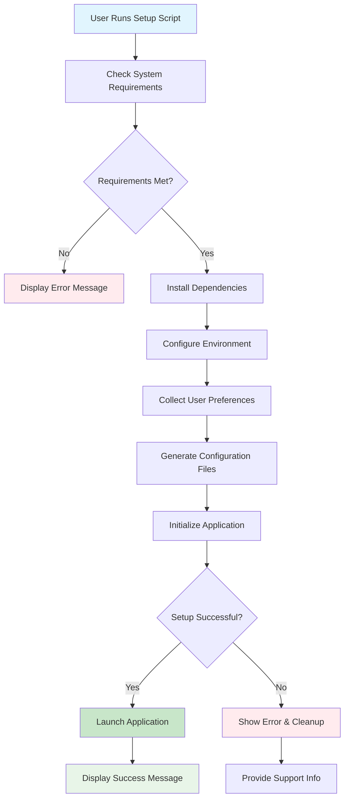

# enhance install script for taskhero ai #21

## Metadata
- **Task ID:** TASK-075
- **Created:** 2025-05-26
- **Due:** 2025-05-29
- **Priority:** Medium
- **Status:** Todo
- **Assigned to:** Developer
- **Task Type:** Development
- **Sequence:** 75
- **Estimated Effort:** Small
- **Related Epic/Feature:** TaskHero AI Project
- **Tags:** install script, initial setup, initial settings, development, coding, api, integration, ui

## 1. Overview
### 1.1. Brief Description
## Development Task: Enhance TaskHero AI Windows Installation Script (#21)
**Task Title:** Enhance Install Script for TaskHero AI (#21)
**Original Description:** *The existing `setup_windows.bat` fi...

### 1.2. Functional Requirements
['Here are 5-8 specific functional requirements for enhancing the `setup_windows.bat` script:', 'The script SHALL, upon initial execution, present a clear, step-by-step user interface for configuration, starting with package installation, followed by user input prompts, and concluding with application launch.', 'The script SHALL, after successful initial configuration, persist all user-provided settings (e.g., `STORAGE_CHOICE`, codebase paths, API details) into `app_settings.json` and relevant API keys into environment variables (e.g., `.env` file), ensuring these settings are loaded and used in subsequent runs.', 'The script SHALL detect the presence of a pre-existing `app_settings.json` file and, if found, skip all user input prompts and proceed directly to the virtual environment activation and `app.py` execution, unless a "force reconfigure" option is explicitly selected.', 'The script SHALL validate user input for all path-related questions (codebase path, task storage path) to ensure the provided paths are valid and accessible, prompting the user for re-entry or offering an exit option on invalid input.', 'The script SHALL provide informative on-screen messages at each stage (e.g., "Installing dependencies...", "Configuring TaskHero...", "Launching TaskHero AI...") and display success or failure messages for each major operation.', 'The script SHALL gracefully handle common installation failures (e.g., missing internet connection for package downloads, insufficient permissions for file creation) by displaying user-friendly error messages and suggesting corrective actions or offering to exit.', 'The script SHALL incorporate a clear prompt for the user to confirm continuation before proceeding with potentially time-consuming or system-modifying operations (e.g., "Do you want to continue with package installation? (Y/N)").']

### 1.3. Purpose & Benefits
This task enhances the TaskHero AI system by implementing enhance install script for taskhero ai #21.

### 1.4. Success Criteria
- [ ] Installation script runs successfully on target platforms
- [ ] User configuration is properly collected and validated
- [ ] Settings are correctly stored in configuration files
- [ ] Application starts successfully after setup

## 2. Flow Diagram
**Task flow diagram:**



Task Flow Diagram

## 3. Implementation Status

### 3.1. Implementation Steps
- [ ] **Step 1: Requirements Analysis** - Status: ⏳ Pending - Target: 2025-05-29
- [ ] Sub-step 1: Review requirements and specifications
- [ ] Sub-step 2: Identify key stakeholders and dependencies
- [ ] Sub-step 3: Define acceptance criteria
- [ ] **Step 2: Implementation** - Status: ⏳ Pending - Target: 2025-05-29
- [ ] Sub-step 1: Implement core functionality
- [ ] Sub-step 2: Add error handling and validation
- [ ] Sub-step 3: Write unit tests

## 4. Detailed Description
## Development Task: Enhance TaskHero AI Windows Installation Script (#21)
**Task Title:** Enhance Install Script for TaskHero AI (#21)
**Original Description:** *The existing `setup_windows.bat` file which installs TaskHero AI and helps run the virtual environment with running `app.py` in the end needs to go through an enhancement. I would like to make it more informative and elegant for the user when the script is run. The script needs to be divided into parts. The first part would be to install the packages to set up the app requirements. Then would come the part about asking the user to answer questions like: 1. Will this be a central repo for all the different code bases? or will be singular as in residing into the existing code base it is going to index. 2. The path of the code base which TaskHero is going to attempt to index. 3. Path of the project tasks files storage (a. default present folder or b. in the root folder `/taskherofiles`). 4. Will TaskHero API and MCP functions would be used? 5. API details for the models and functions required by TaskHero to function. All of these details can be then stored in the `app_settings.json` file which we have and API settings into the ENV file accordingly. Finally to then initiate the run of the `app.py` file to run TaskHero. All settings which are already completed from the initial run would then be skipped when the script is run the next time to go directly to the app run.*
### 1. Overview and Objectives
This task aims to significantly enhance the user experience and robustness of the TaskHero AI Windows installation process. The primary objective is to transform the existing `setup_windows.bat` script into a more interactive, informative, and intelligent installer. This involves structuring the installation into logical phases, gathering critical configuration details from the user in a guided manner, persisting these settings, and providing a seamless "run-once" experience where subsequent executions of the script skip configuration and directly launch the application.
**Key Objectives:**
*   **Improved User Experience:** Provide clear, concise instructions and prompts to the user throughout the installation process.
*   **Modular Installation:** Divide the script into distinct, logical phases (e.g., dependency installation, configuration, application launch).
*   **Intelligent Configuration:** Guide the user through essential TaskHero AI configuration questions, providing sensible defaults where applicable.
*   **Persistent Settings:** Store user-provided configuration details in `app_settings.json` and sensitive API details in the `.env` file.
*   **"Run-Once" Capability:** Detect previously completed installations and automatically skip configuration steps on subsequent runs, directly launching `app.py`.
*   **Error Handling & Feedback:** Provide informative messages for successful steps and clear, actionable feedback for any errors encountered.
### 2. Technical Context (Based on Codebase)
The current installation process relies on `setup_windows.bat`. Analysis of the provided snippets reveals:
*   **Batch Scripting (`.bat`):** The core logic is implemented using Windows Batch scripting. This implies limitations in terms of advanced UI, robust error handling, and complex logic compared to PowerShell.
*   **Conditional Logic for Storage:** The existing `setup_windows.bat` already includes conditional logic for setting `TASK_STORAGE` based on user input (`!STORAGE_CHOICE!`). This pattern will need to be extended for new configuration options.
*   **Dependency Checks:** There's an existing check for Python version (`!MAJOR! equ 3`, `!MINOR! lss 11`). This indicates a precedent for environment validation.
*   **User Input Mechanism:** The `set /p` command is currently used for user prompts (e.g., `set /p CONTINUE="Do you want to continue anyway? (Y/N): "`). This will be the primary mechanism for gathering user input within the batch script.
*   **PowerShell Alternative (`setup_windows.ps1`):** A `setup_windows.ps1` script exists, suggesting an alternative or future direction for Windows installations. While this task focuses on enhancing the `.bat` script, it's worth noting that PowerShell offers more robust capabilities for scripting and UI. *However, for this task, the primary focus is on enhancing the existing `.bat` script as per the original request.* If the `.ps1` script is the *intended* future, this task might need re-scoping. Assuming `setup_windows.bat` is the current target for enhancement.
*   **Configuration Files:** The task explicitly mentions `app_settings.json` for general settings and `.env` for API details. This implies the script will need to read, modify, or create these files programmatically.
### 3. Key Implementation Considerations
*   **Scripting Language Choice:** The task explicitly mentions enhancing `setup_windows.bat`. While PowerShell offers more advanced features, the solution **must primarily leverage Batch scripting** to enhance the existing `.bat` file. If PowerShell is deemed necessary for certain functionalities (e.g., advanced JSON parsing/writing), it should be invoked *from* the batch script and clearly justified.
*   **Phased Execution:**
    *   **Phase 1: Environment & Dependency Check:**
        *   Verify Python installation (existing logic).
        *   Check for required system tools (e.g., `pip`).
        *   Install Python packages (e.g., `pip install -r requirements.txt`). Provide clear progress indicators.
    *   **Phase 2: Configuration Wizard:**
        *   **Detect Existing Configuration:** Check for the presence and validity of `app_settings.json` and `.env` files. If valid and complete, skip to Phase 3.
        *   **Interactive Prompts:**
            *   **Codebase Type:** "Central repo for all codebases" vs. "Singular, residing in existing codebase". This choice will influence how TaskHero indexes.
            *   **Codebase Path:** Absolute path to the codebase TaskHero will index. Validate path existence.
            *   **Task Files Storage Path:**
                *   Option A: `%CD%` (current directory).
                *   Option B: `%CD%\taskherofiles`.
                *   Implement the existing `STORAGE_CHOICE` logic, potentially with a clearer prompt.
            *   **API/MCP Usage:** Boolean (Yes/No) if TaskHero API/MCP functions will be used.
            *   **API Details (Conditional):** If API/MCP usage is 'Yes', prompt for specific API keys/endpoints required by TaskHero.
        *   **Input Validation:** Implement basic validation for user inputs (e.g., path existence, Y/N prompts).
        *   **Persistence:**
            *   Write non-sensitive settings to `app_settings.json`. This may require a simple approach within batch (e.g., echoing JSON fragments to a file) or invoking a Python script to handle JSON if complexity demands.
            *   Write sensitive API details to `.env` file (e.g., `setx` or direct file manipulation).
    *   **Phase 3: Application Launch:**
        *   Activate the virtual environment.
        *   Launch `app.py`.
*   **Configuration Persistence Logic:**
    *   **`app_settings.json`:** The script needs to create or update this JSON file. Consider using `echo` commands to append/overwrite lines for simple JSON structures. For more complex JSON modifications, a small helper Python script invoked by the batch file might be necessary.
    *   **`.env` file:** Create or update environment variables for API details. Directly writing to `.env` file (e.g., `echo VARIABLE=VALUE >> .env`) is a common approach. Ensure sensitive data is handled securely (e.g., not echoed to console).
*   **Idempotency & "Run-Once" Feature:**
    *   The script should check for the existence and completeness of `app_settings.json` and `.env` files at the very beginning.
    *   A simple flag or a specific value within `app_settings.json` could indicate that the initial configuration has been completed.
    *   If detected, the script should bypass the configuration phase and proceed directly to activating the virtual environment and launching `app.py`.
*   **User Feedback:** Use `echo` commands extensively to inform the user about the current step, successful operations, and any failures.
*   **Error Handling:** Implement basic error checks (e.g., `if exist`, `if not exist`, `if errorlevel`). Provide clear messages and options to exit or continue.
*   **Virtual Environment Management:** Ensure the script correctly creates and activates the Python virtual environment before installing dependencies and running `app.py`.
### 4. Expected Deliverables
*   **Modified `setup_windows.bat`:** The enhanced batch script incorporating all the new features and logic.
*   **Updated `app_settings.json` schema (if changes are required):** Documentation or example of the expected structure of `app_settings.json` after the script runs.
*   **Example `.env` content:** Documentation or example of the expected content of the `.env` file for API configurations.
*   **Test Plan / Instructions:** Clear steps to test


## 5. UI Design & Specifications
### 5.1. Design Overview
[Brief description of the UI changes and design goals]

### 5.2. Wireframes & Layout
**Use ASCII art for layouts, wireframes, and component positioning:**

```
╔═══════════════════════════════════════════════════════════════╗
║                        Task Progress                          ║
╠═══════════════════════════════════════════════════════════════╣
║ Phase 1: Analysis     [████████░░] 80%       ║
║ Phase 2: Development  [██████░░░░] 60%       ║
║ Phase 3: Testing      [███░░░░░░░] 30%       ║
║ Phase 4: Deployment   [░░░░░░░░░░] 0%       ║
╚═══════════════════════════════════════════════════════════════╝
```

### 5.3. Design System References
- **Colors:** [Primary: #color, Secondary: #color, etc.]
- **Typography:** [Font family, sizes, weights]
- **Spacing:** [Padding/margin standards]
- **Components:** [shadcn/ui components used]
- **Icons:** [Icon library and specific icons]

### 5.4. Visual Design References
- [Link to Figma/Design file]
- [Link to existing similar components]
- [Screenshots or mockups if available]
## 6. Risk Assessment
### 6.1. Potential Risks
| Risk | Impact | Probability | Mitigation Strategy |
|------|--------|-------------|-------------------|
| Technical complexity higher than estimated | Medium | Low | Break down into smaller tasks, seek technical review |
| Dependencies not available on time | High | Medium | Identify alternative approaches, communicate early with dependencies |


## Dependencies
### Required By This Task
- Environment setup (Windows)
- Base implementation
- Implementation completion


## Testing
Testing will be handled in a separate task based on this task summary and requirements.


## Technical Considerations
- Cross-platform compatibility for installation scripts
- Error handling and recovery mechanisms
- User input validation and sanitization
- Configuration file management and validation


## Updates
- **2025-05-26** - Task created
---
*Generated by TaskHero AI Template Engine on 2025-05-26 07:45:14* 