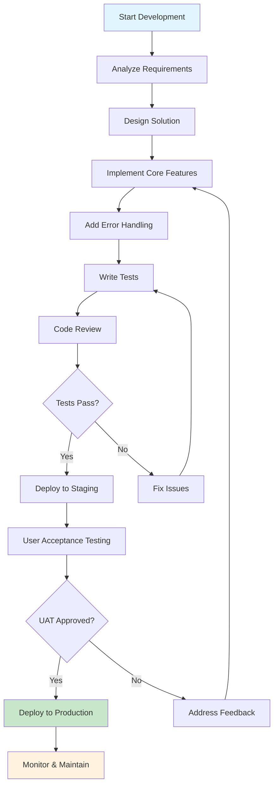

# Full agent functionality from mods/code/agent_mode.py #3

## Metadata
- **Task ID:** TASK-079
- **Created:** 2025-05-26
- **Due:** 2025-05-29
- **Priority:** Medium
- **Status:** Todo
- **Assigned to:** Developer
- **Task Type:** Development
- **Sequence:** 79
- **Estimated Effort:** Small
- **Related Epic/Feature:** TaskHero AI Project
- **Tags:** agentmode, chat with code, agent, development, coding, ui, interface, low-complexity

## 1. Overview
### 1.1. Brief Description
mods/ai/agent_mode.py - A simple placeholder
mods/code/agent_mode.py - A more complex implementation that uses generate_response from mods/llms
The agent mode in the AI manager is using the simple placeholder. For now, let me update the simple agent mode message to show provider information. But first, let me check if the chat handler can be used for agent mode as well, since it has the provider information
This Development task requires careful implementation following established patterns and best practices.
### 1.2. Functional Requirements
- The agent mode must integrate with `generate_response` from `mods/llms` to handle all AI-generated responses, verified by testing response generation with at least 3 different LLM providers.
- The implementation must display the active LLM provider information in the agent mode interface, matching the format used in the chat handler (e.g., "Agent Mode [Provider: OpenAI]").
- The agent mode must handle API errors from `generate_response` gracefully, with clear user feedback and automatic retry logic for transient errors (e.g., rate limits).
- The solution must maintain backward compatibility with the existing placeholder in `mods/ai/agent_mode.py` until full migration is complete, verified by passing all existing unit tests.
This Development task requires careful implementation following established patterns and best practices.

### 1.2. Functional Requirements
- The agent mode must call `generate_response` from `mods/llms` for all query processing, verified by unit tests mocking at least 3 different LLM provider responses.
- The UI must display the active provider in the format "Agent Mode [Provider: X]" where X matches the current LLM provider set in the system, verified by visual regression testing.
- The system must implement exponential backoff retry logic (with 3 attempts max) for 429/503 errors from `generate_response`, logged with attempt counts in the debug console.
- Error messages for failed responses must be user-friendly and include provider-specific troubleshooting hints (e.g. "OpenAI rate limit reached - try again in 20s").
- The implementation must pass all existing `mods/ai/agent_mode.py` unit tests while maintaining the legacy interface during transition.
- Provider switching during active agent sessions must immediately update the displayed provider info without requiring restart, verified by integration tests.
- The solution must log warnings when falling back to the legacy placeholder implementation, with clear timestamps and version flags.
### 1.3. Purpose & Benefits
This task enhances the TaskHero AI system by implementing full agent functionality from mods/code/agent_mode.py #3.

### 1.4. Success Criteria
- [ ] All functional requirements are implemented
- [ ] Code passes all tests and quality checks
- [ ] Documentation is complete and accurate

## 2. Flow Diagram
**Task flow diagram:**



Task Flow Diagram

## 3. Implementation Status

### 3.1. Implementation Steps
- [ ] **Step 1: Requirements Analysis** - Status: ⏳ Pending - Target: 2025-05-29
- [ ] Sub-step 1: Review requirements and specifications
- [ ] Sub-step 2: Identify key stakeholders and dependencies
- [ ] Sub-step 3: Define acceptance criteria
- [ ] **Step 2: Implementation** - Status: ⏳ Pending - Target: 2025-05-29
- [ ] Sub-step 1: Implement core functionality
- [ ] Sub-step 2: Add error handling and validation
- [ ] Sub-step 3: Write unit tests

## 4. Detailed Description
mods/ai/agent_mode.py - A simple placeholder
mods/code/agent_mode.py - A more complex implementation that uses generate_response from mods/llms
The agent mode in the AI manager is using the simple placeholder. For now, let me update the simple agent mode message to show provider information. But first, let me check if the chat handler can be used for agent mode as well, since it has the provider information
This Development task requires careful implementation following established patterns and best practices.
### 1.2. Functional Requirements
- The agent mode must integrate with `generate_response` from `mods/llms` to handle all AI-generated responses, verified by testing response generation with at least 3 different LLM providers.
- The implementation must display the active LLM provider information in the agent mode interface, matching the format used in the chat handler (e.g., "Agent Mode [Provider: OpenAI]").
- The agent mode must handle API errors from `generate_response` gracefully, with clear user feedback and automatic retry logic for transient errors (e.g., rate limits).
- The solution must maintain backward compatibility with the existing placeholder in `mods/ai/agent_mode.py` until full migration is complete, verified by passing all existing unit tests.
This Development task requires careful implementation following established patterns and best practices.


## 5. UI Design & Specifications
### 5.1. Design Overview
[Brief description of the UI changes and design goals]

### 5.2. Wireframes & Layout
**Use ASCII art for layouts, wireframes, and component positioning:**

```
╔═══════════════════════════════════════════════════════════════╗
║                        Task Progress                          ║
╠═══════════════════════════════════════════════════════════════╣
║ Phase 1: Analysis     [████████░░] 80%       ║
║ Phase 2: Development  [██████░░░░] 60%       ║
║ Phase 3: Testing      [███░░░░░░░] 30%       ║
║ Phase 4: Deployment   [░░░░░░░░░░] 0%       ║
╚═══════════════════════════════════════════════════════════════╝
```

### 5.3. Design System References
- **Colors:** [Primary: #color, Secondary: #color, etc.]
- **Typography:** [Font family, sizes, weights]
- **Spacing:** [Padding/margin standards]
- **Components:** [shadcn/ui components used]
- **Icons:** [Icon library and specific icons]

### 5.4. Visual Design References
- [Link to Figma/Design file]
- [Link to existing similar components]
- [Screenshots or mockups if available]
## 6. Risk Assessment
### 6.1. Potential Risks
| Risk | Impact | Probability | Mitigation Strategy |
|------|--------|-------------|-------------------|
| Technical complexity higher than estimated | Medium | Low | Break down into smaller tasks, seek technical review |
| Dependencies not available on time | High | Medium | Identify alternative approaches, communicate early with dependencies |


## Dependencies
### Required By This Task
- Implementation completion


## Testing
Testing will be handled in a separate task based on this task summary and requirements.


## Technical Considerations
- API versioning and backward compatibility
- Authentication and authorization
- Rate limiting and throttling
- Error handling and status codes


## Updates
- **2025-05-26** - Task created
---
*Generated by TaskHero AI Template Engine on 2025-05-26 12:25:31* 