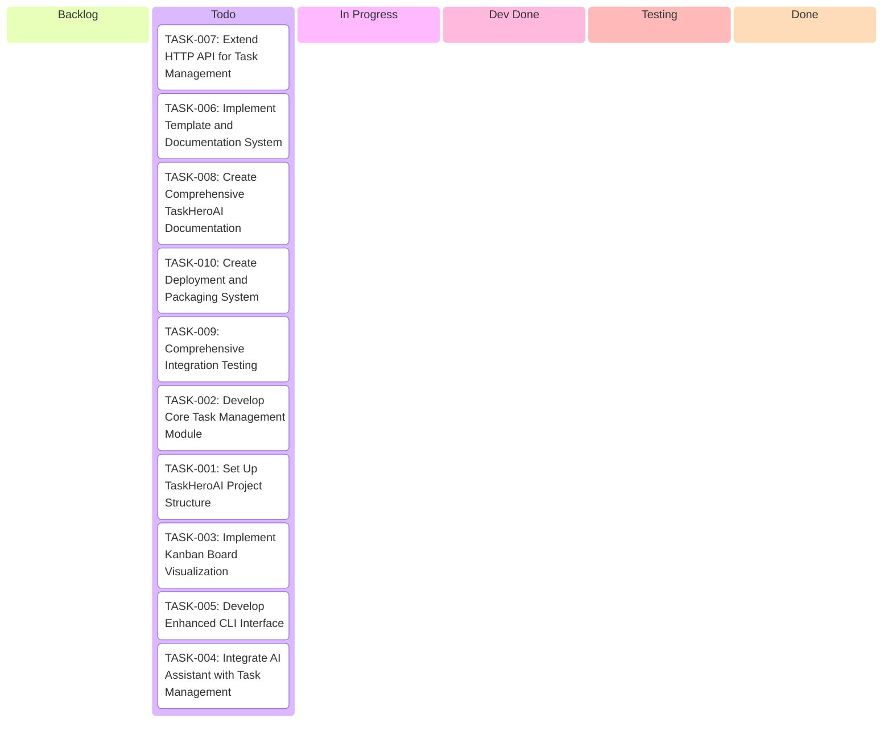
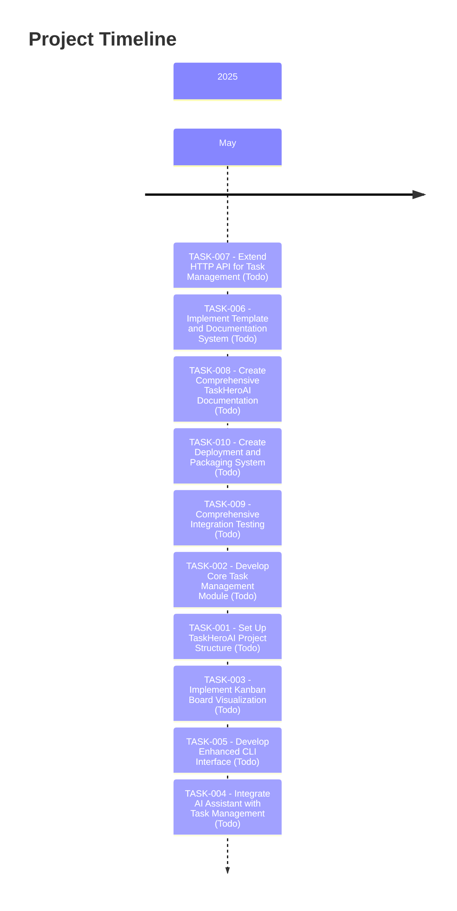

# Project Plan

## 📊 Project Stats
- **Total Tasks:** 10
- **✅ Done:** 0
- **🧪 Testing:** 0
- **🔄 Dev Done:** 0
- **⏳ In Progress:** 0
- **📋 Todo:** 10
- **📊 Backlog:** 0
- **🎯 Completion Rate:** 0%
- **⏱️ Estimated Total Hours:** 140
- **⏱️ Hours Logged:** 0

## 📋 Kanban Board

## 📝 Task Summary
| ID | Status | Title | Type | Priority | Due Date | Assigned To | Progress |
|----|--------|-------|------|----------|----------|-------------|----------|
| TASK-007 | Todo | Extend HTTP API for Task Management | Development | Medium | 2025-02-12 | Developer | 0% |
| TASK-006 | Todo | Implement Template and Documentation System | Development | Medium | 2025-02-10 | Developer | 0% |
| TASK-008 | Todo | Create Comprehensive TaskHeroAI Documentation | Documentation | Medium | 2025-02-15 | Developer | 0% |
| TASK-010 | Todo | Create Deployment and Packaging System | Development | Medium | 2025-02-20 | Developer | 0% |
| TASK-009 | Todo | Comprehensive Integration Testing | Test Case | High | 2025-02-17 | Developer | 0% |
| TASK-002 | Todo | Develop Core Task Management Module | Development | High | 2025-01-31 | Developer | 0% |
| TASK-001 | Todo | Set Up TaskHeroAI Project Structure | Development | High | 2025-01-29 | Developer | 0% |
| TASK-003 | Todo | Implement Kanban Board Visualization | Development | Medium | 2025-02-02 | Developer | 0% |
| TASK-005 | Todo | Develop Enhanced CLI Interface | Development | Medium | 2025-02-07 | Developer | 0% |
| TASK-004 | Todo | Integrate AI Assistant with Task Management | Development | High | 2025-02-05 | Developer | 0% |

## 🔗 Task Dependencies
| Task ID | Task Name | Depends On | Required By |
|---------|-----------|------------|-------------|
| TASK-007 | Extend HTTP API for Task Management |  | TASK-002, TASK-003 |
| TASK-006 | Implement Template and Documentation System |  | TASK-001, TASK-002 |
| TASK-008 | Create Comprehensive TaskHeroAI Documentation |  |  |
| TASK-010 | Create Deployment and Packaging System |  | TASK-009 |
| TASK-009 | Comprehensive Integration Testing |  |  |
| TASK-002 | Develop Core Task Management Module |  | TASK-001 |
| TASK-001 | Set Up TaskHeroAI Project Structure |  |  |
| TASK-003 | Implement Kanban Board Visualization |  | TASK-002 |
| TASK-005 | Develop Enhanced CLI Interface |  | TASK-002, TASK-003 |
| TASK-004 | Integrate AI Assistant with Task Management |  | TASK-002, TASK-003 |

## ⏳ Timeline

## 🔄 Recent Updates

- 2025-05-23 - Plan updated.
