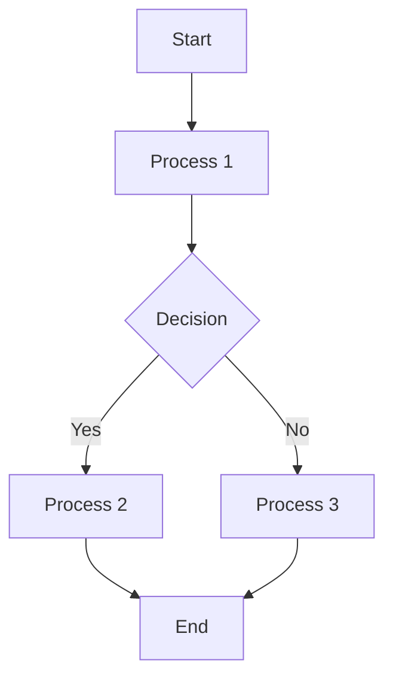
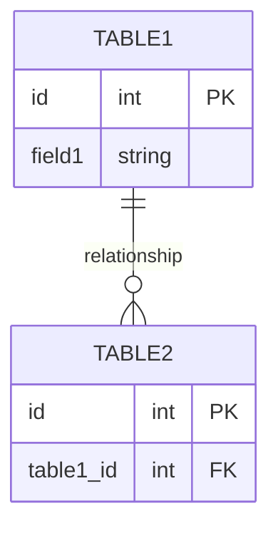

# Task: TASK-ID - TASK-TITLE

## Metadata
- **Priority:** PRIORITY
- **Due:** DUE-DATE
- **Status:** STATUS
- **Assigned to:** ASSIGNEE
- **Task Type:** TASK-TYPE
- **Sequence:** SEQUENCE
- **Tags:** TAGS

## 1. Overview
[Brief description of the task and its purpose]

## 2. Flow Diagram

[Add description of the flow if needed]

## 3. Implementation Status

### 3.1. Main Implementation Steps
- [ ] **Step 1: [Main Step Title]**
  - [ ] Sub-step 1.1: [Detailed sub-step description]
  - [ ] Sub-step 1.2: [Detailed sub-step description]
  - [ ] Sub-step 1.3: [Detailed sub-step description]
- [ ] **Step 2: [Main Step Title]**
  - [ ] Sub-step 2.1: [Detailed sub-step description]
  - [ ] Sub-step 2.2: [Detailed sub-step description]
  - [ ] Sub-step 2.3: [Detailed sub-step description]
- [ ] **Step 3: [Main Step Title]**
  - [ ] Sub-step 3.1: [Detailed sub-step description]
  - [ ] Sub-step 3.2: [Detailed sub-step description]
  - [ ] Sub-step 3.3: [Detailed sub-step description]

### 3.2. Status Overview Table

| Step | Description | Status | Target Date |
|------|-------------|--------|-------------|
| 1 | [Step description] | ⏳ Pending | YYYY-MM-DD |
| 2 | [Step description] | ⏳ Pending | YYYY-MM-DD |
| 3 | [Step description] | ⏳ Pending | YYYY-MM-DD |

## 4. Detailed Description
[Detailed description of the task, including its purpose, benefits, and any relevant background information]

## 5. Testing
[Describe the testing approach for this task]
- [ ] **5.4.1. Create Test Plan**: Create test plan for task
- [ ] **5.4.2. Implement Tests**: Develop tests

## 6. Dependencies
### 6.1. Required By This Task
- [Task ID] - [Task Title] - [Status]

### 6.2. Dependent On This Task
- [Task ID] - [Task Title] - [Status]

### 6.3. Dependency Type
- **Blocking**: This task cannot start until the dependency is completed
- **Informational**: This task can start but may need information from the dependency
- **Related**: Tasks are related but not directly dependent

## 7. Testing Strategy
Create testing script based on task during testing phase.

## 8. Technical Considerations
[Any technical considerations, potential challenges, or architectural decisions]

### 8.1. Database Changes
[If applicable, describe any database schema changes required]

## 9. Time Tracking
- **Estimated hours:** [X]
- **Actual hours:** [X]

## 10. References
- [Reference 1]
- [Reference 2]

## 11. Updates
- [YYYY-MM-DD] - [Update description]
