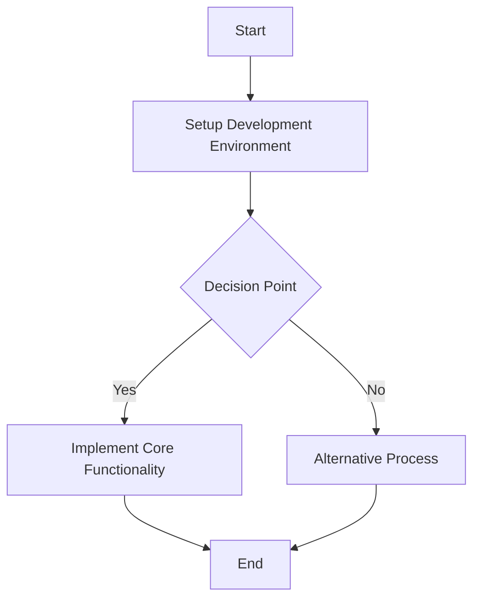

# Test Development Task

## Metadata
- **Task ID:** TASK-001
- **Created:** 2025-01-27
- **Due:** 2025-02-10
- **Priority:** High
- **Status:** In Progress
- **Assigned to:** Test Developer
- **Task Type:** Development
- **Sequence:** 1
- **Tags:** development, test, template
## Overview
This is a test development task to verify template rendering functionality.
## Flow Diagram
This flow diagram shows the development process steps

Additional notes about the flow diagram and process
## Implementation Status

### Main Implementation Steps
- [x] **Step 1: Setup Development Environment**
- [x] Install dependencies
- [x] Configure environment
- [ ] **Step 2: Implement Core Functionality**
- [x] Create base classes
- [ ] Implement business logic

### Status Overview Table
| Step | Description | Status | Target Date |
|------|-------------|--------|-------------|
| 1 | Setup Development Environment | ✅ Complete | 2025-01-28 |
| 2 | Implement Core Functionality | 🔄 In Progress | 2025-01-30 |

## Detailed Description
This is a detailed description of the development task with comprehensive information about implementation approach and expected outcomes.

## Acceptance Criteria
- [x] Template engine can load Jinja2 templates
- [ ] Template validation works correctly
- [ ] Templates render with proper context

## Dependencies
### Required By This Task
- TASK-000 - Setup Project Structure

### Dependent On This Task
- TASK-002 - Integration Testing

## Testing Strategy
Comprehensive unit and integration testing approach

### Test Cases
- **Template Engine Test**: Test template rendering
  - Expected: Template renders successfully
  - Status: Passed
- **Validation Test**: Test template validation
  - Expected: Validation passes
  - Status: In Progress

## Technical Considerations
Use Jinja2 for template processing with proper error handling

### Architecture Notes
Modular architecture with clear separation of concerns
### Performance Considerations
Template caching and optimized rendering
### Security Considerations
Sandboxed template execution and input validation
### Database Changes
No database changes required for this implementation

## Time Tracking
- **Estimated hours:** 8
- **Actual hours:** 4
## References
- Jinja2 Documentation
- Template Design Patterns

## Updates
- **2025-01-27:** Test task created for template validation
- **2025-01-28:** Added implementation steps and context

---
*Generated by TaskHero AI Template Engine on 2025-05-24 23:24:29* 