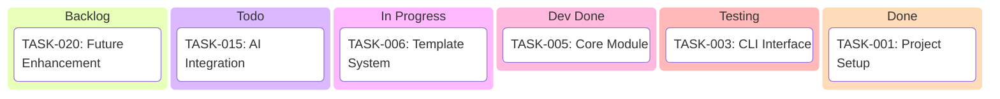
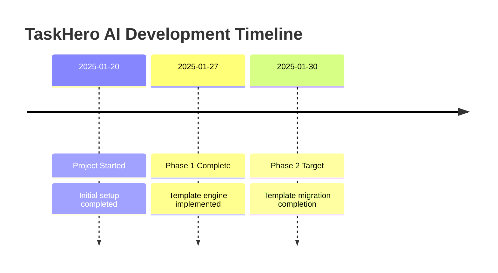

# TaskHero AI Development

## 📊 Project Statistics
- **Total Tasks:** 25
- **✅ Done:** 8
- **🧪 Testing:** 3
- **🔄 Dev Done:** 4
- **⏳ In Progress:** 5
- **📋 Todo:** 3
- **📊 Backlog:** 2
- **🎯 Completion Rate:** 60%
- **⏱️ Estimated Total Hours:** 120
- **⏱️ Hours Logged:** 75
- **🎯 Progress:** 65%

## 📋 Kanban Board

## 📝 Task Summary
| ID | Status | Title | Type | Priority | Due Date | Assigned To | Progress |
|----|--------|-------|------|----------|----------|-------------|----------|
| TASK-001 | Done | Setup Project Structure | Setup | High | 2025-01-20 | Dev Team | 100% |
| TASK-006 | In Progress | Template System | Development | Medium | 2025-02-10 | Dev Team | 75% |

## 🔗 Task Dependencies
| Task ID | Task Name | Depends On | Required By |
|---------|-----------|------------|-------------|
| TASK-006 | Template System | TASK-001 | TASK-015 |

## ⏳ Project Timeline

## 📈 Progress Analytics
### Completion by Category
- **Development**: 5/8 (63%)
- **Testing**: 2/4 (50%)
- **Documentation**: 1/2 (50%)

### Team Performance
- **Dev Team**: 8 completed, 75 hours logged

## 🎯 Current Sprint/Phase
- **Sprint:** Sprint 2
- **Duration:** 2025-01-20 to 2025-02-03
- **Goal:** Complete template system implementation
- **Tasks:** 2 tasks
- **Progress:** 65%
## 🚧 Blockers & Risks
- **Low**: Minor dependency on external library
  - Impact: Minimal delay possible
  - Mitigation: Alternative approach identified

## 📅 Upcoming Milestones
| Milestone | Target Date | Status | Dependencies |
|-----------|-------------|--------|--------------|
| Phase 1 Complete | 2025-01-27 | Complete | TASK-001 |
| Phase 2 Complete | 2025-01-30 | In Progress | TASK-006 |

## 🔄 Recent Updates
- **2025-01-27**: Phase 1 template engine completed
- **2025-01-28**: Phase 2 template migration started
- **2025-05-24**: Project plan updated

## 📊 Metrics Dashboard
- **Velocity**: 5 tasks/week
- **Burndown Rate**: 2 hours/day
- **Quality Score**: 85%
- **Risk Level**: Low

---
*Generated by TaskHero AI Template Engine on 2025-05-24 23:38:28* 