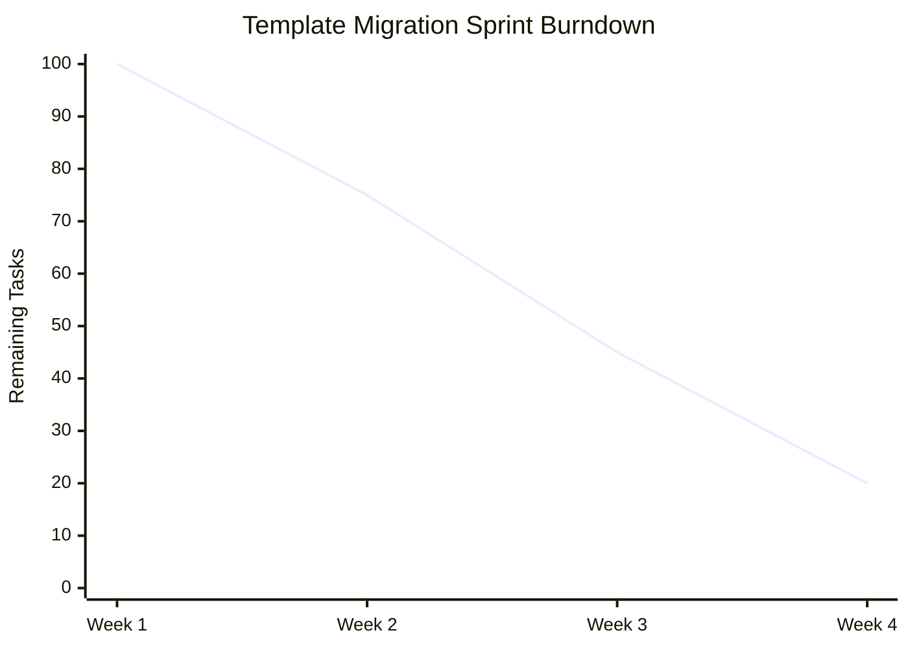
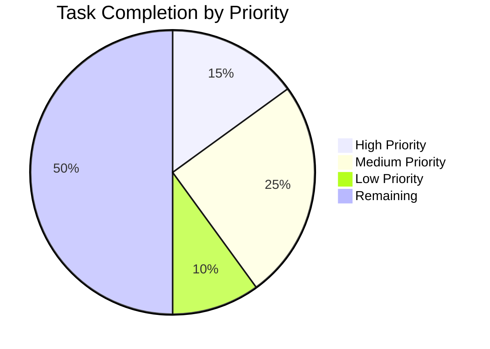

# TaskHero AI Status Report - 2025-01-28

## 📊 Executive Summary
Project is progressing well with Phase 1 template engine completed and Phase 2 migration underway.

## 📈 Project Overview
- **Total Tasks:** 25
- **Completed Tasks:** 8 (32%)
- **In Progress Tasks:** 5 (20%)
- **Todo Tasks:** 12 (48%)
- **Overdue Tasks:** 0
- **Overall Health:** 85%
## 🏆 Recent Accomplishments
- **Template Engine Implementation** (2025-01-27)  - Completed Jinja2-based template engine with validation
- Impact: Foundation for all future template work- **Base Template Creation** (2025-01-28)  - Created comprehensive base template with inheritance
- Impact: Standardized document structure
## 🚧 Current Work
- **Template Migration** (Dev Team)  - Status: In Progress
  - Progress: 60%
- Due: 2025-01-30- Blockers: None- **Enhanced Templates** (Dev Team)  - Status: In Progress
  - Progress: 40%
- Due: 2025-02-01- Blockers: None
## 🚩 Blockers & Risks
- **Low Risk**: Minor Integration Issue
  - Description: Small compatibility issue with legacy templates
  - Impact: Minimal delay
  - Mitigation: Workaround implemented
  - Owner: Dev Team
  - Target Resolution: 2025-01-30

## 📅 Upcoming Deadlines
| Task ID | Title | Due Date | Assigned To | Status | Risk Level |
|---------|-------|----------|-------------|--------|------------|
| TASK-006 | Template System Completion | 2025-02-10 | Dev Team | In Progress | Low |

## 📈 Progress Visualization
### Burndown Chart

### Completion by Priority

## 🎯 Key Metrics
- **Sprint Velocity**: 5 tasks/sprint
- **Cycle Time**: 3 days average
- **Defect Rate**: 2%
- **Team Utilization**: 85%
- **Customer Satisfaction**: 8/10

## 👥 Team Updates
### Development Team
- **Focus Areas**: Template System, Migration
- **Completed**: Phase 1 template engine
- **Current Work**: Phase 2 template migration
- **Blockers**: None
- **Availability**: 100%
- **Notable Achievements**: ['Completed template engine', 'Enhanced validation system']
## 💡 Recommendations & Next Steps
- **Medium Priority**: Sample Recommendation
  - Description: Sample recommendation description
  - Expected Impact: Sample impact
  - Timeline: Sample timeline

## 📋 Action Items
| Item | Owner | Due Date | Priority | Status |
|------|-------|----------|----------|--------|
| Sample Action Item | Sample Owner | 2025-05-24 | Medium | Pending |

## 📊 Appendix: Detailed Metrics
### Task Distribution
- **Development**: 5 tasks (50%)

### Quality Metrics
- **Code Coverage**: 85%
- **Test Pass Rate**: 95%
- **Bug Density**: 1 bugs/KLOC
- **Technical Debt**: 10 hours

---
**Report Period**: 2025-05-24 to 2025-05-24  
**Next Report**: 2025-05-24  
*Generated by TaskHero AI Template Engine on 2025-05-24 23:38:28* 