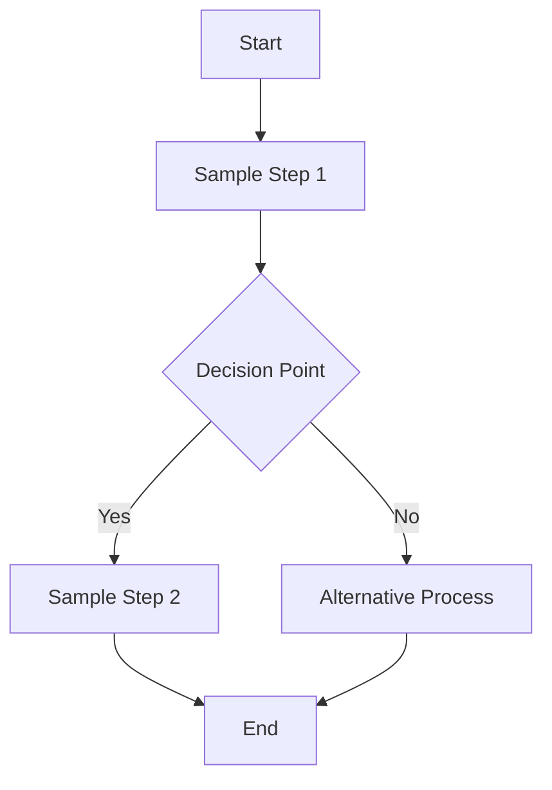
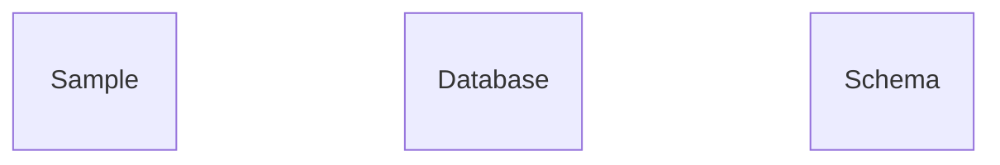

# Sample Title

## Metadata
- **Task ID:** SAMPLE-001
- **Created:** 2025-05-24
- **Due:** 2025-05-24
- **Priority:** Medium
- **Status:** Draft
- **Assigned to:** Sample Assignee
- **Task Type:** Sample Task
- **Sequence:** 1
- **Tags:** sample, preview
## Overview
Sample description for preview purposes.
## Flow Diagram
Sample flow description for the development process

Sample notes about the flow diagram and process
## Implementation Status

### Main Implementation Steps
- [x] **Step 1: Sample Step 1**
- [x] Sample substep 1
- [ ] Sample substep 2
- [ ] **Step 2: Sample Step 2**
- [ ] Sample substep 3
- [ ] Sample substep 4

### Status Overview Table
| Step | Description | Status | Target Date |
|------|-------------|--------|-------------|
| 1 | Sample Step 1 | ✅ Complete | 2025-01-28 |
| 2 | Sample Step 2 | 🔄 In Progress | 2025-01-30 |

## Detailed Description
Sample detailed description with comprehensive information about the task implementation approach and expected outcomes.

## Acceptance Criteria
- [x] Sample acceptance criterion 1
- [ ] Sample acceptance criterion 2

## Dependencies
### Required By This Task
- SAMPLE-000 - Sample Dependency

### Dependent On This Task
- SAMPLE-002 - Sample Dependent Task

## Testing Strategy
Sample testing strategy for preview

### Test Cases
- **Sample Test Case 1**: Test basic functionality
  - Expected: Success
  - Status: Passed
- **Sample Test Case 2**: Test error handling
  - Expected: Error handled
  - Status: Pending

## Technical Considerations
Sample technical notes for preview

### Architecture Notes
['sample1', 'sample2']
### Performance Considerations
SAMPLE-001
### Security Considerations
SAMPLE-001
### Database Changes
['sample1', 'sample2']

## Time Tracking
- **Estimated hours:** 4
- **Actual hours:** 2
## References
- Sample Reference 1
- Sample Reference 2

## Updates
- **2025-01-27:** Template created
- **2025-01-28:** Added sample content

---
*Generated by TaskHero AI Template Engine on 2025-05-24 23:24:30* 