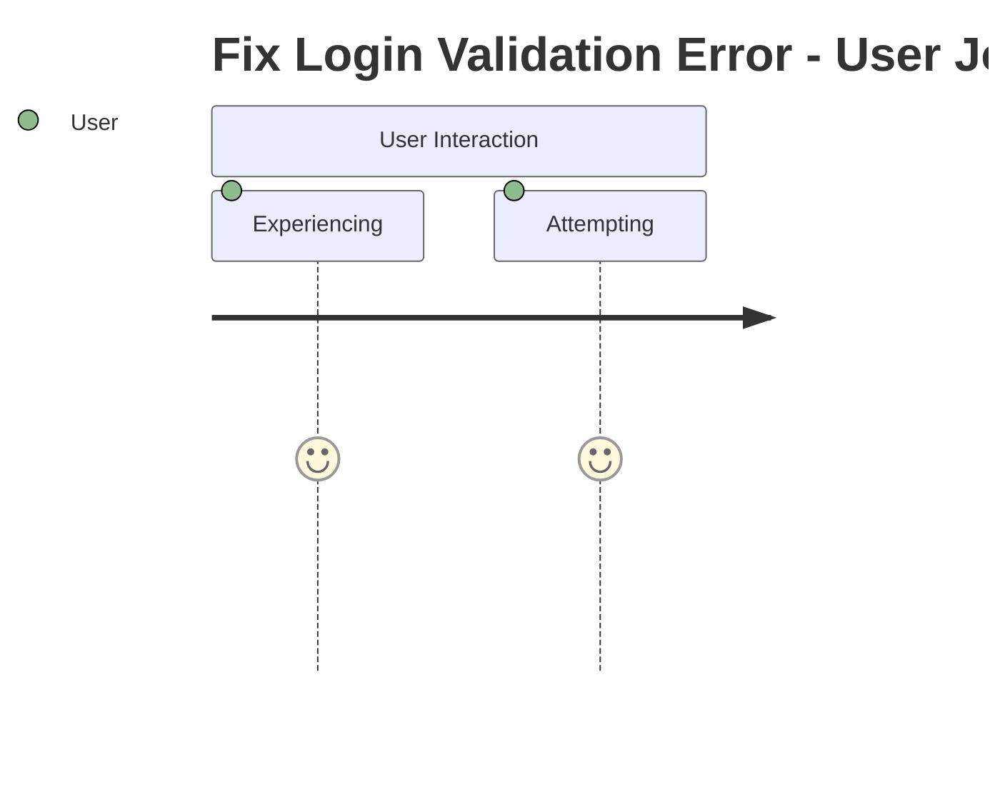

# TASK-060 - Fix Login Validation Error

## Task Naming Convention
**Follow the TaskHero naming convention when creating tasks:**

**Format:** `TASK-XXX-[TYPE]-descriptive-name.md`

**Where:**
- **XXX** = Sequential number (001, 002, 003, etc.)
- **[TYPE]** = Task type abbreviation (must match metadata Task Type field)
- **descriptive-name** = Brief but clear description (use hyphens, no spaces)

**Task Type Abbreviations:**
- **DEV** = Development
- **BUG** = Bug Fix
- **TEST** = Test Case
- **DOC** = Documentation
- **DES** = Design

## Metadata
- **Task Id:** TASK-060
- **Created:** 2025-05-25
- **Due:** 2025-05-30
- **Priority:** Critical
- **Status:** Todo
- **Assigned To:** Bug Fix Team
- **Task Type:** BUG
- **Sequence:** XXX
- **Estimated Effort:** Medium
- **Tags:** bug-fix, login, validation
- **Bug Severity:** High

## 1. Overview
### 1.1. Brief Description
Users are experiencing validation errors when attempting to log in with valid credentials.

### 1.2. Functional Requirements
The enhanced system must:
- The system must process 10,000 records per minute with 99.9% accuracy (verifiable through automated testing)
- The system must validate input data against JSON Schema v7 before processing
- The system must handle invalid input, network failures, and timeout conditions gracefully with appropriate error messages (verifiable through automated testing)

### 1.3. Purpose & Benefits
This task will provide significant value by:
- Improving system functionality and user experience
- Enhancing maintainability and code quality
- Reducing technical debt and future maintenance costs
- Providing a foundation for future enhancements
- Ensuring system reliability and performance

### 1.4. Success Criteria
- [ ] All functional requirements are implemented and tested
- [ ] Code passes all quality checks and reviews
- [ ] Documentation is complete and up-to-date
- [ ] Performance meets or exceeds established benchmarks
- [ ] User acceptance testing is completed successfully

## 2. Bug Fix Flow

## 3. Bug Reproduction
**Steps to Reproduce:**
1. [Detailed step-by-step reproduction instructions]
2. [Include specific data, inputs, and conditions]
3. [Note any environmental requirements]

**Expected Behavior:**
[Description of what should happen]

**Actual Behavior:**
[Description of what actually happens]

**Environment Details:**
- Operating System: [OS version]
- Browser/Application Version: [Version]
- Additional Dependencies: [List relevant dependencies]

## 4. Root Cause Analysis
**Initial Investigation:**
[Summary of initial findings and hypothesis]

**Technical Analysis:**
[Detailed technical investigation results]

**Root Cause Identification:**
[Specific root cause with supporting evidence]

**Impact Assessment:**
[Analysis of bug impact on system and users]

## 5. Solution Implementation
[Solution Implementation content to be populated based on specific requirements]

## 6. Testing Strategy
[Testing Strategy content to be populated based on specific requirements]

---
*Generated by Enhanced TaskHero AI Template Engine on 2025-05-25 19:07:43*