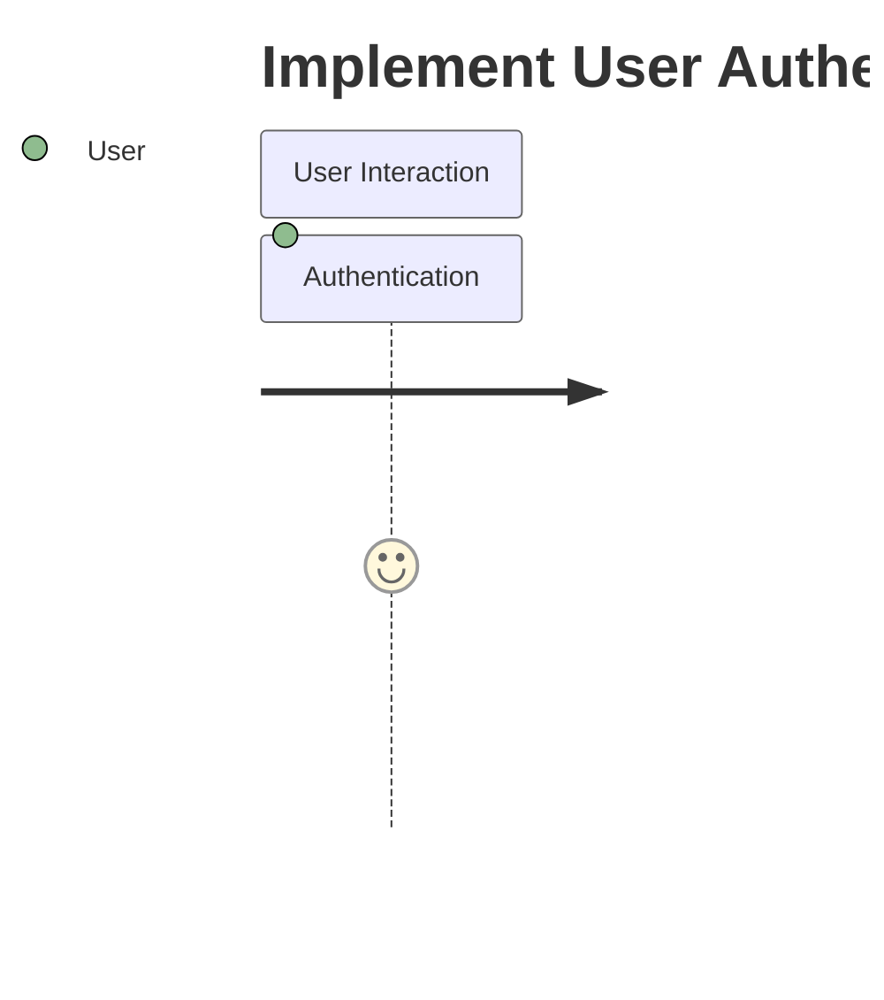

# TASK-059 - Implement User Authentication System

## Task Naming Convention
**Follow the TaskHero naming convention when creating tasks:**

**Format:** `TASK-XXX-[TYPE]-descriptive-name.md`

**Where:**
- **XXX** = Sequential number (001, 002, 003, etc.)
- **[TYPE]** = Task type abbreviation (must match metadata Task Type field)
- **descriptive-name** = Brief but clear description (use hyphens, no spaces)

**Task Type Abbreviations:**
- **DEV** = Development
- **BUG** = Bug Fix
- **TEST** = Test Case
- **DOC** = Documentation
- **DES** = Design

## Metadata
- **Task Id:** TASK-059
- **Created:** 2025-05-25
- **Due:** 2025-06-15
- **Priority:** High
- **Status:** Todo
- **Assigned To:** Development Team
- **Task Type:** DEV
- **Sequence:** XXX
- **Estimated Effort:** Medium
- **Tags:** authentication, security, user-management

## 1. Overview
### 1.1. Brief Description
Create a comprehensive user authentication system with login, registration, and password reset functionality.

### 1.2. Functional Requirements
The enhanced system must:
- The system must process 10,000 records per minute with 99.9% accuracy (verifiable through automated testing)
- The system must validate input data against JSON Schema v7 before processing
- The system must handle invalid input, network failures, and timeout conditions gracefully with appropriate error messages (verifiable through automated testing)

### 1.3. Purpose & Benefits
This task will provide significant value by:
- Improving system functionality and user experience
- Enhancing maintainability and code quality
- Reducing technical debt and future maintenance costs
- Providing a foundation for future enhancements
- Ensuring system reliability and performance

### 1.4. Success Criteria
- [ ] All functional requirements are implemented and tested
- [ ] Code passes all quality checks and reviews
- [ ] Documentation is complete and up-to-date
- [ ] Performance meets or exceeds established benchmarks
- [ ] User acceptance testing is completed successfully

## 2. Flow Diagram

## 3. Implementation Status
- [ ] **Step 1: Analysis and Planning** - Status: ⏳ Pending - Target: TBD
  - [ ] Sub-step 1.1: Analyze current system and requirements
  - [ ] Sub-step 1.2: Design solution architecture and approach
  - [ ] Sub-step 1.3: Create detailed implementation plan
  - [ ] Sub-step 1.4: Set up development environment and tools

- [ ] **Step 2: Core Implementation** - Status: ⏳ Pending - Target: TBD
  - [ ] Sub-step 2.1: Implement core functionality and features
  - [ ] Sub-step 2.2: Add comprehensive error handling
  - [ ] Sub-step 2.3: Implement logging and monitoring
  - [ ] Sub-step 2.4: Add configuration and customization options

- [ ] **Step 3: Testing and Validation** - Status: ⏳ Pending - Target: TBD
  - [ ] Sub-step 3.1: Write comprehensive unit tests
  - [ ] Sub-step 3.2: Perform integration testing
  - [ ] Sub-step 3.3: Conduct performance testing
  - [ ] Sub-step 3.4: Execute user acceptance testing

- [ ] **Step 4: Documentation and Deployment** - Status: ⏳ Pending - Target: TBD
  - [ ] Sub-step 4.1: Create comprehensive documentation
  - [ ] Sub-step 4.2: Prepare deployment procedures
  - [ ] Sub-step 4.3: Deploy to staging environment
  - [ ] Sub-step 4.4: Deploy to production environment

## 4. Detailed Description
[Detailed Description content to be populated based on specific requirements]

## 5. Risk Assessment
| Risk | Impact | Probability | Mitigation Strategy |
|------|--------|-------------|-------------------|
| Implementation complexity exceeding estimates | High | Medium | Break down into smaller, manageable tasks with regular progress reviews |
| Integration challenges with existing systems | Medium | Medium | Conduct thorough analysis and create comprehensive integration plan |
| Performance degradation in production | Medium | Low | Implement comprehensive testing and monitoring before deployment |
| User resistance to changes | Low | Medium | Provide training materials and gradual rollout with feedback collection |
| Technical dependencies causing delays | Medium | Low | Identify dependencies early and create contingency plans |

## 6. Technical Considerations
**Architecture Considerations:**
- Component design and interaction patterns
- State management strategies and data flow
- Performance optimization approaches
- Scalability and maintainability factors

**Implementation Strategy:**
- Technology stack selection and justification
- Code organization and structure patterns
- Testing strategies and validation approaches
- Deployment and monitoring considerations

**Performance Requirements:**
- Response time and throughput expectations
- Resource utilization constraints
- Scalability requirements and load handling
- Monitoring and alerting strategies

---
*Generated by Enhanced TaskHero AI Template Engine on 2025-05-25 19:07:43*