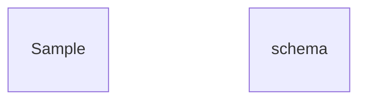

# Enhanced User Authentication System

## Metadata
- **Task ID:** TASK-001-DEV
- **Created:** 2025-05-25
- **Due:** 2025-02-15
- **Priority:** High
- **Status:** In Progress
- **Assigned to:** Development Team
- **Task Type:** DEV
- **Sequence:** 1
- **Estimated Effort:** Large
- **Related Epic/Feature:** User Management Epic
- **Tags:** authentication, security, oauth2, mfa
## Task Naming Convention
**Follow the TaskHero naming convention when creating tasks:**

**Format:** `TASK-XXX-[TYPE]-descriptive-name.md`

**Where:**
- **XXX** = Sequential number (001, 002, 003, etc.)
- **[TYPE]** = Task type abbreviation (must match metadata Task Type field)
- **descriptive-name** = Brief but clear description (use hyphens, no spaces)

**Task Type Abbreviations:**
- **DEV** = Development
- **BUG** = Bug Fix
- **TEST** = Test Case
- **DOC** = Documentation
- **DES** = Design

**Examples:**
- `TASK-001-DEV-user-authentication.md`
- `TASK-002-BUG-login-validation-error.md`
- `TASK-003-TEST-payment-gateway.md`
- `TASK-004-DOC-api-documentation-update.md`
- `TASK-005-DES-dashboard-ui-redesign.md`

> **Important:** The task type abbreviation in the filename must match the Task Type field in the metadata section above.

### Metadata Legend (for reference only)
- **Priority:** High/Medium/Low - Task urgency and importance level
- **Due:** YYYY-MM-DD - Target completion date
- **Status:** Todo/In Progress/Done/Testing/backlog - Current task state
- **Assigned to:** Developer/Team Member - Person responsible for execution or team
- **Task Type:** DEV/DESIGN/RESEARCH/BUG/TEST - Category of work
- **Sequence:** Number - Order in project timeline
- **Estimated Effort:** Small (1-8h)/Medium (1-3d)/Large (1w+) - Time investment
- **Related Epic/Feature:** Parent feature or epic this task belongs to
- **Tags:** Comma-separated keywords for categorization and filtering
## 1. Overview
### 1.1. Brief Description
Implement a comprehensive user authentication system with OAuth2, MFA, and advanced security features.

### 1.2. Functional Requirements
Implement secure user authentication with modern standards
- OAuth2 integration with Google, GitHub, and Microsoft
- Multi-factor authentication (MFA) support
- Session management with JWT tokens

### 1.3. Purpose & Benefits
Enhance application security and user experience
- Improved security through modern authentication standards
- Better user experience with social login options
- Reduced support tickets related to password issues

### 1.4. Success Criteria
- [ ] OAuth2 integration working with all providers
- [ ] MFA implementation with TOTP support
- [x] JWT token management system

## 2. Flow Diagram
**User's perspective of the task flow using Mermaid flowchart:**

```mermaid
flowchart TD
A[User starts task] --> B[Sample Flow Step 1]
B --> C{"Sample Flow Step 2"}
C -->|Option A| F[User completes task]
    C -->|Option B| F    F --> G[User sees result]
```

Sample flow description

## 3. Implementation Status

### 3.1. Implementation Steps
- [x] **Step 1: Sample Step 1** - Status: ✅ Complete - Target: 2025-05-25
- [x] Sub-step 1: Sample substep 1.1
- [ ] Sub-step 2: Sample substep 1.2

## 4. Detailed Description
This task involves implementing a comprehensive authentication system with OAuth2 integration, multi-factor authentication, and advanced security measures.

**Current Implementation Analysis:**
- Basic username/password authentication with session cookies
- Simple login form, password hashing, session management
- No social login, weak password policies, limited security features

**New Implementation Features:**
- OAuth2 social login with Google, GitHub, Microsoft support
- Multi-factor authentication with TOTP and backup codes
- Advanced security with rate limiting and audit logging

**Migration Strategy:**
- Gradual migration with backward compatibility for existing users
- Existing users can continue using passwords while new features are optional
- Feature flags, extensive testing, rollback procedures

**Component Mapping:** (if applicable)
| Current Component | New Component | Notes |
|------------------|---------------|-------|
| Simple Login Form | Enhanced Login with OAuth Options | Add social login buttons and MFA fields |
| Session Cookies | JWT Token System | Migrate to stateless JWT authentication |

## 5. UI Design & Specifications
### 5.1. Design Overview
Modern, secure, and user-friendly authentication interface with social login options

### 5.2. Wireframes & Layout
**Use ASCII art for layouts, wireframes, and component positioning:**

```
┌─────────────────────────────────────────────────────────────┐
│ [Page/Component Layout - Use ASCII art for visual layouts]   │
│ ┌─────────────┐ ┌─────────────────────────────────────────┐ │
│ │ Sidebar     │ │ Main Content Area                       │ │
│ │ - Item 1    │ │ ┌─────────────────────────────────────┐ │ │
│ │ - Item 2    │ │ │ Header/Title Section                │ │ │
│ │ - Item 3    │ │ ├─────────────────────────────────────┤ │ │
│ │             │ │ │ Content Block 1                     │ │ │
│ │             │ │ │ Content Block 2                     │ │ │
│ │             │ │ └─────────────────────────────────────┘ │ │
│ └─────────────┘ └─────────────────────────────────────────┘ │
└─────────────────────────────────────────────────────────────┘
```
**ASCII Art Tips:**
- Use `┌─┐└─┘│├─┤` for clean borders and boxes
- Use `═══` for emphasis/headers
- Use `...` for content areas
- Use `[Button]` for interactive elements
- Use `📊📅💳⚙️` emojis for icons and visual elements
- Use `↕↗▼` arrows for sorting and navigation indicators
- Use `🔴🟢` colored circles for status indicators
- Use `^annotations` below diagrams for explanations

### 5.3. Design System References
- **Colors:** Primary: #2563eb, Secondary: #64748b, Success: #16a34a, Error: #dc2626
- **Typography:** Inter font family, 16px base size, 600 weight for headings
- **Spacing:** 8px base unit, 16px standard padding, 24px section margins
- **Components:** shadcn/ui Button, Input, Card, Alert, Badge components
- **Icons:** Lucide icons for social providers, eye icon for password visibility

### 5.4. Visual Design References
- [Link to Figma/Design file]
- [Link to existing similar components]
- [Screenshots or mockups if available]
## 6. Risk Assessment
### 6.1. Potential Risks
| Risk | Impact | Probability | Mitigation Strategy |
|------|--------|-------------|-------------------|
| OAuth2 provider API changes | High | Low | Monitor provider documentation and implement robust error handling |
| Security vulnerabilities in third-party libraries | High | Medium | Regular security audits and dependency updates |

## 7. Technical Considerations
Security-first approach with defense in depth, scalable architecture for high user loads

**State Management:**
- Stateless JWT tokens with refresh token rotation for security
- Encrypted user credentials, OAuth tokens, and MFA secrets in secure database
- Real-time session validation across multiple devices and browser tabs

**Component Architecture:**
- Modular authentication system with pluggable providers
- Generic OAuth2 adapter pattern for easy addition of new providers
- Middleware-based authentication with clean API integration

**Performance Considerations:**
- Sub-200ms authentication response time, 10,000 concurrent users
- Efficient token caching with TTL and memory-safe operations
- Lazy loading of OAuth2 providers and progressive enhancement

**Compatibility:**
- Modern browsers (Chrome 90+, Firefox 88+, Safari 14+)
- Graceful degradation for users without JavaScript
- RESTful API with OpenAPI specification for external integrations

### 7.2. Database Changes
No database changes required



## 8. Time Tracking
- **Estimated hours:** 40
- **Actual hours:** 15

## 9. References
- Sample Reference

## 10. Updates
- **2025-05-25** - Sample update

## Dependencies
### Required By This Task
- SAMPLE-000 - Sample Dependency

### Dependent On This Task
- SAMPLE-002 - Sample Dependent Task

### Technical Dependencies
- [Package/Tool 1] - [Version/Requirement]
- [Package/Tool 2] - [Version/Requirement]
### Dependency Type
Blocking
## Testing
Comprehensive testing strategy covering security, functionality, and user experience

**Testing Strategy:** Sample testing strategy

## Technical Considerations
Security-first approach with defense in depth, scalable architecture for high user loads

**State Management:**
- Stateless JWT tokens with refresh token rotation for security
- Encrypted user credentials, OAuth tokens, and MFA secrets in secure database
- Real-time session validation across multiple devices and browser tabs

**Component Architecture:**
- Modular authentication system with pluggable providers
- Generic OAuth2 adapter pattern for easy addition of new providers
- Middleware-based authentication with clean API integration

**Performance Considerations:**
- Sub-200ms authentication response time, 10,000 concurrent users
- Efficient token caching with TTL and memory-safe operations
- Lazy loading of OAuth2 providers and progressive enhancement

**Compatibility:**
- Modern browsers (Chrome 90+, Firefox 88+, Safari 14+)
- Graceful degradation for users without JavaScript
- RESTful API with OpenAPI specification for external integrations

### Database Changes
No database changes required


## Time Tracking
- **Estimated hours:** 40
- **Actual hours:** 15
## References
- Sample Reference

## Updates
- **2025-05-25** - Sample update

---
*Generated by TaskHero AI Template Engine on 2025-05-25 11:56:19* 