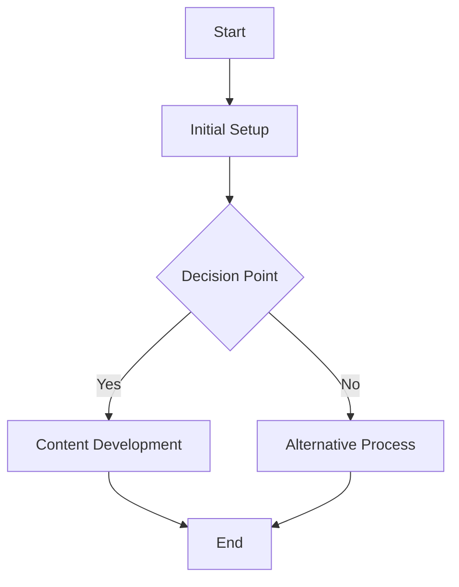
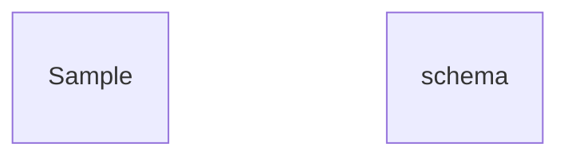

# Test General Task Template

## Metadata
- **Task ID:** TASK-TEST
- **Created:** 2025-01-28
- **Due:** 2025-02-05
- **Priority:** Medium
- **Status:** In Progress
- **Assigned to:** Test User
- **Task Type:** Testing
- **Sequence:** 1
- **Tags:** testing, template, general
## Overview
This is a test of the general task template functionality.
## Flow Diagram
This flow shows the general task processing workflow

Additional notes about the task workflow and process
## Implementation Status

### Main Implementation Steps
- [x] **Step 1: Template Setup**
- [x] Create template structure
- [x] Add metadata
- [ ] **Step 2: Content Development**
- [x] Add main content blocks
- [ ] Test template rendering

### Status Overview Table
| Step | Description | Status | Target Date |
|------|-------------|--------|-------------|
| 1 | Template Setup | ✅ Complete | 2025-01-28 |
| 2 | Content Development | 🔄 In Progress | 2025-01-30 |

## Detailed Description
This is a comprehensive test of the general task template functionality, including all major sections and features.

## Acceptance Criteria
- [x] Template renders without errors
- [ ] All sections display correctly

## Success Metrics
- **Template Rendering Success Rate**: 100% (Current: 95%)
- **Validation Pass Rate**: 100% (Current: 100%)

## Dependencies
### Required By This Task
- TASK-001 - Project Setup

### Dependent On This Task
- TASK-007 - Next Phase

### Dependency Type
Blocking - This task cannot start until dependencies are completed
## Testing Strategy
Comprehensive testing with various data inputs

### Test Plan
- [x] **Template Engine Test**: Test template rendering
- [ ] **Validation Test**: Test template validation

## Technical Considerations
Uses Jinja2 template inheritance for consistency

### Constraints
- Sample constraint

### Assumptions
- Sample assumption

### Database Changes
No database changes required

## Time Tracking
- **Estimated hours:** 4
- **Actual hours:** 2
## References
- Template Design Guide
- Jinja2 Documentation

## Updates
- **2025-01-28:** Task created for testing purposes

---
*Generated by TaskHero AI Template Engine on 2025-05-24 23:38:28* 