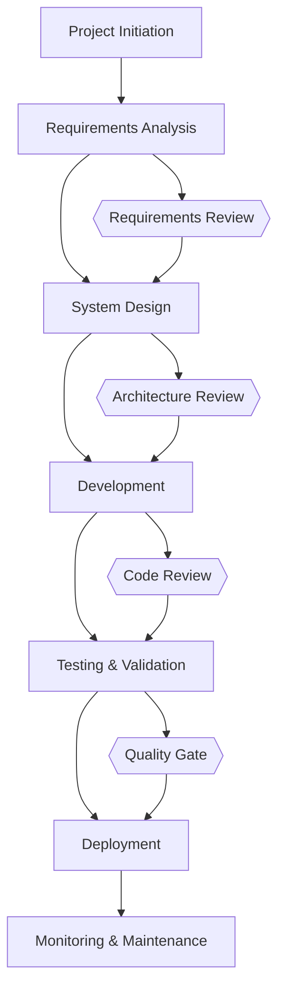

# TASK-TEST-CONSISTENCY - Sample TEST Task for Consistency Test

## Task Naming Convention
**Follow the TaskHero naming convention when creating tasks:**

**Format:** `TASK-XXX-[TYPE]-descriptive-name.md`

**Where:**
- **XXX** = Sequential number (001, 002, 003, etc.)
- **[TYPE]** = Task type abbreviation (must match metadata Task Type field)
- **descriptive-name** = Brief but clear description (use hyphens, no spaces)

**Task Type Abbreviations:**
- **DEV** = Development
- **BUG** = Bug Fix
- **TEST** = Test Case
- **DOC** = Documentation
- **DES** = Design

## Metadata
- **Task Id:** TASK-TEST-CONSISTENCY
- **Created:** 2025-05-25
- **Due:** 
- **Priority:** Medium
- **Status:** Todo
- **Assigned To:** Developer
- **Task Type:** TEST
- **Sequence:** XXX
- **Estimated Effort:** Medium
- **Tags:** 
- **Test Type:** Functional

## 1. Test Overview
### 1.1. Brief Description
This is a sample TEST task to validate consistency across different task types

### 1.2. Functional Requirements
The enhanced system must:
- The test suite must achieve [to be specified] code coverage across {test_types}
- The tests must validate [to be specified] with {assertion_criteria}
- The tests must include [to be specified] performance validation within 2 seconds under normal load conditions

### 1.3. Purpose & Benefits
This task will provide significant value by:
- Improving system functionality and user experience
- Enhancing maintainability and code quality
- Reducing technical debt and future maintenance costs
- Providing a foundation for future enhancements
- Ensuring system reliability and performance

### 1.4. Success Criteria
- [ ] All functional requirements are implemented and tested
- [ ] Code passes all quality checks and reviews
- [ ] Documentation is complete and up-to-date
- [ ] Performance meets or exceeds established benchmarks
- [ ] User acceptance testing is completed successfully

## 2. Test Flow

## 3. Test Cases
| Test Case ID | Description | Test Steps | Expected Result | Priority |
|--------------|-------------|------------|-----------------|----------|
| TC-001 | [Test case description] | [Detailed test steps] | [Expected outcome] | High |
| TC-002 | [Test case description] | [Detailed test steps] | [Expected outcome] | Medium |
| TC-003 | [Test case description] | [Detailed test steps] | [Expected outcome] | Low |

## 4. Test Data
[Test Data content to be populated based on specific requirements]

## 5. Test Automation
[Test Automation content to be populated based on specific requirements]

## 6. Test Reporting
[Test Reporting content to be populated based on specific requirements]

---
*Generated by Enhanced TaskHero AI Template Engine on 2025-05-25 19:18:58*