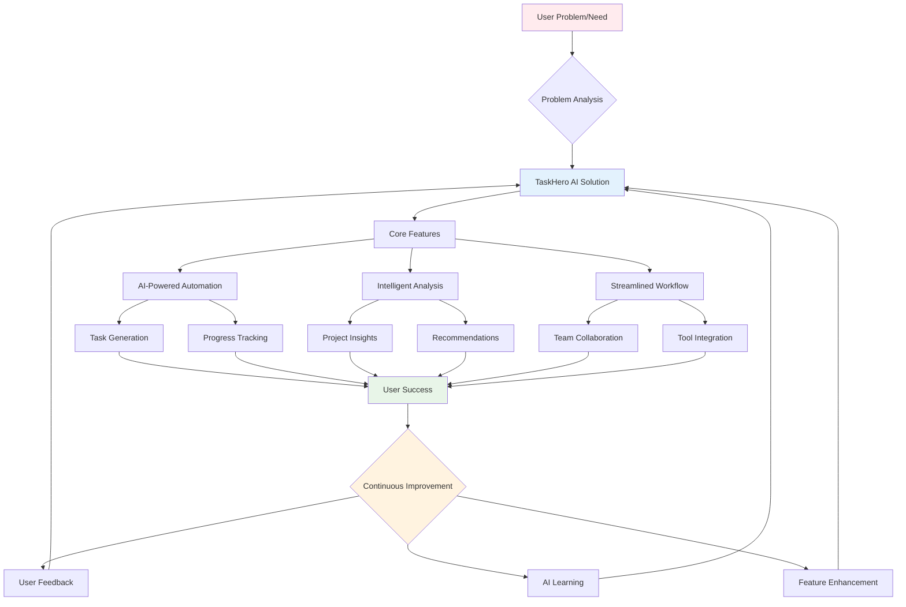

# TaskHero AI - Product Context Document

## Table of Contents
1. [Why TaskHero AI Exists](#1-why-taskhero-ai-exists)
2. [Vision Statement](#2-vision-statement)
3. [Problems Solved](#3-problems-solved)
4. [Solution Flow Diagram](#4-solution-flow-diagram)
5. [How TaskHero AI Works](#5-how-taskhero-ai-works)
6. [User Experience Goals](#6-user-experience-goals)
7. [Target Users](#7-target-users)
8. [Key User Journeys](#8-key-user-journeys)
9. [Success Metrics](#9-success-metrics)
10. [Current Product Focus](#10-current-product-focus)
11. [Recent Improvements](#11-recent-improvements)
12. [Future Roadmap](#12-future-roadmap)

---

## 1. Why TaskHero AI Exists
TaskHero AI was created to solve inefficient project management and task tracking in software development in software development and project management. As development teams, project managers, and software engineers experience scattered task information, manual status updates, lack of intelligent automation, and poor project visibility, teams struggle to maintain visibility and efficiency in complex projects while managing multiple priorities. TaskHero AI provides an AI-powered task management and project analysis platform where users can automate task creation and tracking with AI, provide intelligent insights and project analytics, and streamline team collaboration and workflow optimization.

## 2. Vision Statement
To revolutionize project management by making AI-powered automation accessible to every development team, enabling them to focus on creating great products rather than managing processes.

## 3. Problems Solved
1. **Task Management Inefficiency**: Manual task creation and tracking leads to inconsistencies, missed deadlines, and lost productivity
2. **Poor Project Visibility**: Teams lack real-time insights into project progress, bottlenecks, and resource allocation
3. **Context Switching Overhead**: Developers lose focus and productivity when switching between different tools and interfaces
4. **Inconsistent Documentation**: Project documentation becomes outdated and fragmented across multiple platforms
5. **Knowledge Silos**: Important project knowledge gets trapped with individual team members

## 4. Solution Flow Diagram

## 5. How TaskHero AI Works
TaskHero AI is a intelligent project management system that allows users to:
1. **AI-Powered Task Creation**: Automatically generate detailed, actionable tasks from high-level requirements using advanced AI analysis
2. **Intelligent Project Analysis**: Analyze codebase structure and project patterns to provide contextual insights and recommendations
3. **Automated Workflow Integration**: Seamlessly integrate with existing development tools and Git workflows for minimal disruption
4. **Real-time Progress Tracking**: Monitor project progress with intelligent metrics and automated status updates

Built with The project follows a modular architecture. The primary components are: a setup script (Bash) that orchestrates the entire process, a core application (Flask) that represents the TaskHero AI application, and a virtual environment to isolate dependencies. The setup script manages the creation and activation of the virtual environment, installs the required Python packages, and then executes the core application. architecture. Complexity level: Intermediate - Requires familiarity with Python, Bash scripting, virtual environments, and potentially Flask web development.. The project's key innovation is the automated setup wizard, which simplifies the initial configuration process and ensures a consistent development environment. The use of colorized terminal output enhances the user experience during setup.

## 6. User Experience Goals
1. **Minimal Learning Curve**: Developers can start using the system immediately without extensive training
2. **Context-Aware Interface**: UI adapts to current project context and user workflow patterns
3. **Intelligent Automation**: System handles routine tasks automatically while keeping users informed
4. **Unified Workspace**: Single interface for all project management and development activities

## 7. Target Users
1. **Senior Developer/Tech Lead**: Experienced developers who need to manage complex projects and coordinate team efforts while maintaining code quality
2. **Project Manager**: Non-technical project managers who need clear visibility into development progress and team productivity
3. **Solo Developer/Freelancer**: Independent developers working on multiple projects who need efficient task management and project organization
4. **Development Team Lead**: Team leaders who balance hands-on coding with team management and project coordination responsibilities

## 8. Key User Journeys
1. **New Project Setup**:
- Clone or create new project repository
- Run TaskHero AI initialization to analyze codebase
- Review AI-generated project insights and recommendations
- Set up initial task board and project goals
- Configure team access and collaboration settings

2. **Daily Development Workflow**:
- Check task dashboard for daily priorities
- Use AI task creator for new feature requirements
- Track progress automatically as code changes
- Review AI-generated insights and suggestions
- Update project status with minimal manual effort

3. **Project Analysis and Optimization**:
- Generate comprehensive project analysis report
- Review codebase metrics and complexity insights
- Identify potential bottlenecks and optimization opportunities
- Plan future development phases based on AI recommendations
- Share insights with stakeholders and team members

## 9. Success Metrics
1. **Task Creation Efficiency**: Time reduction in creating detailed, actionable tasks (target: 70% reduction in task creation time)
2. **Project Visibility Score**: Team understanding of project status and priorities (target: 90% team alignment on project goals)
3. **Development Velocity**: Increase in feature delivery speed (target: 40% improvement in sprint completion rates)
4. **Context Switch Reduction**: Decrease in time spent switching between tools (target: 50% reduction in tool-switching overhead)
5. **Documentation Quality**: Consistency and completeness of project documentation (target: 85% of tasks have complete, up-to-date documentation)

## 10. Current Product Focus
The current product focus is on enhanced AI integration and automation capabilities by implementing advanced machine learning models for better task prediction, project analysis, and workflow optimization. This will enhance the user experience by:
1. **Improved Task Accuracy**: Better task estimation and requirement analysis through advanced AI (target: 90% task estimation accuracy)2. **Reduced Manual Effort**: Automated task creation, status updates, and progress tracking3. **Enhanced Project Insights**: Deeper analysis of codebase patterns and development trends
After completing AI integration enhancements, we will focus on expanding team collaboration features, enterprise integrations, and advanced analytics dashboards.

## 11. Recent Improvements
The application has recently been enhanced with:
1. **Enhanced Template System**: Implemented comprehensive Jinja2-based templating for all document types with AI-powered content generation
2. **AI-Powered Task Creation**: Added intelligent task generation with context awareness, quality validation, and automated requirements analysis
3. **Advanced Project Analysis**: Integrated deep codebase analysis with architectural insights and optimization recommendations
4. **Improved User Experience**: Streamlined workflows with better navigation, context-aware interfaces, and reduced cognitive load

These improvements have significantly enhanced the platform's intelligence, user experience, and automation capabilities, resulting in faster task creation, better project insights, and improved team productivity.

## 12. Future Roadmap
1. **Q1 2025**: Advanced AI integration with enhanced natural language processing and automated code analysis
2. **Q2 2025**: Team collaboration features including real-time updates, shared workspaces, and communication integration
3. **Q3 2025**: Enterprise features with advanced security, SSO integration, and organizational management tools
4. **Q4 2025**: Analytics and reporting dashboard with predictive insights and performance optimization recommendations
5. **2026**: Platform expansion with API ecosystem, third-party integrations, and industry-specific customizations

---

*This document provides context for why TaskHero AI exists, the problems it solves, and how it should work from a product perspective. It serves as a guide for product decisions and feature prioritization.*

### Notes for AI Agent

When populating this template:
1. Replace all placeholder text in [brackets] with specific product information
2. Ensure the vision statement is concise, inspiring, and aligned with product goals
3. Be specific about the problems solved and how the product solves them
4. Update the mermaid flow diagram to reflect actual product workflow
5. Define clear user personas that represent actual target users
6. Map out realistic user journeys that cover the main use cases
7. Set measurable success metrics with specific target values
8. Focus on the current product priorities and recent improvements
9. Include a realistic roadmap with timeframes
10. Add any product-specific sections that might be relevant 