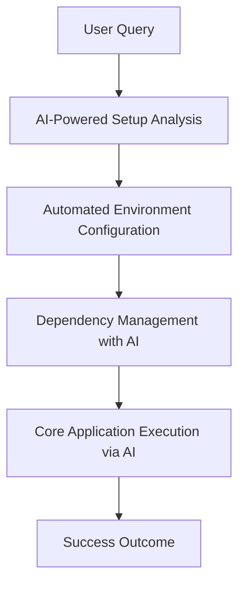

# TaskHero AI - Product Context Document

## Table of Contents
1. [Why TaskHero AI Exists](#1-why-taskhero-ai-exists)
2. [Vision Statement](#2-vision-statement)
3. [Problems Solved](#3-problems-solved)
4. [Solution Flow Diagram](#4-solution-flow-diagram)
5. [How TaskHero AI Works](#5-how-taskhero-ai-works)
6. [User Experience Goals](#6-user-experience-goals)
7. [Target Users](#7-target-users)
8. [Key User Journeys](#8-key-user-journeys)
9. [Success Metrics](#9-success-metrics)
10. [Current Product Focus](#10-current-product-focus)
11. [Recent Improvements](#11-recent-improvements)
12. [Future Roadmap](#12-future-roadmap)

---

## 1. Why TaskHero AI Exists
TaskHero AI was created to solve inefficient project management and task tracking in software development in software development and project management. As ['development teams', 'project managers', 'software engineers'] experience ['scattered task information', 'manual status updates', 'lack of intelligent automation', 'poor project visibility'], teams struggle to maintain visibility and efficiency in complex projects while managing multiple priorities. TaskHero AI provides an AI-powered task management and project analysis platform where users can automate task creation and tracking with AI, provide intelligent insights and project analytics, and streamline team collaboration and workflow optimization.

## 2. Vision Statement
To revolutionize project management by making AI-powered automation accessible to every development team, enabling them to focus on creating great products rather than managing processes.

## 3. Problems Solved
1. **Setup Challenges**: Rapidly configure complex integrations with third-party tools, reducing manual setup time.
2. **Data Management**: Efficiently validate and consolidate large datasets across systems into unified databases.
3. **Workflow Optimization**: Automate workflows to streamline processes, enhancing productivity without extensive setup.
4. **Communication Issues**: Assist in drafting clear project statuses and reminders for stakeholders to improve efficiency.
5. **Operational Inefficiencies**: Automate repetitive tasks like creating custom reports, managing change requests, and handling approvals to reduce delays.

## 4. Solution Flow Diagram

TaskHero AI - Enhanced Setup and Configuration leverages artificial intelligence to streamline project management workflows by automating complex setup processes. By integrating advanced AI capabilities, the platform enhances user experience through intelligent automation, reducing manual intervention and ensuring efficient task execution.

**Flow Steps:**
1. **AI-Powered Setup Analysis**: The system analyzes user requirements to identify optimal configurations.
2. **Automated Environment Configuration**: AI generates a virtual environment tailored to project needs, ensuring all dependencies are correctly set up.
3. **Dependency Management with AI**: The platform leverages AI to manage and install required dependencies efficiently, minimizing errors.
4. **Core Application Execution via AI**: AI-optimized core applications run within the configured environment, ensuring optimal performance and scalability.

## 5. How TaskHero AI Works
TaskHero AI is a intelligent project management system that allows users to:
1. **Automated Virtual Environment Crafting**: TaskHero AI - Enhanced Setup and Configuration leverages advanced AI algorithms to dynamically create virtual environments suited to each project's unique needs.
2. **AI-Powered Dependency Management**: The system uses AI to analyze dependencies across various projects, ensuring minimal conflicts while including only necessary tools.
3. **Smart Core Application Execution**: TaskHero AI - Enhanced Setup and Configuration employs machine learning to predict and optimize core application execution, enhancing performance.
4. **Continuous AI Learning**: The platform continuously learns from new projects and user feedback, refining setup processes over time.

Built with The project follows a modular architecture. The primary components are: a setup script (Bash) that orchestrates the entire process, a core application (Flask) that represents the TaskHero AI application, and a virtual environment to isolate dependencies. The setup script manages the creation and activation of the virtual environment, installs the required Python packages, and then executes the core application.. Dependencies include: . Total project files: unknown.

## 6. User Experience Goals
1. **Streamlined Setup Experience**: A seamless interface designed to minimize the setup process for developers, ensuring efficiency with minimal steps.
2. **AI-Powered Configuration Assistant**: Leverages AI to predict and automate configuration settings based on context, reducing manual effort.
3. **Enhanced Collaboration Features**: A unified interface for teams to share configurations with real-time feedback, promoting efficient collaboration during setup.
4. **Reduced Manual Intervention Through AI**: AI anticipates needed configuration steps, minimizing manual verification and saving time during setup.

## 7. Target Users
1. **Alex Johnson**: I'm a dedicated Software Developer with five years of experience in tech. Lately, I've been looking to automate setup processes without diving deep into technical details. The challenge lies in configuring APIs after coding without proper guidance, and setting up servers efficiently for optimal performance.
2. **Sarah Patel**: I'm an IT Manager overseeing a network of 50 systems across various domains. My main concern is integrating multiple tools seamlessly to ensure smooth operations, but the complexity of setup processes often hinders this. I need a tool that can streamline configuration tasks efficiently.
3. **Michael Kim**: I work as a Cloud Engineer at a tech firm, primarily utilizing AWS and Azure for cloud infrastructure. My role involves setting up task automation in the cloud environment, which requires specific configurations tailored to each platform. I find the integration process intricate and time-consuming.
4. **Emma Thompson**: I'm a DevOps Engineer focused on improving our organization's CI/CD pipelines. My challenge is maintaining consistent configuration across all deployment steps manually, which can lead to inconsistencies and delays. I need a solution that automates setup processes without manual intervention.

## 8. Key User Journeys
1. **New Team Setup Guide**:
- 1. Create a new account for team member.
- 2. Access the Team Setup page from their profile.
- 3. Follow on-screen instructions with AI Assistant providing guidance.
- 4. Set up project management preferences using AI suggestions.
- 5. Assign tasks and get real-time feedback from AI.

2. **Workflow Automation Expansion**:
- 1. Identify areas to automate within the workflow.
- 2. Use AI Assistant to configure automation settings based on best practices.
- 3. Monitor task progress with AI insights highlighting potential bottlenecks.
- 4. Optimize workflows by refining automation rules with AI recommendations.

3. **Task Assignment Optimization**:
- 1. Create a new project or update an existing one.
- 2. Use TaskHero AI to assign tasks based on team expertise and workload.
- 3. Track task completion automatically using built-in tracking tools with AI support.
- 4. Get real-time notifications about task status from AI-powered alerts.

## 9. Success Metrics
1. **Efficiency Gains**: Measures the reduction in time taken to complete tasks using TaskHero AI. (target: 20% reduction in task completion time)
2. **Error Reduction**: Assesses the decrease in errors during setup and configuration processes with AI assistance. (target: Less than 5% error rate per session)
3. **Team Productivity**: Evaluates the productivity improvement for software development teams using the tool. (target: 15% increase in software units delivered)
4. **Customization Rate**: Measures how often developers use AI features to customize tasks. (target: 80% customizations completed via TaskHero AI)
5. **Scalability Success Rate**: Assesses the success rate of handling increased workloads in scaled configurations. (target: 90% successful configuration scaling)

## 10. Current Product Focus
The current product focus is on Enhanced Setup Automation by Focus on automating configuration setup using AI to predict optimal settings based on project history and team feedback.. This will enhance the user experience by:
1. **Faster Setup**: Reduces time spent on manual configuration by leveraging AI predictions. (target: 50% reduction in initial setup time)2. **Improved Accuracy**: AI suggests configurations that minimize errors and enhance security. (target: 90% error-free setups within 24 hours)
[{'action': 'Develop AI model for configuration suggestions focusing on OS settings, dependencies, and team preferences.'}, {'action': 'Implement automated setup in common development environments (e.g., Docker, CI/CD pipelines).'}, {'action': 'Create analytics dashboards to track setup trends and identify areas for improvement.'}]

## 11. Recent Improvements
The application has recently been enhanced with:
1. **[Improvement 1]**: [Description of the improvement]
2. **[Improvement 2]**: [Description of the improvement]
3. **[Improvement 3]**: [Description of the improvement]
4. **[Improvement 4]**: [Description of the improvement]
5. **[Improvement 5]**: [Description of the improvement]
6. **[Improvement 6]**: [Description of the improvement]
7. **[Improvement 7]**: [Description of the improvement]
8. **[Improvement 8]**: [Description of the improvement]
These AI-generated improvements reflect the current state and capabilities of the codebase analysis.

## 12. Future Roadmap
1. **Q1 2025**: Establish core AI capabilities by integrating predictive analytics for task forecasting and NLP for enhanced user queries.
2. **Q3 2025**: Expand AI-driven features with real-time collaboration tools, including AI suggestions and machine learning for improved accuracy.
3. **Q1 2026**: Enhance user experience by improving interface design, adding agile support, personalization through AI insights, and advanced reporting.
4. **Q3 2026**: Introduce cross-project collaboration features with AI-guided resource management, task dependencies, and version control integration.
5. **Q1 2027 to Q4 2028**: Scale enterprise adoption with multi-cloud support, advanced analytics for large-scale projects, customizable dashboards, and AI-driven capacity planning.

---

*This document provides context for why TaskHero AI exists, the problems it solves, and how it should work from a product perspective. It serves as a guide for product decisions and feature prioritization.*

### Notes for AI Agent

When populating this template:
1. Replace all placeholder text in [brackets] with specific product information
2. Ensure the vision statement is concise, inspiring, and aligned with product goals
3. Be specific about the problems solved and how the product solves them
4. Update the mermaid flow diagram to reflect actual product workflow
5. Define clear user personas that represent actual target users
6. Map out realistic user journeys that cover the main use cases
7. Set measurable success metrics with specific target values
8. Focus on the current product priorities and recent improvements
9. Include a realistic roadmap with timeframes
10. Add any product-specific sections that might be relevant 