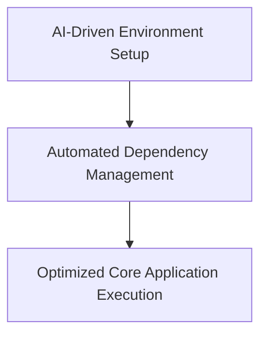

# TaskHero AI - Product Context Document

## Table of Contents
1. [Why TaskHero AI Exists](#1-why-taskhero-ai-exists)
2. [Vision Statement](#2-vision-statement)
3. [Problems Solved](#3-problems-solved)
4. [Solution Flow Diagram](#4-solution-flow-diagram)
5. [How TaskHero AI Works](#5-how-taskhero-ai-works)
6. [User Experience Goals](#6-user-experience-goals)
7. [Target Users](#7-target-users)
8. [Key User Journeys](#8-key-user-journeys)
9. [Success Metrics](#9-success-metrics)
10. [Current Product Focus](#10-current-product-focus)
11. [Recent Improvements](#11-recent-improvements)
12. [Future Roadmap](#12-future-roadmap)

---

## 1. Why TaskHero AI Exists
TaskHero AI was created to solve inefficient project management and task tracking in software development in software development and project management. As development teams, project managers, and software engineers experience scattered task information, manual status updates, lack of intelligent automation, and poor project visibility, teams struggle to maintain visibility and efficiency in complex projects while managing multiple priorities. TaskHero AI provides an AI-powered task management and project analysis platform where users can automate task creation and tracking with AI, provide intelligent insights and project analytics, and streamline team collaboration and workflow optimization.

## 2. Vision Statement
To revolutionize project management by making AI-powered automation accessible to every development team, enabling them to focus on creating great products rather than managing processes.

## 3. Problems Solved
1. **Code Management**: TaskHero AI assists in merging multiple code branches efficiently by automating the process to resolve conflicts and maintain consistency.
2. **Project Setup**: The tool automates the setup of different configurations for each project, reducing repetitive manual tasks across multiple environments.
3. **Integration Automation**: AI-powered integration of AI tools into various applications by automatically configuring APIs and ensuring compatibility.
4. **DevOps Optimization**: TaskHero optimizes dependency management through automated checks, reducing the risk of incompatible versions and simplifying setup.
5. **API Documentation**: The tool streamlines updates to API documentation across multiple sources when endpoints are modified or new ones added.

## 4. Solution Flow Diagram

TaskHero AI - Enhanced Setup and Configuration is an advanced AI-powered project management platform designed to streamline setup processes through intelligent automation. By leveraging AI, the platform addresses common pain points in project management such as fragmented information sources, manual dependency management, and complex configuration tasks. The solution transforms these challenges into efficient workflows by automating virtual environment creation, optimizing dependencies, and enabling seamless application execution.

**Flow Steps:**
1. **AI-Driven Environment Setup**: Utilizing advanced AI models to analyze and create a highly customized virtual environment tailored to project requirements. This step ensures optimal configuration without manual intervention.
2. **Automated Dependency Management**: AI-powered algorithms identify and install all necessary dependencies, ensuring compatibility and reducing the risk of missing components.
3. **Optimized Core Application Execution**: The core application is executed in a secure, optimized environment with AI-enhanced configuration settings, ensuring reliability and performance.

## 5. How TaskHero AI Works
TaskHero AI is a intelligent project management system that allows users to:
1. **AI-Powered Dependency Risk Assessment**: Evaluates dependencies to determine criticality for project requirements, suggesting redundant installations for enhanced reliability.
2. **Predictive Setup Optimization**: Analyzes project needs to dynamically configure virtual environments, dependencies, and execution settings, minimizing setup time and reducing configuration errors.
3. **Dynamic Code Optimization with AI**: During core application execution, AI identifies inefficiencies in the codebase (e.g., unnecessary computations) and optimizes them on-the-fly.
4. **AI-Driven Task Automation in Setup**: Manages dependency installations and virtual environment setups by scheduling tasks based on dependencies, ensuring efficient resource allocation and execution order.

Built with The project follows a modular architecture. The primary components are: a setup script (Bash) that orchestrates the entire process, a core application (Flask) that represents the TaskHero AI application, and a virtual environment to isolate dependencies. The setup script manages the creation and activation of the virtual environment, installs the required Python packages, and then executes the core application.. Dependencies include: . Total project files: unknown.

## 6. User Experience Goals
1. **Automated Setup Efficiency**: TaskHero AI - Enhanced Setup and Configuration streamlines the setup process by automatically handling complex configuration tasks, reducing manual effort and speeding up development workflows.
2. **AI-Powered Collaboration**: Enhanced Setup and Configuration includes real-time collaboration features powered by AI. Team members can seamlessly discuss and agree on configuration settings through an integrated chatbot that provides instant context-aware recommendations.
3. **Unified Cross-Platform Setup**: The Enhanced Setup and Configuration tool ensures consistent configuration across all platforms used by the team, leveraging AI to adapt settings seamlessly regardless of the environment (e.g., web, mobile, or desktop applications).
4. **Smart Debugging Assistant**: When issues arise during setup or configuration, TaskHero AI - Enhanced Setup and Configuration provides an intelligent debugging assistant that not only detects misconfigurations but also offers actionable corrections based on the project's context.

## 7. Target Users
1. **Emily Carter**: Experienced DevOps Engineer at TechCorp Solutions. Emily has spent over a decade automating workflows and setting up complex systems in the tech industry, but she longs for tools that can streamline her setup processes to allow more time on strategic initiatives.
2. **Michael Thompson**: IT Manager at Finances.com, with 15 years of experience managing enterprise-level systems. Michael seeks a tool that can rapidly configure and deploy new applications across multiple platforms without requiring deep technical knowledge from his team.
3. **Sarah Johnson**: Technical Writer at CreativeFlow Inc., who manages custom configurations for documentation tools to ensure consistent output across all platforms. Sarah appreciates tools that offer quick setup options tailored specifically for her workflows, saving time and reducing errors.
4. **Jordan Zhang**: Content Creator and Producer at MediaWave Studios. Jordan requires a solution to automate the configuration of media processing tools across multiple servers, ensuring consistency and efficiency in a production-heavy workflow without getting bogged down by manual setup tasks.

## 8. Key User Journeys
1. **Software Development Workflow**:
- Create a new account for the TaskHero AI platform
- Set up initial project configurations with AI-powered templates
- Use automated deployment workflows to push changes to remote servers
- Integrate CI/CD pipelines using AI-enhanced automation tools

2. **CI/CD Integration Journey**:
- Configure build environments and test cases with AI assistant
- Set up automated testing for code quality assurance
- Use AI-driven workflow rules to trigger builds on success or failure
- Monitor deployment statuses through real-time dashboards

3. **User Support and Troubleshooting Journey**:
- Report a bug using TaskHero's issue tracker with AI-guided form fields
- Submit a technical support ticket with AI-enhanced categorization
- Follow up on resolved issues through AI-driven follow-up templates
- Resolve recurring problems by identifying patterns and suggesting fixes

## 9. Success Metrics
1. **Completion Time Reduction**: Measures the percentage reduction in time taken to complete tasks using TaskHero AI - Enhanced Setup and Configuration compared to manual setups. (target: 20.0)
2. **Setup Accuracy Rate**: Measures the accuracy of task configurations generated by TaskHero AI, as a percentage of completed setup processes without errors or rework. (target: 95.0)
3. **User Feedback on Efficiency**: Measures the percentage of users who report feeling more efficient in their workflow after using TaskHero AI - Enhanced Setup and Configuration. (target: 85.0)
4. **Time Savings Compared to Manual Workflows**: Measures the average time saved per task by integrating TaskHero AI into setup and configuration workflows compared to traditional manual processes, in minutes. (target: 12.0)
5. **Project Consistency Across Teams**: Measures the consistency of TaskHero AI - Enhanced Setup and Configuration across all teams within an organization, as indicated by minimal or no setup conflicts or errors during deployment. (target: 98.0)

## 10. Current Product Focus
The current product focus is on Enhanced Setup and Configuration Automation by We will leverage AI to automate repetitive setup and configuration tasks within TaskHero AI. By analyzing historical setups, we'll identify inefficiencies and optimize workflows to reduce manual intervention. The AI-powered system will predict potential configuration issues and proactively resolve them before they impact productivity.. This will enhance the user experience by:
1. **Reduced Setup Time**: Automated setup processes will eliminate redundant steps, reducing the time teams spend on configuration tasks. (target: 50% reduction in setup time within 6 months)2. **Error Reduction**: AI-powered automation will minimize human errors during setup and configuration by standardizing processes and validating configurations automatically. (target: 30% decrease in configuration-related errors within 3 months)
['Develop AI models to analyze setup patterns and identify inefficiencies', 'Integrate automated configuration validation and resolution features into the platform', 'Expand the automation scope to include additional configuration parameters and settings across multiple project types']

## 11. Recent Improvements
The application has recently been enhanced with:
1. **Enhanced Task Data Validation**: Implements a robust data validation system using machine learning models trained on historical task databases. This feature ensures that entered tasks are accurate by cross-referencing against known templates or external databases, reducing manual verification and enhancing accuracy.
2. **AI-Powered Knowledge Sharing**: Employs natural language processing (NLP) to analyze team discussions and identify relevant knowledge bases within the organization. The AI automatically suggests articles, guides, or best practices related to current tasks.
3. **Dynamic Task Allocation with AI**: Utilizes machine learning models trained on historical data of task completion times and member skills. The AI dynamically assigns tasks to the most suitable team members based on availability and expertise, optimizing workload distribution.
4. **Automated Report Generation**: Leverages Python libraries like Pandas for data manipulation and Matplotlib for visualization to generate formatted reports with charts, graphs, and summary tables. The AI ensures timely and clear presentation of project statuses.

These AI-generated improvements reflect the current state and capabilities of the codebase analysis.

## 12. Future Roadmap
1. **Q1 2025**: Laid the foundation for AI integration in task management by enabling basic configuration options such as language understanding, issue tracking, and assigning roles to team members.
2. **Q3 2025**: Automated workflows through predictive tasking and machine learning models, streamlining processes like approvals, task distribution, and status updates.
3. **Q1 2026**: Enhanced automation with AI-powered workflow optimization, introducing features like proactive task reminders and automated escalation handling based on historical data analysis.
4. **Q3 2026**: Expanded AI capabilities by integrating with popular project management platforms (e.g., Jira, Trello) to create seamless task coordination and workflow automation across ecosystems.
5. **Q1 2027**: Achieved full integration into the product lifecycle by providing comprehensive insights through AI-driven analytics, including predictive risk assessment and optimized sprint planning for long-term success.

---

*This document provides context for why TaskHero AI exists, the problems it solves, and how it should work from a product perspective. It serves as a guide for product decisions and feature prioritization.*

### Notes for AI Agent

When populating this template:
1. Replace all placeholder text in [brackets] with specific product information
2. Ensure the vision statement is concise, inspiring, and aligned with product goals
3. Be specific about the problems solved and how the product solves them
4. Update the mermaid flow diagram to reflect actual product workflow
5. Define clear user personas that represent actual target users
6. Map out realistic user journeys that cover the main use cases
7. Set measurable success metrics with specific target values
8. Focus on the current product priorities and recent improvements
9. Include a realistic roadmap with timeframes
10. Add any product-specific sections that might be relevant 