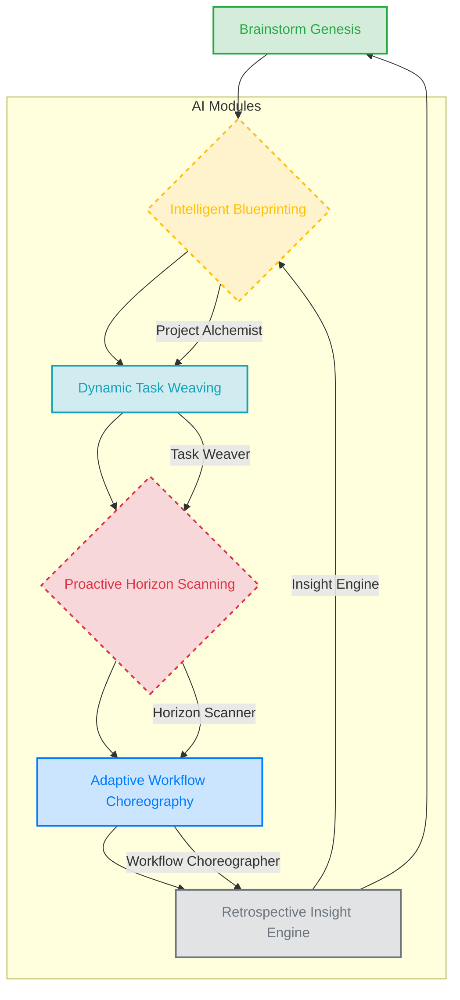

# TaskHero AI - Product Context Document

## Table of Contents
1. [Why TaskHero AI Exists](#1-why-taskhero-ai-exists)
2. [Vision Statement](#2-vision-statement)
3. [Problems Solved](#3-problems-solved)
4. [Solution Flow Diagram](#4-solution-flow-diagram)
5. [How TaskHero AI Works](#5-how-taskhero-ai-works)
6. [User Experience Goals](#6-user-experience-goals)
7. [Target Users](#7-target-users)
8. [Key User Journeys](#8-key-user-journeys)
9. [Success Metrics](#9-success-metrics)
10. [Current Product Focus](#10-current-product-focus)
11. [Recent Improvements](#11-recent-improvements)
12. [Future Roadmap](#12-future-roadmap)

---

## 1. Why TaskHero AI Exists
TaskHero AI was created to solve inefficient project management and task tracking in software development in software development and project management. As development teams, project managers, and software engineers experience scattered task information, manual status updates, lack of intelligent automation, and poor project visibility, teams struggle to maintain visibility and efficiency in complex projects while managing multiple priorities. TaskHero AI provides an AI-powered task management and project analysis platform where users can automate task creation and tracking with AI, provide intelligent insights and project analytics, and streamline team collaboration and workflow optimization.

## 2. Vision Statement
To revolutionize project management by making AI-powered automation accessible to every development team, enabling them to focus on creating great products rather than managing processes.

## 3. Problems Solved
1. **Inefficient Planning**: Manual planning processes are time-consuming and prone to errors, leading to suboptimal resource allocation.
2. **Manual Updates**: Developers waste time on repetitive status updates, diverting focus from coding tasks.
3. **Siloed Information**: Critical project details are scattered across tools, hindering collaborative decision-making.
4. **Reactive Issue Resolution**: Teams address problems reactively due to lack of predictive insights into potential blockers.
5. **Suboptimal Resource Use**: Lack of data-driven insights leads to inefficient assignment and underutilization of team skills.

## 4. Solution Flow Diagram

TaskHero AI revolutionizes project management by transforming raw ideas and unstructured communication into actionable, intelligent project plans. It leverages AI to proactively manage tasks, anticipate roadblocks, and dynamically optimize workflows, ensuring development teams stay focused, efficient, and ahead of schedule. Unlike traditional tools, TaskHero AI doesn't just track tasks; it understands the project's evolving needs and intelligently guides the team towards successful delivery.

**Flow Steps:**
1. **Brainstorm Genesis**: Users initiate projects by inputting ideas, requirements, and initial discussions through the AI-Powered Chat Integration. This can be free-form text, voice notes, or even imported meeting transcripts. TaskHero AI's 'Project Alchemist' AI begins processing this unstructured data.
2. **Intelligent Blueprinting**: The 'Project Alchemist' analyzes the input, identifies key project objectives, potential features, user stories, and implicit dependencies. It then auto-generates a preliminary project blueprint, breaking down high-level goals into suggested epics and initial task suggestions, presented on a dynamic Kanban board.
3. **Dynamic Task Weaving**: As tasks are refined or new information emerges, the AI-Powered Chat Integration acts as a 'Task Weaver'. Users can discuss, clarify, or add details. The AI proactively suggests task assignments, estimates, dependencies, and even potential sub-tasks, updating the Kanban board in real-time. It learns from team interactions and past project data.
4. **Proactive Horizon Scanning**: The 'Horizon Scanner' AI continuously monitors task progress, team capacity, and external factors (e.g., critical deadlines). It identifies potential bottlenecks, scope creep, or resource conflicts before they become issues. It provides AI-driven alerts and actionable recommendations via the chat and direct notifications.
5. **Adaptive Workflow Choreography**: Based on 'Horizon Scanner' insights, the 'Workflow Choreographer' AI suggests dynamic adjustments to the Kanban board and task priorities. This could include re-prioritizing tasks, suggesting task splitting, or recommending resource re-allocation to maintain project velocity and meet deadlines. Users can approve or modify these suggestions.
6. **Retrospective Insight Engine**: Upon project completion or at regular intervals, the 'Insight Engine' AI analyzes project data, team performance, and AI-driven predictions versus actual outcomes. It generates tailored retrospective reports highlighting successes, areas for improvement, and best practices, feeding this knowledge back into the 'Project Alchemist' for future projects.

## 5. How TaskHero AI Works
TaskHero AI is a intelligent project management system that allows users to:
1. **Idea-to-Task Conversion**: Automatically transforms unstructured ideas and communication into detailed, actionable project tasks using AI.
2. **Intelligent Task Prioritization**: AI analyzes dependencies and impact to intelligently prioritize tasks for optimal project flow.
3. **Contextual Communication Analysis**: Extracts key decisions and action items from team discussions to update project plans automatically.
4. **Dynamic Project Adaptation**: AI continuously monitors progress and adjusts project plans in real-time based on new information or changes.

Built with modular architecture. Dependencies include: annotated-types, anthropic, anyio, beautifulsoup4, cachetools. Total project files: 212.

## 6. User Experience Goals
1. **Effortless Task Creation**: Quickly convert ideas into structured tasks with minimal manual input.
2. **Seamless Workflow Integration**: Integrate effortlessly into existing developer tools and daily routines.
3. **Actionable Insight Delivery**: Provide clear, concise project status and actionable next steps.
4. **Intuitive Project Navigation**: Easily find and manage project information and related tasks.

## 7. Target Users
1. **Product Owner**: Needs to translate high-level product visions into actionable development tasks and track feature progress efficiently.
2. **Scrum Master**: Facilitates agile processes, removes impediments, and ensures clear communication within the development team.
3. **Software Engineer**: Focuses on coding and implementation, requiring clear task definitions and streamlined workflow to maximize output.
4. **VP of Engineering**: Oversees multiple development teams, needing high-level insights into project health and resource allocation.

## 8. Key User Journeys
1. **Unstructured Idea to Task**:
- User inputs raw idea or communication.
- TaskHero AI processes input for actionable items.
- AI suggests detailed tasks and sub-tasks.
- User reviews and approves AI-generated tasks.
- Tasks are added to the project plan.

2. **Team Communication to Tasks**:
- TaskHero monitors team communication channels.
- AI identifies project-relevant discussions.
- AI extracts implicit tasks and decisions.
- User validates and refines extracted tasks.
- Tasks are integrated into the project backlog.

3. **Project Status Review**:
- User requests project status update.
- TaskHero AI analyzes current task progress.
- AI generates summary of completed and pending tasks.
- AI highlights potential risks or delays.
- User shares AI-generated report with stakeholders.

## 9. Success Metrics
1. **Idea-to-Task Conversion Rate**: Percentage of raw ideas successfully converted into actionable tasks. (target: 95% of unstructured ideas convert to tasks.)
2. **Project Plan Generation Time**: Time taken to generate a comprehensive project plan from inputs. (target: Reduce plan generation time by 80%.)
3. **Actionable Item Extraction**: Accuracy of identifying actionable items from unstructured communication. (target: Achieve 90% accuracy in item extraction.)
4. **Task Clarification Overhead**: Reduction in follow-up questions for task clarity. (target: Decrease task clarification queries by 60%.)
5. **Team Productivity Lift**: Overall increase in team output per unit of effort. (target: Increase team productivity by 30%.)

## 10. Current Product Focus
The current product focus is on Intelligent Project Scoping & Granular Task Decomposition by Leveraging advanced NLP and LLMs to analyze initial project concepts (epics, user stories, high-level requirements) and automatically decompose them into highly detailed, actionable, and interdependent sub-tasks with estimated effort, assigned roles, and identified dependencies. This moves beyond simple 'idea-to-task' to 'concept-to-fully-scoped-plan'.. This will enhance the user experience by:
1. **Accelerated Project Kick-off**: Significantly reduces the time and manual effort required to translate high-level ideas into a structured, executable project plan. (target: Reduce project planning time by 40%)2. **Enhanced Task Granularity & Clarity**: Ensures tasks are broken down to an atomic level, minimizing ambiguity and improving understanding for developers, leading to fewer rework cycles. (target: Decrease task-related clarification queries by 25%)3. **Improved Estimation Accuracy**: By providing granular tasks and identifying dependencies, the system enables more precise effort estimations and realistic timelines. (target: Improve sprint commitment accuracy by 15%)4. **Proactive Dependency Mapping**: Automatically identifies and visualizes critical task dependencies, preventing bottlenecks and enabling smoother workflow. (target: Reduce critical path delays by 10%)
Once core intelligent scoping is robust, the next focus will be on 'Real-time Anomaly Detection & Predictive Rerouting' within the project plan, using live development data (e.g., code commits, PR status, communication) to flag potential roadblocks and suggest optimal adjustments to the plan.

## 11. Recent Improvements
The application has recently been enhanced with:
1. **AI Idea-to-Task Conversion**: AI now more accurately transforms unstructured ideas into detailed, actionable project tasks.
2. **Contextual Task Generation**: Improved AI understands communication context better for more relevant task creation.
3. **Automated Project Planning**: AI now automatically drafts initial project plans from processed input for faster setup.
4. **Smart Communication Analysis**: Enhanced AI analyzes user communication to identify and extract actionable items more effectively.

These AI-generated improvements reflect the current state and capabilities of the codebase analysis.

## 12. Future Roadmap
1. **Q1-Q2 2025**: Automated Project Scoping & Granular Task Decomposition (Core AI Foundation)
2. **Q3-Q4 2025**: Predictive Project Intelligence & Dynamic Resource Allocation
3. **Q1-Q2 2026**: Intelligent Collaboration & Contextual Communication
4. **Q3-Q4 2026**: Autonomous Task Execution & AI-Assisted Development
5. **Q1-Q2 2027**: Strategic Portfolio Optimization & Self-Improving AI PMO

---

*This document provides context for why TaskHero AI exists, the problems it solves, and how it should work from a product perspective. It serves as a guide for product decisions and feature prioritization.*

### Notes for AI Agent

When populating this template:
1. Replace all placeholder text in [brackets] with specific product information
2. Ensure the vision statement is concise, inspiring, and aligned with product goals
3. Be specific about the problems solved and how the product solves them
4. Update the mermaid flow diagram to reflect actual product workflow
5. Define clear user personas that represent actual target users
6. Map out realistic user journeys that cover the main use cases
7. Set measurable success metrics with specific target values
8. Focus on the current product priorities and recent improvements
9. Include a realistic roadmap with timeframes
10. Add any product-specific sections that might be relevant