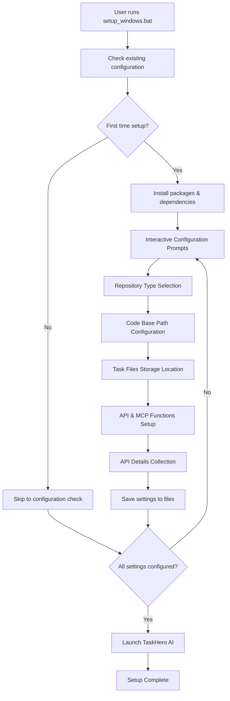

# Enhance Install Script for TaskHero AI

## Metadata
- **Task ID:** TASK-008
- **Created:** 2025-01-XX
- **Due:** 2025-01-XX
- **Priority:** High
- **Status:** Todo
- **Assigned to:** Developer
- **Task Type:** DEV
- **Sequence:** 8
- **Estimated Effort:** Medium (1-3 days)
- **Related Epic/Feature:** User Experience Enhancement
- **Tags:** setup, installation, user-experience, windows, batch-script

## Task Naming Convention
**Follow the TaskHero naming convention when creating tasks:**

**Format:** `TASK-XXX-[TYPE]-descriptive-name.md`

**Where:**
- **XXX** = Sequential number (001, 002, 003, etc.)
- **[TYPE]** = Task type abbreviation (must match metadata Task Type field)
- **descriptive-name** = Brief but clear description (use hyphens, no spaces)

**Task Type Abbreviations:**
- **DEV** = Development
- **BUG** = Bug Fix
- **TEST** = Test Case
- **DOC** = Documentation
- **DES** = Design

**Examples:**
- `TASK-001-DEV-user-authentication.md`
- `TASK-002-BUG-login-validation-error.md`
- `TASK-003-TEST-payment-gateway.md`
- `TASK-004-DOC-api-documentation-update.md`
- `TASK-005-DES-dashboard-ui-redesign.md`

> **Important:** The task type abbreviation in the filename must match the Task Type field in the metadata section above.

## 1. Overview
### 1.1. Brief Description
Enhance the existing Windows setup_windows.bat file to provide a more informative, elegant, and interactive user experience during TaskHero AI installation and configuration.

### 1.2. Functional Requirements
The enhanced script must:
- Install packages and setup app requirements
- Provide interactive user prompts for configuration
- Store settings in appropriate configuration files
- Skip completed configurations on subsequent runs
- Launch the TaskHero AI application after setup

**Specific Requirements:**
- Interactive prompts for repository type (central vs singular)
- Code base path configuration
- Project task files storage location selection
- API and MCP functions usage configuration
- API details collection for required models and functions

### 1.3. Purpose & Benefits
This enhancement will significantly improve the user onboarding experience by:
- Reducing manual configuration steps
- Providing clear guidance during setup
- Ensuring proper configuration storage
- Creating a more professional installation experience
- Enabling quick re-runs without redundant steps

### 1.4. Success Criteria
- [ ] Script runs without errors on Windows systems
- [ ] User can configure all settings through interactive prompts
- [ ] Settings are properly stored in app_settings.json and .env files
- [ ] Subsequent runs skip completed configurations
- [ ] TaskHero AI launches successfully after setup
- [ ] Script provides clear feedback and progress indicators

## 2. Flow Diagram
**User's perspective of the enhanced setup flow:**

The user journey focuses on a guided, step-by-step configuration process that adapts based on existing settings and provides clear feedback at each stage.

## 3. Implementation Status

### 3.1. Implementation Steps
- [ ] **Step 1: Analyze Current Script** - Status: ⏳ Pending - Target: 2025-01-XX
  - [ ] Sub-step 1: Review existing setup_windows.bat functionality
  - [ ] Sub-step 2: Identify areas for improvement
  - [ ] Sub-step 3: Document current limitations

- [ ] **Step 2: Design Enhanced Script Structure** - Status: ⏳ Pending - Target: 2025-01-XX
  - [ ] Sub-step 1: Create modular script sections
  - [ ] Sub-step 2: Design user prompt flow
  - [ ] Sub-step 3: Plan configuration storage strategy

- [ ] **Step 3: Implement Interactive Prompts** - Status: ⏳ Pending - Target: 2025-01-XX
  - [ ] Sub-step 1: Repository type selection prompt
  - [ ] Sub-step 2: Code base path configuration
  - [ ] Sub-step 3: Task files storage location prompt
  - [ ] Sub-step 4: API and MCP functions configuration

- [ ] **Step 4: Configuration Management** - Status: ⏳ Pending - Target: 2025-01-XX
  - [ ] Sub-step 1: Implement settings validation
  - [ ] Sub-step 2: Create configuration file updates
  - [ ] Sub-step 3: Add skip logic for completed settings

- [ ] **Step 5: Testing and Validation** - Status: ⏳ Pending - Target: 2025-01-XX
  - [ ] Sub-step 1: Test fresh installation flow
  - [ ] Sub-step 2: Test re-run scenarios
  - [ ] Sub-step 3: Validate configuration persistence

## 4. Detailed Description
The existing Windows setup_windows.bat file provides basic installation functionality but lacks user interaction and configuration management. This enhancement will transform it into a comprehensive setup wizard that guides users through the entire TaskHero AI configuration process.

**Current Implementation Analysis:**
- Basic package installation without user feedback
- No interactive configuration options
- Manual post-installation setup required
- Limited error handling and user guidance

**New Implementation Features:**
- Interactive prompts with clear instructions and options
- Intelligent configuration detection and skip logic
- Comprehensive settings management with validation
- Professional user interface with progress indicators
- Automatic application launch after successful setup

**Migration Strategy:**
- Backup existing setup_windows.bat as setup_windows_legacy.bat
- Implement new script with backward compatibility
- Provide migration path for existing installations
- Ensure all current functionality is preserved and enhanced

## 5. Interactive Configuration Details

### 5.1. Repository Type Configuration
**Prompt:** "Will this be a central repository for all different code bases, or will it reside within an existing codebase?"
- Option A: Central repository (recommended for multiple projects)
- Option B: Singular repository (embedded in existing codebase)

### 5.2. Code Base Path Configuration
**Prompt:** "Please specify the path of the codebase that TaskHero will index:"
- Input validation for path existence
- Support for relative and absolute paths
- Default suggestion based on current directory

### 5.3. Task Files Storage Location
**Prompt:** "Where would you like to store project task files?"
- Option A: Present folder (default)
- Option B: Root folder /taskherofiles
- Custom path option

### 5.4. API and MCP Functions Configuration
**Prompt:** "Will TaskHero API and MCP functions be used?"
- Yes/No selection
- If Yes, proceed to API details collection
- If No, skip API configuration

### 5.5. API Details Collection
**Prompts for each enabled provider:**
- OpenAI API key and model preferences
- Anthropic API key and model preferences
- DeepSeek API key and model preferences
- OpenRouter API key and model preferences
- Ollama local configuration

## 6. Risk Assessment
### 6.1. Potential Risks
| Risk | Impact | Probability | Mitigation Strategy |
|------|--------|-------------|-------------------|
| User input validation errors | Medium | Medium | Implement comprehensive input validation and error handling |
| Configuration file corruption | High | Low | Create backup files before modifications and validate JSON structure |
| Path resolution issues | Medium | Medium | Use absolute path resolution and existence validation |
| API key security concerns | High | Low | Implement secure storage practices and user warnings |
| Script compatibility issues | Medium | Low | Test on multiple Windows versions and provide fallback options |

## Dependencies
### Required By This Task
- Windows batch scripting knowledge
- JSON file manipulation capabilities
- Environment variable management
- File system operations

### Technical Dependencies
- Windows Command Prompt/PowerShell
- Python environment (for JSON validation)
- Existing app_settings.json structure
- Current .env file format

## Testing
Testing will focus on comprehensive validation of the enhanced setup script across different scenarios and Windows environments.

**Testing Strategy:** 
- Fresh installation testing on clean Windows systems
- Re-run testing with existing configurations
- Error scenario testing with invalid inputs
- Configuration persistence validation
- Cross-Windows version compatibility testing

## Technical Considerations
**State Management:**
- Configuration state will be managed through app_settings.json and .env files
- Settings validation will ensure data integrity and completeness
- Skip logic will track completed configuration steps

**Component Architecture:**
- Modular script design for maintainability and extensibility
- Separate functions for each configuration section
- Centralized error handling and user feedback

**Performance Considerations:**
- Minimize redundant operations through intelligent skip logic
- Optimize file I/O operations for configuration management
- Provide progress indicators for long-running operations

## Updates
- **2025-01-XX** - Task created

---
*Generated by TaskHero AI Template Engine on 2025-01-XX* 