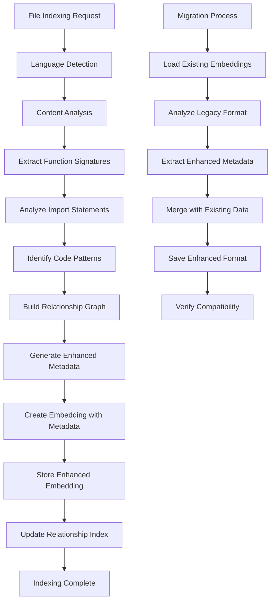

# Task: TASK-089 - Enhanced Metadata Integration for Context Retrieval

## Task Naming Convention
**Follow the TaskHero naming convention when creating tasks:**

**Format:** `TASK-XXX-[TYPE]-descriptive-name.md`

**Where:**
- **XXX** = Sequential number (001, 002, 003, etc.)
- **[TYPE]** = Task type abbreviation (must match metadata Task Type field)
- **descriptive-name** = Brief but clear description (use hyphens, no spaces)

**Task Type Abbreviations:**
- **DEV** = Development
- **BUG** = Bug Fix
- **TEST** = Test Case
- **DOC** = Documentation
- **DES** = Design
- **RES** = Research
- **PLAN** = Planning

**Examples:**
- `TASK-001-DEV-user-authentication.md`
- `TASK-002-BUG-login-validation-error.md`
- `TASK-003-TEST-payment-gateway.md`
- `TASK-004-DOC-api-documentation-update.md`
- `TASK-005-DES-dashboard-ui-redesign.md`

> **Important:** The task type abbreviation in the filename must match the Task Type field in the metadata section above.

## Metadata
- **Task ID:** TASK-089
- **Created:** 2025-01-29
- **Due:** 2025-02-05
- **Priority:** Medium
- **Status:** Todo
- **Assigned to:** Developer
- **Task Type:** Development
- **Sequence:** 89
- **Estimated Effort:** Medium (2-3 days)
- **Related Epic/Feature:** TaskHero AI Context Enhancement
- **Tags:** metadata-integration, embeddings, indexing, context-quality, performance

## 1. Overview
### 1.1. Brief Description
Upgrade the embedding creation system to include enhanced metadata for improved context retrieval quality, including file relationships, imports, function signatures, and advanced code analysis.

### 1.2. Functional Requirements
- **Enhanced Embedding Creation**: Update `mods/code/indexer.py` to create enhanced metadata format
- **File Relationship Analysis**: Extract and store import statements, function calls, and class references
- **Language Detection**: Automatic programming language detection and categorization
- **Function Signature Extraction**: Parse and store function/method signatures for better matching
- **Metadata Migration**: Create migration script for existing embeddings with backward compatibility
- **Code Pattern Recognition**: Identify design patterns and architectural patterns
- **Cross-file Dependency Analysis**: Build comprehensive dependency graphs

### 1.3. Purpose & Benefits
- **Improved Context Quality**: Enhanced metadata provides better semantic understanding
- **Better File Relationships**: Understand code dependencies and relationships
- **Faster Query Resolution**: Pre-computed metadata speeds up context retrieval
- **Enhanced Relevance Scoring**: More factors for calculating file relevance
- **Future-Proof Architecture**: Extensible metadata format for future enhancements

### 1.4. Success Criteria
- [ ] Enhanced metadata format implemented in indexer
- [ ] File relationship extraction working for Python, JavaScript, and Markdown files
- [ ] Language detection accurately identifies file types
- [ ] Function signature extraction captures method definitions
- [ ] Migration script preserves existing embeddings while adding enhanced metadata
- [ ] Code pattern recognition identifies common patterns
- [ ] Cross-file dependency analysis builds accurate relationship graphs
- [ ] Performance impact is minimal (< 20% increase in indexing time)
- [ ] Backward compatibility maintained with existing embedding format
- [ ] Enhanced context retrieval shows measurable quality improvement

## 2. Flow Diagram


## 3. Implementation Plan

### Phase 1: Enhanced Metadata Format Design - Estimated: 0.5 days
- **File**: `mods/code/indexer.py`
- **Tasks**:
  - Design enhanced metadata schema with backward compatibility
  - Define relationship types and metadata fields
  - Create metadata validation and serialization functions
  - Implement language detection using file extensions and content analysis

### Phase 2: Content Analysis Enhancement - Estimated: 1 day
- **Files**: `mods/code/indexer.py`, `mods/code/analyzers/`
- **Tasks**:
  - Implement function signature extraction for Python, JavaScript, TypeScript
  - Create import statement analysis for dependency mapping
  - Add code pattern recognition (classes, functions, modules)
  - Implement cross-file reference detection

### Phase 3: Relationship Graph Building - Estimated: 0.5 days
- **Files**: `mods/code/indexer.py`, `mods/project_management/graphiti_retriever.py`
- **Tasks**:
  - Build comprehensive file relationship graphs
  - Create dependency mapping between files
  - Implement relationship strength scoring
  - Integrate with existing GraphitiContextRetriever

### Phase 4: Migration and Compatibility - Estimated: 1 day
- **Files**: `mods/code/migration.py`, `mods/code/indexer.py`
- **Tasks**:
  - Create migration script for existing embeddings
  - Implement backward compatibility layer
  - Add gradual upgrade mechanism
  - Test migration with existing embedding files

## 4. Technical Considerations

### 4.1. Architecture Changes
- **Enhanced Metadata Schema**: Extend existing embedding format with new metadata fields
- **Backward Compatibility**: Ensure existing embeddings continue to work
- **Performance Optimization**: Minimize impact on indexing performance
- **Modular Design**: Separate analyzers for different file types and patterns

### 4.2. Dependencies
- **AST Parsing Libraries**: For Python, JavaScript, TypeScript analysis
- **Language Detection**: File extension mapping and content-based detection
- **Existing Indexer**: Build upon current `mods/code/indexer.py`
- **GraphitiContextRetriever**: Integration with enhanced context retrieval

### 4.3. Performance Considerations
- **Incremental Processing**: Only analyze changed files
- **Caching Strategy**: Cache analysis results for unchanged files
- **Parallel Processing**: Analyze multiple files concurrently
- **Memory Management**: Efficient handling of large codebases

### 4.4. Security Considerations
- **Code Analysis Safety**: Ensure AST parsing doesn't execute code
- **Metadata Sanitization**: Validate and sanitize extracted metadata
- **File Access Control**: Respect file permissions and access controls

## 5. Implementation Details

### 5.1. Enhanced Metadata Schema
```python
class EnhancedMetadata:
    def __init__(self):
        self.file_info = {
            'language': str,           # Detected programming language
            'file_type': str,          # File category (code, config, docs)
            'size': int,               # File size in bytes
            'last_modified': float,    # Timestamp
            'encoding': str            # File encoding
        }

        self.code_analysis = {
            'functions': List[Dict],   # Function signatures and metadata
            'classes': List[Dict],     # Class definitions and methods
            'imports': List[Dict],     # Import statements and dependencies
            'exports': List[Dict],     # Exported functions/classes
            'patterns': List[str]      # Identified code patterns
        }

        self.relationships = {
            'dependencies': List[str], # Files this file depends on
            'dependents': List[str],   # Files that depend on this file
            'related_files': List[Dict], # Related files with relationship type
            'strength_scores': Dict    # Relationship strength scores
        }
```

### 5.2. Language Detection System
```python
def detect_language(file_path: Path, content: str) -> str:
    """Detect programming language from file extension and content."""
    # Extension-based detection
    extension_map = {
        '.py': 'python',
        '.js': 'javascript',
        '.ts': 'typescript',
        '.md': 'markdown',
        '.json': 'json',
        '.yaml': 'yaml',
        '.yml': 'yaml'
    }

    # Content-based detection for ambiguous cases
    if file_path.suffix.lower() in extension_map:
        return extension_map[file_path.suffix.lower()]

    # Fallback to content analysis
    return analyze_content_language(content)
```

### 5.3. Function Signature Extraction
```python
def extract_function_signatures(content: str, language: str) -> List[Dict]:
    """Extract function signatures based on language."""
    if language == 'python':
        return extract_python_functions(content)
    elif language in ['javascript', 'typescript']:
        return extract_js_functions(content)
    else:
        return []

def extract_python_functions(content: str) -> List[Dict]:
    """Extract Python function signatures using AST."""
    import ast

    try:
        tree = ast.parse(content)
        functions = []

        for node in ast.walk(tree):
            if isinstance(node, ast.FunctionDef):
                functions.append({
                    'name': node.name,
                    'args': [arg.arg for arg in node.args.args],
                    'line_number': node.lineno,
                    'is_async': isinstance(node, ast.AsyncFunctionDef),
                    'docstring': ast.get_docstring(node)
                })

        return functions
    except SyntaxError:
        return []
```

### 5.4. Migration Script Implementation
```python
class EmbeddingMigration:
    def __init__(self, embeddings_dir: Path):
        self.embeddings_dir = embeddings_dir
        self.backup_dir = embeddings_dir / "backup"

    def migrate_embeddings(self) -> Dict[str, Any]:
        """Migrate existing embeddings to enhanced format."""
        results = {
            'migrated': 0,
            'skipped': 0,
            'errors': 0,
            'backup_created': False
        }

        # Create backup
        self._create_backup()
        results['backup_created'] = True

        # Process each embedding file
        for embedding_file in self.embeddings_dir.glob("*.json"):
            try:
                if self._migrate_single_file(embedding_file):
                    results['migrated'] += 1
                else:
                    results['skipped'] += 1
            except Exception as e:
                logger.error(f"Migration failed for {embedding_file}: {e}")
                results['errors'] += 1

        return results
```

## 6. Testing Strategy
- **Unit Tests**: Test each metadata extraction function independently
- **Integration Tests**: Test enhanced indexing with real codebase files
- **Migration Tests**: Verify migration preserves existing functionality
- **Performance Tests**: Measure indexing time impact with enhanced metadata
- **Compatibility Tests**: Ensure backward compatibility with existing embeddings
- **Quality Tests**: Validate enhanced metadata improves context retrieval quality

## 7. Risks and Mitigations
- **Risk**: Enhanced metadata significantly increases indexing time
  **Mitigation**: Implement incremental processing and caching strategies

- **Risk**: AST parsing fails for complex or malformed code
  **Mitigation**: Graceful error handling with fallback to basic metadata

- **Risk**: Migration corrupts existing embeddings
  **Mitigation**: Create comprehensive backups before migration

- **Risk**: Enhanced metadata format becomes incompatible with existing system
  **Mitigation**: Maintain backward compatibility layer and version detection

## 8. Dependencies
- TASK-045-DEV-graphiti-integration-for-task-creation.md (Completed)
- TASK-087-DEV-enhanced-context-preview-ui-for-task-creation.md (Completed)
- Existing indexing system in `mods/code/indexer.py`

## 9. Acceptance Criteria
- [ ] Enhanced metadata format implemented with backward compatibility
- [ ] Function signature extraction working for Python, JavaScript, TypeScript
- [ ] Import statement analysis builds accurate dependency graphs
- [ ] Language detection achieves >95% accuracy
- [ ] Migration script successfully upgrades existing embeddings
- [ ] Performance impact is <20% increase in indexing time
- [ ] Enhanced context retrieval shows measurable quality improvement
- [ ] All existing functionality continues to work unchanged
- [ ] Comprehensive test suite covers all new functionality

## 10. Future Enhancements
- **Advanced Pattern Recognition**: Identify design patterns and architectural patterns
- **Semantic Code Analysis**: Understand code semantics beyond syntax
- **Multi-language Support**: Extend to more programming languages
- **Real-time Updates**: Incremental metadata updates for changed files
- **Machine Learning Integration**: Use ML for better pattern recognition

---
*Generated by TaskHero AI Template Engine on 2025-01-29*
