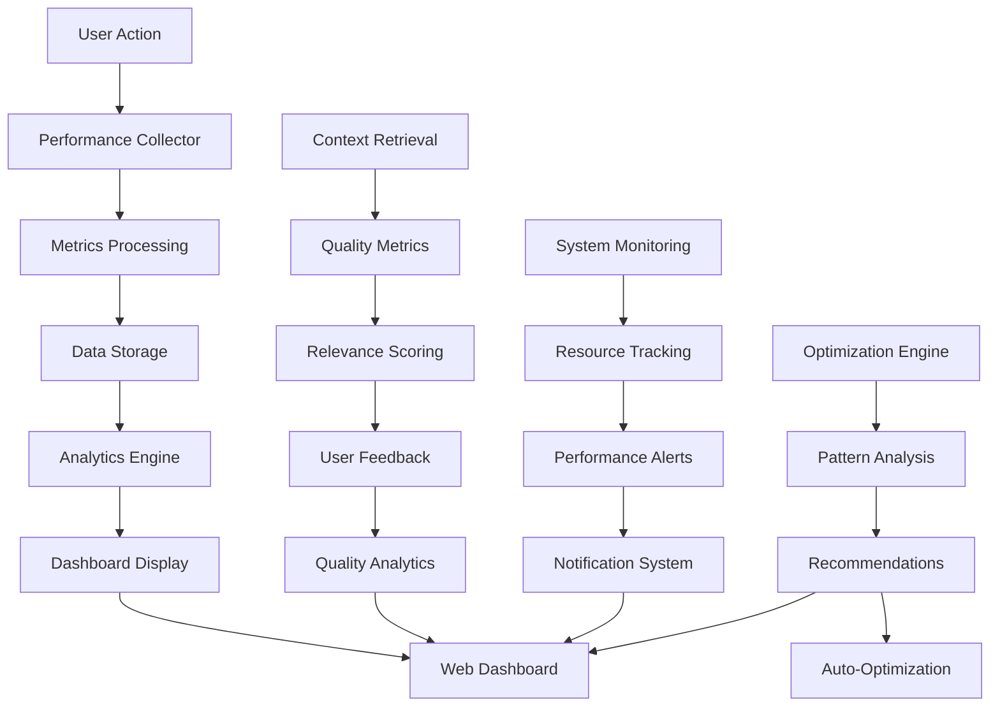

# Task: TASK-090 - Performance Monitoring & Analytics Dashboard

## Task Naming Convention
**Follow the TaskHero naming convention when creating tasks:**

**Format:** `TASK-XXX-[TYPE]-descriptive-name.md`

**Where:**
- **XXX** = Sequential number (001, 002, 003, etc.)
- **[TYPE]** = Task type abbreviation (must match metadata Task Type field)
- **descriptive-name** = Brief but clear description (use hyphens, no spaces)

**Task Type Abbreviations:**
- **DEV** = Development
- **BUG** = Bug Fix
- **TEST** = Test Case
- **DOC** = Documentation
- **DES** = Design
- **RES** = Research
- **PLAN** = Planning

**Examples:**
- `TASK-001-DEV-user-authentication.md`
- `TASK-002-BUG-login-validation-error.md`
- `TASK-003-TEST-payment-gateway.md`
- `TASK-004-DOC-api-documentation-update.md`
- `TASK-005-DES-dashboard-ui-redesign.md`

> **Important:** The task type abbreviation in the filename must match the Task Type field in the metadata section above.

## Metadata
- **Task ID:** TASK-090
- **Created:** 2025-01-29
- **Due:** 2025-02-07
- **Priority:** Medium
- **Status:** Todo
- **Assigned to:** Developer
- **Task Type:** Development
- **Sequence:** 90
- **Estimated Effort:** Medium (2-3 days)
- **Related Epic/Feature:** TaskHero AI Performance & Analytics
- **Tags:** performance-monitoring, analytics, dashboard, metrics, optimization

## 1. Overview
### 1.1. Brief Description
Implement comprehensive performance monitoring and analytics dashboard for TaskHero AI, including query performance tracking, context relevance scoring, relationship graph quality metrics, and optimization recommendations.

### 1.2. Functional Requirements
- **Performance Monitoring**: Track query response times, context retrieval performance, and system resource usage
- **Analytics Dashboard**: Web-based dashboard showing performance trends, usage statistics, and quality metrics
- **Context Quality Metrics**: Measure context relevance accuracy, user satisfaction, and selection patterns
- **Relationship Graph Analytics**: Analyze graph quality, relationship accuracy, and discovery effectiveness
- **Optimization Recommendations**: AI-powered suggestions for performance improvements
- **Historical Trending**: Track performance changes over time with trend analysis
- **Alert System**: Notifications for performance degradation or quality issues

### 1.3. Purpose & Benefits
- **Performance Optimization**: Identify bottlenecks and optimization opportunities
- **Quality Assurance**: Monitor context retrieval quality and user satisfaction
- **Data-Driven Decisions**: Make informed decisions based on usage analytics
- **Proactive Monitoring**: Detect issues before they impact user experience
- **Continuous Improvement**: Track improvements and measure success of optimizations

### 1.4. Success Criteria
- [ ] Performance monitoring system tracks all key metrics
- [ ] Analytics dashboard displays real-time and historical data
- [ ] Context quality metrics show relevance accuracy >85%
- [ ] Relationship graph analytics provide actionable insights
- [ ] Optimization recommendations improve performance by >20%
- [ ] Alert system detects performance issues within 5 minutes
- [ ] Historical trending shows clear performance patterns
- [ ] Dashboard is accessible via web interface
- [ ] All metrics are exportable for external analysis
- [ ] System overhead is <5% of total processing time

## 2. Flow Diagram


## 3. Implementation Plan

### Phase 1: Performance Monitoring Infrastructure - Estimated: 1 day
- **Files**: `mods/monitoring/performance_monitor.py`, `mods/monitoring/metrics_collector.py`
- **Tasks**:
  - Create performance monitoring framework
  - Implement metrics collection for query times, context retrieval, and system resources
  - Add performance decorators for key functions
  - Create data storage system for metrics

### Phase 2: Analytics Dashboard Development - Estimated: 1 day
- **Files**: `mods/monitoring/dashboard.py`, `templates/dashboard.html`, `static/dashboard.js`
- **Tasks**:
  - Build web-based analytics dashboard using Flask
  - Create real-time performance charts and graphs
  - Implement historical trending visualization
  - Add interactive filtering and drill-down capabilities

### Phase 3: Quality Metrics & Optimization - Estimated: 1 day
- **Files**: `mods/monitoring/quality_analyzer.py`, `mods/monitoring/optimizer.py`
- **Tasks**:
  - Implement context quality measurement system
  - Create relationship graph quality analytics
  - Build optimization recommendation engine
  - Add automated performance tuning capabilities

## 4. Technical Considerations

### 4.1. Architecture Changes
- **Monitoring Layer**: Add non-intrusive performance monitoring throughout the system
- **Analytics Engine**: Process and analyze collected metrics for insights
- **Dashboard Interface**: Web-based interface for viewing analytics and metrics
- **Storage System**: Efficient storage for time-series performance data

### 4.2. Dependencies
- **Flask**: For web dashboard interface
- **Chart.js**: For interactive charts and graphs
- **SQLite**: For metrics data storage
- **Threading**: For background monitoring and data collection

### 4.3. Performance Considerations
- **Low Overhead**: Monitoring should add <5% overhead to system performance
- **Asynchronous Collection**: Use background threads for data collection
- **Data Retention**: Implement data retention policies to manage storage
- **Efficient Queries**: Optimize dashboard queries for fast loading

### 4.4. Security Considerations
- **Access Control**: Secure dashboard access with authentication
- **Data Privacy**: Ensure sensitive data is not exposed in metrics
- **Network Security**: Secure dashboard communication with HTTPS

## 5. Implementation Details

### 5.1. Performance Monitoring Framework
```python
class PerformanceMonitor:
    def __init__(self):
        self.metrics_collector = MetricsCollector()
        self.storage = MetricsStorage()
        self.alert_system = AlertSystem()

    def track_query_performance(self, query: str, response_time: float,
                              context_count: int, quality_score: float):
        """Track query performance metrics."""
        metrics = {
            'timestamp': time.time(),
            'query': query,
            'response_time': response_time,
            'context_count': context_count,
            'quality_score': quality_score,
            'memory_usage': self._get_memory_usage(),
            'cpu_usage': self._get_cpu_usage()
        }

        self.storage.store_metrics(metrics)
        self._check_performance_thresholds(metrics)

    def performance_decorator(self, func_name: str):
        """Decorator for automatic performance tracking."""
        def decorator(func):
            def wrapper(*args, **kwargs):
                start_time = time.time()
                try:
                    result = func(*args, **kwargs)
                    success = True
                    error = None
                except Exception as e:
                    result = None
                    success = False
                    error = str(e)
                    raise
                finally:
                    end_time = time.time()
                    self.track_function_performance(
                        func_name, end_time - start_time, success, error
                    )
                return result
            return wrapper
        return decorator
```

### 5.2. Analytics Dashboard
```python
from flask import Flask, render_template, jsonify
import json

class AnalyticsDashboard:
    def __init__(self, metrics_storage):
        self.app = Flask(__name__)
        self.storage = metrics_storage
        self._setup_routes()

    def _setup_routes(self):
        @self.app.route('/dashboard')
        def dashboard():
            return render_template('dashboard.html')

        @self.app.route('/api/performance-metrics')
        def performance_metrics():
            metrics = self.storage.get_recent_metrics(hours=24)
            return jsonify({
                'query_times': self._format_query_times(metrics),
                'context_quality': self._format_quality_metrics(metrics),
                'system_resources': self._format_resource_metrics(metrics)
            })

        @self.app.route('/api/optimization-recommendations')
        def optimization_recommendations():
            recommendations = self._generate_recommendations()
            return jsonify(recommendations)

    def run(self, host='localhost', port=5001):
        """Start the analytics dashboard server."""
        self.app.run(host=host, port=port, debug=False)
```

### 5.3. Quality Metrics System
```python
class QualityAnalyzer:
    def __init__(self):
        self.relevance_tracker = RelevanceTracker()
        self.user_feedback = UserFeedbackCollector()

    def analyze_context_quality(self, query: str, selected_context: List[ContextChunk],
                              user_selection: List[int]) -> Dict[str, float]:
        """Analyze the quality of context retrieval."""
        metrics = {
            'relevance_accuracy': self._calculate_relevance_accuracy(
                selected_context, user_selection
            ),
            'selection_efficiency': self._calculate_selection_efficiency(
                len(selected_context), len(user_selection)
            ),
            'diversity_score': self._calculate_context_diversity(selected_context),
            'coverage_score': self._calculate_query_coverage(query, selected_context)
        }

        return metrics

    def _calculate_relevance_accuracy(self, context: List[ContextChunk],
                                    user_selection: List[int]) -> float:
        """Calculate how well the relevance scores match user selection."""
        if not user_selection:
            return 0.0

        # Sort context by relevance score
        sorted_context = sorted(enumerate(context),
                              key=lambda x: x[1].relevance_score, reverse=True)

        # Calculate how many top-scored items were actually selected
        top_indices = [i for i, _ in sorted_context[:len(user_selection)]]
        matches = len(set(top_indices) & set(user_selection))

        return matches / len(user_selection)

### 5.4. Optimization Recommendation Engine
```python
class OptimizationEngine:
    def __init__(self, metrics_storage):
        self.storage = metrics_storage
        self.patterns = PatternAnalyzer()

    def generate_recommendations(self) -> List[Dict[str, Any]]:
        """Generate optimization recommendations based on performance data."""
        recommendations = []

        # Analyze query performance patterns
        slow_queries = self._identify_slow_queries()
        if slow_queries:
            recommendations.append({
                'type': 'performance',
                'priority': 'high',
                'title': 'Optimize Slow Queries',
                'description': f'Found {len(slow_queries)} queries with >2s response time',
                'action': 'Consider caching or query optimization',
                'impact': 'High - Improves user experience'
            })

        # Analyze context quality patterns
        low_quality_contexts = self._identify_low_quality_contexts()
        if low_quality_contexts:
            recommendations.append({
                'type': 'quality',
                'priority': 'medium',
                'title': 'Improve Context Relevance',
                'description': f'Context quality below 80% for {len(low_quality_contexts)} queries',
                'action': 'Review relevance scoring algorithm',
                'impact': 'Medium - Better context selection'
            })

        return recommendations

## 6. Testing Strategy
- **Unit Tests**: Test each monitoring component independently
- **Integration Tests**: Test dashboard with real performance data
- **Load Tests**: Verify monitoring overhead is minimal under load
- **UI Tests**: Test dashboard interface and user interactions
- **Performance Tests**: Measure monitoring system performance impact
- **Data Integrity Tests**: Verify metrics accuracy and consistency

## 7. Risks and Mitigations
- **Risk**: Monitoring adds significant performance overhead
  **Mitigation**: Use asynchronous collection and efficient data structures

- **Risk**: Dashboard becomes slow with large amounts of data
  **Mitigation**: Implement data aggregation and pagination

- **Risk**: Metrics storage grows too large
  **Mitigation**: Implement data retention policies and archiving

- **Risk**: False alerts from monitoring system
  **Mitigation**: Implement smart thresholds and alert filtering

## 8. Dependencies
- TASK-045-DEV-graphiti-integration-for-task-creation.md (Completed)
- TASK-087-DEV-enhanced-context-preview-ui-for-task-creation.md (Completed)
- TASK-089-DEV-enhanced-metadata-integration-for-context-retrieval.md (Pending)
- Flask web framework for dashboard
- Chart.js for data visualization

## 9. Acceptance Criteria
- [ ] Performance monitoring tracks all key system metrics
- [ ] Analytics dashboard displays real-time and historical data
- [ ] Context quality metrics achieve >85% relevance accuracy
- [ ] Optimization recommendations provide actionable insights
- [ ] Alert system detects performance issues within 5 minutes
- [ ] Dashboard loads in <3 seconds with 30 days of data
- [ ] Monitoring overhead is <5% of total system performance
- [ ] All metrics are exportable in JSON/CSV format
- [ ] Dashboard is responsive and works on mobile devices
- [ ] System provides automated optimization suggestions

## 10. Future Enhancements
- **Machine Learning Analytics**: Use ML for predictive performance analysis
- **Advanced Visualizations**: 3D graphs and interactive relationship maps
- **Custom Dashboards**: User-configurable dashboard layouts
- **API Integration**: REST API for external monitoring tools
- **Real-time Collaboration**: Multi-user dashboard with real-time updates

---
*Generated by TaskHero AI Template Engine on 2025-01-29*
```
