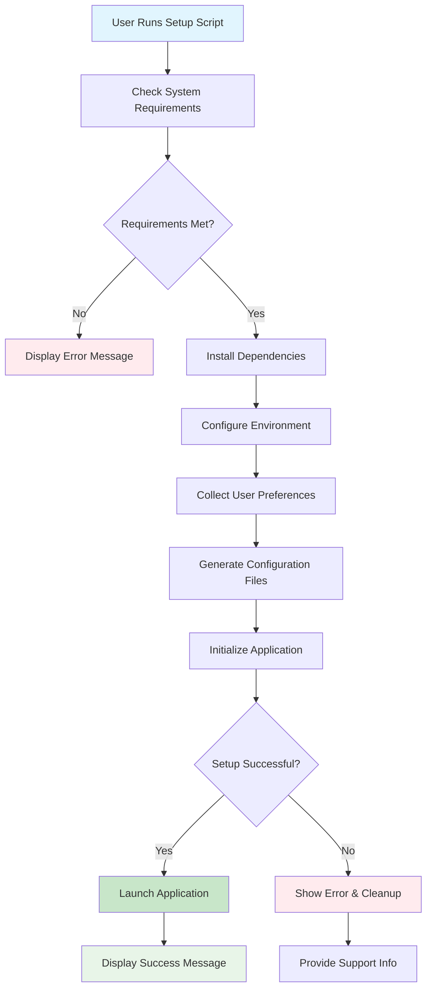

# enhance install script for taskhero ai #20

## Metadata
- **Task ID:** TASK-074
- **Created:** 2025-05-26
- **Due:** 2025-05-29
- **Priority:** Medium
- **Status:** Todo
- **Assigned to:** Developer
- **Task Type:** Development
- **Sequence:** 74
- **Estimated Effort:** Small
- **Related Epic/Feature:** TaskHero AI Project
- **Tags:** install script, initial setup, initial settings

## 1. Overview
### 1.1. Brief Description
## Development Task: Enhance TaskHero AI Installation Script (Windows)
**Task ID:** #20
**Task Title:** Enhance Install Script for TaskHero AI
### 1. Overview and Objectives
This task aims to...

### 1.2. Functional Requirements
['Here are 8 specific, measurable functional requirements for enhancing the `setup_windows.bat` script:', 'The script SHALL present a clear, multi-stage installation process to the user, starting with package installation, followed by configuration questions, and finally application launch.', 'The script SHALL automatically detect and skip configuration questions for which valid settings already exist in `app_settings.json` and the environment, proceeding directly to application launch if all settings are complete.', 'The script SHALL prompt the user for the "central repo or singular" choice, storing the boolean outcome in `app_settings.json` (e.g., `is_central_repo: true/false`).', 'The script SHALL prompt the user for the "path of the codebase to index," validating that the provided path exists and storing it in `app_settings.json` (e.g., `codebase_path: "C:\\Projects\\MyCode"`).', 'The script SHALL offer two distinct options for "project tasks files storage" (default present folder or `/taskherofiles` in root), validating the user\'s choice and storing the resolved absolute path in `app_settings.json` (e.g., `task_storage_path: "C:\\TaskHeroFiles"`).', 'The script SHALL prompt the user for whether "TaskHero API and MCP functions would be used," and if affirmed, subsequently prompt for API details (e.g., API keys, endpoints), storing these securely as environment variables.', 'The script SHALL, upon successful completion of all configuration steps, automatically initiate the `app.py` file to run TaskHero AI, displaying a success message to the user.']

### 1.3. Purpose & Benefits
This task enhances the TaskHero AI system by implementing enhance install script for taskhero ai #20.

### 1.4. Success Criteria
- [ ] Installation script runs successfully on target platforms
- [ ] User configuration is properly collected and validated
- [ ] Settings are correctly stored in configuration files
- [ ] Application starts successfully after setup

## 2. Flow Diagram
**Task flow diagram:**



Task Flow Diagram

## 3. Implementation Status

### 3.1. Implementation Steps
- [ ] **Step 1: Requirements Analysis** - Status: ⏳ Pending - Target: 2025-05-29
- [ ] Sub-step 1: Review requirements and specifications
- [ ] Sub-step 2: Identify key stakeholders and dependencies
- [ ] Sub-step 3: Define acceptance criteria
- [ ] **Step 2: Implementation** - Status: ⏳ Pending - Target: 2025-05-29
- [ ] Sub-step 1: Implement core functionality
- [ ] Sub-step 2: Add error handling and validation
- [ ] Sub-step 3: Write unit tests

## 4. Detailed Description
## Development Task: Enhance TaskHero AI Installation Script (Windows)
**Task ID:** #20
**Task Title:** Enhance Install Script for TaskHero AI
### 1. Overview and Objectives
This task aims to significantly enhance the user experience of installing and configuring TaskHero AI on Windows systems. The current `setup_windows.bat` script is functional but lacks user guidance, clear progress indication, and a structured configuration flow. The primary objective is to transform this script into an elegant, informative, and interactive installer that guides the user through the initial setup, collects essential configuration parameters, and seamlessly launches the TaskHero AI application.
**Key Objectives:**
*   **Improved User Experience:** Provide clear, step-by-step instructions, visual feedback, and intuitive prompts.
*   **Modularized Installation:** Divide the installation process into logical, user-friendly sections.
*   **Guided Configuration:** Interactively collect critical application settings from the user.
*   **Persistent Configuration:** Store user-provided settings appropriately (JSON for app settings, ENV for API settings).
*   **Idempotent Execution:** Allow subsequent runs of the script to skip already completed setup steps and directly launch the application.
*   **Robustness:** Incorporate error handling and validation where appropriate.
### 2. Technical Context
The existing installation mechanism for TaskHero AI on Windows primarily relies on `setup_windows.bat`. This script handles basic environment checks (Python version), virtual environment creation, package installation, and some rudimentary configuration prompts. There's also a `setup_windows.ps1` script, indicating a potential future shift or alternative for PowerShell users, but this task focuses specifically on enhancing the `.bat` script.
**Relevant Existing Files:**
*   `setup_windows.bat`: The primary script to be enhanced. It currently performs:
    *   Python version checks (e.g., `if !MAJOR! equ 3 (if !MINOR! lss 11 (...)`)
    *   Virtual environment creation.
    *   `pip install -r requirements.txt`.
    *   Basic prompts for `STORAGE_CHOICE` (e.g., `if "!STORAGE_CHOICE!"=="1" (...)`).
    *   Continues/exits based on user input (e.g., `set /p CONTINUE="Do you want to continue anyway? (Y/N): "`).
*   `app_settings.json`: This file is expected to store general application settings.
*   `.env` (or similar environment file): This file is expected to store sensitive API-related settings.
*   `app.py`: The main TaskHero AI application entry point, to be launched after successful setup.
**Current Limitations:**
*   Lack of clear separation between setup phases.
*   Limited user interaction and feedback during configuration.
*   Configuration parameters are not persistently stored in a structured manner.
*   No mechanism for skipping already completed setup steps.
### 3. Key Implementation Considerations
The enhancement of `setup_windows.bat` requires a structured approach to user interaction and configuration management.
**3.1. Script Structure and Flow:**
The enhanced `setup_windows.bat` should follow these logical phases:
1.  **Initial Checks & Welcome:**
    *   Display a clear welcome message for TaskHero AI.
    *   Perform existing Python version checks. If checks fail, provide informative messages and options to continue/exit.
    *   Check for the existence of a `.taskhero_setup_complete` (or similar) marker file/registry key. If found, skip directly to virtual environment activation and `app.py` launch (see Idempotency).
2.  **Dependency Installation Phase:**
    *   Clearly indicate "Installing Dependencies..."
    *   Create/activate the Python virtual environment.
    *   Run `pip install -r requirements.txt`.
    *   Provide progress/success feedback.
3.  **Configuration Phase (Interactive Prompts):**
    *   Introduce this phase as "TaskHero AI Configuration."
    *   **Question 1: Codebase Repository Type:**
        *   Prompt: "Will TaskHero AI be a central repository for multiple codebases, or will it reside within a single codebase?"
        *   Options: `1. Central Repo (indexes multiple codebases)` / `2. Singular (resides within one codebase)`
        *   Store choice in `app_settings.json` (e.g., `repo_type: "central"` or `"singular"`).
    *   **Question 2: Codebase Path to Index:**
        *   Prompt: "Please provide the absolute path to the codebase TaskHero AI will primarily index."
        *   Allow user to input path.
        *   Validate path existence/accessibility if possible.
        *   Store path in `app_settings.json` (e.g., `indexed_codebase_path`).
    *   **Question 3: Project Tasks Files Storage:**
        *   Prompt: "Where should TaskHero AI store its project task files?"
        *   Options: `1. Current folder (where this script is run)` / `2. In a subfolder named 'taskherofiles' within the current folder`
        *   Default: Option 2 might be a good default.
        *   Store choice/resolved path in `app_settings.json` (e.g., `task_storage_path`).
        *   *Leverage existing `STORAGE_CHOICE` logic but enhance the prompt.*
    *   **Question 4: API & MCP Functions Usage:**
        *   Prompt: "Will TaskHero AI API and MCP (Model Control Plane) functions be used?"
        *   Options: `Y/N`
        *   If 'N', skip Question 5.
        *   Store choice in `app_settings.json` (e.g., `api_enabled: true/false`).
    *   **Question 5: API Details (Conditional):**
        *   If API/MCP is enabled:
            *   Prompt: "Please provide API details for models and functions required by TaskHero AI."
            *   This is a critical section. Consider prompts for:
                *   OpenAI API Key (or similar LLM provider)
                *   Any other specific API endpoints/keys.
            *   **Crucially, these sensitive details MUST be stored in the `.env` file.**
            *   Provide clear instructions on how to obtain these keys.
4.  **Configuration Saving:**
    *   After all questions are answered, write/update `app_settings.json` with the collected app settings.
    *   Write/update `.env` with collected API settings.
    *   Provide success message: "Configuration saved successfully."
5.  **Finalization & Launch:**
    *   Create the `.taskhero_setup_complete` marker file/registry key to indicate successful initial setup.
    *   Activate the virtual environment.
    *   Launch `app.py` (e.g., `python app.py`).
    *   Provide a clear message indicating TaskHero AI is starting.
**3.2. Idempotency:**
*   Introduce a mechanism to detect if the initial setup has already been completed. This could be:
    *   A specific file (e.g., `.taskhero_setup_complete`) in the script's directory.
    *   A registry key (less portable for simple `.bat` scripts, but an option).
*   If the marker is found, the script should:
    *   Display a message like "TaskHero AI setup detected. Skipping configuration and launching application."
    *   Activate the virtual environment.
    *   Directly execute `python app.py`.
**3.3. User Interface & Feedback:**
*   Use `echo` for clear messages.
*   Utilize `set /p` for interactive prompts.
*   Implement basic input validation (e.g., for paths, Y/N).
*   Consider using simple ASCII art or separators for visual appeal.
*   Provide success/failure messages for each major step.
**3.4. Configuration Storage:**
*   **`app_settings.json`:**
    *   This file will store general application settings (e.g., `repo_type`, `indexed_codebase_path`, `task_storage_path`, `api_enabled`).
    *   The `setup_windows.bat` script will need to dynamically create/update this JSON file. This can be challenging with pure batch scripting.
    *   **Consideration:** It might be necessary to have a small Python helper script (`config_writer.py`) that the `.bat` script calls, passing parameters, to handle robust JSON writing. This is generally preferred over complex string manipulation in `.bat`.
*   **`.env`:**
    *   This file will store sensitive API keys and other environment variables (e.g., `OPENAI_API_KEY`).
    *   Batch scripting can easily append/write to `.env` files. Ensure proper escaping for values.
**3.5. Error Handling:**
*   Implement basic error checks (e.g., if `pip install` fails).


## 5. UI Design & Specifications
### 5.1. Design Overview
[Brief description of the UI changes and design goals]

### 5.2. Wireframes & Layout
**Use ASCII art for layouts, wireframes, and component positioning:**

```
╔═══════════════════════════════════════════════════════════════╗
║                        Task Progress                          ║
╠═══════════════════════════════════════════════════════════════╣
║ Phase 1: Analysis     [████████░░] 80%       ║
║ Phase 2: Development  [██████░░░░] 60%       ║
║ Phase 3: Testing      [███░░░░░░░] 30%       ║
║ Phase 4: Deployment   [░░░░░░░░░░] 0%       ║
╚═══════════════════════════════════════════════════════════════╝
```

### 5.3. Design System References
- **Colors:** [Primary: #color, Secondary: #color, etc.]
- **Typography:** [Font family, sizes, weights]
- **Spacing:** [Padding/margin standards]
- **Components:** [shadcn/ui components used]
- **Icons:** [Icon library and specific icons]

### 5.4. Visual Design References
- [Link to Figma/Design file]
- [Link to existing similar components]
- [Screenshots or mockups if available]
## 6. Risk Assessment
### 6.1. Potential Risks
| Risk | Impact | Probability | Mitigation Strategy |
|------|--------|-------------|-------------------|
| The enhanced script relies heavily on user input for critical settings (repo type, paths, API details). If input validation is insufficient or buggy, users could enter invalid paths, malformed API keys, or incorrect choices, leading to script failure, misconfiguration, or security vulnerabilities (e.g., path traversal attempts if not sanitized). | High | Medium | Implement robust input validation for all user prompts. This includes: |
| The script needs to store user-provided settings in `app settings json` and API details in the `ENV file`. Errors in writing to these files (e.g., incorrect JSON formatting, overwriting existing critical data, permission issues, or race conditions if multiple instances try to run) could lead to a non-functional TaskHero AI or loss of previous configurations. | High | Medium | [Mitigation strategy] |
| The requirement states that "all settings which are already completed from the initial run would then be skipped when the script is run the next time." Implementing this logic incorrectly (e.g., not properly detecting a completed setup, skipping necessary updates, or misinterpreting partial setups) could lead to the script re-prompting users unnecessarily, failing to apply crucial updates, or entering an infinite loop of setup attempts. | Medium | Medium | [Mitigation strategy] |


## Testing
Testing will be handled in a separate task based on this task summary and requirements.


## Technical Considerations
- Cross-platform compatibility for installation scripts
- Error handling and recovery mechanisms
- User input validation and sanitization
- Configuration file management and validation


## Updates
- **2025-05-26** - Task created
---
*Generated by TaskHero AI Template Engine on 2025-05-26 07:33:46* 