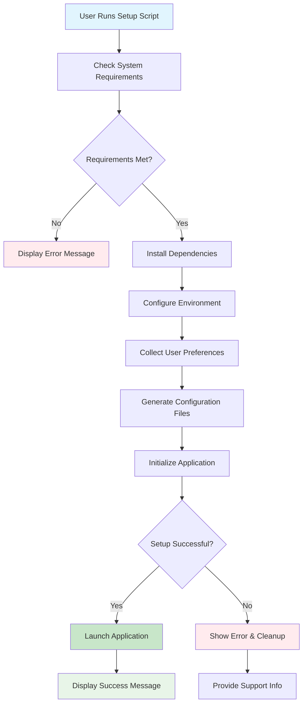

# enhance install script for taskhero ai #21

## Metadata
- **Task ID:** TASK-076
- **Created:** 2025-05-26
- **Due:** 2025-05-29
- **Priority:** Medium
- **Status:** Todo
- **Assigned to:** Developer
- **Task Type:** Development
- **Sequence:** 76
- **Estimated Effort:** Small
- **Related Epic/Feature:** TaskHero AI Project
- **Tags:** install script, initial setup, initial settings, development, coding, api, integration, ui

## 1. Overview
### 1.1. Brief Description
## Development Task: Enhance TaskHero AI Windows Installation Script (#21)
**Task Title:** Enhance TaskHero AI Windows Installation Script
**Original Description:** The existing `setup_windows.bat` file, which installs TaskHero AI and helps run the virtual environment with `app.py` in the end, needs an enhancement. I'd like to make it more informative and elegant for the user when the script is run. The script needs to be divided into parts. The first part would be to install the packages to set up the app requirements. Then would come the part about asking the user to answer questions like: 1. Will this be a central repo for all the different codebases, or will it be singular, as in residing into the existing codebase it is going to index? 2. The path of the codebase which TaskHero is going to attempt to index. 3. Path of the project tasks files storage: a. default present folder or b. in the root folder `/taskherofiles`. 4. Will TaskHero API and MCP functions be used? 5. API details for the models and functions required by TaskHero to function. All of these details can then be stored in the app settings JSON file which we have and API settings into the ENV file accordingly. Finally, to then initiate the run of the `app.py` file to run TaskHero. All settings which are already completed from the initial run would then be skipped when the script is run the next time to go directly to the app run.
### 1. Overview and Objectives
This task aims to significantly enhance the user experience and functionality of the TaskHero AI Windows installation process. The current `setup_windows.bat` script is rudimentary and lacks user guidance and configuration flexibility. The primary objective is to transform this into a more robust, interactive, and intelligent installer that guides the user through essential setup steps, captures critical configuration details, persists these settings, and intelligently skips already configured steps on subsequent runs.
**Key Objectives:**
*   **Improved User Experience:** Provide clear, informative prompts and feedback throughout the installation process.
*   **Guided Configuration:** Interactively collect essential TaskHero AI operational parameters from the user.
*   **Persistent Settings:** Store user-defined configurations in appropriate files (`app_settings.json`, `.env`).
*   **Idempotent Execution:** Ensure the script can be run multiple times without re-prompting for already configured settings, directly launching TaskHero AI when fully configured.
*   **Modular Design:** Structure the installation flow into logical, distinct phases (prerequisites, configuration, launch).
*   **Robustness:** Incorporate basic error handling and validation for user inputs.
### 2. Technical Context
The current installation process relies on `setup_windows.bat`. The existing snippets indicate:
*   **Conditional Logic:** The script already uses `if/else if` constructs for basic choices (e.g., `STORAGE_CHOICE`). This pattern can be extended for more complex configuration.
*   **User Input:** The `set /p` command is used to prompt for user input (e.g., `CONTINUE`). This will be central to the interactive configuration phase.
*   **Python Version Check:** There's an existing check for Python version (`!MAJOR! equ 3` and `!MINOR! lss 11`). This indicates a dependency on a specific Python environment, which should be handled as part of the prerequisite installation.
*   **PowerShell Alternative:** The presence of `setup_windows.ps1` suggests an exploration into PowerShell for more advanced scripting capabilities. While the initial request focuses on enhancing the `.bat` file, consideration should be given to whether PowerShell might offer a more maintainable and powerful solution for the long term, or if a hybrid approach is feasible. For this task, the primary focus remains on enhancing the `.bat` file as requested, but the developer should be aware of `setup_windows.ps1`'s existence.
**Existing Configuration Files:**
*   `app_settings.json`: This file is intended to store general application settings. User inputs like codebase path, storage path, and central/singular repo choice should be stored here.
*   `.env`: This file is typically used for environment variables, especially sensitive ones like API keys or model details. API-related configurations should be stored here.
### 3. Key Implementation Considerations
**3.1. Phased Installation Flow:**
The script should be structured into distinct, sequential phases:
*   **Phase 1: Prerequisites Check & Installation:**
    *   Verify Python installation (version 3.11+). If not present, guide the user to install it or offer to install it (e.g., using `winget` or direct download if possible).
    *   Verify `pip` is available.
    *   Verify `venv` module is available.
    *   Create and activate a Python virtual environment (e.g., `.\venv`).
    *   Install all required Python packages from `requirements.txt` into the virtual environment. Provide clear progress feedback.
*   **Phase 2: Interactive Configuration:**
    *   **Conditional Prompting:** Before prompting for any setting, check if the setting is already present in `app_settings.json` or `.env`. If found, display the current value and skip prompting, moving to the next unconfigured setting.
    *   **User Prompts (in order):**
        1.  **Repository Mode:** "Will TaskHero AI operate as a central repository for multiple codebases (Y) or index a singular, existing codebase (N)? [Y/N]"
            *   *Storage:* `app_settings.json -> "repo_mode"` (e.g., "central", "singular")
        2.  **Codebase Path:** "Enter the absolute path to the codebase TaskHero AI will index (e.g., C:\Projects\MyRepo):"
            *   *Validation:* Check if path exists and is accessible.
            *   *Storage:* `app_settings.json -> "codebase_path"`
        3.  **Task Storage Location:** "Where should TaskHero AI store its project task files? (1) Current directory (.\) or (2) A new 'taskherofiles' folder in the root of the TaskHero AI installation? [1/2]"
            *   *Default:* `1` (current directory)
            *   *Storage:* `app_settings.json -> "task_storage_path"` (resolved absolute path)
        4.  **API/MCP Usage:** "Will you be using TaskHero AI's API and MCP (Model Control Plane) functions? [Y/N]"
            *   *Storage:* `app_settings.json -> "use_api_mcp"` (boolean)
        5.  **API Details (Conditional):** If "API/MCP Usage" is 'Y':
            *   "Enter your OpenAI API Key:" (or similar model provider key)
            *   *Storage:* `.env -> OPENAI_API_KEY` (or relevant key name)
            *   "Enter your desired AI model name (e.g., gpt-4o, claude-3-opus-20240229):"
            *   *Storage:* `.env -> AI_MODEL_NAME`
            *   "Enter any other required API parameters (e.g., endpoint URL, project ID). Press Enter to skip:" (allow for a free-form input or additional prompts if specific APIs are known)
            *   *Storage:* `.env` (parse and add as new key-value pairs)
*   **Phase 3: Configuration Persistence:**
    *   Dynamically update `app_settings.json` with gathered configuration. This will require careful handling of JSON structure from a batch script (potentially using a helper Python script invoked by the batch).
    *   Dynamically update `.env` with API details.
*   **Phase 4: Application Launch:**
    *   Activate the virtual environment.
    *   Execute `python app.py`.
**3.2. Scripting Language Choice:**
*   **Batch (`.bat`):** While requested, batch scripting has limitations for complex logic, string manipulation, and JSON/ENV file parsing. It will likely require calling external tools or helper Python scripts for robust JSON/ENV manipulation.
*   **PowerShell (`.ps1`):** PowerShell is significantly more powerful for these tasks (JSON parsing, environment variables, robust file operations, user interaction). The existing `setup_windows.ps1` suggests this is already an option. **Recommendation:** Although the task specifies enhancing `.bat`, the developer should seriously consider if the complexity warrants a transition to or leveraging of PowerShell for the configuration persistence logic. If sticking to `.bat`, acknowledge the overhead of external calls. For example, a small Python script could be written to read/write JSON and ENV files, which the `.bat` script then calls.
**3.3. Error Handling and User Feedback:**
*   Provide clear `[SUCCESS]` and `[FAILURE]` messages for each step (e.g., "Installing packages...", "Virtual environment created successfully.").
*   Implement basic input validation (e.g., path existence, Y/N prompts).
*   Graceful exit on critical errors.
**3.4.

### 1.2. Functional Requirements
- The `setup_windows.bat` script SHALL be refactored into distinct, labeled sections: "Dependency Installation," "Configuration Setup," and "Application Launch," with clear console output indicating progress for each section.
- The "Configuration Setup" section SHALL interactively prompt the user for the following inputs: "Central Repo (Y/N)," "Codebase Path," "Task Storage Path (Default/Custom)," and "API/MCP Usage (Y/N)," validating each input for correct format or allowed values before proceeding.
- If "API/MCP Usage (Y/N)" is 'Y', the script SHALL additionally prompt for "API Details" and "Model/Function Details," storing these securely in an environment variable (ENV file) and `app_settings.json` respectively.
- Upon successful configuration, the script SHALL persist all user-provided settings (excluding sensitive API details) into the `app_settings.json` file, and API details into an environment variable or `.env` file, ensuring subsequent runs skip configuration if these settings are detected.
- The script SHALL implement robust error handling for each stage, including dependency installation failures, invalid user inputs, and file write errors, providing informative messages and options to retry or exit gracefully (e.g., "Do you want to continue anyway? (Y/N)").
- The script SHALL automatically detect and utilize existing `app_settings.json` and `.env` files from previous successful runs, bypassing the configuration prompts and proceeding directly to the "Application Launch" section, unless a `--force` or similar flag is provided.
- The final "Application Launch" section SHALL execute `app.py` only after all preceding configuration steps are successfully completed and settings are persisted, providing a clear confirmation message to the user that TaskHero AI is starting.

### 1.3. Purpose & Benefits
This task enhances the TaskHero AI system by implementing enhance install script for taskhero ai #21.

### 1.4. Success Criteria
- [ ] Installation script runs successfully on target platforms
- [ ] User configuration is properly collected and validated
- [ ] Settings are correctly stored in configuration files
- [ ] Application starts successfully after setup

## 2. Flow Diagram
**Task flow diagram:**



Task Flow Diagram

## 3. Implementation Status

### 3.1. Implementation Steps
- [ ] **Step 1: Requirements Analysis** - Status: ⏳ Pending - Target: 2025-05-29
- [ ] Sub-step 1: Review requirements and specifications
- [ ] Sub-step 2: Identify key stakeholders and dependencies
- [ ] Sub-step 3: Define acceptance criteria
- [ ] **Step 2: Implementation** - Status: ⏳ Pending - Target: 2025-05-29
- [ ] Sub-step 1: Implement core functionality
- [ ] Sub-step 2: Add error handling and validation
- [ ] Sub-step 3: Write unit tests

## 4. Detailed Description
## Development Task: Enhance TaskHero AI Windows Installation Script (#21)
**Task Title:** Enhance TaskHero AI Windows Installation Script
**Original Description:** The existing `setup_windows.bat` file, which installs TaskHero AI and helps run the virtual environment with `app.py` in the end, needs an enhancement. I'd like to make it more informative and elegant for the user when the script is run. The script needs to be divided into parts. The first part would be to install the packages to set up the app requirements. Then would come the part about asking the user to answer questions like: 1. Will this be a central repo for all the different codebases, or will it be singular, as in residing into the existing codebase it is going to index? 2. The path of the codebase which TaskHero is going to attempt to index. 3. Path of the project tasks files storage: a. default present folder or b. in the root folder `/taskherofiles`. 4. Will TaskHero API and MCP functions be used? 5. API details for the models and functions required by TaskHero to function. All of these details can then be stored in the app settings JSON file which we have and API settings into the ENV file accordingly. Finally, to then initiate the run of the `app.py` file to run TaskHero. All settings which are already completed from the initial run would then be skipped when the script is run the next time to go directly to the app run.
### 1. Overview and Objectives
This task aims to significantly enhance the user experience and functionality of the TaskHero AI Windows installation process. The current `setup_windows.bat` script is rudimentary and lacks user guidance and configuration flexibility. The primary objective is to transform this into a more robust, interactive, and intelligent installer that guides the user through essential setup steps, captures critical configuration details, persists these settings, and intelligently skips already configured steps on subsequent runs.
**Key Objectives:**
*   **Improved User Experience:** Provide clear, informative prompts and feedback throughout the installation process.
*   **Guided Configuration:** Interactively collect essential TaskHero AI operational parameters from the user.
*   **Persistent Settings:** Store user-defined configurations in appropriate files (`app_settings.json`, `.env`).
*   **Idempotent Execution:** Ensure the script can be run multiple times without re-prompting for already configured settings, directly launching TaskHero AI when fully configured.
*   **Modular Design:** Structure the installation flow into logical, distinct phases (prerequisites, configuration, launch).
*   **Robustness:** Incorporate basic error handling and validation for user inputs.
### 2. Technical Context
The current installation process relies on `setup_windows.bat`. The existing snippets indicate:
*   **Conditional Logic:** The script already uses `if/else if` constructs for basic choices (e.g., `STORAGE_CHOICE`). This pattern can be extended for more complex configuration.
*   **User Input:** The `set /p` command is used to prompt for user input (e.g., `CONTINUE`). This will be central to the interactive configuration phase.
*   **Python Version Check:** There's an existing check for Python version (`!MAJOR! equ 3` and `!MINOR! lss 11`). This indicates a dependency on a specific Python environment, which should be handled as part of the prerequisite installation.
*   **PowerShell Alternative:** The presence of `setup_windows.ps1` suggests an exploration into PowerShell for more advanced scripting capabilities. While the initial request focuses on enhancing the `.bat` file, consideration should be given to whether PowerShell might offer a more maintainable and powerful solution for the long term, or if a hybrid approach is feasible. For this task, the primary focus remains on enhancing the `.bat` file as requested, but the developer should be aware of `setup_windows.ps1`'s existence.
**Existing Configuration Files:**
*   `app_settings.json`: This file is intended to store general application settings. User inputs like codebase path, storage path, and central/singular repo choice should be stored here.
*   `.env`: This file is typically used for environment variables, especially sensitive ones like API keys or model details. API-related configurations should be stored here.
### 3. Key Implementation Considerations
**3.1. Phased Installation Flow:**
The script should be structured into distinct, sequential phases:
*   **Phase 1: Prerequisites Check & Installation:**
    *   Verify Python installation (version 3.11+). If not present, guide the user to install it or offer to install it (e.g., using `winget` or direct download if possible).
    *   Verify `pip` is available.
    *   Verify `venv` module is available.
    *   Create and activate a Python virtual environment (e.g., `.\venv`).
    *   Install all required Python packages from `requirements.txt` into the virtual environment. Provide clear progress feedback.
*   **Phase 2: Interactive Configuration:**
    *   **Conditional Prompting:** Before prompting for any setting, check if the setting is already present in `app_settings.json` or `.env`. If found, display the current value and skip prompting, moving to the next unconfigured setting.
    *   **User Prompts (in order):**
        1.  **Repository Mode:** "Will TaskHero AI operate as a central repository for multiple codebases (Y) or index a singular, existing codebase (N)? [Y/N]"
            *   *Storage:* `app_settings.json -> "repo_mode"` (e.g., "central", "singular")
        2.  **Codebase Path:** "Enter the absolute path to the codebase TaskHero AI will index (e.g., C:\Projects\MyRepo):"
            *   *Validation:* Check if path exists and is accessible.
            *   *Storage:* `app_settings.json -> "codebase_path"`
        3.  **Task Storage Location:** "Where should TaskHero AI store its project task files? (1) Current directory (.\) or (2) A new 'taskherofiles' folder in the root of the TaskHero AI installation? [1/2]"
            *   *Default:* `1` (current directory)
            *   *Storage:* `app_settings.json -> "task_storage_path"` (resolved absolute path)
        4.  **API/MCP Usage:** "Will you be using TaskHero AI's API and MCP (Model Control Plane) functions? [Y/N]"
            *   *Storage:* `app_settings.json -> "use_api_mcp"` (boolean)
        5.  **API Details (Conditional):** If "API/MCP Usage" is 'Y':
            *   "Enter your OpenAI API Key:" (or similar model provider key)
            *   *Storage:* `.env -> OPENAI_API_KEY` (or relevant key name)
            *   "Enter your desired AI model name (e.g., gpt-4o, claude-3-opus-20240229):"
            *   *Storage:* `.env -> AI_MODEL_NAME`
            *   "Enter any other required API parameters (e.g., endpoint URL, project ID). Press Enter to skip:" (allow for a free-form input or additional prompts if specific APIs are known)
            *   *Storage:* `.env` (parse and add as new key-value pairs)
*   **Phase 3: Configuration Persistence:**
    *   Dynamically update `app_settings.json` with gathered configuration. This will require careful handling of JSON structure from a batch script (potentially using a helper Python script invoked by the batch).
    *   Dynamically update `.env` with API details.
*   **Phase 4: Application Launch:**
    *   Activate the virtual environment.
    *   Execute `python app.py`.
**3.2. Scripting Language Choice:**
*   **Batch (`.bat`):** While requested, batch scripting has limitations for complex logic, string manipulation, and JSON/ENV file parsing. It will likely require calling external tools or helper Python scripts for robust JSON/ENV manipulation.
*   **PowerShell (`.ps1`):** PowerShell is significantly more powerful for these tasks (JSON parsing, environment variables, robust file operations, user interaction). The existing `setup_windows.ps1` suggests this is already an option. **Recommendation:** Although the task specifies enhancing `.bat`, the developer should seriously consider if the complexity warrants a transition to or leveraging of PowerShell for the configuration persistence logic. If sticking to `.bat`, acknowledge the overhead of external calls. For example, a small Python script could be written to read/write JSON and ENV files, which the `.bat` script then calls.
**3.3. Error Handling and User Feedback:**
*   Provide clear `[SUCCESS]` and `[FAILURE]` messages for each step (e.g., "Installing packages...", "Virtual environment created successfully.").
*   Implement basic input validation (e.g., path existence, Y/N prompts).
*   Graceful exit on critical errors.
**3.4.


## 5. UI Design & Specifications
### 5.1. Design Overview
[Brief description of the UI changes and design goals]

### 5.2. Wireframes & Layout
**Use ASCII art for layouts, wireframes, and component positioning:**

```
╔═══════════════════════════════════════════════════════════════╗
║                        Task Progress                          ║
╠═══════════════════════════════════════════════════════════════╣
║ Phase 1: Analysis     [████████░░] 80%       ║
║ Phase 2: Development  [██████░░░░] 60%       ║
║ Phase 3: Testing      [███░░░░░░░] 30%       ║
║ Phase 4: Deployment   [░░░░░░░░░░] 0%       ║
╚═══════════════════════════════════════════════════════════════╝
```

### 5.3. Design System References
- **Colors:** [Primary: #color, Secondary: #color, etc.]
- **Typography:** [Font family, sizes, weights]
- **Spacing:** [Padding/margin standards]
- **Components:** [shadcn/ui components used]
- **Icons:** [Icon library and specific icons]

### 5.4. Visual Design References
- [Link to Figma/Design file]
- [Link to existing similar components]
- [Screenshots or mockups if available]
## 6. Risk Assessment
### 6.1. Potential Risks
| Risk | Impact | Probability | Mitigation Strategy |
|------|--------|-------------|-------------------|
| Technical complexity higher than estimated | Medium | Low | Break down into smaller tasks, seek technical review |
| Dependencies not available on time | High | Medium | Identify alternative approaches, communicate early with dependencies |


## Dependencies
### Required By This Task
- Environment setup (Windows)
- Base implementation
- Implementation completion


## Testing
Testing will be handled in a separate task based on this task summary and requirements.


## Technical Considerations
- Cross-platform compatibility for installation scripts
- Error handling and recovery mechanisms
- User input validation and sanitization
- Configuration file management and validation


## Updates
- **2025-05-26** - Task created
---
*Generated by TaskHero AI Template Engine on 2025-05-26 07:53:24* 