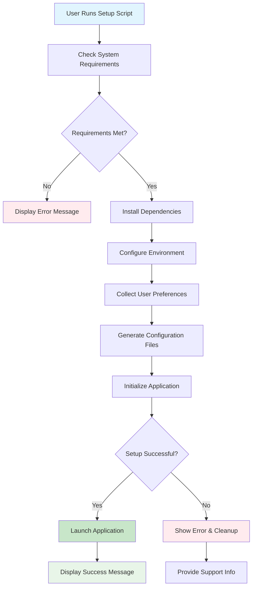

# enhance install script for taskhero ai #23

## Metadata
- **Task ID:** TASK-077
- **Created:** 2025-05-26
- **Due:** 2025-05-29
- **Priority:** Medium
- **Status:** Todo
- **Assigned to:** Developer
- **Task Type:** Development
- **Sequence:** 77
- **Estimated Effort:** Small
- **Related Epic/Feature:** TaskHero AI Project
- **Tags:** install script, initial setup, initial settings, development, coding, api, integration, ui

## 1. Overview
### 1.1. Brief Description
## Development Task: Enhance TaskHero AI Installation Script (Windows)
**Task ID:** #23
**Task Title:** Enhance Install Script for TaskHero AI
**Original Description (from Product Owner):**
"Existing `setup_windows.bat` file which installs TaskHero AI and helps run the virtual environment with running `app.py` in the end needs to go through an enhancement. I would like to make it more informative and elegant for the user when the script is run. The script needs to be divided into parts. First part would be to install the packages to setup the app requirements. Then would come the part about asking the user to answer questions like:
1. Will this be a central repo for all the different code bases? Or will it be singular as in residing into the existing code base it is going to index?
2. The path of the code base which TaskHero is going to attempt to index.
3. Path of the project tasks files storage: a. default present folder or b. in the root folder `/taskherofiles`.
4. Will TaskHero API and MCP functions would be used?
5. API details for the models and functions required by TaskHero to function.
All of these details can be then stored in the `app_settings.json` file which we have and API settings into the `ENV` file accordingly. Finally, to then initiate the run of the `app.py` file to run TaskHero. All settings which are already completed from the initial run would then be skipped when the script is run the next time to go directly to the app run."
### 1. Clear Overview and Objectives
This task aims to significantly improve the user experience of installing and configuring TaskHero AI on Windows systems. The current `setup_windows.bat` script is functional but lacks user guidance, modularity, and persistent configuration. The objective is to transform this into a robust, interactive, and intelligent installer that guides the user through the setup process, collects necessary configuration details, persists them, and intelligently skips already configured steps on subsequent runs. This will reduce friction for new users and streamline updates for existing ones.
**Key Objectives:**
*   **Enhanced User Experience:** Provide clear, step-by-step prompts, informative messages, and error handling.
*   **Modular Installation:** Separate dependency installation from application configuration.
*   **Interactive Configuration:** Guide users through critical setup questions.
*   **Persistent Configuration:** Store user inputs in `app_settings.json` and `.env` files.
*   **Intelligent Skipping:** Detect existing configurations and skip already completed steps on subsequent runs, directly launching `app.py`.
*   **Robustness:** Improve error handling and provide actionable feedback to the user.
### 2. Technical Context Based on the Codebase
The current installation logic resides primarily in `setup_windows.bat`. There's also a `setup_windows.ps1` script, indicating a potential future shift or a parallel PowerShell-based installer. For this task, the focus is on enhancing the `setup_windows.bat` script as per the original request, but consideration for potential overlap or migration to PowerShell for more advanced features should be kept in mind for future tasks.
**Relevant Code Snippets Analysis:**
*   **`setup_windows.bat` (current state):**
    *   `if "!STORAGE_CHOICE!"=="1" (...) else if "!STORAGE_CHOICE!"=="2" (...):` This snippet shows an existing pattern of user input for storage choices. This pattern can be extended for other configuration questions. It uses `set /p` for input, which is suitable for interactive prompts.
    *   `set /p CONTINUE="Do you want to continue anyway? (Y/N): " if /i "!CONTINUE!" neq "Y" exit /b 1:` This demonstrates basic interactive error handling and exit conditions. This needs to be expanded for more graceful error handling and informative messages.
    *   `if !MAJOR! equ 3 (if !MINOR! lss 11 (...)):` This indicates version checking for Python, a good practice that should be maintained and potentially enhanced with clearer instructions for the user if Python is not found or is an incorrect version.
*   **`app_settings.json` and `.env`:** These files are implicitly mentioned as the targets for storing configuration. The script will need to parse/modify these JSON and environment variable files. For `.env`, this typically involves writing key-value pairs directly. For `app_settings.json`, it will require robust JSON manipulation within the batch script context (or external tools if necessary, though direct batch file manipulation is preferred if feasible).
*   **Virtual Environment Management:** The script is expected to set up and activate a Python virtual environment. This typically involves commands like `python -m venv venv` and `.\venv\Scripts\activate.bat`.
*   **Dependency Installation:** `pip install -r requirements.txt` is the standard method for installing Python dependencies. The script should ensure `pip` is available and handle potential installation errors.
### 3. Key Implementation Considerations
*   **Scripting Language:** The primary language for this enhancement is **Batch Script (`.bat`)**. While PowerShell offers more advanced features, the request specifically refers to enhancing the existing `.bat` file. Complex JSON manipulation within batch might be challenging; consider utility tools or a hybrid approach if pure batch proves too cumbersome for JSON.
*   **Modularity:**
    *   **Phase 1: Pre-requisite Check & Dependency Installation:**
        *   Check for Python installation and version (>= 3.11). Provide clear instructions if not met.
        *   Create and activate a Python virtual environment.
        *   Install dependencies from `requirements.txt`. Implement robust error handling for pip installations.
    *   **Phase 2: Interactive Configuration:**
        *   Present each configuration question clearly.
        *   Validate user input where applicable (e.g., path existence, valid choices).
        *   Store inputs:
            *   **`app_settings.json`:**
                *   "Central Repo/Singular Codebase" choice.
                *   "Codebase Path for Indexing".
                *   "Project Tasks Storage Path".
                *   Potentially a flag indicating initial setup completion.
            *   **`.env`:**
                *   "TaskHero API/MCP Usage" flag.
                *   API details (keys, endpoints, etc.) as environment variables.
        *   **JSON Manipulation:** This is a critical technical challenge for batch scripts.
            *   **Option A (Preferred if feasible):** Direct manipulation using `for /f` and `findstr` to read and `echo` to write, potentially requiring careful string parsing and reconstruction. This can be brittle.
            *   **Option B (Alternative):** Use a small, self-contained Python script embedded or called by the batch file to handle JSON updates. This would simplify JSON parsing and writing significantly. The Python script could take parameters from the batch file and return status.
            *   **Option C (Less Preferred):** Rely on external command-line JSON processors (e.g., `jq`), but this adds an external dependency that would need to be bundled or installed.
    *   **Phase 3: Application Launch:**
        *   Activate the virtual environment.
        *   Launch `app.py`.
*   **Persistence and Skipping Logic:**
    *   Introduce a mechanism (e.g., a flag in `app_settings.json` or a separate marker file) to indicate that the initial setup has been completed.
    *   On subsequent runs, check this flag. If set, skip directly to the `app.py` launch after activating the virtual environment.
    *   If any critical configuration (e.g., codebase path) is missing or invalid, prompt the user to re-configure.
*   **User Interface/Experience:**
    *   Use `echo` commands for clear headings, instructions, and progress messages.
    *   Employ `set /p` for interactive input.
    *   Provide default options where sensible (e.g., for storage path).
    *   Implement basic input validation (e.g., checking if a provided path exists using `if exist`).
    *   Provide clear success/failure messages.
*   **Error Handling:**
    *   Check return codes of commands (`if %errorlevel% neq 0`).
    *   Provide informative error messages.
    *   Guide the user on how to resolve issues (e.g., "Python not found, please install Python 3.11+").
    *   Consider a "force reconfigure" option for developers.
*   **Environment Variables:** Ensure sensitive API keys are correctly stored in the `.env` file and not directly in `app_settings.json`.
### 4. Expected Deliverables
*   **Modified `setup_windows.bat` script:**
    *   Clearly segmented into "Dependency Installation," "Configuration," and "Application Launch" phases.
    *   Interactive prompts for all required configuration questions.
    *   Logic to read/write to `app_settings.json` and `.env` files.
    *   Logic to detect existing configuration and skip setup steps on subsequent runs.
    *   Robust error handling and informative user messages

### 1.2. Functional Requirements
- The install script MUST first attempt to install all required Python packages (from `requirements.txt` or similar) using `pip`, displaying clear progress messages to the user.
- The install script MUST prompt the user for the "central repo" vs. "singular" codebase choice, validating input as '1' or '2' and re-prompting on invalid input.
- The install script MUST prompt the user for the codebase path to index, validating that the provided path exists and is accessible, and re-prompting if invalid.
- The install script MUST prompt the user for the project tasks files storage path, offering "present folder" (default) or "root folder /taskherofiles", validating input and creating `/taskherofiles` if chosen and not existing.
- The install script MUST prompt the user whether TaskHero API and MCP functions will be used, validating input as 'Y' or 'N' (case-insensitive).
- If API and MCP functions are chosen, the install script MUST then prompt for API details (e.g., API keys, endpoints), validating input format where applicable (e.g., non-empty strings).
- All user-provided configuration details (codebase choice, paths, API usage) MUST be persistently stored in `app_settings.json` and API-specific details in `.env` files, respectively, ensuring proper JSON and environment variable formatting.
### 1.3. Purpose & Benefits
This task enhances the TaskHero AI system by implementing enhance install script for taskhero ai #23.

### 1.4. Success Criteria
- [ ] Installation script runs successfully on target platforms
- [ ] User configuration is properly collected and validated
- [ ] Settings are correctly stored in configuration files
- [ ] Application starts successfully after setup

## 2. Flow Diagram
**Task flow diagram:**



Task Flow Diagram

## 3. Implementation Status

### 3.1. Implementation Steps
- [ ] **Step 1: Requirements Analysis** - Status: ⏳ Pending - Target: 2025-05-29
- [ ] Sub-step 1: Review requirements and specifications
- [ ] Sub-step 2: Identify key stakeholders and dependencies
- [ ] Sub-step 3: Define acceptance criteria
- [ ] **Step 2: Implementation** - Status: ⏳ Pending - Target: 2025-05-29
- [ ] Sub-step 1: Implement core functionality
- [ ] Sub-step 2: Add error handling and validation
- [ ] Sub-step 3: Write unit tests

## 4. Detailed Description
## Development Task: Enhance TaskHero AI Installation Script (Windows)
**Task ID:** #23
**Task Title:** Enhance Install Script for TaskHero AI
**Original Description (from Product Owner):**
"Existing `setup_windows.bat` file which installs TaskHero AI and helps run the virtual environment with running `app.py` in the end needs to go through an enhancement. I would like to make it more informative and elegant for the user when the script is run. The script needs to be divided into parts. First part would be to install the packages to setup the app requirements. Then would come the part about asking the user to answer questions like:
1. Will this be a central repo for all the different code bases? Or will it be singular as in residing into the existing code base it is going to index?
2. The path of the code base which TaskHero is going to attempt to index.
3. Path of the project tasks files storage: a. default present folder or b. in the root folder `/taskherofiles`.
4. Will TaskHero API and MCP functions would be used?
5. API details for the models and functions required by TaskHero to function.
All of these details can be then stored in the `app_settings.json` file which we have and API settings into the `ENV` file accordingly. Finally, to then initiate the run of the `app.py` file to run TaskHero. All settings which are already completed from the initial run would then be skipped when the script is run the next time to go directly to the app run."
### 1. Clear Overview and Objectives
This task aims to significantly improve the user experience of installing and configuring TaskHero AI on Windows systems. The current `setup_windows.bat` script is functional but lacks user guidance, modularity, and persistent configuration. The objective is to transform this into a robust, interactive, and intelligent installer that guides the user through the setup process, collects necessary configuration details, persists them, and intelligently skips already configured steps on subsequent runs. This will reduce friction for new users and streamline updates for existing ones.
**Key Objectives:**
*   **Enhanced User Experience:** Provide clear, step-by-step prompts, informative messages, and error handling.
*   **Modular Installation:** Separate dependency installation from application configuration.
*   **Interactive Configuration:** Guide users through critical setup questions.
*   **Persistent Configuration:** Store user inputs in `app_settings.json` and `.env` files.
*   **Intelligent Skipping:** Detect existing configurations and skip already completed steps on subsequent runs, directly launching `app.py`.
*   **Robustness:** Improve error handling and provide actionable feedback to the user.
### 2. Technical Context Based on the Codebase
The current installation logic resides primarily in `setup_windows.bat`. There's also a `setup_windows.ps1` script, indicating a potential future shift or a parallel PowerShell-based installer. For this task, the focus is on enhancing the `setup_windows.bat` script as per the original request, but consideration for potential overlap or migration to PowerShell for more advanced features should be kept in mind for future tasks.
**Relevant Code Snippets Analysis:**
*   **`setup_windows.bat` (current state):**
    *   `if "!STORAGE_CHOICE!"=="1" (...) else if "!STORAGE_CHOICE!"=="2" (...):` This snippet shows an existing pattern of user input for storage choices. This pattern can be extended for other configuration questions. It uses `set /p` for input, which is suitable for interactive prompts.
    *   `set /p CONTINUE="Do you want to continue anyway? (Y/N): " if /i "!CONTINUE!" neq "Y" exit /b 1:` This demonstrates basic interactive error handling and exit conditions. This needs to be expanded for more graceful error handling and informative messages.
    *   `if !MAJOR! equ 3 (if !MINOR! lss 11 (...)):` This indicates version checking for Python, a good practice that should be maintained and potentially enhanced with clearer instructions for the user if Python is not found or is an incorrect version.
*   **`app_settings.json` and `.env`:** These files are implicitly mentioned as the targets for storing configuration. The script will need to parse/modify these JSON and environment variable files. For `.env`, this typically involves writing key-value pairs directly. For `app_settings.json`, it will require robust JSON manipulation within the batch script context (or external tools if necessary, though direct batch file manipulation is preferred if feasible).
*   **Virtual Environment Management:** The script is expected to set up and activate a Python virtual environment. This typically involves commands like `python -m venv venv` and `.\venv\Scripts\activate.bat`.
*   **Dependency Installation:** `pip install -r requirements.txt` is the standard method for installing Python dependencies. The script should ensure `pip` is available and handle potential installation errors.
### 3. Key Implementation Considerations
*   **Scripting Language:** The primary language for this enhancement is **Batch Script (`.bat`)**. While PowerShell offers more advanced features, the request specifically refers to enhancing the existing `.bat` file. Complex JSON manipulation within batch might be challenging; consider utility tools or a hybrid approach if pure batch proves too cumbersome for JSON.
*   **Modularity:**
    *   **Phase 1: Pre-requisite Check & Dependency Installation:**
        *   Check for Python installation and version (>= 3.11). Provide clear instructions if not met.
        *   Create and activate a Python virtual environment.
        *   Install dependencies from `requirements.txt`. Implement robust error handling for pip installations.
    *   **Phase 2: Interactive Configuration:**
        *   Present each configuration question clearly.
        *   Validate user input where applicable (e.g., path existence, valid choices).
        *   Store inputs:
            *   **`app_settings.json`:**
                *   "Central Repo/Singular Codebase" choice.
                *   "Codebase Path for Indexing".
                *   "Project Tasks Storage Path".
                *   Potentially a flag indicating initial setup completion.
            *   **`.env`:**
                *   "TaskHero API/MCP Usage" flag.
                *   API details (keys, endpoints, etc.) as environment variables.
        *   **JSON Manipulation:** This is a critical technical challenge for batch scripts.
            *   **Option A (Preferred if feasible):** Direct manipulation using `for /f` and `findstr` to read and `echo` to write, potentially requiring careful string parsing and reconstruction. This can be brittle.
            *   **Option B (Alternative):** Use a small, self-contained Python script embedded or called by the batch file to handle JSON updates. This would simplify JSON parsing and writing significantly. The Python script could take parameters from the batch file and return status.
            *   **Option C (Less Preferred):** Rely on external command-line JSON processors (e.g., `jq`), but this adds an external dependency that would need to be bundled or installed.
    *   **Phase 3: Application Launch:**
        *   Activate the virtual environment.
        *   Launch `app.py`.
*   **Persistence and Skipping Logic:**
    *   Introduce a mechanism (e.g., a flag in `app_settings.json` or a separate marker file) to indicate that the initial setup has been completed.
    *   On subsequent runs, check this flag. If set, skip directly to the `app.py` launch after activating the virtual environment.
    *   If any critical configuration (e.g., codebase path) is missing or invalid, prompt the user to re-configure.
*   **User Interface/Experience:**
    *   Use `echo` commands for clear headings, instructions, and progress messages.
    *   Employ `set /p` for interactive input.
    *   Provide default options where sensible (e.g., for storage path).
    *   Implement basic input validation (e.g., checking if a provided path exists using `if exist`).
    *   Provide clear success/failure messages.
*   **Error Handling:**
    *   Check return codes of commands (`if %errorlevel% neq 0`).
    *   Provide informative error messages.
    *   Guide the user on how to resolve issues (e.g., "Python not found, please install Python 3.11+").
    *   Consider a "force reconfigure" option for developers.
*   **Environment Variables:** Ensure sensitive API keys are correctly stored in the `.env` file and not directly in `app_settings.json`.
### 4. Expected Deliverables
*   **Modified `setup_windows.bat` script:**
    *   Clearly segmented into "Dependency Installation," "Configuration," and "Application Launch" phases.
    *   Interactive prompts for all required configuration questions.
    *   Logic to read/write to `app_settings.json` and `.env` files.
    *   Logic to detect existing configuration and skip setup steps on subsequent runs.
    *   Robust error handling and informative user messages


## 5. UI Design & Specifications
### 5.1. Design Overview
[Brief description of the UI changes and design goals]

### 5.2. Wireframes & Layout
**Use ASCII art for layouts, wireframes, and component positioning:**

```
╔═══════════════════════════════════════════════════════════════╗
║                        Task Progress                          ║
╠═══════════════════════════════════════════════════════════════╣
║ Phase 1: Analysis     [████████░░] 80%       ║
║ Phase 2: Development  [██████░░░░] 60%       ║
║ Phase 3: Testing      [███░░░░░░░] 30%       ║
║ Phase 4: Deployment   [░░░░░░░░░░] 0%       ║
╚═══════════════════════════════════════════════════════════════╝
```

### 5.3. Design System References
- **Colors:** [Primary: #color, Secondary: #color, etc.]
- **Typography:** [Font family, sizes, weights]
- **Spacing:** [Padding/margin standards]
- **Components:** [shadcn/ui components used]
- **Icons:** [Icon library and specific icons]

### 5.4. Visual Design References
- [Link to Figma/Design file]
- [Link to existing similar components]
- [Screenshots or mockups if available]
## 6. Risk Assessment
### 6.1. Potential Risks
| Risk | Impact | Probability | Mitigation Strategy |
|------|--------|-------------|-------------------|
| Technical complexity higher than estimated | Medium | Low | Break down into smaller tasks, seek technical review |
| Dependencies not available on time | High | Medium | Identify alternative approaches, communicate early with dependencies |


## Dependencies
### Required By This Task
- Environment setup (Windows)
- Base implementation
- Implementation completion


## Testing
Testing will be handled in a separate task based on this task summary and requirements.


## Technical Considerations
- Cross-platform compatibility for installation scripts
- Error handling and recovery mechanisms
- User input validation and sanitization
- Configuration file management and validation


## Updates
- **2025-05-26** - Task created
---
*Generated by TaskHero AI Template Engine on 2025-05-26 08:22:05* 