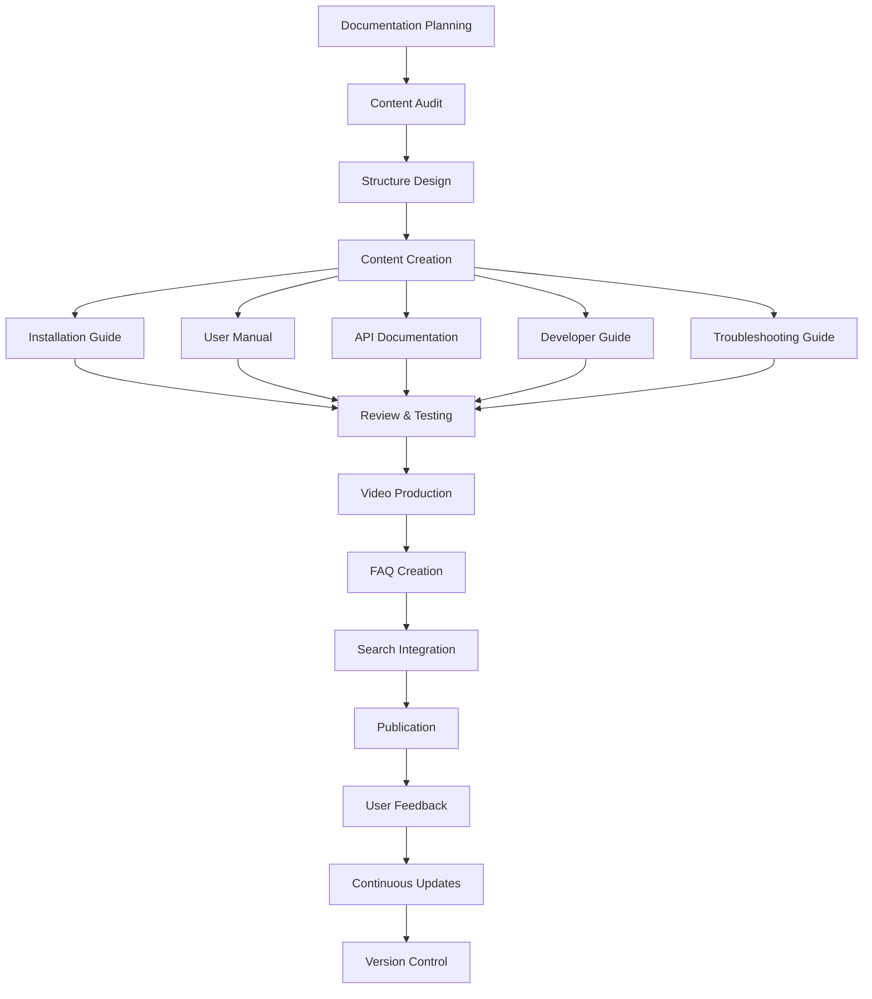

# Task: TASK-091 - Comprehensive Documentation & User Guides

## Task Naming Convention
**Follow the TaskHero naming convention when creating tasks:**

**Format:** `TASK-XXX-[TYPE]-descriptive-name.md`

**Where:**
- **XXX** = Sequential number (001, 002, 003, etc.)
- **[TYPE]** = Task type abbreviation (must match metadata Task Type field)
- **descriptive-name** = Brief but clear description (use hyphens, no spaces)

**Task Type Abbreviations:**
- **DEV** = Development
- **BUG** = Bug Fix
- **TEST** = Test Case
- **DOC** = Documentation
- **DES** = Design
- **RES** = Research
- **PLAN** = Planning

**Examples:**
- `TASK-001-DEV-user-authentication.md`
- `TASK-002-BUG-login-validation-error.md`
- `TASK-003-TEST-payment-gateway.md`
- `TASK-004-DOC-api-documentation-update.md`
- `TASK-005-DES-dashboard-ui-redesign.md`

> **Important:** The task type abbreviation in the filename must match the Task Type field in the metadata section above.

## Metadata
- **Task ID:** TASK-091
- **Created:** 2025-01-29
- **Due:** 2025-02-10
- **Priority:** High
- **Status:** Todo
- **Assigned to:** Developer
- **Task Type:** Documentation
- **Sequence:** 91
- **Estimated Effort:** Large (3-4 days)
- **Related Epic/Feature:** TaskHero AI Documentation Suite
- **Tags:** documentation, user-guides, api-docs, tutorials, knowledge-base

## 1. Overview
### 1.1. Brief Description
Create comprehensive documentation and user guides for TaskHero AI, including installation guides, user manuals, API documentation, developer guides, and troubleshooting resources to ensure users can effectively utilize all system features.

### 1.2. Functional Requirements
- **Installation & Setup Guide**: Complete setup instructions for different environments
- **User Manual**: Comprehensive guide for all TaskHero AI features and workflows
- **API Documentation**: Detailed API reference with examples and use cases
- **Developer Guide**: Technical documentation for contributors and developers
- **Troubleshooting Guide**: Common issues and solutions with diagnostic steps
- **Video Tutorials**: Screen recordings demonstrating key features
- **FAQ Section**: Frequently asked questions with detailed answers
- **Architecture Documentation**: System design and component relationships

### 1.3. Purpose & Benefits
- **Improved User Adoption**: Clear documentation reduces learning curve
- **Reduced Support Burden**: Self-service documentation answers common questions
- **Developer Onboarding**: Faster onboarding for new contributors
- **Feature Discovery**: Users discover and utilize advanced features
- **Quality Assurance**: Documentation process identifies gaps and inconsistencies

### 1.4. Success Criteria
- [ ] Complete installation guide with step-by-step instructions
- [ ] User manual covers all major features and workflows
- [ ] API documentation includes all endpoints with examples
- [ ] Developer guide enables new contributors to get started
- [ ] Troubleshooting guide resolves 80% of common issues
- [ ] Video tutorials demonstrate key user journeys
- [ ] FAQ section answers top 20 user questions
- [ ] Documentation is searchable and well-organized
- [ ] All documentation is up-to-date with current features
- [ ] User feedback shows >90% satisfaction with documentation quality

## 2. Flow Diagram


## 3. Implementation Plan

### Phase 1: Documentation Structure & Planning - Estimated: 0.5 days
- **Files**: `docs/README.md`, `docs/structure.md`
- **Tasks**:
  - Audit existing documentation and identify gaps
  - Design comprehensive documentation structure
  - Create documentation templates and style guide
  - Set up documentation versioning and maintenance process

### Phase 2: Core Documentation Creation - Estimated: 2 days
- **Files**: `docs/installation/`, `docs/user-guide/`, `docs/api/`, `docs/developer/`
- **Tasks**:
  - Write comprehensive installation and setup guide
  - Create detailed user manual with screenshots
  - Generate API documentation with examples
  - Develop developer guide and contribution guidelines

### Phase 3: Troubleshooting & Support Resources - Estimated: 1 day
- **Files**: `docs/troubleshooting/`, `docs/faq/`, `docs/videos/`
- **Tasks**:
  - Create troubleshooting guide with diagnostic steps
  - Compile FAQ from user questions and support tickets
  - Produce video tutorials for key features
  - Set up search functionality and navigation

### Phase 4: Review, Testing & Publication - Estimated: 0.5 days
- **Tasks**:
  - Review all documentation for accuracy and completeness
  - Test installation and setup procedures
  - Validate API examples and code snippets
  - Publish documentation and gather user feedback

## 4. Technical Considerations

### 4.1. Documentation Platform
- **Format**: Markdown files for easy maintenance and version control
- **Platform**: GitHub Pages or similar for hosting
- **Search**: Integrated search functionality for easy navigation
- **Responsive Design**: Mobile-friendly documentation layout

### 4.2. Content Management
- **Version Control**: Git-based versioning for documentation
- **Automated Updates**: Scripts to update API docs from code
- **Review Process**: Pull request workflow for documentation changes
- **Maintenance Schedule**: Regular review and update cycles

### 4.3. Multimedia Integration
- **Screenshots**: High-quality screenshots with annotations
- **Video Tutorials**: Screen recordings with voice-over
- **Interactive Examples**: Live code examples where possible
- **Diagrams**: Architecture and flow diagrams using Mermaid

## 5. Documentation Structure

### 5.1. Installation & Setup Guide
```markdown
# TaskHero AI Installation Guide

## Prerequisites
- Python 3.8 or higher
- Git for version control
- 4GB RAM minimum, 8GB recommended
- 2GB free disk space

## Quick Start Installation
1. Clone the repository
2. Install dependencies
3. Configure environment
4. Run initial setup
5. Verify installation

## Advanced Installation Options
- Docker deployment
- Virtual environment setup
- Production configuration
- Multi-user setup

## Platform-Specific Instructions
- Windows installation
- macOS installation
- Linux installation
- Cloud deployment
```

### 5.2. User Manual Structure
```markdown
# TaskHero AI User Manual

## Getting Started
- First-time setup
- Basic concepts
- User interface overview

## Core Features
- Task creation workflow
- Context selection
- AI enhancement
- Task management

## Advanced Features
- Custom templates
- Batch operations
- Integration options
- Performance tuning

## Best Practices
- Effective task writing
- Context optimization
- Workflow efficiency
- Quality improvement
```

### 5.3. API Documentation
```markdown
# TaskHero AI API Reference

## Authentication
- API key setup
- Authentication methods
- Security considerations

## Endpoints
### Task Creation
- POST /api/tasks/create
- GET /api/tasks/{id}
- PUT /api/tasks/{id}
- DELETE /api/tasks/{id}

### Context Management
- GET /api/context/search
- POST /api/context/analyze
- GET /api/context/relationships

## Examples
- Creating a task via API
- Retrieving context data
- Batch operations
- Error handling
```

### 5.4. Developer Guide
```markdown
# TaskHero AI Developer Guide

## Architecture Overview
- System components
- Data flow
- Integration points

## Development Setup
- Local development environment
- Testing framework
- Debugging tools

## Contributing Guidelines
- Code style standards
- Pull request process
- Testing requirements
- Documentation standards

## Extension Development
- Plugin architecture
- Custom providers
- Integration patterns
- Best practices
```

## 6. Content Creation Guidelines

### 6.1. Writing Standards
- **Clear and Concise**: Use simple, direct language
- **Step-by-Step**: Break complex procedures into numbered steps
- **Visual Aids**: Include screenshots and diagrams where helpful
- **Examples**: Provide real-world examples and use cases
- **Consistency**: Maintain consistent terminology and formatting

### 6.2. Technical Accuracy
- **Code Testing**: All code examples must be tested and working
- **Version Alignment**: Documentation must match current software version
- **Regular Updates**: Keep documentation current with feature changes
- **Peer Review**: All documentation changes require review

### 6.3. User Experience Focus
- **User Journey**: Organize content around user goals and workflows
- **Progressive Disclosure**: Start simple, then provide advanced details
- **Search Optimization**: Use keywords and tags for discoverability
- **Feedback Integration**: Incorporate user feedback and questions

## 7. Video Tutorial Plan

### 7.1. Essential Tutorials (5-10 minutes each)
1. **Getting Started**: Installation and first task creation
2. **Enhanced Context Selection**: Using the new preview UI
3. **Smart Auto-Selection**: Leveraging AI for context selection
4. **Task Management**: Organizing and tracking tasks
5. **Advanced Features**: Custom templates and batch operations

### 7.2. Advanced Tutorials (10-15 minutes each)
1. **Performance Optimization**: Tuning for large codebases
2. **Integration Setup**: Connecting with external tools
3. **Troubleshooting**: Common issues and solutions
4. **Developer Workflow**: Contributing to TaskHero AI

## 8. Testing Strategy
- **Documentation Testing**: Verify all procedures work as documented
- **User Testing**: Have new users follow documentation to identify gaps
- **Link Validation**: Ensure all internal and external links work
- **Accessibility Testing**: Verify documentation is accessible to all users
- **Mobile Testing**: Ensure documentation works on mobile devices

## 9. Maintenance Plan
- **Monthly Reviews**: Regular review of documentation accuracy
- **Feature Updates**: Update docs when new features are released
- **User Feedback**: Incorporate feedback and suggestions
- **Analytics Monitoring**: Track documentation usage and popular sections
- **Continuous Improvement**: Regular updates based on user needs

## 10. Success Metrics
- **Completion Rate**: Users successfully complete documented procedures
- **Support Reduction**: Decrease in support tickets for documented topics
- **User Satisfaction**: High ratings for documentation quality
- **Feature Adoption**: Increased usage of documented features
- **Contributor Onboarding**: Faster developer onboarding times

---
*Generated by TaskHero AI Template Engine on 2025-01-29*
