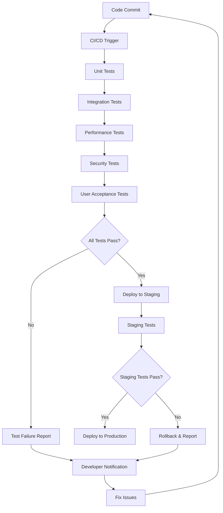

# Task: TASK-092 - Comprehensive Quality Assurance & Testing Suite

## Task Naming Convention
**Follow the TaskHero naming convention when creating tasks:**

**Format:** `TASK-XXX-[TYPE]-descriptive-name.md`

**Where:**
- **XXX** = Sequential number (001, 002, 003, etc.)
- **[TYPE]** = Task type abbreviation (must match metadata Task Type field)
- **descriptive-name** = Brief but clear description (use hyphens, no spaces)

**Task Type Abbreviations:**
- **DEV** = Development
- **BUG** = Bug Fix
- **TEST** = Test Case
- **DOC** = Documentation
- **DES** = Design
- **RES** = Research
- **PLAN** = Planning

**Examples:**
- `TASK-001-DEV-user-authentication.md`
- `TASK-002-BUG-login-validation-error.md`
- `TASK-003-TEST-payment-gateway.md`
- `TASK-004-DOC-api-documentation-update.md`
- `TASK-005-DES-dashboard-ui-redesign.md`

> **Important:** The task type abbreviation in the filename must match the Task Type field in the metadata section above.

## Metadata
- **Task ID:** TASK-092
- **Created:** 2025-01-29
- **Due:** 2025-02-12
- **Priority:** High
- **Status:** Todo
- **Assigned to:** Developer
- **Task Type:** Test Case
- **Sequence:** 92
- **Estimated Effort:** Large (3-4 days)
- **Related Epic/Feature:** TaskHero AI Quality Assurance
- **Tags:** testing, quality-assurance, automation, ci-cd, test-coverage

## 1. Overview
### 1.1. Brief Description
Develop a comprehensive quality assurance and testing suite for TaskHero AI, including unit tests, integration tests, performance tests, user acceptance tests, and automated CI/CD pipeline to ensure system reliability and quality.

### 1.2. Functional Requirements
- **Unit Test Suite**: Comprehensive unit tests for all core components
- **Integration Test Suite**: End-to-end testing of complete workflows
- **Performance Test Suite**: Load testing and performance benchmarking
- **User Acceptance Tests**: Automated UI testing and user journey validation
- **API Test Suite**: Complete API endpoint testing with various scenarios
- **Security Testing**: Vulnerability scanning and security validation
- **Regression Test Suite**: Automated testing to prevent feature regressions
- **CI/CD Pipeline**: Automated testing and deployment pipeline

### 1.3. Purpose & Benefits
- **Quality Assurance**: Ensure all features work correctly and reliably
- **Regression Prevention**: Catch bugs before they reach production
- **Performance Validation**: Maintain system performance standards
- **Security Assurance**: Identify and prevent security vulnerabilities
- **Continuous Integration**: Automated testing for faster development cycles

### 1.4. Success Criteria
- [ ] Unit test coverage >90% for all core components
- [ ] Integration tests cover all major user workflows
- [ ] Performance tests validate system meets performance requirements
- [ ] User acceptance tests automate key user journeys
- [ ] API tests cover all endpoints with various scenarios
- [ ] Security tests identify and validate fixes for vulnerabilities
- [ ] CI/CD pipeline runs all tests automatically on code changes
- [ ] Test suite runs in <10 minutes for fast feedback
- [ ] All tests are maintainable and well-documented
- [ ] Test results are clearly reported with actionable feedback

## 2. Flow Diagram


## 3. Implementation Plan

### Phase 1: Test Infrastructure Setup - Estimated: 1 day
- **Files**: `tests/conftest.py`, `tests/fixtures/`, `pytest.ini`, `.github/workflows/`
- **Tasks**:
  - Set up pytest testing framework with fixtures
  - Create test data and mock objects
  - Configure CI/CD pipeline with GitHub Actions
  - Set up test reporting and coverage analysis

### Phase 2: Unit & Integration Tests - Estimated: 1.5 days
- **Files**: `tests/unit/`, `tests/integration/`, `tests/api/`
- **Tasks**:
  - Write comprehensive unit tests for all core components
  - Create integration tests for complete workflows
  - Develop API test suite with various scenarios
  - Add database and file system testing

### Phase 3: Performance & Security Tests - Estimated: 1 day
- **Files**: `tests/performance/`, `tests/security/`, `tests/load/`
- **Tasks**:
  - Create performance benchmarking tests
  - Implement load testing for concurrent users
  - Add security vulnerability scanning
  - Set up memory and resource usage monitoring

### Phase 4: User Acceptance & Automation - Estimated: 0.5 days
- **Files**: `tests/e2e/`, `tests/ui/`, `tests/acceptance/`
- **Tasks**:
  - Develop end-to-end user journey tests
  - Create automated UI testing with Selenium
  - Set up regression test automation
  - Configure test result reporting and notifications

## 4. Technical Considerations

### 4.1. Testing Framework
- **pytest**: Primary testing framework for Python components
- **Selenium**: Web UI automation testing
- **locust**: Performance and load testing
- **bandit**: Security vulnerability scanning
- **coverage.py**: Code coverage analysis

### 4.2. Test Environment
- **Isolated Testing**: Each test runs in isolated environment
- **Test Data Management**: Consistent test data and fixtures
- **Mock Services**: Mock external dependencies for reliable testing
- **Parallel Execution**: Run tests in parallel for faster execution

### 4.3. CI/CD Integration
- **GitHub Actions**: Automated testing on code changes
- **Test Reporting**: Clear test results and coverage reports
- **Failure Notifications**: Immediate notification of test failures
- **Deployment Gates**: Tests must pass before deployment

## 5. Test Suite Structure

### 5.1. Unit Tests
```python
# tests/unit/test_ai_task_creator.py
import pytest
from unittest.mock import Mock, patch
from mods.project_management.ai_task_creator import AITaskCreator

class TestAITaskCreator:
    @pytest.fixture
    def task_creator(self):
        return AITaskCreator("test_project")
    
    def test_initialization(self, task_creator):
        """Test AITaskCreator initialization."""
        assert task_creator.project_root == "test_project"
        assert task_creator.creation_state is not None
    
    @patch('mods.project_management.ai_task_creator.GraphitiContextRetriever')
    def test_context_collection(self, mock_retriever, task_creator):
        """Test context collection functionality."""
        # Setup mock
        mock_retriever.return_value.search_context.return_value = [
            Mock(relevance_score=0.9, file_path="test.py")
        ]
        
        # Test context collection
        result = task_creator._collect_context_with_graphiti(
            "test query", {"task_type": "Development"}
        )
        
        assert len(result) > 0
        assert result[0].relevance_score == 0.9
    
    def test_enhanced_context_display(self, task_creator):
        """Test enhanced context selection display."""
        mock_chunks = [
            Mock(
                file_path="test.py",
                relevance_score=0.8,
                text="def test_function():\n    pass"
            )
        ]
        
        # Should not raise exception
        task_creator._display_enhanced_context_selection(mock_chunks)
```

### 5.2. Integration Tests
```python
# tests/integration/test_task_creation_workflow.py
import pytest
import asyncio
from pathlib import Path
from mods.project_management.ai_task_creator import AITaskCreator

class TestTaskCreationWorkflow:
    @pytest.fixture
    def temp_project(self, tmp_path):
        """Create temporary project for testing."""
        project_dir = tmp_path / "test_project"
        project_dir.mkdir()
        
        # Create test files
        (project_dir / "main.py").write_text("def main():\n    print('Hello')")
        (project_dir / "README.md").write_text("# Test Project")
        
        return project_dir
    
    @pytest.mark.asyncio
    async def test_complete_task_creation(self, temp_project):
        """Test complete task creation workflow."""
        task_creator = AITaskCreator(str(temp_project))
        
        # Simulate user input
        task_data = {
            'title': 'Test Task Creation',
            'description': 'Testing the complete workflow',
            'task_type': 'Development',
            'priority': 'medium'
        }
        
        # Test progressive creation
        success = await task_creator.create_task_progressive(
            task_data['title'],
            task_data['description'],
            task_data['task_type']
        )
        
        assert success
        assert task_creator.creation_state['step'] == 4
        assert len(task_creator.creation_state['selected_context']) > 0
```

### 5.3. Performance Tests
```python
# tests/performance/test_context_retrieval_performance.py
import time
import pytest
from mods.project_management.graphiti_retriever import GraphitiContextRetriever

class TestContextRetrievalPerformance:
    @pytest.fixture
    def retriever(self):
        return GraphitiContextRetriever(".")
    
    def test_query_performance(self, retriever):
        """Test context retrieval performance."""
        queries = [
            "task creation enhancement",
            "context selection interface",
            "performance optimization",
            "user interface improvement"
        ]
        
        total_time = 0
        for query in queries:
            start_time = time.time()
            results = retriever.search_context(query, max_results=10)
            end_time = time.time()
            
            query_time = end_time - start_time
            total_time += query_time
            
            # Performance assertion: each query should complete in <2 seconds
            assert query_time < 2.0, f"Query '{query}' took {query_time:.3f}s"
            assert len(results) > 0, f"No results for query '{query}'"
        
        avg_time = total_time / len(queries)
        assert avg_time < 1.0, f"Average query time {avg_time:.3f}s exceeds 1.0s"
```

### 5.4. API Tests
```python
# tests/api/test_task_api.py
import pytest
import requests
from unittest.mock import patch

class TestTaskAPI:
    @pytest.fixture
    def api_base_url(self):
        return "http://localhost:5000/api"
    
    def test_create_task_endpoint(self, api_base_url):
        """Test task creation API endpoint."""
        task_data = {
            'title': 'API Test Task',
            'description': 'Testing API functionality',
            'task_type': 'Development',
            'priority': 'medium'
        }
        
        response = requests.post(f"{api_base_url}/tasks", json=task_data)
        
        assert response.status_code == 201
        assert 'task_id' in response.json()
        assert response.json()['title'] == task_data['title']
    
    def test_get_task_endpoint(self, api_base_url):
        """Test task retrieval API endpoint."""
        # First create a task
        task_data = {'title': 'Test Task', 'description': 'Test'}
        create_response = requests.post(f"{api_base_url}/tasks", json=task_data)
        task_id = create_response.json()['task_id']
        
        # Then retrieve it
        response = requests.get(f"{api_base_url}/tasks/{task_id}")
        
        assert response.status_code == 200
        assert response.json()['title'] == task_data['title']
```

## 6. CI/CD Pipeline Configuration

### 6.1. GitHub Actions Workflow
```yaml
# .github/workflows/test.yml
name: Test Suite

on:
  push:
    branches: [ main, develop ]
  pull_request:
    branches: [ main ]

jobs:
  test:
    runs-on: ubuntu-latest
    
    steps:
    - uses: actions/checkout@v3
    
    - name: Set up Python
      uses: actions/setup-python@v3
      with:
        python-version: '3.9'
    
    - name: Install dependencies
      run: |
        pip install -r requirements.txt
        pip install -r requirements-test.txt
    
    - name: Run unit tests
      run: pytest tests/unit/ -v --cov=mods --cov-report=xml
    
    - name: Run integration tests
      run: pytest tests/integration/ -v
    
    - name: Run performance tests
      run: pytest tests/performance/ -v
    
    - name: Run security tests
      run: bandit -r mods/ -f json -o security-report.json
    
    - name: Upload coverage reports
      uses: codecov/codecov-action@v3
      with:
        file: ./coverage.xml
```

## 7. Quality Gates & Standards
- **Code Coverage**: Minimum 90% coverage for core components
- **Performance Standards**: All operations complete within defined time limits
- **Security Standards**: No high or critical security vulnerabilities
- **Test Reliability**: Tests must be deterministic and reliable
- **Documentation**: All tests must be well-documented with clear purpose

## 8. Test Data Management
- **Fixtures**: Reusable test data and mock objects
- **Test Databases**: Isolated test databases for each test run
- **File System**: Temporary directories for file system tests
- **External Services**: Mock external API calls and services

## 9. Reporting & Monitoring
- **Test Results**: Clear pass/fail reporting with detailed error messages
- **Coverage Reports**: Code coverage analysis with line-by-line details
- **Performance Metrics**: Response time and resource usage tracking
- **Trend Analysis**: Track test performance and reliability over time

## 10. Maintenance & Evolution
- **Regular Updates**: Keep tests current with feature changes
- **Test Review**: Regular review of test effectiveness and coverage
- **Performance Monitoring**: Monitor test suite performance and optimize
- **Tool Updates**: Keep testing tools and frameworks up to date

---
*Generated by TaskHero AI Template Engine on 2025-01-29*
