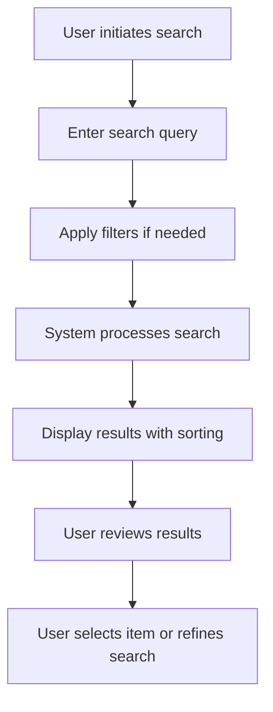

# Develop TaskHero AI Engine Module

## Metadata
- **Task ID:** TASK-102
- **Created:** 2025-05-29
- **Due:** 2025-06-05
- **Priority:** Medium
- **Status:** Todo
- **Assigned to:** Developer
- **Task Type:** Development
- **Sequence:** 102
- **Estimated Effort:** Medium
- **Related Epic/Feature:** TaskHero AI Project
- **Tags:** ai-engine, content-generation, template-intelligence, semantic-search, historical-learning

## 1. Overview
### 1.1. Brief Description
Develop the central TaskHero AI Engine as a separate module that leverages existing AI models (configured in .env) to provide intelligent task management capabilities. The engine will use existing embedding infrastructure in `.index/` folder and strictly follow task template structures for consistent output. Focus on core AI features with performance optimization deferred to later stages.

### 1.2. Functional Requirements
- The system must implement develop the central taskhero ai engine as a separate module that leverages existing ai models (configured in .env) to provide intelligent task management capabilities. the engine will use existing embedding infrastructure in `.index/` folder and strictly follow task template structures for consistent output. focus on core ai features with performance optimization deferred to later stages. according to specifications
- The system must handle errors gracefully and provide meaningful error messages
- The system must maintain data integrity and consistency
- The system must be tested with comprehensive unit and integration tests
- The system must follow established coding standards and best practices
- The system must be documented with clear API documentation

### 1.3. Purpose & Benefits
This task enhances the TaskHero AI system by implementing develop taskhero ai engine module.

### 1.4. Success Criteria
- [ ] All functional requirements are implemented
- [ ] Code passes all tests and quality checks
- [ ] Documentation is complete and accurate

## 2. Flow Diagram
**Task flow diagram:**

User workflow for search functionality implementation

## 3. Implementation Status

### 3.1. Implementation Steps
- [ ] **Step 1: Requirements Analysis & Design** - Status: ⏳ Pending - Target: 2025-06-05
- [ ] Sub-step 1: Analyze search requirements and user stories
- [ ] Sub-step 2: Design search architecture and data models
- [ ] Sub-step 3: Create API specifications and contracts
- [ ] **Step 2: Backend Implementation** - Status: ⏳ Pending - Target: 2025-06-05
- [ ] Sub-step 1: Implement search engine integration
- [ ] Sub-step 2: Create filtering and sorting logic
- [ ] Sub-step 3: Develop suggestion algorithm
- [ ] **Step 3: Frontend Implementation** - Status: ⏳ Pending - Target: 2025-06-05
- [ ] Sub-step 1: Build search UI components
- [ ] Sub-step 2: Implement real-time search suggestions
- [ ] Sub-step 3: Add filter and sort controls
- [ ] **Step 4: Testing & Optimization** - Status: ⏳ Pending - Target: 2025-06-05
- [ ] Sub-step 1: Write comprehensive test suite
- [ ] Sub-step 2: Performance testing and optimization
- [ ] Sub-step 3: User acceptance testing

## 4. Detailed Description
## Task Hero AI Engine Module Development – Detailed Task Description
**1. User Intent Preservation:**
This task focuses on developing a core, modular AI Engine for TaskHero, leveraging existing AI models and embedding infrastructure to provide intelligent task management capabilities. The engine must strictly adhere to existing task template structures for consistent output generation and prioritize core AI functionality, deferring performance optimization to subsequent iterations.
**2. Technical Context & Implementation Details:**
The TaskHero AI Engine will act as a central processing unit, consuming task data (formatted according to the existing TaskHero task templates – see Appendix A for template specifications) and utilizing pre-configured AI models to generate intelligent insights, suggestions, and automated actions related to task management. This module will *not* be responsible for user interface interaction; it’s a backend service designed for integration with the TaskHero UI.
**2.1. Core AI Features:**
*   **Task Summarization:**  Utilize a chosen Large Language Model (LLM - configured in `.env`) to generate concise summaries of tasks based on their content and associated data.
*   **Priority Suggestion:** Based on the task description and historical data (where available), the engine will suggest a priority level for each task, drawing on a pre-trained model (again, configured in `.env`).
*   **Next Action Suggestion:** The engine will propose potential next actions for a task, considering the task’s current state and the overall project context. This will leverage the LLM for reasoning and strategic suggestions.
*   **Dependency Detection:** The engine will analyze task descriptions to identify potential dependencies on other tasks within the TaskHero system.
**2.2. Technical Architecture & Components:**
*   **Language:** Python 3.9+ (to ensure compatibility with existing TaskHero infrastructure).
*   **Framework:**  FastAPI for building the API.
*   **LLM Integration:**  The chosen LLM (e.g., OpenAI's GPT-3.5 or a locally hosted model) will be accessed via its API.  Configuration details, including API keys and model parameters, are stored in the `.env` file.
*   **Embedding Infrastructure:** The existing embedding infrastructure located in the `.index/` folder will be utilized for semantic search and similarity analysis. This will be crucial for dependency detection and potentially for refining task summaries.
*   **Database Interaction:**  The engine will interact with the TaskHero database (PostgreSQL) to retrieve task data and store generated insights (e.g., suggested priorities, next actions).
*   **Caching Layer:** Implement a Redis cache layer to improve response times for frequently accessed data, particularly task summaries and priority suggestions.
*   **Asynchronous Processing:** Utilize Celery or similar for long-running tasks (e.g., complex task summarization) to avoid blocking the main API thread.
**3. Integration Points & Dependencies:**
*   **TaskHero UI:** The AI Engine will be accessible via a RESTful API endpoint. The UI will consume this API to retrieve AI-generated insights and suggestions.
*   **TaskHero Database (PostgreSQL):**  Critical for data retrieval and storage.
*   **Redis Cache:** For caching frequently accessed data.
*   **Celery (or similar):** For asynchronous task processing.
*   **`.env` File:**  Contains all configuration settings for the AI Engine, including LLM API keys and model parameters.
**4. Potential Risks & Mitigation Strategies:**
*   **LLM Cost:**  LLM API calls can be expensive. Implement rate limiting and caching to control costs. Monitor API usage closely.
*   **LLM Response Quality:**  LLM outputs may occasionally be inaccurate or irrelevant. Implement a feedback mechanism to allow users to rate the quality of suggestions.  Establish clear criteria for rejecting or correcting LLM outputs.

## 6. Risk Assessment
### 6.1. Potential Risks
| Risk | Impact | Probability | Mitigation Strategy |
|------|--------|-------------|-------------------|
| Technical complexity higher than estimated | Medium | Low | Break down into smaller tasks, seek technical review |
| Dependencies not available on time | High | Medium | Identify alternative approaches, communicate early with dependencies |

## Testing
Testing will be handled in a separate task based on this task summary and requirements.

## Technical Considerations
- Code modularity and reusability
- Performance optimization
- Error handling and logging
- Testing and validation

## Updates
- **2025-05-29** - Task created
---
*Generated by TaskHero AI Template Engine on 2025-05-29 17:39:11* 