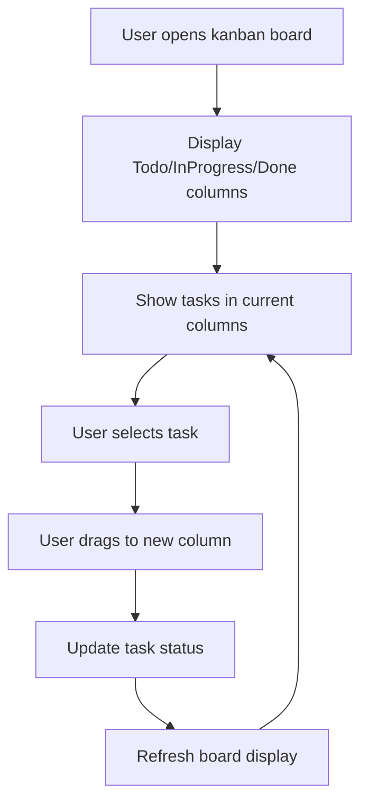

# Implement Kanban Board Visualization

## Metadata
- **Task ID:** TASK-121
- **Created:** 2025-05-29
- **Due:** 2025-06-05
- **Priority:** Medium
- **Status:** Todo
- **Assigned to:** Developer
- **Task Type:** Development
- **Sequence:** 121
- **Estimated Effort:** Medium
- **Related Epic/Feature:** TaskHero AI Project
- **Tags:** visualization, kanban, ui, terminal, rich

## 1. Overview
### 1.1. Brief Description
Create a visual Kanban board system that displays tasks in Todo, InProgress, and Done columns with proper formatting and status indicators. This will provide users with an intuitive visual interface for managing their project tasks within the terminal environment.

### 1.2. Functional Requirements
- The system must the system shall display a kanban board with columns labeled 'todo', 'inprogress', and 'done'.
- The system must each task within a column shall be displayed with a clear status indicator (e.g., text color or symbol) representing its current state.
- The system must the kanban board shall be visually formatted within the terminal environment to provide an intuitive and easily navigable interface.
- The system must the system shall allow users to interact with the kanban board via terminal commands to move tasks between columns.
- The system must the taskmanager shall be used to manage the state of tasks within the kanban board columns.
- The system must the kanbanboard class must initialize with a taskmanager instance to facilitate task state management.

### 1.3. Purpose & Benefits
This task enhances the TaskHero AI system by implementing implement kanban board visualization.

### 1.4. Success Criteria
- [ ] All functional requirements are implemented
- [ ] Code passes all tests and quality checks
- [ ] Documentation is complete and accurate

## 2. Flow Diagram
**Task flow diagram:**



User workflow for kanban board task management

## 3. Implementation Status

### 3.1. Implementation Steps
- [ ] **Step 1: Analysis & Planning for Implement Kanban Board Visualization** - Status: ⏳ Pending - Target: 2025-06-05
- [ ] Sub-step 1: Analyze requirements for implement kanban board visualization
- [ ] Sub-step 2: Design architecture and approach
- [ ] Sub-step 3: Create implementation plan
- [ ] **Step 2: Implementation of Implement Kanban Board Visualization** - Status: ⏳ Pending - Target: 2025-06-05
- [ ] Sub-step 1: Implement core functionality
- [ ] Sub-step 2: Add supporting features
- [ ] Sub-step 3: Integrate with existing system
- [ ] **Step 3: Testing & Validation** - Status: ⏳ Pending - Target: 2025-06-05
- [ ] Sub-step 1: Test implement kanban board visualization functionality
- [ ] Sub-step 2: Validate requirements are met
- [ ] Sub-step 3: Perform user acceptance testing

## 4. Detailed Description
Title: Implement Kanban Board Visualization
Description: Create a visual Kanban board system that displays tasks in Todo, InProgress, and Done columns with proper formatting and status indicators. This will provide users with an intuitive visual interface for managing their project tasks within the terminal environment. The `KanbanBoard` class, as demonstrated in `test_kanban_board.py`, utilizes a `TaskManager` instance to manage tasks and presents them across six columns: Todo, InProgress, and Done.  The `KanbanBoard` class, as tested in `test_kanban_board.py`, initializes with a `TaskManager` and creates a board with six columns, ensuring proper formatting and status indicators for each task.  This aligns with the task naming convention (-[TYPE]-descriptive-name.md) and leverages the `TaskManager` for task management, mirroring the testing framework's approach.
Task Type: Development


## 5. UI Design & Specifications
### 5.1. Design Overview
User interface design for implement kanban board visualization

### 5.2. Wireframes & Layout
**Use ASCII art for layouts, wireframes, and component positioning:**

```
┌─────────────────────────────────────────────────────────────┐
│ [Implement Kanban Board Visualization Layout]                                             │
│ ┌─────────────┐ ┌─────────────────────────────────────────┐ │
│ │ Navigation  │ │ Main Content Area                       │ │
│ │ - Menu      │ │ ┌─────────────────────────────────────┐ │ │
│ │ - Options   │ │ │ Implement Kanban Board Visualization Interface                   │ │ │
│ │ - Settings  │ │ ├─────────────────────────────────────┤ │ │
│ │             │ │ │ Content and Controls                │ │ │
│ │             │ │ │ Status: Ready                       │ │ │
│ │             │ │ └─────────────────────────────────────┘ │ │
│ └─────────────┘ └─────────────────────────────────────────┘ │
└─────────────────────────────────────────────────────────────┘
```

### 5.3. Design System References
- **Colors:** Primary: #3b82f6, Secondary: #64748b, Success: #10b981, Warning: #f59e0b
- **Typography:** Inter font family, 14px base size, 500 weight for readability
- **Spacing:** 8px base unit, 16px component padding, 24px section margins
- **Components:** Standard UI components and controls
- **Icons:** Lucide icons: appropriate icons for functionality

### 5.4. Visual Design References
- [Link to Figma/Design file]
- [Link to existing similar components]
- [Screenshots or mockups if available]
## 6. Risk Assessment
### 6.1. Potential Risks
| Risk | Impact | Probability | Mitigation Strategy |
|------|--------|-------------|-------------------|
| [Risk description] | High | Medium | Conduct thorough stakeholder interviews (product owner, key users) early in the project to clearly define desired UI elements, formatting preferences (colors, fonts, spacing), and interaction methods. Create wireframes and mockups to validate understanding before development begins. Establish a clear acceptance criteria document. |
| [Risk description] | Medium | Medium | Early prototyping and testing within the existing terminal environment. Utilize existing terminal libraries and APIs where possible. Implement robust error handling and logging to quickly identify integration issues.  Maintain open communication with the terminal environment team. |
| [Risk description] | Medium | Low | Design the Kanban board with efficient data structures and algorithms. Implement pagination or lazy loading for large task lists. Optimize terminal output for speed and responsiveness. Conduct performance testing with a representative number of tasks. |
| [Risk description] | Low | Medium | Establish a clear change management process.  All new feature requests must go through a formal evaluation process, considering impact on timeline, budget, and existing functionality.  The Product Owner has final approval authority. |


## Testing
Testing will be handled in a separate task based on this task summary and requirements.


## Technical Considerations
- Code modularity and reusability
- Performance optimization
- Error handling and logging
- Testing and validation


## Updates
- **2025-05-29** - Task created
---
*Generated by TaskHero AI Template Engine on 2025-05-29 19:55:57* 