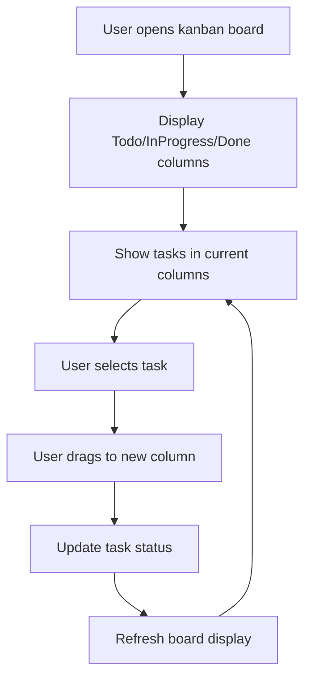

# Implement Kanban Board Visualization

## Metadata
- **Task ID:** TASK-122
- **Created:** 2025-05-29
- **Due:** 2025-06-05
- **Priority:** Medium
- **Status:** Todo
- **Assigned to:** Developer
- **Task Type:** Development
- **Sequence:** 122
- **Estimated Effort:** Medium
- **Related Epic/Feature:** TaskHero AI Project
- **Tags:** visualization, kanban, ui, terminal, rich

## 1. Overview
### 1.1. Brief Description
Create a visual Kanban board system that displays tasks in Todo, InProgress, and Done columns with proper formatting and status indicators. This will provide users with an intuitive visual interface for managing their project tasks within the terminal environment.

### 1.2. Functional Requirements
- The system must the system shall display a kanban board with three columns: todo, inprogress, and done.
- The system must each task displayed on the kanban board shall have a status indicator reflecting its current stage (todo, inprogress, or done).
- The system must the system shall allow users to view a list of tasks within each kanban column.
- The system must the system shall present tasks in a terminal-based visual format, mimicking a kanban board layout.
- The system must the ai engine shall be utilized to generate task descriptions for display on the kanban board, leveraging existing templates as per taskhero ai's core functionality.

### 1.3. Purpose & Benefits
This task enhances the TaskHero AI system by implementing implement kanban board visualization.

### 1.4. Success Criteria
- [ ] All functional requirements are implemented
- [ ] Code passes all tests and quality checks
- [ ] Documentation is complete and accurate

## 2. Flow Diagram
**Task flow diagram:**



User workflow for kanban board task management

## 3. Implementation Status

### 3.1. Implementation Steps
- [ ] **Step 1: Analysis & Planning for Implement Kanban Board Visualization** - Status: ⏳ Pending - Target: 2025-06-05
- [ ] Sub-step 1: Analyze requirements for implement kanban board visualization
- [ ] Sub-step 2: Design architecture and approach
- [ ] Sub-step 3: Create implementation plan
- [ ] **Step 2: Implementation of Implement Kanban Board Visualization** - Status: ⏳ Pending - Target: 2025-06-05
- [ ] Sub-step 1: Implement core functionality
- [ ] Sub-step 2: Add supporting features
- [ ] Sub-step 3: Integrate with existing system
- [ ] **Step 3: Testing & Validation** - Status: ⏳ Pending - Target: 2025-06-05
- [ ] Sub-step 1: Test implement kanban board visualization functionality
- [ ] Sub-step 2: Validate requirements are met
- [ ] Sub-step 3: Perform user acceptance testing

## 4. Detailed Description
Title: Implement Kanban Board Visualization
Description: Create a visual Kanban board system that displays tasks in Todo, InProgress, and Done columns with proper formatting and status indicators. This will provide users with an intuitive visual interface for managing their project tasks within the terminal environment. Leveraging the TaskHero AI’s Smart Content Generation capabilities, the system will utilize structured data representation – potentially utilizing classes like `Task` and `Column` – to manage task status transitions. The AI engine will be instrumental in generating initial task content, ensuring each task object includes relevant attributes for display and status tracking.  Specifically, the implementation should incorporate the ‘Smart Content Generation’ feature, utilizing templates to define task structures and populate fields like ‘Task Title’, ‘Description’, and ‘Status’ (Todo, InProgress, Done). The system will utilize a terminal-based UI, likely employing command-line formatting to represent the Kanban board columns and task statuses, aligning with TaskHero AI’s focus on efficient task management.  The core functionality will be driven by the AI engine’s ability to analyze task descriptions and generate complete, well-structured task content, ensuring a seamless workflow for users within the terminal environment.


## 5. UI Design & Specifications
### 5.1. Design Overview
User interface design for implement kanban board visualization

### 5.2. Wireframes & Layout
**Use ASCII art for layouts, wireframes, and component positioning:**

```
┌─────────────────────────────────────────────────────────────┐
│ [Implement Kanban Board Visualization Layout]                                             │
│ ┌─────────────┐ ┌─────────────────────────────────────────┐ │
│ │ Navigation  │ │ Main Content Area                       │ │
│ │ - Menu      │ │ ┌─────────────────────────────────────┐ │ │
│ │ - Options   │ │ │ Implement Kanban Board Visualization Interface                   │ │ │
│ │ - Settings  │ │ ├─────────────────────────────────────┤ │ │
│ │             │ │ │ Content and Controls                │ │ │
│ │             │ │ │ Status: Ready                       │ │ │
│ │             │ │ └─────────────────────────────────────┘ │ │
│ └─────────────┘ └─────────────────────────────────────────┘ │
└─────────────────────────────────────────────────────────────┘
```

### 5.3. Design System References
- **Colors:** Primary: #3b82f6, Secondary: #64748b, Success: #10b981, Warning: #f59e0b
- **Typography:** Inter font family, 14px base size, 500 weight for readability
- **Spacing:** 8px base unit, 16px component padding, 24px section margins
- **Components:** Standard UI components and controls
- **Icons:** Lucide icons: appropriate icons for functionality

### 5.4. Visual Design References
- [Link to Figma/Design file]
- [Link to existing similar components]
- [Screenshots or mockups if available]
## 6. Risk Assessment
### 6.1. Potential Risks
| Risk | Impact | Probability | Mitigation Strategy |
|------|--------|-------------|-------------------|
| [Risk description] | Medium | Medium | Conduct thorough stakeholder interviews with key users to clearly define UI expectations – including preferred color schemes, font sizes, spacing, and overall layout. Create low-fidelity wireframes and prototypes to validate design choices early on. Establish a formal change request process for UI adjustments. |
| [Risk description] | High | Medium | Early and frequent integration testing is crucial. Utilize a test terminal environment that mirrors the production environment as closely as possible.  Document all API interactions and dependencies.  Adhere to established coding standards and best practices for terminal-based applications. |
| [Risk description] | Medium | Low | Implement efficient data structures and algorithms for managing task states. Optimize rendering performance by minimizing screen updates and using techniques like cursor positioning instead of full screen redraws. Conduct load testing to identify performance bottlenecks. |
| [Risk description] | Low | Medium | Carefully evaluate and select well-maintained, reputable terminal libraries. Establish a process for monitoring library updates and security vulnerabilities.  Consider using a dependency management tool to manage library versions. |


## Testing
Testing will be handled in a separate task based on this task summary and requirements.


## Technical Considerations
- Code modularity and reusability
- Performance optimization
- Error handling and logging
- Testing and validation


## Updates
- **2025-05-29** - Task created
---
*Generated by TaskHero AI Template Engine on 2025-05-29 19:56:33* 