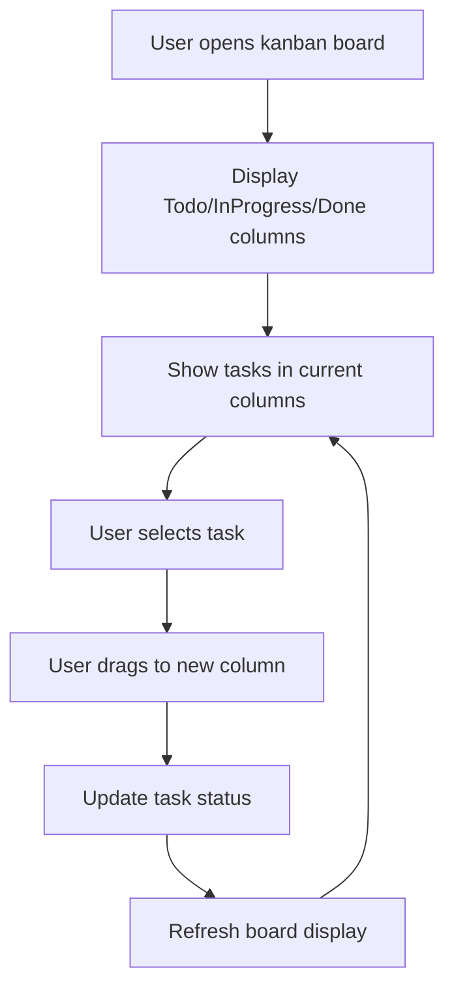

# Implement Kanban Board Visualization

## Metadata
- **Task ID:** TASK-123
- **Created:** 2025-05-29
- **Due:** 2025-06-05
- **Priority:** Medium
- **Status:** Todo
- **Assigned to:** Developer
- **Task Type:** Development
- **Sequence:** 123
- **Estimated Effort:** Medium
- **Related Epic/Feature:** TaskHero AI Project
- **Tags:** visualization, kanban, ui, terminal, rich

## 1. Overview
### 1.1. Brief Description
Create a visual Kanban board system that displays tasks in Todo, InProgress, and Done columns with proper formatting and status indicators. This will provide users with an intuitive visual interface for managing their project tasks within the terminal environment.

### 1.2. Functional Requirements
- The system must the system shall display a kanban board with three distinct columns: todo, inprogress, and done, to represent task status.
- The system must the system shall utilize lucide icons to visually represent task status within each column (e.g., a checkmark for 'done', a circular arrow for 'inprogress', and a simple square for 'todo').
- The system must the system shall allow users to interact with the kanban board via terminal commands to move tasks between columns, reflecting changes in task status.
- The system must the system shall provide clear formatting for each task item on the kanban board, including task titles and potentially brief descriptions, displayed within the terminal environment.
- The system must the system shall implement efficient data structures and algorithms to manage task states and ensure responsive updates to the kanban board display, minimizing screen redraws.

### 1.3. Purpose & Benefits
This task enhances the TaskHero AI system by implementing implement kanban board visualization.

### 1.4. Success Criteria
- [ ] All functional requirements are implemented
- [ ] Code passes all tests and quality checks
- [ ] Documentation is complete and accurate

## 2. Flow Diagram
**Task flow diagram:**



User workflow for kanban board task management

## 3. Implementation Status

### 3.1. Implementation Steps
- [ ] **Step 1: Analysis & Planning for Implement Kanban Board Visualization** - Status: ⏳ Pending - Target: 2025-06-05
- [ ] Sub-step 1: Analyze requirements for implement kanban board visualization
- [ ] Sub-step 2: Design architecture and approach
- [ ] Sub-step 3: Create implementation plan
- [ ] **Step 2: Implementation of Implement Kanban Board Visualization** - Status: ⏳ Pending - Target: 2025-06-05
- [ ] Sub-step 1: Implement core functionality
- [ ] Sub-step 2: Add supporting features
- [ ] Sub-step 3: Integrate with existing system
- [ ] **Step 3: Testing & Validation** - Status: ⏳ Pending - Target: 2025-06-05
- [ ] Sub-step 1: Test implement kanban board visualization functionality
- [ ] Sub-step 2: Validate requirements are met
- [ ] Sub-step 3: Perform user acceptance testing

## 4. Detailed Description
Title: Implement Kanban Board Visualization
Description: Create a visual Kanban board system that displays tasks in Todo, InProgress, and Done columns with proper formatting and status indicators. This will provide users with an intuitive visual interface for managing their project tasks within the terminal environment.
Task Type: Development
```markdown
- **Icons:** Lucide icons: appropriate icons for functionality (e.g., a checkmark for ‘Done’, a pencil for ‘InProgress’, and a document for ‘Todo’).
### 5.4. Visual Design References
- [Link to Figma/Design file]
- [Link to existing similar components]
- [Screenshots or mockups if available]
## 6. Risk Assessment
### 6.1. Potential Risks
| Risk | Impact | Probability | Mitigation Strategy |
|------|--------|-------------|-------------------|
| Utilizing Lucide icons effectively to represent task states. | Medium | Medium | Conduct thorough stakeholder interviews with key users to clearly define UI expectations – including preferred color schemes, font sizes, spacing, and overall layout. Create low-fidelity wireframes and prototypes to validate design choices early on, specifically focusing on icon selection and clarity within the terminal environment. |
| Potential performance issues with rendering a visual board within a terminal application. | High | Medium | Early and frequent integration testing is crucial. Utilize a test terminal environment that mirrors the production environment as closely as possible.  Document all API interactions and dependencies.  Adhere to established coding standards and best practices for terminal-based applications.  Implement efficient data structures and algorithms for managing task states. Optimize rendering performance by minimizing screen updates and using techniques like cursor positioning instead of full screen redraws. Conduct load testing to identify performance bottlenecks. |
| Dependency on a specific terminal library with potential maintenance challenges. | Medium | Low | Implement efficient data structures and algorithms for managing task states. Optimize rendering performance by minimizing screen updates and using techniques like cursor positioning instead of full screen redraws. Conduct load testing to identify performance bottlenecks. Carefully evaluate and select well-maintained, reputable terminal libraries. Establish a process for monitoring library updates and security vulnerabilities. Consider using a dependency management tool to manage library versions. |
## Testing
Testing will be handled in a separate task based on this task summary and requirements.
## Technical Considerations
- Code modularity and reusability – designing the Kanban board components for potential reuse in other terminal applications.
- Performance optimization – focusing on minimizing terminal resource usage.
- Error handling and logging – robust error handling to gracefully manage unexpected terminal events.
- Testing and validation – comprehensive unit and integration tests to ensure the Kanban board’s functionality and stability.
## Updates
- **2025-05-29** - Task created
*Generated by TaskHero AI Template Engine on 2025-05-29 19:56:33*
```


## 5. UI Design & Specifications
### 5.1. Design Overview
User interface design for implement kanban board visualization

### 5.2. Wireframes & Layout
**Use ASCII art for layouts, wireframes, and component positioning:**

```
┌─────────────────────────────────────────────────────────────┐
│ [Implement Kanban Board Visualization Layout]                                             │
│ ┌─────────────┐ ┌─────────────────────────────────────────┐ │
│ │ Navigation  │ │ Main Content Area                       │ │
│ │ - Menu      │ │ ┌─────────────────────────────────────┐ │ │
│ │ - Options   │ │ │ Implement Kanban Board Visualization Interface                   │ │ │
│ │ - Settings  │ │ ├─────────────────────────────────────┤ │ │
│ │             │ │ │ Content and Controls                │ │ │
│ │             │ │ │ Status: Ready                       │ │ │
│ │             │ │ └─────────────────────────────────────┘ │ │
│ └─────────────┘ └─────────────────────────────────────────┘ │
└─────────────────────────────────────────────────────────────┘
```

### 5.3. Design System References
- **Colors:** Primary: #3b82f6, Secondary: #64748b, Success: #10b981, Warning: #f59e0b
- **Typography:** Inter font family, 14px base size, 500 weight for readability
- **Spacing:** 8px base unit, 16px component padding, 24px section margins
- **Components:** Standard UI components and controls
- **Icons:** Lucide icons: appropriate icons for functionality

### 5.4. Visual Design References
- [Link to Figma/Design file]
- [Link to existing similar components]
- [Screenshots or mockups if available]
## 6. Risk Assessment
### 6.1. Potential Risks
| Risk | Impact | Probability | Mitigation Strategy |
|------|--------|-------------|-------------------|
| [Risk description] | High | Medium | Conduct thorough stakeholder interviews and workshops to clearly define the desired UI style, color scheme, and overall visual presentation. Create wireframes and mockups for review and approval before development begins. Establish a clear style guide for the Kanban board. |
| [Risk description] | Medium | Medium | Early and frequent integration testing with the existing terminal environment. Utilize existing terminal libraries and APIs where possible.  Develop a modular design to isolate the Kanban board from core terminal functionalities, allowing for easier updates and potential conflicts to be resolved. |
| [Risk description] | Medium | Low | Implement efficient data structures and algorithms for managing the task list. Optimize terminal output for readability and minimal resource consumption.  Conduct performance testing with a representative number of tasks to identify bottlenecks.  Use pagination or scrolling to manage large task lists. |
| [Risk description] | Low | Medium | Establish a clear and documented scope for the project, defining the core functionality of the Kanban board. Implement a change management process to evaluate and approve any proposed additions or modifications.  Strictly adhere to the agreed-upon requirements and prioritize features based on their value and feasibility. |


## Testing
Testing will be handled in a separate task based on this task summary and requirements.


## Technical Considerations
- Code modularity and reusability
- Performance optimization
- Error handling and logging
- Testing and validation


## Updates
- **2025-05-29** - Task created
---
*Generated by TaskHero AI Template Engine on 2025-05-29 20:39:47* 