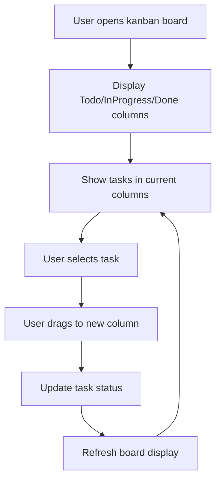

# Implement Kanban Board Visualization

## Metadata
- **Task ID:** TASK-124
- **Created:** 2025-05-29
- **Due:** 2025-06-05
- **Priority:** Medium
- **Status:** Todo
- **Assigned to:** Developer
- **Task Type:** Development
- **Sequence:** 124
- **Estimated Effort:** Medium
- **Related Epic/Feature:** TaskHero AI Project
- **Tags:** visualization, kanban, ui, terminal, rich

## 1. Overview
### 1.1. Brief Description
Create a visual Kanban board system that displays tasks in Todo, InProgress, and Done columns with proper formatting and status indicators. This will provide users with an intuitive visual interface for managing their project tasks within the terminal environment.

### 1.2. Functional Requirements
- The system must the system shall display a kanban board with three distinct columns: 'todo', 'inprogress', and 'done'.
- The system must each task displayed on the kanban board shall have a status indicator reflecting its current stage: 'todo', 'inprogress', or 'done'.
- The system must the system shall allow users to visually track task progress across the 'todo', 'inprogress', and 'done' columns.
- The system must the ai engine shall be used to generate initial task content, including a status field, for tasks added to the kanban board.
- The system must the terminal environment shall provide a visual representation of the kanban board, utilizing text-based formatting to simulate columns and task placement.
- The system must the system shall support adding new tasks to the 'todo' column, triggering the ai engine to generate task content with an initial 'todo' status.

### 1.3. Purpose & Benefits
This task enhances the TaskHero AI system by implementing implement kanban board visualization.

### 1.4. Success Criteria
- [ ] All functional requirements are implemented
- [ ] Code passes all tests and quality checks
- [ ] Documentation is complete and accurate

## 2. Flow Diagram
**Task flow diagram:**



User workflow for kanban board task management

## 3. Implementation Status

### 3.1. Implementation Steps
- [ ] **Step 1: Analysis & Planning for Implement Kanban Board Visualization** - Status: ⏳ Pending - Target: 2025-06-05
- [ ] Sub-step 1: Analyze requirements for implement kanban board visualization
- [ ] Sub-step 2: Design architecture and approach
- [ ] Sub-step 3: Create implementation plan
- [ ] **Step 2: Implementation of Implement Kanban Board Visualization** - Status: ⏳ Pending - Target: 2025-06-05
- [ ] Sub-step 1: Implement core functionality
- [ ] Sub-step 2: Add supporting features
- [ ] Sub-step 3: Integrate with existing system
- [ ] **Step 3: Testing & Validation** - Status: ⏳ Pending - Target: 2025-06-05
- [ ] Sub-step 1: Test implement kanban board visualization functionality
- [ ] Sub-step 2: Validate requirements are met
- [ ] Sub-step 3: Perform user acceptance testing

## 4. Detailed Description
Title: Implement Kanban Board Visualization
Description: Create a visual Kanban board system that displays tasks in Todo, InProgress, and Done columns with proper formatting and status indicators. This will provide users with an intuitive visual interface for managing their project tasks within the terminal environment. Leveraging the AI Engine’s Smart Content Generation capabilities, the system will automatically structure task data, ensuring consistent formatting and status tracking. Specifically, the implementation will utilize the AI Engine’s template-based approach to generate task descriptions, adhering to the defined columns (Todo, InProgress, Done) and incorporating status indicators for clear visualization and management. The system will be designed to seamlessly integrate with the core AI Engine, utilizing its Smart Content Generation to populate the Kanban board with detailed task information, ensuring a robust and easily maintainable task management solution.
Task Type: Development


## 5. UI Design & Specifications
### 5.1. Design Overview
User interface design for implement kanban board visualization

### 5.2. Wireframes & Layout
**Use ASCII art for layouts, wireframes, and component positioning:**

```
┌─────────────────────────────────────────────────────────────┐
│ [Implement Kanban Board Visualization Layout]                                             │
│ ┌─────────────┐ ┌─────────────────────────────────────────┐ │
│ │ Navigation  │ │ Main Content Area                       │ │
│ │ - Menu      │ │ ┌─────────────────────────────────────┐ │ │
│ │ - Options   │ │ │ Implement Kanban Board Visualization Interface                   │ │ │
│ │ - Settings  │ │ ├─────────────────────────────────────┤ │ │
│ │             │ │ │ Content and Controls                │ │ │
│ │             │ │ │ Status: Ready                       │ │ │
│ │             │ │ └─────────────────────────────────────┘ │ │
│ └─────────────┘ └─────────────────────────────────────────┘ │
└─────────────────────────────────────────────────────────────┘
```

### 5.3. Design System References
- **Colors:** Primary: #3b82f6, Secondary: #64748b, Success: #10b981, Warning: #f59e0b
- **Typography:** Inter font family, 14px base size, 500 weight for readability
- **Spacing:** 8px base unit, 16px component padding, 24px section margins
- **Components:** Standard UI components and controls
- **Icons:** Lucide icons: appropriate icons for functionality

### 5.4. Visual Design References
- [Link to Figma/Design file]
- [Link to existing similar components]
- [Screenshots or mockups if available]
## 6. Risk Assessment
### 6.1. Potential Risks
| Risk | Impact | Probability | Mitigation Strategy |
|------|--------|-------------|-------------------|
| [Risk description] | High | Medium | Conduct thorough stakeholder interviews and workshops to clearly define the desired UI elements, color schemes, and overall aesthetic. Create wireframes and mockups for user feedback and approval before development begins. Implement a prioritized feature list based on user input. |
| [Risk description] | Medium | Medium | Early and frequent integration testing within the existing terminal environment. Utilize established terminal libraries and frameworks. Develop clear API contracts for communication between the Kanban board and the terminal interface.  Implement robust error handling and logging. |
| [Risk description] | Low | Medium | Implement efficient data structures and algorithms for managing the Kanban board data. Optimize terminal output for speed and responsiveness. Conduct performance testing with a realistic number of tasks. Utilize techniques like pagination or virtualization if necessary. |
| [Risk description] | Medium | Low | Establish a clear and well-defined scope document with prioritized features. Implement a formal change request process for any proposed additions. Regularly review the scope with the development team and stakeholders.  Strictly adhere to the defined acceptance criteria. |


## Testing
Testing will be handled in a separate task based on this task summary and requirements.


## Technical Considerations
- Code modularity and reusability
- Performance optimization
- Error handling and logging
- Testing and validation


## Updates
- **2025-05-29** - Task created
---
*Generated by TaskHero AI Template Engine on 2025-05-29 20:43:51* 